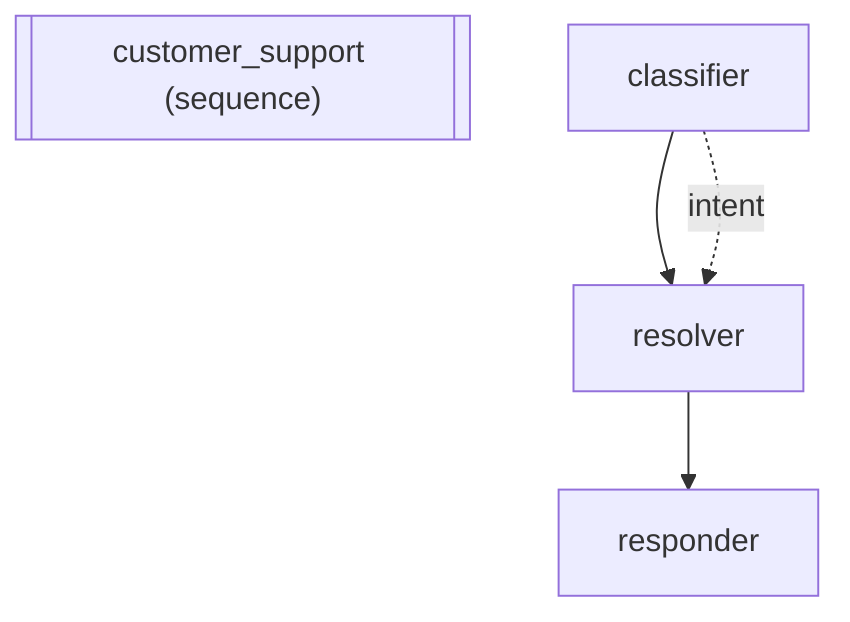

# adk-fluent

Fluent builder API for Google's [Agent Development Kit (ADK)](https://google.github.io/adk-docs/). Reduces agent creation from 22+ lines to 1-3 lines while producing identical native ADK objects.

[](https://github.com/vamsiramakrishnan/adk-fluent/actions/workflows/ci.yml)
[](https://pypi.org/project/adk-fluent/)
[](https://pypi.org/project/adk-fluent/)
[](https://pypi.org/project/adk-fluent/)
[](https://github.com/vamsiramakrishnan/adk-fluent/blob/master/LICENSE)
[](https://vamsiramakrishnan.github.io/adk-fluent/)
[](https://github.com/vamsiramakrishnan/adk-fluent/wiki)
[](https://peps.python.org/pep-0561/)
[](https://google.github.io/adk-docs/)
[](https://codecov.io/gh/vamsiramakrishnan/adk-fluent)
[](https://github.com/vamsiramakrishnan/adk-fluent)

> **Monorepo:** This repository is a dual-language monorepo. The Python package (`adk-fluent`) lives in [`python/`](python/) and the TypeScript package (`adk-fluent-ts`) lives in [`ts/`](ts/). Shared generation tooling, manifests, and seeds live in [`shared/`](shared/). Both packages are generated from the same manifest and expose the same surface area.

## Table of Contents

- [Packages](#packages)
- [Install](#install)
- [Quick Start](#quick-start)
- [Three Pathways](#three-pathways)
- [Zero to Running](#zero-to-running)
- [Why adk-fluent](#why-adk-fluent)
- [Expression Language](#expression-language)
- [Context Engineering (C Module)](#context-engineering-c-module)
- [Common Errors](#common-errors)
- [Fluent API Reference](#fluent-api-reference)
- [When to Use adk-fluent](#when-to-use-adk-fluent)
- [Run with adk web](#run-with-adk-web)
- [Visual Cookbook Runner](#visual-cookbook-runner)
- [Cookbook](#cookbook)
- [Performance](#performance)
- [ADK Compatibility](#adk-compatibility)
- [How It Works](#how-it-works)
- [Features](#features)
- [AI Coding Skills](#ai-coding-skills)
- [Development](#development)

## Packages

adk-fluent is released as two sibling packages driven by a single shared manifest. Pick the language you ship in — both expose the same builders, operators, and namespaces.

| Package              | Language   | Source      | Registry                                                      | Entry README                              |
| -------------------- | ---------- | ----------- | ------------------------------------------------------------- | ----------------------------------------- |
| `adk-fluent`         | Python 3.11+ | [`python/`](python/) | [PyPI](https://pypi.org/project/adk-fluent/)                  | [`python/README.md`](python/README.md)    |
| `adk-fluent-ts`      | TypeScript | [`ts/`](ts/) | npm (coming soon)                                             | [`ts/README.md`](ts/README.md)            |

Shared generator scripts, ADK scan manifests, and seed files live in [`shared/`](shared/). The Python and TypeScript builders are both regenerated from `shared/manifest.json` + `shared/seeds/seed.toml`, so API parity is enforced at generation time.

```text
adk-fluent/
├── python/      # adk-fluent (PyPI) — builders, namespaces, tests, docs fixtures
├── ts/          # adk-fluent-ts (npm) — TypeScript port with method-chained operators
├── shared/      # manifest.json, seeds, scripts/ (scanner, generator, doc gen)
├── docs/        # Sphinx docs site (Python-first, TS guide embedded)
├── skills/      # AI coding agent skills
└── justfile     # Monorepo-aware commands (`just test`, `just ts-test`, `just test-all`)
```

## Install

### Python (`adk-fluent`)

```bash
pip install adk-fluent
```

Autocomplete works immediately -- the package ships with `.pyi` type stubs for every builder. Type `Agent("name").` and your IDE shows all available methods with type hints.

### TypeScript (`adk-fluent-ts`)

The TypeScript port mirrors the Python API surface with method-chained operators (`.then()`, `.parallel()`, `.times()`, `.fallback()`, `.outputAs()`).

```bash
# From the monorepo (until the package is published to npm)
cd ts
npm install
npm run build
```

```ts
import { Agent, Pipeline } from "adk-fluent-ts";

const pipeline = new Agent("writer", "gemini-2.5-flash")
  .instruct("Write a draft about {topic}.")
  .writes("draft")
  .then(
    new Agent("reviewer", "gemini-2.5-flash")
      .instruct("Review the draft: {draft}")
      .writes("feedback"),
  )
  .build();
```

See [`ts/README.md`](ts/README.md) for the full TypeScript API, the [operator → method-chain mapping](ts/CLAUDE.md), and [`ts/examples/`](ts/examples) for runnable recipes. The rest of this README focuses on the Python package.

> **Full walkthrough:** [Getting Started guide](https://vamsiramakrishnan.github.io/adk-fluent/getting-started/) covers install, credentials, first agent, and IDE setup.

### Optional Extras

Install additional capabilities as needed:

```bash
pip install adk-fluent[a2a]            # A2A remote agent-to-agent communication
pip install adk-fluent[yaml]           # .to_yaml() / .from_yaml() serialization
pip install adk-fluent[rich]           # Rich terminal output for .explain()
pip install adk-fluent[search]         # BM25-indexed tool discovery (T.search)
pip install adk-fluent[pii]            # PII detection guard (G.pii with Cloud DLP)
pip install adk-fluent[observability]  # OpenTelemetry tracing and metrics
pip install adk-fluent[dev]            # Development tools (pytest, ruff, pyright)
pip install adk-fluent[docs]           # Documentation build (Sphinx, Furo)
```

Combine extras: `pip install adk-fluent[a2a,yaml,rich]`

**A2UI (Agent-to-UI):** The UI namespace for declarative agent UIs ships with the core package -- no extra install needed. See the [A2UI guide](https://vamsiramakrishnan.github.io/adk-fluent/user-guide/a2ui/) for component reference and examples. The full A2UI toolset (`SendA2uiToClientToolset`) will be available via `pip install adk-fluent[a2ui]` when the `a2ui-agent` package is published. Until then, all UI composition, compilation, and presets work out of the box.

### IDE Setup

**VS Code** -- install the [Pylance](https://marketplace.visualstudio.com/items?itemName=ms-python.vscode-pylance) extension (included in the Python extension pack). Autocomplete and type checking work out of the box.

**PyCharm** -- works automatically. The `.pyi` stubs are bundled in the package and PyCharm discovers them on install.

**Neovim (LSP)** -- use [pyright](https://github.com/microsoft/pyright) as your language server. Stubs are picked up automatically.

See the [Editor & AI Agent Setup](https://vamsiramakrishnan.github.io/adk-fluent/editor-setup/) guide for Claude Code, Cursor, Gemini CLI, and Copilot integration.

### Discover the API

```python
from adk_fluent import Agent

agent = Agent("demo")
agent.  # <- autocomplete shows: .model(), .instruct(), .tool(), .build(), ...

# Typos are caught at definition time, not runtime:
agent.instuction("oops")  # -> AttributeError: 'instuction' is not a recognized field.
                          #    Did you mean: 'instruction'?

# Inspect any builder's current state:
print(agent.model("gemini-2.5-flash").instruct("Help.").explain())
# Agent: demo
#   Config fields: model, instruction

# See everything available:
print(dir(agent))  # All methods including forwarded ADK fields
```

## Quick Start

```python
from adk_fluent import Agent

# Create an agent and get a response -- no Runner, no Session, no boilerplate
agent = Agent("helper", "gemini-2.5-flash").instruct("You are a helpful assistant.")
print(agent.ask("What is the capital of France?"))
# => The capital of France is Paris.
```

`.ask()` handles Runner, Session, and cleanup internally. One line to define, one line to run. See the [Getting Started guide](https://vamsiramakrishnan.github.io/adk-fluent/getting-started/) for credentials setup and more examples.

**Try without an API key** — verify the library works using `.mock()`:

```python
from adk_fluent import Agent

agent = Agent("demo", "gemini-2.5-flash").instruct("You are helpful.").mock(["Hello! How can I help?"])
print(agent.ask("Hi"))
# => Hello! How can I help?
```

For ADK integration, `.build()` returns the native ADK object:

```python
from adk_fluent import Agent, Pipeline, FanOut, Loop

# Simple agent -- returns a native LlmAgent
agent = Agent("helper", "gemini-2.5-flash").instruct("You are a helpful assistant.").build()

# Pipeline -- sequential agents
pipeline = (
    Pipeline("research")
    .step(Agent("searcher", "gemini-2.5-flash").instruct("Search for information."))
    .step(Agent("writer", "gemini-2.5-flash").instruct("Write a summary."))
    .build()
)

# Fan-out -- parallel agents
fanout = (
    FanOut("parallel_research")
    .branch(Agent("web", "gemini-2.5-flash").instruct("Search the web."))
    .branch(Agent("papers", "gemini-2.5-flash").instruct("Search papers."))
    .build()
)

# Loop -- iterative refinement
loop = (
    Loop("refine")
    .step(Agent("writer", "gemini-2.5-flash").instruct("Write draft."))
    .step(Agent("critic", "gemini-2.5-flash").instruct("Critique."))
    .max_iterations(3)
    .build()
)
```

Every `.build()` returns a real ADK object (`LlmAgent`, `SequentialAgent`, etc.). Fully compatible with `adk web`, `adk run`, and `adk deploy`.

### Two Styles, Same Result

Every workflow can be expressed two ways -- the explicit builder API or the expression operators. Both produce identical ADK objects:

```python
# Explicit builder style — readable, IDE-friendly
pipeline = (
    Pipeline("research")
    .step(Agent("web", "gemini-2.5-flash").instruct("Search web.").outputs("web_data"))
    .step(Agent("analyst", "gemini-2.5-flash").instruct("Analyze {web_data}."))
    .build()
)

# Operator style — compact, composable
pipeline = (
    Agent("web", "gemini-2.5-flash").instruct("Search web.").outputs("web_data")
    >> Agent("analyst", "gemini-2.5-flash").instruct("Analyze {web_data}.")
).build()
```

The builder style shines for complex multi-step workflows where each step is configured with callbacks, tools, and context. The operator style excels at composing reusable sub-expressions:

```python
# Complex builder-style pipeline with tools and callbacks
pipeline = (
    Pipeline("customer_support")
    .step(
        Agent("classifier", "gemini-2.5-flash")
        .instruct("Classify the customer's intent.")
        .outputs("intent")
        .before_model(log_fn)
    )
    .step(
        Agent("resolver", "gemini-2.5-flash")
        .instruct("Resolve the {intent} issue.")
        .tool(lookup_customer)
        .tool(create_ticket)
        .history("none")
    )
    .step(
        Agent("responder", "gemini-2.5-flash")
        .instruct("Draft a response to the customer.")
        .after_model(audit_fn)
    )
    .build()
)

# Same complexity, composed from reusable parts with operators
classify = Agent("classifier", "gemini-2.5-flash").instruct("Classify intent.").outputs("intent")
resolve = Agent("resolver", "gemini-2.5-flash").instruct("Resolve {intent}.").tool(lookup_customer)
respond = Agent("responder", "gemini-2.5-flash").instruct("Draft response.")

support_pipeline = classify >> resolve >> respond
# Reuse sub-expressions in different pipelines
escalation_pipeline = classify >> Agent("escalate", "gemini-2.5-flash").instruct("Escalate.")
```

### Pipeline Architecture




## Three Pathways

Once you know the builder basics, adk-fluent offers three distinct development pathways -- a fork in the road where each branch produces native ADK objects but solves different problems at different abstraction levels. See the [Decision Guide](https://vamsiramakrishnan.github.io/adk-fluent/decision-guide/) for interactive flowcharts to pick the right path.

```
                              adk-fluent
                                  |
              ┌───────────────────┼───────────────────┐
              |                   |                    |
       PIPELINE PATH        SKILLS PATH          HARNESS PATH
      Python builders      Declarative YAML     Autonomous runtimes
              |                   |                    |
    ┌─────────┴─────────┐ ┌──────┴───────┐ ┌──────────┴──────────┐
    | Agent >> Agent     | | SKILL.md     | | H namespace (Python) |
    | >> | * // @        | | Topology in  | | 5-layer architecture |
    | S, C, P, M, T, G  | | config, not  | | EventBus, sandbox    |
    | Full Python control| | code         | | Permissions, budgets |
    └─────────┬─────────┘ └──────┬───────┘ └──────────┬──────────┘
              |                   |                    |
     Custom workflows      Reusable agent       Coding agents
     Complex routing       libraries             DevOps runtimes
     Dynamic topologies    Cross-team sharing    Research harnesses
```

### Pipeline Path -- Python-First Builders

The core path. Full Python control with expression operators and 9 namespace modules. Build any topology -- sequential, parallel, loops, routing, fallbacks -- with type-checked, IDE-friendly builders.

```python
from adk_fluent import Agent, S, C, until

# Compose any topology with operators
research = (
    S.capture("query")
    >> Agent("planner", "gemini-2.5-flash").instruct("Decompose the query.").writes("plan")
    >> (Agent("web", "gemini-2.5-flash").instruct("Search web.").writes("web")
        | Agent("papers", "gemini-2.5-flash").instruct("Search papers.").writes("papers"))
    >> Agent("writer", "gemini-2.5-pro").instruct("Synthesize {web} and {papers}.")
)

# Loops, routing, fallbacks, typed output -- all composable
loop = (writer >> critic) * until(lambda s: s.get("score", 0) >= 0.8, max=3)
routed = classifier >> Route("intent").eq("billing", billing).otherwise(general)
safe = fast_model // strong_model  # Fallback chain
```

**Best for:** Custom workflows with complex routing, dynamic topologies, callback-heavy agents, full programmatic control. This is where most development starts.

[User Guide](https://vamsiramakrishnan.github.io/adk-fluent/user-guide/) · [Expression Language](https://vamsiramakrishnan.github.io/adk-fluent/user-guide/expression-language/) · [Context Engineering](https://vamsiramakrishnan.github.io/adk-fluent/user-guide/context-engineering/) · [State Transforms](https://vamsiramakrishnan.github.io/adk-fluent/user-guide/state-transforms/) · [Patterns](https://vamsiramakrishnan.github.io/adk-fluent/user-guide/patterns/) · [74 Cookbook Recipes](https://vamsiramakrishnan.github.io/adk-fluent/generated/cookbook/)

### Skills Path -- Declarative Agent Packages

Turn YAML + Markdown into executable agent graphs. Domain experts write prompts and topology; engineers inject tools and deploy. One file is simultaneously documentation, coding-agent context, and a runnable pipeline.

```python
from adk_fluent import Skill

# Load a skill -- parses YAML into an agent graph
research = Skill("skills/research_pipeline/")

# Compose skills with the same operators as agents
pipeline = Skill("skills/research/") >> Skill("skills/writing/") >> Skill("skills/review/")

# Override models, inject tools
fast = research.model("gemini-2.5-flash").inject(web_search=my_search_fn)
```

**Best for:** Stable topologies where the main variation is prompts, models, and tools. Teams with non-Python domain experts. Reusable capability libraries.

[Skills Guide](https://vamsiramakrishnan.github.io/adk-fluent/user-guide/skills/) · [Example SKILL.md files](examples/skills/)

### Harness Path -- Autonomous Coding Runtimes

Build Claude-Code-class autonomous agents with the `H` namespace. Five composable layers: intelligence, tools, safety, observability, and runtime.

```python
from adk_fluent import Agent, H, C

# Intelligence + Tools
agent = (
    Agent("coder", "gemini-2.5-pro")
    .instruct("You are an expert coding assistant.")
    .tools(H.workspace("/project", diff_mode=True) + H.web() + H.git_tools("/project"))
)

# Safety + Observability + Runtime
agent = agent.harness(
    permissions=H.auto_allow("read_file", "grep_search").merge(H.ask_before("edit_file", "bash")),
    sandbox=H.workspace_only("/project"),
)

bus = H.event_bus()
repl = H.repl(agent.build(), hooks=H.hooks("/project").on_edit("ruff check {file_path}"))
await repl.run()
```

**Best for:** Agents that act autonomously -- reading codebases, editing files, running tests, managing processes. When you need permissions, sandboxing, token budgets, and observability.

[Harness Guide](https://vamsiramakrishnan.github.io/adk-fluent/user-guide/harness/) · [Full harness example](examples/cookbook/79_coding_agent_harness.py)

### Which Path?

| Question | Pipeline | Skills | Harness |
|----------|----------|--------|---------|
| Who writes the agent logic? | Engineers (Python) | Domain experts (YAML) | Engineers (Python) |
| Abstraction level | Low -- full control | High -- config-driven | Medium -- composable layers |
| Topology flexibility | Unlimited | Fixed per skill | Agent + tools |
| Does the agent need file/shell access? | Optional | No | Yes |
| Does the agent need permissions/sandbox? | No | No | Yes |
| Is reusability across teams important? | Moderate -- share code | High -- share SKILL.md files | Low -- custom per-domain |
| Is it a multi-turn autonomous runtime? | No -- pipeline execution | No -- pipeline execution | Yes -- REPL with memory |

**All three compose together.** A harness can load skills for domain expertise, while pipelines define the internal agent topology:

```python
agent = (
    Agent("coder", "gemini-2.5-pro")
    .use_skill("skills/code_review/")          # Skills for domain knowledge
    .use_skill("skills/python_best_practices/")
    .tools(H.workspace("/project") + H.web())  # Harness for autonomous capability
)
# Inside a skill, the agents are wired as pipelines with >> | * operators
```

## Zero to Running

### Fastest: Google AI Studio (free tier)

```bash
pip install adk-fluent
export GOOGLE_API_KEY="your-key-from-aistudio.google.com"
python quickstart.py
```

Get a free API key at [aistudio.google.com](https://aistudio.google.com/apikey).

### Production: Vertex AI

```bash
pip install adk-fluent
export GOOGLE_CLOUD_PROJECT="your-project-id"
export GOOGLE_CLOUD_LOCATION="us-central1"
export GOOGLE_GENAI_USE_VERTEXAI="TRUE"
python quickstart.py
```

Requires a GCP project with the Vertex AI API enabled. See [Vertex AI setup](https://cloud.google.com/vertex-ai/docs/start/introduction-unified-platform).

Both paths produce the same result -- the [`quickstart.py`](quickstart.py) file works with either configuration.

## Why adk-fluent

Real patterns. Real reduction. Every adk-fluent expression compiles to the same native ADK objects you'd build by hand.

### Document Processing Pipeline

A contract review system that extracts terms, analyzes risks, and summarizes.

**LangGraph** (~35 lines):

```python
class State(TypedDict):
    document: str
    terms: str
    risks: str
    summary: str

def extract(state): ...
def analyze(state): ...
def summarize(state): ...

graph = StateGraph(State)
graph.add_node("extract", extract)
graph.add_node("analyze", analyze)
graph.add_node("summarize", summarize)
graph.add_edge("extract", "analyze")
graph.add_edge("analyze", "summarize")
graph.add_edge(START, "extract")
graph.add_edge("summarize", END)
app = graph.compile()
```

**adk-fluent** (1 expression):

```python
pipeline = extractor >> analyst >> summarizer
```

[Full example with native ADK comparison →](examples/cookbook/04_sequential_pipeline.py)

### Multi-Source Research with Quality Loop

Decompose a query, search 3 sources in parallel, synthesize, and review in a loop until quality threshold is met.

**LangGraph** (~60 lines):

```python
class ResearchState(TypedDict):
    query: str
    web_results: str
    academic_results: str
    synthesis: str
    quality_score: float

def analyze_query(state): ...
def search_web(state): ...
def search_academic(state): ...
def search_news(state): ...
def synthesize(state): ...
def review_quality(state): ...
def revise(state): ...
def should_continue(state):
    return "revise" if state["quality_score"] < 0.85 else "report"

graph = StateGraph(ResearchState)
graph.add_node("analyze", analyze_query)
graph.add_node("search_web", search_web)
graph.add_node("search_academic", search_academic)
graph.add_node("search_news", search_news)
graph.add_node("synthesize", synthesize)
graph.add_node("review", review_quality)
graph.add_node("revise", revise)
graph.add_node("report", write_report)
graph.add_edge(START, "analyze")
graph.add_edge("analyze", "search_web")
graph.add_edge("analyze", "search_academic")
graph.add_edge("analyze", "search_news")
graph.add_edge("search_web", "synthesize")
graph.add_edge("search_academic", "synthesize")
graph.add_edge("search_news", "synthesize")
graph.add_edge("synthesize", "review")
graph.add_conditional_edges("review", should_continue)
graph.add_edge("report", END)
app = graph.compile()
```

**adk-fluent** (1 expression):

```python
research = (
    analyzer
    >> (web | papers | news)
    >> synthesizer
    >> (reviewer >> reviser) * until(lambda s: s["quality_score"] >= 0.85)
    >> writer @ ResearchReport
)
```

[Full example with typed output and state wiring →](examples/cookbook/55_deep_research.py)

### Customer Support Triage

Classify customer intent and route to the right specialist.

**LangGraph** (~45 lines):

```python
class SupportState(TypedDict):
    message: str
    intent: str
    response: str

def classify(state): ...
def handle_billing(state): ...
def handle_technical(state): ...
def handle_general(state): ...
def route_intent(state):
    return state["intent"]

graph = StateGraph(SupportState)
graph.add_node("classify", classify)
graph.add_node("billing", handle_billing)
graph.add_node("technical", handle_technical)
graph.add_node("general", handle_general)
graph.add_edge(START, "classify")
graph.add_conditional_edges(
    "classify", route_intent,
    {"billing": "billing", "technical": "technical", "general": "general"},
)
graph.add_edge("billing", END)
graph.add_edge("technical", END)
graph.add_edge("general", END)
app = graph.compile()
```

**adk-fluent** (1 expression):

```python
support = (
    S.capture("message")
    >> classifier
    >> Route("intent")
        .eq("billing", billing)
        .eq("technical", technical)
        .otherwise(general)
)
```

[Full example with escalation gates →](examples/cookbook/56_customer_support_triage.py)

### The Pattern

| What                | LangGraph                    | Native ADK             | adk-fluent   |
| ------------------- | ---------------------------- | ---------------------- | ------------ |
| Sequential pipeline | ~35 lines                    | ~20 lines              | 1 expression |
| Parallel + loop     | ~60 lines                    | ~45 lines              | 1 expression |
| Routing             | ~45 lines                    | ~35 lines              | 1 expression |
| Boilerplate         | StateGraph, TypedDict, edges | Agent, Runner, Session | None         |
| Result type         | LangGraph graph              | ADK agent              | ADK agent    |

For a detailed comparison including CrewAI and native ADK code, see the [Framework Comparison](https://vamsiramakrishnan.github.io/adk-fluent/user-guide/comparison/) guide.

## Expression Language

> **Deep dive:** [Expression Language guide](https://vamsiramakrishnan.github.io/adk-fluent/user-guide/expression-language/) · [Operator Algebra visual reference](https://vamsiramakrishnan.github.io/adk-fluent/user-guide/operator-algebra-reference.html)

Nine operators compose any agent topology:

| Operator                       | Meaning             | ADK Type                 |
| ------------------------------ | ------------------- | ------------------------ |
| `a >> b`                       | Sequence            | `SequentialAgent`        |
| `a >> fn`                      | Function step       | Zero-cost transform      |
| `a \| b`                       | Parallel            | `ParallelAgent`          |
| `a * 3`                        | Loop (fixed)        | `LoopAgent`              |
| `a * until(pred)`              | Loop (conditional)  | `LoopAgent` + checkpoint |
| `a @ Schema`                   | Typed output        | `output_schema`          |
| `a // b`                       | Fallback            | First-success chain      |
| `Route("key").eq(...)`         | Branch              | Deterministic routing    |
| `S.pick(...)`, `S.rename(...)` | State transforms    | Dict operations via `>>` |
| `C.user_only()`, `C.none()`    | Context engineering | Selective Turn History   |

Eight control loop primitives for agent orchestration:

| Primitive              | Purpose                        | ADK Mechanism                           |
| ---------------------- | ------------------------------ | --------------------------------------- |
| `tap(fn)`              | Observe state without mutating | Custom `BaseAgent` (no LLM)             |
| `expect(pred, msg)`    | Assert state contract          | Raises `ValueError` on failure          |
| `.mock(responses)`     | Bypass LLM for testing         | `before_model_callback` → `LlmResponse` |
| `.retry_if(pred)`      | Retry while condition holds    | `LoopAgent` + checkpoint escalate       |
| `map_over(key, agent)` | Iterate agent over list        | Custom `BaseAgent` loop                 |
| `.timeout(seconds)`    | Time-bound execution           | `asyncio` deadline + cancel             |
| `gate(pred, msg)`      | Human-in-the-loop approval     | `EventActions(escalate=True)`           |
| `race(a, b, ...)`      | First-to-finish wins           | `asyncio.wait(FIRST_COMPLETED)`         |

All operators are **immutable** -- sub-expressions can be safely reused:

```python
review = agent_a >> agent_b
pipeline_1 = review >> agent_c  # Independent
pipeline_2 = review >> agent_d  # Independent
```

### How Operators Map to Agent Trees

```
Expression:   a >> (b | c) * 3

Agent tree:
  SequentialAgent
  +-- a (LlmAgent)
  +-- LoopAgent (max_iterations=3)
      +-- ParallelAgent
          +-- b (LlmAgent)
          +-- c (LlmAgent)
```

```
Expression:   a >> fn >> Route("key").eq("x", b).eq("y", c)

Agent tree:
  SequentialAgent
  +-- a (LlmAgent)
  +-- fn (FunctionAgent)
  +-- RoutingAgent
      +-- "x" -> b (LlmAgent)
      +-- "y" -> c (LlmAgent)
```

```
Expression:   (a | b) >> merge_fn >> writer @ Report // fallback_writer @ Report

Agent tree:
  SequentialAgent
  +-- ParallelAgent
  |   +-- a (LlmAgent)
  |   +-- b (LlmAgent)
  +-- merge_fn (FunctionAgent)
  +-- FallbackAgent
      +-- writer (LlmAgent, output_schema=Report)
      +-- fallback_writer (LlmAgent, output_schema=Report)
```

### Function Steps

Plain Python functions compose with `>>` as zero-cost workflow nodes (no LLM call):

```python
def merge_research(state):
    return {"research": state["web"] + "\n" + state["papers"]}

pipeline = web_agent >> merge_research >> writer_agent
```

### Typed Output

`@` binds a Pydantic schema as the agent's output contract:

```python
from pydantic import BaseModel

class Report(BaseModel):
    title: str
    body: str

agent = Agent("writer").model("gemini-2.5-flash").instruct("Write.") @ Report
```

### Fallback Chains

`//` tries each agent in order -- first success wins:

```python
answer = (
    Agent("fast").model("gemini-2.0-flash").instruct("Quick answer.")
    // Agent("thorough").model("gemini-2.5-pro").instruct("Detailed answer.")
)
```

### Conditional Loops

`* until(pred)` loops until a predicate on session state is satisfied:

```python
from adk_fluent import until

loop = (
    Agent("writer").model("gemini-2.5-flash").instruct("Write.").outputs("quality")
    >> Agent("reviewer").model("gemini-2.5-flash").instruct("Review.")
) * until(lambda s: s.get("quality") == "good", max=5)
```

### State Transforms

> **Deep dive:** [State Transforms guide](https://vamsiramakrishnan.github.io/adk-fluent/user-guide/state-transforms/)

`S` factories return dict transforms that compose with `>>`:

```python
from adk_fluent import S

pipeline = (
    (web_agent | scholar_agent)
    >> S.merge("web", "scholar", into="research")
    >> S.default(confidence=0.0)
    >> S.rename(research="input")
    >> writer_agent
)
```

| Factory                 | Purpose                  |
| ----------------------- | ------------------------ |
| `S.pick(*keys) `        | Keep only specified keys |
| `S.drop(*keys)`         | Remove specified keys    |
| `S.rename(**kw)`        | Rename keys              |
| `S.default(**kw)`       | Fill missing keys        |
| `S.merge(*keys, into=)` | Combine keys             |
| `S.transform(key, fn)`  | Map a single value       |
| `S.compute(**fns)`      | Derive new keys          |
| `S.guard(pred)`         | Assert invariant         |
| `S.log(*keys)`          | Debug-print              |

### Context Engineering (C Module)

> **Deep dive:** [Context Engineering guide](https://vamsiramakrishnan.github.io/adk-fluent/user-guide/context-engineering/) · [P·C·S visual reference](https://vamsiramakrishnan.github.io/adk-fluent/user-guide/pcs-visual-reference.html)

Control exactly what conversation history each agent sees. Prevents prompt pollution in complex DAGs:

```python
from adk_fluent import C

pipeline = (
    Agent("classifier").outputs("intent")
    >> Agent("booker")
        .instruct("Process {intent}")
        .context(C.user_only()) # Booker sees user prompt + {intent}, but NOT classifier text
)
```

| Transform                 | Purpose                             |
| ------------------------- | ----------------------------------- |
| `C.user_only()`           | Include only original user messages |
| `C.none()`                | No turn history (stateless prompt)  |
| `C.window(n=5)`           | Sliding window of last N turns      |
| `C.from_agents("a", "b")` | Include user + named agent outputs  |
| `C.capture("key")`        | Snapshot user message into state    |

### Common Errors

**Missing required field:**

```python
Agent("x").instruct("Hi").build()
# BuilderError: Agent 'x' is missing required field 'model'
#   model: required (not set)
```

Fix: add `.model("gemini-2.5-flash")` before `.build()`.

**Typo in method name:**

```python
Agent("x").modle("gemini-2.5-flash")
# AttributeError: 'modle' is not a recognized field. Did you mean: 'model'?
```

The typo detector suggests the closest valid field name.

**Invalid operator operand:**

```python
Agent("a") | "not an agent"
# TypeError: unsupported operand type(s) for |: 'AgentBuilder' and 'str'
```

Operators work with `Agent`, `Pipeline`, `FanOut`, `Loop` builders, callables, and built ADK agents.

**Template variable at runtime:**

```python
# {topic} resolves from session state at runtime, not at definition time
agent = Agent("writer", "gemini-2.5-flash").instruct("Write about {topic}.")
agent.ask("hello")  # {topic} appears literally if not in state
```

Use `.outputs("topic")` on a prior agent, or pass initial state via `.session()`.

Full error reference: [Error Reference](https://vamsiramakrishnan.github.io/adk-fluent/user-guide/error-reference/)

### IR, Backends, and Middleware (v4)

> **Deep dive:** [IR & Backends guide](https://vamsiramakrishnan.github.io/adk-fluent/user-guide/ir-and-backends/) · [Middleware guide](https://vamsiramakrishnan.github.io/adk-fluent/user-guide/middleware/) · [Data Flow visual reference](https://vamsiramakrishnan.github.io/adk-fluent/user-guide/data-flow-reference.html)

Builders can compile to an intermediate representation (IR) for inspection, testing, and alternative backends:

```python
from adk_fluent import Agent, ExecutionConfig, CompactionConfig

# IR: inspect the agent tree without building
pipeline = Agent("a") >> Agent("b") >> Agent("c")
ir = pipeline.to_ir()  # Returns frozen dataclass tree

# to_app(): compile through IR to a native ADK App
app = pipeline.to_app(config=ExecutionConfig(
    app_name="my_app",
    resumable=True,
    compaction=CompactionConfig(interval=10),
))

# Middleware: app-global cross-cutting behavior
from adk_fluent import Middleware, RetryMiddleware, StructuredLogMiddleware

app = (
    Agent("a") >> Agent("b")
).middleware(RetryMiddleware(max_retries=3)).to_app()

# Data contracts: verify pipeline wiring at build time
from pydantic import BaseModel
from adk_fluent.testing import check_contracts

class Intent(BaseModel):
    category: str
    confidence: float

pipeline = Agent("classifier").produces(Intent) >> Agent("resolver").consumes(Intent)
issues = check_contracts(pipeline.to_ir())  # [] = all good

# Deterministic testing without LLM calls
from adk_fluent.testing import mock_backend, AgentHarness

harness = AgentHarness(pipeline, backend=mock_backend({
    "classifier": {"category": "billing", "confidence": 0.9},
    "resolver": "Ticket #1234 created.",
}))

# Graph visualization
print(pipeline.to_mermaid())  # Mermaid diagram source
```

```python
# Tool confirmation (human-in-the-loop approval)
agent = Agent("ops").tool(deploy_fn, require_confirmation=True)

# Resource DI (hide infra params from LLM)
agent = Agent("lookup").tool(search_db).inject(db=my_database)
```

### Deterministic Routing

Route on session state without LLM calls:

```python
from adk_fluent import Agent
from adk_fluent._routing import Route

classifier = Agent("classify").model("gemini-2.5-flash").instruct("Classify intent.").outputs("intent")
booker = Agent("booker").model("gemini-2.5-flash").instruct("Book flights.")
info = Agent("info").model("gemini-2.5-flash").instruct("Provide info.")

# Route on exact match — zero LLM calls for routing
pipeline = classifier >> Route("intent").eq("booking", booker).eq("info", info)

# Dict shorthand
pipeline = classifier >> {"booking": booker, "info": info}
```

### Conditional Gating

```python
# Only runs if predicate(state) is truthy
enricher = (
    Agent("enricher")
    .model("gemini-2.5-flash")
    .instruct("Enrich the data.")
    .proceed_if(lambda s: s.get("valid") == "yes")
)
```

### Tap (Observe Without Mutating)

`tap(fn)` creates a zero-cost observation step. It reads state but never writes back -- perfect for logging, metrics, and debugging:

```python
from adk_fluent import tap

pipeline = (
    writer
    >> tap(lambda s: print("Draft:", s.get("draft", "")[:50]))
    >> reviewer
)

# Also available as a method
pipeline = writer.tap(lambda s: log_metrics(s)) >> reviewer
```

### Expect (State Assertions)

`expect(pred, msg)` asserts a state contract at a pipeline step. Raises `ValueError` if the predicate fails:

```python
from adk_fluent import expect

pipeline = (
    writer
    >> expect(lambda s: "draft" in s, "Writer must produce a draft")
    >> reviewer
)
```

### Mock (Testing Without LLM)

`.mock(responses)` bypasses LLM calls with canned responses. Uses the same `before_model_callback` mechanism as ADK's `ReplayPlugin`, but scoped to a single agent:

```python
# List of responses (cycles when exhausted)
agent = Agent("writer").model("gemini-2.5-flash").instruct("Write.").mock(["Draft 1", "Draft 2"])

# Callable for dynamic mocking
agent = Agent("echo").model("gemini-2.5-flash").mock(lambda req: "Mocked response")
```

### Retry If

`.retry_if(pred)` retries agent execution while the predicate returns True. Thin wrapper over `loop_until` with inverted logic:

```python
agent = (
    Agent("writer").model("gemini-2.5-flash")
    .instruct("Write a high-quality draft.").outputs("quality")
    .retry_if(lambda s: s.get("quality") != "good", max_retries=3)
)
```

### Map Over

`map_over(key, agent)` iterates an agent over each item in a state list:

```python
from adk_fluent import map_over

pipeline = (
    fetcher
    >> map_over("documents", summarizer, output_key="summaries")
    >> compiler
)
```

### Timeout

`.timeout(seconds)` wraps an agent with a time limit. Raises `asyncio.TimeoutError` if exceeded:

```python
agent = Agent("researcher").model("gemini-2.5-pro").instruct("Deep research.").timeout(60)
```

### Gate (Human-in-the-Loop)

`gate(pred, msg)` pauses the pipeline for human approval when the condition is met. Uses ADK's `escalate` mechanism:

```python
from adk_fluent import gate

pipeline = (
    analyzer
    >> gate(lambda s: s.get("risk") == "high", message="Approve high-risk action?")
    >> executor
)
```

### Race (First-to-Finish)

`race(a, b, ...)` runs agents concurrently and keeps only the first to finish:

```python
from adk_fluent import race

winner = race(
    Agent("fast").model("gemini-2.0-flash").instruct("Quick answer."),
    Agent("thorough").model("gemini-2.5-pro").instruct("Detailed answer."),
)
```

### Full Composition

All operators compose into a single expression:

```python
from pydantic import BaseModel
from adk_fluent import Agent, S, until

class Report(BaseModel):
    title: str
    body: str
    confidence: float

pipeline = (
    (   Agent("web").model("gemini-2.5-flash").instruct("Search web.")
      | Agent("scholar").model("gemini-2.5-flash").instruct("Search papers.")
    )
    >> S.merge("web", "scholar", into="research")
    >> Agent("writer").model("gemini-2.5-flash").instruct("Write.") @ Report
       // Agent("writer_b").model("gemini-2.5-pro").instruct("Write.") @ Report
    >> (
        Agent("critic").model("gemini-2.5-flash").instruct("Score.").outputs("confidence")
        >> Agent("reviser").model("gemini-2.5-flash").instruct("Improve.")
    ) * until(lambda s: s.get("confidence", 0) >= 0.85, max=4)
)
```

## Fluent API Reference

> **Full API docs:** [API Reference](https://vamsiramakrishnan.github.io/adk-fluent/generated/api/) · [Agent](https://vamsiramakrishnan.github.io/adk-fluent/generated/api/agent/) · [Workflow](https://vamsiramakrishnan.github.io/adk-fluent/generated/api/workflow/) · [Tool](https://vamsiramakrishnan.github.io/adk-fluent/generated/api/tool/) · [Config](https://vamsiramakrishnan.github.io/adk-fluent/generated/api/config/)

### Agent Builder

The `Agent` builder wraps ADK's `LlmAgent`. Every method returns `self` for chaining.

#### Core Configuration

| Method                  | Alias for     | Description                                                                |
| ----------------------- | ------------- | -------------------------------------------------------------------------- |
| `.model(name)`          | `model`       | LLM model identifier (`"gemini-2.5-flash"`, `"gemini-2.5-pro"`, etc.)      |
| `.instruct(text_or_fn)` | `instruction` | System instruction. Accepts a string or `Callable[[ReadonlyContext], str]` |
| `.describe(text)`       | `description` | Agent description (used in delegation and tool descriptions)               |
| `.outputs(key)`         | `output_key`  | Store the agent's final response in session state under this key           |
| `.tool(fn)`             | —             | Add a tool function or `BaseTool` instance. Multiple calls accumulate      |
| `.build()`              | —             | Resolve into a native ADK `LlmAgent`                                       |

#### Prompt & Context Control

| Method                   | Alias for            | Description                                                                                                   |
| ------------------------ | -------------------- | ------------------------------------------------------------------------------------------------------------- |
| `.instruct(text)`        | `instruction`        | Dynamic instruction. Supports `{variable}` placeholders auto-resolved from session state                      |
| `.instruct(fn)`          | `instruction`        | Callable receiving `ReadonlyContext`, returns string. Full programmatic control                               |
| `.static(content)`       | `static_instruction` | Cacheable instruction that never changes. Sent as system instruction for context caching                      |
| `.history("none")`       | `include_contents`   | Control conversation history: `"default"` (full history) or `"none"` (stateless)                              |
| `.global_instruct(text)` | `global_instruction` | Instruction inherited by all sub-agents                                                                       |
| `.inject_context(fn)`    | —                    | Prepend dynamic context via `before_model_callback`. The function receives callback context, returns a string |

Template variables in string instructions are auto-resolved from session state:

```python
# {topic} and {style} are replaced at runtime from session state
agent = Agent("writer").instruct("Write about {topic} in a {style} tone.")
```

This composes naturally with the expression algebra:

```python
pipeline = (
    Agent("classifier").instruct("Classify.").outputs("topic")
    >> S.default(style="professional")
    >> Agent("writer").instruct("Write about {topic} in a {style} tone.")
)
```

Optional variables use `?` suffix (`{maybe_key?}` returns empty string if missing). Namespaced keys: `{app:setting}`, `{user:pref}`, `{temp:scratch}`.

#### Prompt Builder

> **Deep dive:** [Prompt Composition guide](https://vamsiramakrishnan.github.io/adk-fluent/user-guide/prompts/)

For multi-section prompts, the `Prompt` builder provides structured composition:

```python
from adk_fluent import Prompt

prompt = (
    Prompt()
    .role("You are a senior code reviewer.")
    .context("The codebase uses Python 3.11 with type hints.")
    .task("Review the code for bugs and security issues.")
    .constraint("Be concise. Max 5 bullet points.")
    .constraint("No false positives.")
    .format("Return markdown with ## sections.")
    .example("Input: x=eval(input()) | Output: - **Critical**: eval() on user input")
)

agent = Agent("reviewer").model("gemini-2.5-flash").instruct(prompt).build()
```

Sections are emitted in a fixed order (role, context, task, constraints, format, examples) regardless of call order. Prompts are composable and reusable:

```python
base_prompt = Prompt().role("You are a senior engineer.").constraint("Be precise.")

reviewer = Agent("reviewer").instruct(base_prompt + Prompt().task("Review code."))
writer   = Agent("writer").instruct(base_prompt + Prompt().task("Write documentation."))
```

| Method                 | Description                                   |
| ---------------------- | --------------------------------------------- |
| `.role(text)`          | Agent persona (emitted without header)        |
| `.context(text)`       | Background information                        |
| `.task(text)`          | Primary objective                             |
| `.constraint(text)`    | Rules to follow (multiple calls accumulate)   |
| `.format(text)`        | Desired output format                         |
| `.example(text)`       | Few-shot examples (multiple calls accumulate) |
| `.section(name, text)` | Custom named section                          |
| `.merge(other)` / `+`  | Combine two Prompts                           |
| `.build()` / `str()`   | Compile to instruction string                 |

#### Static Instructions & Context Caching

Split prompts into cacheable and dynamic parts:

```python
agent = (
    Agent("analyst")
    .model("gemini-2.5-flash")
    .static("You are a financial analyst. Here is the 50-page annual report: ...")
    .instruct("Answer the user's question about the report.")
    .build()
)
```

When `.static()` is set, the static content goes as a system instruction (eligible for context caching), while `.instruct()` content goes as user content. This avoids re-processing large static contexts on every turn.

#### Dynamic Context Injection

Prepend runtime context to every LLM call:

```python
agent = (
    Agent("support")
    .model("gemini-2.5-flash")
    .instruct("Help the customer.")
    .inject_context(lambda ctx: f"Customer: {ctx.state.get('customer_name', 'unknown')}")
    .inject_context(lambda ctx: f"Plan: {ctx.state.get('plan', 'free')}")
)
```

Each `.inject_context()` call accumulates. The function receives the callback context and returns a string that gets prepended as content before the LLM processes the request.

#### Callbacks

> **Deep dive:** [Callbacks guide](https://vamsiramakrishnan.github.io/adk-fluent/user-guide/callbacks/) · [Module Lifecycle visual reference](https://vamsiramakrishnan.github.io/adk-fluent/user-guide/module-lifecycle-reference.html)

All callback methods are **additive** -- multiple calls accumulate handlers, never replace:

| Method                | Alias for                 | Description                                                           |
| --------------------- | ------------------------- | --------------------------------------------------------------------- |
| `.before_model(fn)`   | `before_model_callback`   | Runs before each LLM call. Receives `(callback_context, llm_request)` |
| `.after_model(fn)`    | `after_model_callback`    | Runs after each LLM call. Receives `(callback_context, llm_response)` |
| `.before_agent(fn)`   | `before_agent_callback`   | Runs before agent execution                                           |
| `.after_agent(fn)`    | `after_agent_callback`    | Runs after agent execution                                            |
| `.before_tool(fn)`    | `before_tool_callback`    | Runs before each tool call                                            |
| `.after_tool(fn)`     | `after_tool_callback`     | Runs after each tool call                                             |
| `.on_model_error(fn)` | `on_model_error_callback` | Handles LLM errors                                                    |
| `.on_tool_error(fn)`  | `on_tool_error_callback`  | Handles tool errors                                                   |
| `.guardrail(fn)`      | —                         | Registers `fn` as both `before_model` and `after_model`               |

Conditional variants append only when the condition is true:

```python
agent = (
    Agent("service")
    .before_model_if(debug_mode, log_fn)
    .after_model_if(audit_enabled, audit_fn)
)
```

#### Control Flow

| Method                                | Description                                                                  |
| ------------------------------------- | ---------------------------------------------------------------------------- |
| `.proceed_if(pred)`                   | Only run this agent if `pred(state)` is truthy. Uses `before_agent_callback` |
| `.loop_until(pred, max_iterations=N)` | Wrap in a loop that exits when `pred(state)` is satisfied                    |
| `.retry_if(pred, max_retries=3)`      | Retry while `pred(state)` returns True. Inverse of `loop_until`              |
| `.mock(responses)`                    | Bypass LLM with canned responses (list or callable). For testing             |
| `.tap(fn)`                            | Append observation step: `self >> tap(fn)`. Returns Pipeline                 |
| `.timeout(seconds)`                   | Wrap with time limit. Raises `asyncio.TimeoutError` on expiry                |

#### Delegation (LLM-Driven Routing)

> **Deep dive:** [Transfer Control guide](https://vamsiramakrishnan.github.io/adk-fluent/user-guide/transfer-control/) · [Delegation visual reference](https://vamsiramakrishnan.github.io/adk-fluent/user-guide/delegation-reference.html)

```python
# The coordinator's LLM decides when to delegate
coordinator = (
    Agent("coordinator")
    .model("gemini-2.5-flash")
    .instruct("Route tasks to the right specialist.")
    .delegate(Agent("math").model("gemini-2.5-flash").instruct("Solve math."))
    .delegate(Agent("code").model("gemini-2.5-flash").instruct("Write code."))
    .build()
)
```

`.delegate(agent)` wraps the sub-agent in an `AgentTool` so the coordinator's LLM can invoke it by name.

#### One-Shot Execution

> **Deep dive:** [Execution guide](https://vamsiramakrishnan.github.io/adk-fluent/user-guide/execution/) · [Execution Modes visual reference](https://vamsiramakrishnan.github.io/adk-fluent/user-guide/execution-modes-reference.html)

| Method                                        | Description                                                     |
| --------------------------------------------- | --------------------------------------------------------------- |
| `.ask(prompt)`                                | Send a prompt, get response text. No Runner/Session boilerplate |
| `.ask_async(prompt)`                          | Async version of `.ask()`                                       |
| `.stream(prompt)`                             | Async generator yielding response text chunks                   |
| `.events(prompt)`                             | Async generator yielding raw ADK `Event` objects                |
| `.map(prompts, concurrency=5)`                | Batch execution against multiple prompts                        |
| `.map_async(prompts, concurrency=5)`          | Async batch execution                                           |
| `.session()`                                  | Create an interactive `async with` session context manager      |
| `.test(prompt, contains=, matches=, equals=)` | Smoke test: calls `.ask()` and asserts output                   |

#### Cloning and Variants

```python
base = Agent("base").model("gemini-2.5-flash").instruct("Be helpful.")

# Clone — independent deep copy with new name
math_agent = base.clone("math").instruct("Solve math.")

# with_() — immutable variant (original unchanged)
creative = base.with_(name="creative", model="gemini-2.5-pro")
```

#### Validation and Introspection

| Method                      | Description                                                                         |
| --------------------------- | ----------------------------------------------------------------------------------- |
| `.validate()`               | Try `.build()` and raise `ValueError` with clear message on failure. Returns `self` |
| `.explain()`                | Multi-line summary of builder state (config fields, callbacks, lists)               |
| `.to_dict()` / `.to_yaml()` | Serialize builder state (inspection only, no round-trip)                            |

#### Dynamic Field Forwarding

Any ADK `LlmAgent` field can be set through `__getattr__`, even without an explicit method:

```python
agent = Agent("x").generate_content_config(my_config)  # Works via forwarding
```

Misspelled names raise `AttributeError` with the closest match suggestion.

### Workflow Builders

All workflow builders accept both built ADK agents and fluent builders as arguments. Builders are auto-built at `.build()` time, enabling safe sub-expression reuse.

#### Pipeline (Sequential)

```python
from adk_fluent import Pipeline, Agent

# Builder style — full control over each step
pipeline = (
    Pipeline("data_processing")
    .step(Agent("extractor", "gemini-2.5-flash").instruct("Extract entities.").outputs("entities"))
    .step(Agent("enricher", "gemini-2.5-flash").instruct("Enrich {entities}.").tool(lookup_db))
    .step(Agent("formatter", "gemini-2.5-flash").instruct("Format output.").history("none"))
    .build()
)

# Operator style — same result
pipeline = (
    Agent("extractor", "gemini-2.5-flash").instruct("Extract entities.").outputs("entities")
    >> Agent("enricher", "gemini-2.5-flash").instruct("Enrich {entities}.").tool(lookup_db)
    >> Agent("formatter", "gemini-2.5-flash").instruct("Format output.").history("none")
).build()
```

| Method         | Description                                                        |
| -------------- | ------------------------------------------------------------------ |
| `.step(agent)` | Append an agent as the next step. Lazy -- built at `.build()` time |
| `.build()`     | Resolve into a native ADK `SequentialAgent`                        |

#### FanOut (Parallel)

```python
from adk_fluent import FanOut, Agent

# Builder style — named branches with different models
fanout = (
    FanOut("research")
    .branch(Agent("web", "gemini-2.5-flash").instruct("Search the web.").outputs("web_results"))
    .branch(Agent("papers", "gemini-2.5-pro").instruct("Search academic papers.").outputs("paper_results"))
    .branch(Agent("internal", "gemini-2.5-flash").instruct("Search internal docs.").outputs("internal_results"))
    .build()
)

# Operator style
fanout = (
    Agent("web", "gemini-2.5-flash").instruct("Search web.").outputs("web_results")
    | Agent("papers", "gemini-2.5-pro").instruct("Search papers.").outputs("paper_results")
    | Agent("internal", "gemini-2.5-flash").instruct("Search internal docs.").outputs("internal_results")
).build()
```

| Method           | Description                                                   |
| ---------------- | ------------------------------------------------------------- |
| `.branch(agent)` | Add a parallel branch agent. Lazy -- built at `.build()` time |
| `.build()`       | Resolve into a native ADK `ParallelAgent`                     |

#### Loop

```python
from adk_fluent import Loop, Agent, until

# Builder style — explicit loop configuration
loop = (
    Loop("quality_loop")
    .step(Agent("writer", "gemini-2.5-flash").instruct("Write draft.").outputs("quality"))
    .step(Agent("reviewer", "gemini-2.5-flash").instruct("Review and score."))
    .max_iterations(5)
    .until(lambda s: s.get("quality") == "good")
    .build()
)

# Operator style
loop = (
    Agent("writer", "gemini-2.5-flash").instruct("Write draft.").outputs("quality")
    >> Agent("reviewer", "gemini-2.5-flash").instruct("Review and score.")
) * until(lambda s: s.get("quality") == "good", max=5)
```

| Method               | Description                                            |
| -------------------- | ------------------------------------------------------ |
| `.step(agent)`       | Append a step agent. Lazy -- built at `.build()` time  |
| `.max_iterations(n)` | Set maximum loop iterations                            |
| `.until(pred)`       | Set exit predicate. Exits when `pred(state)` is truthy |
| `.build()`           | Resolve into a native ADK `LoopAgent`                  |

#### Combining Builder and Operator Styles

The styles mix freely. Use builders for complex individual steps and operators for composition:

```python
from adk_fluent import Agent, Pipeline, FanOut, S, until, Prompt

# Define reusable agents with full builder configuration
researcher = (
    Agent("researcher", "gemini-2.5-flash")
    .instruct(Prompt().role("You are a research analyst.").task("Find relevant information."))
    .tool(search_tool)
    .before_model(log_fn)
    .outputs("findings")
)

writer = (
    Agent("writer", "gemini-2.5-pro")
    .instruct("Write a report about {findings}.")
    .static("Company style guide: use formal tone, cite sources...")
    .outputs("draft")
)

reviewer = (
    Agent("reviewer", "gemini-2.5-flash")
    .instruct("Score the draft 1-10 for quality.")
    .outputs("quality_score")
)

# Compose with operators — each sub-expression is reusable
research_phase = (
    FanOut("gather")
    .branch(researcher.clone("web").tool(web_search))
    .branch(researcher.clone("papers").tool(paper_search))
)

pipeline = (
    research_phase
    >> S.merge("web", "papers", into="findings")
    >> writer
    >> (reviewer >> writer) * until(lambda s: int(s.get("quality_score", 0)) >= 8, max=3)
)
```

### Presets

> **Deep dive:** [Presets guide](https://vamsiramakrishnan.github.io/adk-fluent/user-guide/presets/)

Reusable configuration bundles:

```python
from adk_fluent.presets import Preset

production = Preset(model="gemini-2.5-flash", before_model=log_fn, after_model=audit_fn)

agent = Agent("service").instruct("Handle requests.").use(production).build()
```

### @agent Decorator

```python
from adk_fluent.decorators import agent

@agent("weather_bot", model="gemini-2.5-flash")
def weather_bot():
    """You help with weather queries."""

@weather_bot.tool
def get_weather(city: str) -> str:
    return f"Sunny in {city}"

built = weather_bot.build()
```

### Typed State Keys

```python
from adk_fluent import StateKey

call_count = StateKey("call_count", scope="session", type=int, default=0)

# In callbacks/tools:
current = call_count.get(ctx)
call_count.increment(ctx)
```

## When to Use adk-fluent

> **See also:** [Decision Guide](https://vamsiramakrishnan.github.io/adk-fluent/decision-guide/) · [Framework Comparison](https://vamsiramakrishnan.github.io/adk-fluent/user-guide/comparison/) · [Best Practices](https://vamsiramakrishnan.github.io/adk-fluent/user-guide/best-practices/)

**Use adk-fluent when you want to:**

- Define agents in 1-3 lines instead of 22+
- Compose pipelines, fan-out, loops, and routing with operators (`>>`, `|`, `*`, `//`)
- Get IDE autocomplete and type checking during development
- Test agents deterministically with `.mock()` and `.test()` (no API calls)
- Iterate quickly with `.ask()` and `.stream()` (no Runner/Session boilerplate)

**Use raw ADK directly when you need to:**

- Subclass `BaseAgent` with custom `_run_async_impl` logic
- Access ADK internals not exposed through the builder API
- Build framework-level tooling that wraps ADK itself
- Manage Runner/Session lifecycle with fine-grained control beyond `.session()`

adk-fluent produces native ADK objects. You can mix fluent-built agents with hand-built agents in the same pipeline -- they're the same types.

## Run with `adk web`

### Environment Setup

Before running any example, copy the `.env.example` and fill in your credentials. Two auth paths are supported — pick one:

```bash
cd examples
cp .env.example .env
```

**Option A: Gemini API Key** (simplest — no GCP project needed):
```bash
# Get a free key at https://aistudio.google.com/app/apikey
GOOGLE_API_KEY=your-gemini-api-key-here
```

**Option B: Vertex AI** (full GCP — required for some advanced features):
```bash
GOOGLE_CLOUD_PROJECT=your-project-id
GOOGLE_CLOUD_LOCATION=us-central1
GOOGLE_GENAI_USE_VERTEXAI=TRUE
```

Every agent loads these variables automatically via `load_dotenv()`.

### Run an Example

```bash
cd examples
adk web simple_agent          # Basic agent
adk web weather_agent         # Agent with tools
adk web research_team         # Multi-agent pipeline
adk web real_world_pipeline   # Full expression language
adk web route_branching       # Deterministic routing
adk web delegate_pattern      # LLM-driven delegation
adk web operator_composition  # >> | * operators
adk web function_steps        # >> fn (function nodes)
adk web until_operator        # * until(pred)
adk web typed_output          # @ Schema
adk web fallback_operator     # // fallback
adk web state_transforms      # S.pick, S.rename, ...
adk web full_algebra          # All operators together
adk web tap_observation       # tap() observation steps
adk web mock_testing          # .mock() for testing
adk web race                  # race() first-to-finish
```

68 runnable examples covering all features. See [`examples/`](examples/) for the full list.

## Cookbook

> **Browse online:** [Cookbook by topic](https://vamsiramakrishnan.github.io/adk-fluent/generated/cookbook/) · [Recipes by use case](https://vamsiramakrishnan.github.io/adk-fluent/generated/cookbook/recipes-by-use-case/) · [Runnable Examples](https://vamsiramakrishnan.github.io/adk-fluent/runnable-examples/)

68 annotated examples in [`examples/cookbook/`](examples/cookbook/) with side-by-side Native ADK vs Fluent comparisons. Each file is also a runnable test: `pytest examples/cookbook/ -v`

### Start Here

| #   | Example             | What You'll Learn                            |
| --- | ------------------- | -------------------------------------------- |
| 01  | Simple Agent        | Create and build your first agent            |
| 08  | One-Shot Ask        | Run an agent with `.ask()` -- no boilerplate |
| 04  | Sequential Pipeline | Chain agents with `Pipeline` or `>>`         |

### Core Patterns

| #   | Example              | What You'll Learn                            |
| --- | -------------------- | -------------------------------------------- |
| 02  | Agent with Tools     | Attach tool functions                        |
| 03  | Callbacks            | `before_model`, `after_model` hooks          |
| 05  | Parallel FanOut      | Run agents in parallel with `FanOut` or `\|` |
| 07  | Team Coordinator     | LLM-driven delegation with `.delegate()`     |
| 16  | Operator Composition | `>>` `\|` `*` operators together             |
| 17  | Route Branching      | Deterministic routing with `Route`           |
| 33  | State Transforms     | `S.pick`, `S.rename`, `S.merge`              |
| 37  | Mock Testing         | Test without LLM calls using `.mock()`       |
| 31  | Typed Output         | Pydantic schemas with `@ Schema`             |
| 11  | Inline Testing       | Smoke tests with `.test()`                   |

### All Examples

<details>
<summary>Full list (66 examples)</summary>

| #   | Example              | Feature                              |
| --- | -------------------- | ------------------------------------ |
| 01  | Simple Agent         | Basic agent creation                 |
| 02  | Agent with Tools     | Tool registration                    |
| 03  | Callbacks            | Additive callback accumulation       |
| 04  | Sequential Pipeline  | Pipeline builder                     |
| 05  | Parallel FanOut      | FanOut builder                       |
| 06  | Loop Agent           | Loop builder                         |
| 07  | Team Coordinator     | Sub-agent delegation                 |
| 08  | One-Shot Ask         | `.ask()` execution                   |
| 09  | Streaming            | `.stream()` execution                |
| 10  | Cloning              | `.clone()` deep copy                 |
| 11  | Inline Testing       | `.test()` smoke tests                |
| 12  | Guardrails           | `.guardrail()` shorthand             |
| 13  | Interactive Session  | `.session()` context manager         |
| 14  | Dynamic Forwarding   | `__getattr__` field access           |
| 15  | Production Runtime   | Full agent setup                     |
| 16  | Operator Composition | `>>` `\|` `*` operators              |
| 17  | Route Branching      | Deterministic `Route`                |
| 18  | Dict Routing         | `>>` dict shorthand                  |
| 19  | Conditional Gating   | `.proceed_if()`                      |
| 20  | Loop Until           | `.loop_until()`                      |
| 21  | StateKey             | Typed state descriptors              |
| 22  | Presets              | `Preset` + `.use()`                  |
| 23  | With Variants        | `.with_()` immutable copy            |
| 24  | @agent Decorator     | Decorator syntax                     |
| 25  | Validate & Explain   | `.validate()` `.explain()`           |
| 26  | Serialization        | `to_dict` / `to_yaml`                |
| 27  | Delegate Pattern     | `.delegate()`                        |
| 28  | Real-World Pipeline  | Full composition                     |
| 29  | Function Steps       | `>> fn` zero-cost transforms         |
| 30  | Until Operator       | `* until(pred)` conditional loops    |
| 31  | Typed Output         | `@ Schema` output contracts          |
| 32  | Fallback Operator    | `//` first-success chains            |
| 33  | State Transforms     | `S.pick`, `S.rename`, `S.merge`, ... |
| 34  | Full Algebra         | All operators composed together      |
| 35  | Tap Observation      | `tap()` pure observation steps       |
| 36  | Expect Assertions    | `expect()` state contract checks     |
| 37  | Mock Testing         | `.mock()` bypass LLM for tests       |
| 38  | Retry If             | `.retry_if()` conditional retry      |
| 39  | Map Over             | `map_over()` iterate agent over list |
| 40  | Timeout              | `.timeout()` time-bound execution    |
| 41  | Gate Approval        | `gate()` human-in-the-loop           |
| 42  | Race                 | `race()` first-to-finish wins        |
| 43+ | Advanced             | Middleware, DI, schemas, contracts   |
| 70  | A2UI Basics          | UI components, operators, surfaces   |
| 71  | A2UI Agent Integration | `.ui()`, `T.a2ui()`, `G.a2ui()`    |
| 72  | A2UI Operators       | `\|` (Row), `>>` (Column) layouts    |
| 73  | A2UI LLM-Guided      | `UI.auto()`, `P.ui_schema()`        |
| 74  | A2UI Pipeline        | `S.to_ui()`, `S.from_ui()` bridges  |

</details>

Browse by use case on the [docs site](https://vamsiramakrishnan.github.io/adk-fluent/generated/cookbook/recipes-by-use-case/).

## Visual Cookbook Runner

A custom web frontend for interactively running and debugging all cookbook agents, with live A2UI surface rendering.

### Quick Start (from scratch)

```bash
# 1. Clone and install the Python package
git clone https://github.com/vamsiramakrishnan/adk-fluent.git
cd adk-fluent
cd python && uv sync --all-extras && cd ..    # or: pip install -e "./python[a2a,yaml,rich]"

# 2. Configure credentials
cp python/visual/.env.example python/visual/.env
# Edit python/visual/.env — add your Gemini API key or Vertex AI credentials

# 3. Generate agent folders from cookbooks (one-time)
just agents                             # or: uv run --project python python -m shared.scripts.cookbook_to_agents --force

# 4. Launch the visual runner
just visual                             # or: cd python && uv run uvicorn visual.server:app --port 8099 --reload
```

Opens at **http://localhost:8099** with:
- **Left sidebar** — all cookbooks, grouped by difficulty
- **Center panel** — interactive chat with any agent
- **Right panel** — live A2UI surface rendering + JSON inspector

### A2UI Preview (no API key needed)

To browse A2UI component surfaces without any LLM calls:

```bash
just a2ui-preview
```

This exports surfaces from cookbooks 70-74 and opens a static gallery in your browser.

### Visual Regression Tests

```bash
cd python
uv run pytest tests/visual/ -v                      # run tests (no API key needed)
uv run pytest tests/visual/ -v --update-golden       # update golden snapshots
```

See [`python/visual/README.md`](python/visual/README.md) for full architecture details.

## Performance

adk-fluent is a **build-time layer**. Calling `.build()` produces a native ADK object -- the same `LlmAgent`, `SequentialAgent`, or `ParallelAgent` you'd construct manually. After `.build()`, adk-fluent is not in the execution path. There is no runtime wrapper, proxy, or middleware layer injected by the builder itself.

**Build overhead:** Builder construction adds microseconds of Python dict manipulation per agent. For context, a single Gemini API call takes 500ms-30s.

Verify yourself:

```bash
uv run --project python python shared/scripts/benchmark.py
```

## ADK Compatibility

### Version Support Policy (N-5 Guarantee)

adk-fluent officially supports the **current and previous 5 minor/patch releases** of `google-adk`. Every CI run tests the generated fluent API against all 6 versions in the compatibility matrix.

| google-adk | Status        | Tested in CI |
| ---------- | ------------- | ------------ |
| 1.27.x     | Current       | Yes          |
| 1.26.x     | Supported     | Yes          |
| 1.25.x     | Supported     | Yes          |
| 1.24.x     | Supported     | Yes          |
| 1.23.x     | Supported     | Yes          |
| 1.22.x     | Supported     | Yes          |
| < 1.22     | Best-effort   | No           |

**How it works:** The fluent API surface is generated from the *latest* ADK (via `scanner.py`), but the generated builders pass configuration through `_safe_build()`, which delegates to ADK's own Pydantic models at runtime. When you run against an older ADK:

- Builder methods for fields that exist in your ADK version work normally.
- Builder methods for fields added in a *newer* ADK will raise a clear `BuilderError` at `.build()` time, not silently fail.
- The `pyproject.toml` floor (`google-adk>=1.20.0`) is intentionally lower than the N-5 window to avoid hard-blocking users on older versions, but only versions within the N-5 window are actively tested.

**Deprecation:** When a new ADK version is released, the oldest version in the window drops out. We update the CI matrix, but do not add code to intentionally break older versions. Users on deprecated versions may continue to work but are not covered by CI.

A [weekly sync workflow](.github/workflows/sync-adk.yml) scans for new ADK releases every Monday, regenerates code, runs the full N-5 compatibility matrix, and opens a PR automatically. If you hit an incompatibility, [open an issue](https://github.com/vamsiramakrishnan/adk-fluent/issues).

## How It Works

> **Deep dive:** [Architecture & Concepts](https://vamsiramakrishnan.github.io/adk-fluent/user-guide/architecture-and-concepts/) · [IR & Backends](https://vamsiramakrishnan.github.io/adk-fluent/user-guide/ir-and-backends/)

adk-fluent is **auto-generated** from the installed ADK package. A single shared pipeline produces both the Python and TypeScript builders:

```
shared/scripts/scanner.py ─> shared/manifest.json
                                        │
                                        ▼
                             shared/scripts/seed_generator.py
                                        │
                                        ▼
                               shared/seeds/seed.toml  ◄── shared/seeds/seed.manual.toml
                                        │
                         ┌──────────────┴──────────────┐
                         ▼                             ▼
               shared/scripts/generator.py   shared/scripts/generator.py
                 --target python               --target typescript
                         │                             │
                         ▼                             ▼
               python/src/adk_fluent/         ts/src/builders/
                 (builders + .pyi stubs)        (TypeScript classes)
```

1. **Scanner** introspects all ADK modules and produces `shared/manifest.json`
1. **Seed Generator** classifies classes and produces `shared/seeds/seed.toml` (merged with manual extras)
1. **Code Generator** emits fluent builders for both Python (`python/src/adk_fluent/`) and TypeScript (`ts/src/builders/`)

This means adk-fluent automatically stays in sync with ADK updates:

```bash
pip install --upgrade google-adk
just all              # Regenerate Python (scan → seed → generate → docs)
just ts-generate      # Regenerate TypeScript from the same manifest
just test-all         # Verify both languages
```

## API Reference

Browse the full API docs online: **[API Reference](https://vamsiramakrishnan.github.io/adk-fluent/generated/api/)**

| Module | What's Inside |
|--------|--------------|
| [Agent](https://vamsiramakrishnan.github.io/adk-fluent/generated/api/agent/) | Agent, BaseAgent builders |
| [Workflow](https://vamsiramakrishnan.github.io/adk-fluent/generated/api/workflow/) | Pipeline, FanOut, Loop |
| [Tool](https://vamsiramakrishnan.github.io/adk-fluent/generated/api/tool/) | 40+ tool builders (FunctionTool, MCPToolset, AgentTool, ...) |
| [Service](https://vamsiramakrishnan.github.io/adk-fluent/generated/api/service/) | Session, artifact, memory services |
| [Config](https://vamsiramakrishnan.github.io/adk-fluent/generated/api/config/) | Configuration builders |
| [Plugin](https://vamsiramakrishnan.github.io/adk-fluent/generated/api/plugin/) | Plugin builders |
| [Runtime](https://vamsiramakrishnan.github.io/adk-fluent/generated/api/runtime/) | Runner, App builders |
| [Prompt (P)](https://vamsiramakrishnan.github.io/adk-fluent/generated/api/prompt/) | Prompt composition namespace |
| [Context (C)](https://vamsiramakrishnan.github.io/adk-fluent/generated/api/context/) | Context engineering namespace |
| [Transforms (S)](https://vamsiramakrishnan.github.io/adk-fluent/generated/api/transforms/) | State transform namespace |
| [Middleware (M)](https://vamsiramakrishnan.github.io/adk-fluent/generated/api/middleware/) | Middleware namespace |
| [Artifacts (A)](https://vamsiramakrishnan.github.io/adk-fluent/generated/api/artifacts/) | Artifact management namespace |
| [Eval (E)](https://vamsiramakrishnan.github.io/adk-fluent/generated/api/eval/) | Evaluation namespace |

Migration guide: [From Native ADK](https://vamsiramakrishnan.github.io/adk-fluent/generated/migration/from-native-adk/)

## Features

> **Explore:** [User Guide](https://vamsiramakrishnan.github.io/adk-fluent/user-guide/) covers every feature in depth with examples and visual references.

- **130+ builders** covering agents, tools, configs, services, plugins, planners, executors
- **Expression algebra**: `>>` (sequence), `|` (parallel), `*` (loop), `@` (typed output), `//` (fallback), `>> fn` (transforms), `S` (state ops), `Route` (branch)
- **Prompt builder**: structured multi-section prompt composition via `Prompt`
- **Template variables**: `{key}` in instructions auto-resolved from session state
- **Context control**: `.static()` for cacheable context, `.history("none")` for stateless agents, `.inject_context()` for dynamic preambles
- **State transforms**: `S.pick`, `S.drop`, `S.rename`, `S.default`, `S.merge`, `S.transform`, `S.compute`, `S.guard`
- **Full IDE autocomplete** via `.pyi` type stubs
- **PEP 561 `py.typed`** marker included -- type checkers recognize the package natively
- **Zero-maintenance** `__getattr__` forwarding for any ADK field
- **Callback accumulation**: multiple `.before_model()` calls append, not replace
- **Typo detection**: misspelled methods raise `AttributeError` with suggestions
- **A2UI (Agent-to-UI)**: declarative UI composition via `UI` namespace -- `UI.form()`, `UI.dashboard()`, `|` (Row), `>>` (Column) operators, `compile_surface()` to A2UI JSON ([guide](https://vamsiramakrishnan.github.io/adk-fluent/user-guide/a2ui/))
- **Harness runtime**: `H` namespace exposes nine focused sub-packages for building Claude-Code-class coding agents — [hooks](https://vamsiramakrishnan.github.io/adk-fluent/user-guide/hooks/) (12-event registry), [permissions](https://vamsiramakrishnan.github.io/adk-fluent/user-guide/permissions/) (5-mode policy with `PermissionPlugin`), [plan mode](https://vamsiramakrishnan.github.io/adk-fluent/user-guide/plan-mode/) (plan-then-execute latch), [session](https://vamsiramakrishnan.github.io/adk-fluent/user-guide/session/) (tape + forks + snapshots), [subagents](https://vamsiramakrishnan.github.io/adk-fluent/user-guide/subagents/) (dynamic specialist dispatch via `task()` tool), [usage](https://vamsiramakrishnan.github.io/adk-fluent/user-guide/usage/) (token + USD cost tracking), [budget](https://vamsiramakrishnan.github.io/adk-fluent/user-guide/budget/) (threshold-triggered budget plugin), [compression](https://vamsiramakrishnan.github.io/adk-fluent/user-guide/compression/) (pre-compact hook), and a pluggable `FsBackend` for sandboxed file I/O
- **Guards**: output validation with `G.pii()`, `G.toxicity()`, `G.length()`, `G.schema()` ([guide](https://vamsiramakrishnan.github.io/adk-fluent/user-guide/guards/))
- **A2A**: remote agent-to-agent communication via A2A protocol ([guide](https://vamsiramakrishnan.github.io/adk-fluent/user-guide/a2a/), [topology reference](https://vamsiramakrishnan.github.io/adk-fluent/user-guide/a2a-topology-reference.html))
- **Evaluation**: fluent eval suites with `E.case()`, `E.criterion()`, LLM-as-judge ([guide](https://vamsiramakrishnan.github.io/adk-fluent/user-guide/evaluation/))
- **Deterministic routing**: `Route` evaluates predicates against session state (zero LLM calls)
- **One-shot execution**: `.ask()`, `.stream()`, `.session()`, `.map()` without Runner boilerplate
- **Presets**: reusable config bundles via `Preset` + `.use()`
- **Cloning**: `.clone()` and `.with_()` for independent variants
- **Validation**: `.validate()` catches config errors at definition time
- **Serialization**: `to_dict()`, `to_yaml()`, `from_dict()`, `from_yaml()`
- **@agent decorator**: FastAPI-style agent definition
- **Typed state**: `StateKey` with scope, type, and default

## AI Coding Skills

> **Setup guide:** [Editor & AI Agent Setup](https://vamsiramakrishnan.github.io/adk-fluent/editor-setup/) · [Agent Skills reference](https://vamsiramakrishnan.github.io/adk-fluent/editor-setup/agent-skills/)

adk-fluent ships with [Agent Skills](https://agentskills.io) that teach AI coding assistants how to use the library. Install them into any compatible tool:

```bash
npx skills add vamsiramakrishnan/adk-fluent -y -g
```

| Skill | Description |
|-------|-------------|
| `adk-fluent-complete` | **Comprehensive reference** — all {{ BUILDER_COUNT }} builders, 9 namespaces, operators, patterns, A2A. Auto-generated, always current |
| `adk-fluent-cheatsheet` | API quick reference — builder methods, operators, namespaces, ADK→fluent mapping |
| `adk-fluent-dev-guide` | Development lifecycle — spec-driven workflow, phase-based development, troubleshooting |
| `adk-fluent-eval-guide` | Evaluation methodology — E namespace, eval suites, criteria, LLM-as-judge |
| `adk-fluent-deploy-guide` | Deployment — Agent Engine, Cloud Run, production middleware, guards |
| `adk-fluent-observe-guide` | Observability — M namespace middleware, introspection, Cloud Trace |
| `adk-fluent-scaffold` | Project scaffolding — directory structure, templates, ADK CLI integration |

Works with Gemini CLI, Claude Code, Cursor, GitHub Copilot, Amp, and more.

## Development

**Requires:** Python 3.11+, Node.js 20+, [just](https://github.com/casey/just#installation), [uv](https://docs.astral.sh/uv/)

**Container:** Open in VS Code or GitHub Codespaces with the included Dev Container for a pre-configured environment.

### Monorepo layout

```text
adk-fluent/
├── python/      # adk-fluent — uv-managed Python package (PyPI)
├── ts/          # adk-fluent-ts — npm-managed TypeScript package
├── shared/      # Manifests, seeds, generator/scanner/doc-gen scripts
├── docs/        # Sphinx docs (built from python/ + shared/)
├── skills/      # AI coding agent skills (auto-regenerated)
└── justfile     # Monorepo-aware task runner
```

Generated files (`agent.py`, `config.py`, `.pyi` stubs, `ts/src/builders/*.ts`) are owned by `just generate` / `just ts-generate`. Hand-written files are owned by developers. Formatters and pre-commit hooks only touch hand-written files — see [`.gitattributes`](.gitattributes) for the full generated-file list.

### First-time setup

```bash
just setup    # uv sync (python/) + npm install (ts/) + pre-commit hooks
```

### Python workflow

```bash
# Full pipeline: scan -> seed -> generate -> docs (Python)
just all

# Run the Python test suite (780+ tests)
just test

# Type check hand-written Python code
just typecheck-core

# Local CI (preflight + check-gen + test)
just ci
```

All Python commands run against `python/` under the hood — e.g. `just test` is equivalent to `cd python && uv run pytest tests/`.

### TypeScript workflow

```bash
just ts-setup        # npm install inside ts/
just ts-generate     # Regenerate TS builders from shared/manifest.json
just ts-build        # tsc build
just ts-typecheck    # tsc --noEmit
just ts-lint         # eslint
just ts-test         # vitest run
```

### Monorepo commands

```bash
just generate-all    # Regenerate Python AND TypeScript builders
just build-all       # Generate + build both packages
just test-all        # Run Python + TypeScript test suites
```

See [CONTRIBUTING.md](CONTRIBUTING.md) and the [Contributing guide](https://vamsiramakrishnan.github.io/adk-fluent/contributing/) for the full development guide.

## What's New

- **v0.16.0** -- flux catalog v0.16.0, Token pack system, Authoring DSL
- **v0.15.0** -- A2UI devex wedge, Schema-driven forms, Reflective bindings
- **v0.14.0** -- Monorepo restructure, TypeScript package (adk-fluent-ts), Unified hooks foundation
- **v0.13.2** -- Lazy import loading, `__init__.pyi` stub, Import budget CI test
- **v0.13.1** -- Namespace composition operator symmetry, Parallel merge conflict detection, E namespace protocol properties

See [CHANGELOG.md](CHANGELOG.md) for the full release history, or browse it on the [docs site](https://vamsiramakrishnan.github.io/adk-fluent/changelog/).

## Releases

Only one file to edit: `python/src/adk_fluent/_version.py`. Everything else auto-syncs. (The TypeScript package versions independently via `ts/package.json`.)

```bash
just release patch   # or: minor, major
# → bumps _version.py, runs tests + typecheck, builds wheel
# → prints next steps: review, commit, tag, push

just release-tag     # creates and pushes the git tag
# → CI auto-publishes to PyPI + rebuilds versioned docs
```

The version in `python/src/adk_fluent/_version.py` is the single source of truth for the Python package — `python/pyproject.toml`, `docs/conf.py`, and the announcement banner all read from it automatically.

## License

MIT
