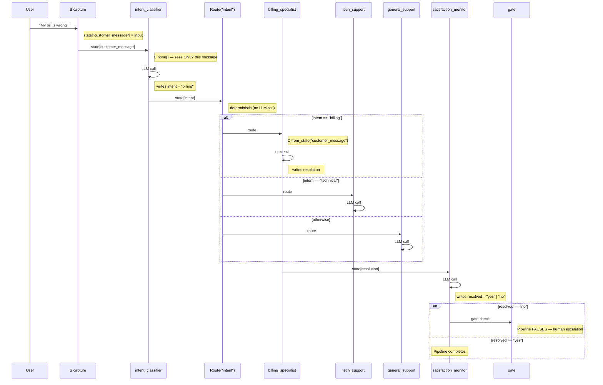

# Customer Support Triage — Multi-Tier Routing with Escalation

> **Modules in play:** `S.capture`, `C.none()`, `C.from_state()`, `Route`,
> `gate()`, `>>` sequential

## The Real-World Problem

Your support system has four specialist teams (billing, technical, account,
general). Today a coordinator LLM reads every ticket and decides where to
send it — burning API calls on a decision that could be deterministic.
Worse, the billing specialist sees the classifier's internal reasoning
("I determined this is a billing issue because...") mixed into the customer's
actual message, producing confused responses. And when a ticket isn't resolved,
it silently closes instead of escalating to a human.

You need: deterministic routing (no LLM for dispatch), clean context isolation
(specialists see only the customer message), and an escalation gate that pauses
the pipeline for human review when resolution fails.

## The Fluent Solution

```python
from adk_fluent import Agent, Pipeline, S, C, gate
from adk_fluent._routing import Route

MODEL = "gemini-2.5-flash"

# Step 1: Classify intent — stateless, no conversation history
classifier = (
    Agent("intent_classifier", MODEL)
    .instruct(
        "Classify the customer message into exactly one category: "
        "'billing', 'technical', 'account', or 'general'.\n"
        "Customer message: {customer_message}"
    )
    .context(C.none())    # Sees ONLY the captured message, not history
    .writes("intent")
)

# Step 2: Specialized handlers — each sees only the customer message
billing_handler = (
    Agent("billing_specialist", MODEL)
    .instruct("Help with payment issues, refunds, subscriptions.\nMessage: {customer_message}")
    .context(C.from_state("customer_message"))
    .writes("agent_response")
)
technical_handler = (
    Agent("tech_support", MODEL)
    .instruct("Diagnose the issue, suggest troubleshooting steps.\nMessage: {customer_message}")
    .context(C.from_state("customer_message"))
    .writes("agent_response")
)
account_handler = (
    Agent("account_manager", MODEL)
    .instruct("Help with account access, profile updates, security.\nMessage: {customer_message}")
    .context(C.from_state("customer_message"))
    .writes("agent_response")
)
general_handler = (
    Agent("general_support", MODEL)
    .instruct("Help with FAQs, product info, general inquiries.\nMessage: {customer_message}")
    .context(C.user_only())
    .writes("agent_response")
)

# Step 3: Satisfaction check + escalation gate
satisfaction_check = (
    Agent("satisfaction_monitor", MODEL)
    .instruct("Evaluate if the issue was resolved. Set resolved to 'yes' or 'no'.")
    .writes("resolved")
)
escalation = gate(
    lambda s: s.get("resolved") == "no",
    message="Issue unresolved. Escalating to human supervisor.",
)

# THE SYMPHONY: capture → classify → route → monitor → escalate
support_system = (
    S.capture("customer_message")
    >> classifier
    >> Route("intent")
       .eq("billing", billing_handler)
       .eq("technical", technical_handler)
       .eq("account", account_handler)
       .otherwise(general_handler)
    >> satisfaction_check
    >> escalation
)
```

## The Interplay Breakdown

**Why `S.capture()` first?**
The user's message arrives as a conversation event, not a state key. Downstream
agents need it as `{customer_message}` in their prompts. `S.capture("customer_message")`
extracts the latest user message into `state["customer_message"]` — a one-liner
that replaces a 10-line custom `BaseAgent` subclass in native ADK.

**Why `C.none()` on the classifier?**
The classifier should see *only* the current message, not prior conversation turns.
Without `C.none()`, a returning customer's history leaks in, and the classifier
might misroute based on a previous billing issue when the current issue is technical.
`C.none()` sets `include_contents="none"` on the native agent.

**Why `Route()` instead of LLM routing?**
The classifier already produced a string — `"billing"`, `"technical"`, etc.
Sending that string to another LLM to "decide" which specialist to call is
wasteful. `Route("intent").eq("billing", billing_handler)` dispatches instantly
and deterministically. Zero API cost, zero latency, 100% predictable. If you
later add a "returns" category, you add one `.eq()` line — no prompt engineering.

**Why `gate()` at the end?**
When `resolved == "no"`, the pipeline should stop and wait for human intervention.
`gate()` creates a checkpoint: the pipeline pauses, emits the escalation message,
and resumes only when a human approves. Without this, unresolved tickets silently
close — the most dangerous failure mode in support systems.

**Why `C.from_state()` on specialists?**
Each specialist sees *only* `customer_message` — not the classifier's output,
not other specialists' responses, not internal state. This prevents prompt
contamination and keeps specialist responses focused.

## Pipeline Topology

```
S.capture("customer_message")
    ──► intent_classifier [C.none]
        ──► Route("intent")
            ├─ "billing"   → billing_specialist
            ├─ "technical" → tech_support
            ├─ "account"   → account_manager
            └─ otherwise   → general_support
        ──► satisfaction_monitor
            ──► gate(resolved == "no") → [HUMAN ESCALATION]
```

## Execution Sequence



## Running on Different Backends

::::{tab-set}
:::{tab-item} ADK (default)
```python
response = support_pipeline.ask("I was charged twice for my subscription")
print(response)
```
:::
:::{tab-item} Temporal (in dev)
```python
from temporalio.client import Client

client = await Client.connect("localhost:7233")

# Route() becomes deterministic workflow code (zero LLM cost for routing)
# gate() becomes a Temporal Signal (pauses for human approval)
durable = support_pipeline.engine("temporal", client=client, task_queue="support")
response = await durable.ask_async("I was charged twice for my subscription")
```

This pipeline is especially well-suited for Temporal because:
- `Route()` is deterministic — replays identically from history
- `gate()` maps to Temporal Signals — pauses workflow for human input
- Each specialist handler is a separate Activity — cached on replay
:::
:::{tab-item} asyncio (in dev)
```python
async_pipeline = support_pipeline.engine("asyncio")
response = await async_pipeline.ask_async("I was charged twice for my subscription")
```
:::
::::

## Framework Comparison

| Framework    | Lines | Deterministic routing? | Context isolation? | Escalation gate? |
|-------------|-------|----------------------|-------------------|-----------------|
| **adk-fluent** | ~45 | `Route()` — instant  | `C.none()` built-in | `gate()` built-in |
| Native ADK   | ~100 | Custom `BaseAgent`    | Manual `include_contents` | Custom `EventActions` |
| LangGraph    | ~50  | `conditional_edges`   | Manual state scoping | Custom interrupt |
| CrewAI       | ~40  | LLM-only (no deterministic) | No isolation | No built-in gate |
