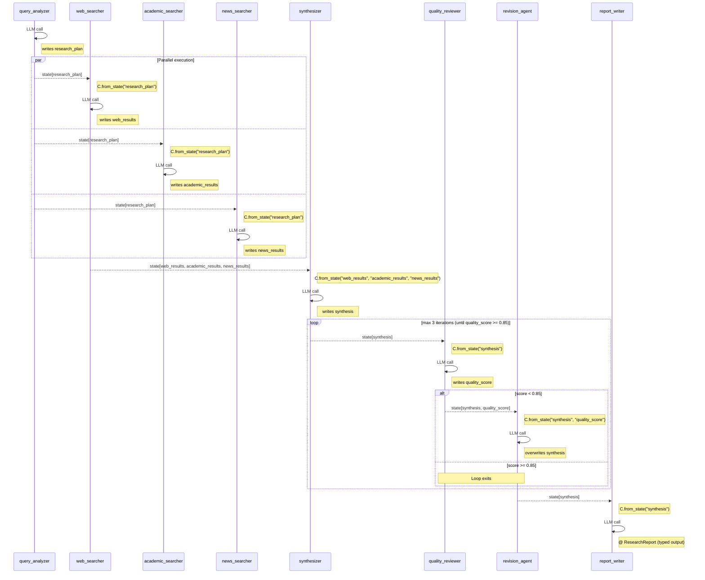

# Deep Research Agent — Gemini Deep Research in 20 Lines

> **Modules in play:** `>>` sequential, `|` parallel, `* until()` conditional loop,
> `@` typed output, `S.*` state transforms, `C.*` context engineering

## The Real-World Problem

Your analyst team spends 4 hours on a research brief: they decompose a question,
search three sources independently, synthesize the findings, then review-revise
until the report meets quality standards. Most of that time is mechanical — the
same decompose-search-synthesize-review pattern every time. You need a pipeline
that runs web, academic, and news searches *in parallel*, feeds results into a
synthesizer, loops a quality review until confidence hits 85%, and outputs a
typed report — not free-form text that breaks your downstream systems.

## The Fluent Solution

```python
from pydantic import BaseModel
from adk_fluent import Agent, Pipeline, S, C

MODEL = "gemini-2.5-flash"


class ResearchReport(BaseModel):
    """Structured output for the final research report."""
    title: str
    executive_summary: str
    key_findings: list[str]
    confidence_score: float


# Stage 1: Decompose the research query into sub-questions
query_analyzer = (
    Agent("query_analyzer", MODEL)
    .instruct(
        "Analyze the research query. Identify the core question, "
        "decompose it into 3-5 sub-questions, and determine which "
        "sources are most relevant (academic, news, web)."
    )
    .writes("research_plan")
)

# Stage 2: Search three source types IN PARALLEL
parallel_search = (
    Agent("web_searcher", MODEL)
    .instruct("Search the web for relevant articles. Summarize key findings.")
    .context(C.from_state("research_plan"))
    .writes("web_results")
    | Agent("academic_searcher", MODEL)
    .instruct("Search academic databases for peer-reviewed papers.")
    .context(C.from_state("research_plan"))
    .writes("academic_results")
    | Agent("news_searcher", MODEL)
    .instruct("Search recent news for current developments.")
    .context(C.from_state("research_plan"))
    .writes("news_results")
)

# Stage 3: Synthesize findings from all sources
synthesizer = (
    Agent("synthesizer", MODEL)
    .instruct(
        "Synthesize findings from web, academic, and news sources. "
        "Identify consensus, contradictions, and gaps. "
        "Rate confidence on a 0-1 scale."
    )
    .context(C.from_state("web_results", "academic_results", "news_results"))
    .writes("synthesis")
)

# Stage 4: Quality review loop — reviewer scores until confident
quality_loop = (
    Agent("quality_reviewer", MODEL)
    .instruct(
        "Review the synthesis for accuracy, completeness, and bias. "
        "Score quality from 0 to 1. If below 0.85, specify improvements."
    )
    .context(C.from_state("synthesis"))
    .writes("quality_score")
    >> Agent("revision_agent", MODEL)
    .instruct("Revise the synthesis based on reviewer feedback.")
    .context(C.from_state("synthesis", "quality_score"))
    .writes("synthesis")
).loop_until(lambda s: float(s.get("quality_score", 0)) >= 0.85, max_iterations=3)

# Stage 5: Format final report with TYPED output
report_writer = (
    Agent("report_writer", MODEL)
    .instruct("Write the final report with executive summary and key findings.")
    .context(C.from_state("synthesis"))
    @ ResearchReport
)

# THE SYMPHONY: one expression, five stages
deep_research = (
    query_analyzer >> parallel_search >> synthesizer >> quality_loop >> report_writer
)
```

## The Interplay Breakdown

This pipeline isn't just "agents in sequence." Every module choice solves a
specific problem:

**Why `|` (parallel) for the search stage?**
Web, academic, and news searches are independent. Running them sequentially
would triple the latency for zero benefit. The `|` operator launches all three
as concurrent branches under a `ParallelAgent`. When all three finish, their
results are merged into shared state — `web_results`, `academic_results`,
`news_results` — available to the synthesizer.

**Why `C.from_state()` instead of default context?**
Without context engineering, each searcher would see the full conversation
history — including the query analyzer's internal reasoning. That's noise.
`C.from_state("research_plan")` gives each searcher *only* the decomposed
plan, not the raw user query or other agents' outputs. The synthesizer uses
`C.from_state("web_results", "academic_results", "news_results")` to see
*only* the search results, not the plan or the original query.

**Why `* until()` for quality review?**
A fixed number of review rounds either wastes time (3 rounds when 1 suffices)
or produces low-quality output (1 round when 3 are needed). The `loop_until`
predicate — `quality_score >= 0.85` — makes the loop adaptive. The `max_iterations=3`
cap prevents runaway loops when the reviewer is never satisfied.

**Why `@` (typed output) on the report writer?**
Free-form text breaks downstream systems. The `@ ResearchReport` binding
forces the LLM to output JSON conforming to the Pydantic schema. If the
output doesn't parse, ADK raises immediately — no silent corruption.

**Why `.writes()` everywhere?**
Each agent writes to a named state key. This creates an explicit data contract:
`query_analyzer` produces `research_plan`, searchers produce `*_results`,
synthesizer produces `synthesis`. If you rename a key, `check_contracts()`
catches the break at build time, not in production.

## Pipeline Topology

```
query_analyzer ──► ┌─ web_searcher ────┐
                   │  academic_searcher │──► synthesizer ──► ┌─ quality_reviewer ─┐ * until(≥0.85)
                   │  news_searcher ────┘                    │  revision_agent ───┘
                                                             ──► report_writer @ ResearchReport
```

## Execution Sequence

This is what actually happens at runtime — the order of LLM calls, data flow between agents, and where parallel execution occurs. Auto-generated with `.to_sequence_diagram()`.



## Running on Different Backends

The pipeline definition above is backend-agnostic. Here's how to execute it on each backend:

::::{tab-set}
:::{tab-item} ADK (default)
```python
# Default backend — no .engine() needed
response = deep_research.ask("What are the latest advances in quantum computing?")
print(response)
```
:::
:::{tab-item} Temporal (in dev)
```python
from temporalio.client import Client

client = await Client.connect("localhost:7233")

# Same pipeline definition, durable execution
durable_research = deep_research.engine("temporal", client=client, task_queue="research")
response = await durable_research.ask_async("What are the latest advances in quantum computing?")

# If the process crashes during the quality loop, Temporal replays:
# - query_analyzer: cached (0 LLM cost)
# - 3 searchers: cached (0 LLM cost)
# - synthesizer: cached (0 LLM cost)
# - quality loop: resumes from last completed iteration
```
:::
:::{tab-item} asyncio (in dev)
```python
# Pure asyncio, no ADK dependency at runtime
async_research = deep_research.engine("asyncio")
response = await async_research.ask_async("What are the latest advances in quantum computing?")
```
:::
::::

## Framework Comparison

| Framework    | Lines | Notes                                              |
|-------------|-------|----------------------------------------------------|
| **adk-fluent** | ~50 | One expression per stage, compose with `>>`         |
| Native ADK   | ~120 | 7 LlmAgent + ParallelAgent + SequentialAgent + custom LoopAgent |
| LangGraph    | ~80  | StateGraph + conditional back-edges + fan-out nodes |
| CrewAI       | ~70  | No native parallel; no typed output; no quality loop control |

The adk-fluent version reads like a business process document. The native ADK
version reads like infrastructure code. Both produce identical runtime objects.
