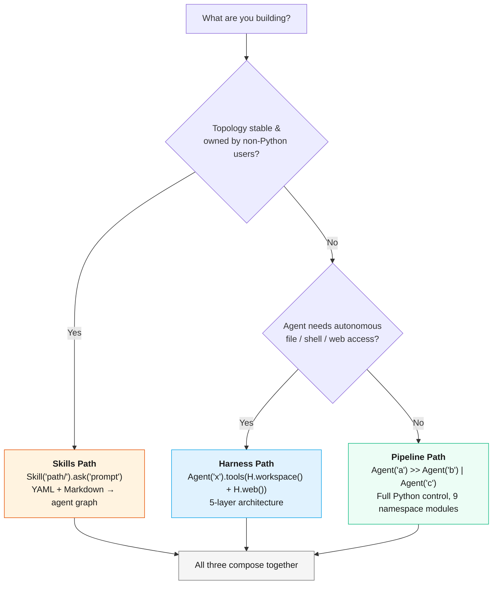
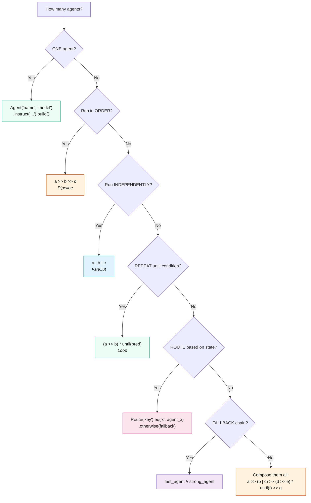
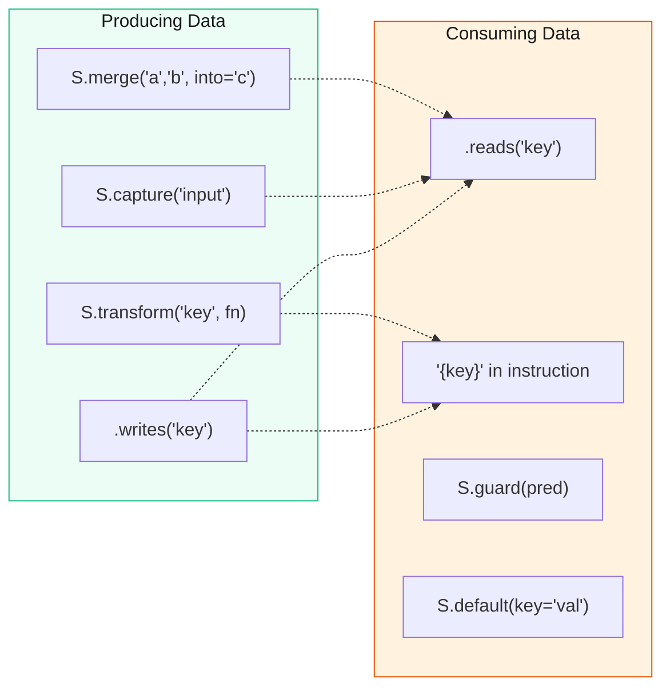

# Decision Guide

This page answers the question every developer asks: **"Which pattern should I use?"**

Use it as a flowchart when you're staring at a blank file and know what you
want but not how to express it in adk-fluent.

## Choosing a Pathway

Before picking a topology, pick a pathway. adk-fluent has three:



| | Pipeline | Skills | Harness |
|---|---|---|---|
| **Abstraction** | Low -- full Python control | High -- YAML config | Medium -- composable layers |
| **Topology** | Any (unlimited) | Fixed per skill file | Agent + toolset |
| **Who writes it** | Engineers | Domain experts + engineers | Engineers |
| **File/shell access** | Optional | No | Yes (sandboxed) |
| **Multi-turn runtime** | No | No | Yes (REPL, memory) |
| **Reusability** | Code sharing | SKILL.md sharing (30+ platforms) | Per-domain |

**All three compose.** A harness loads skills, skills wire agents as pipelines, pipelines use the full expression algebra.

## Choosing a Topology



## Choosing a Context Strategy

| Situation | Use | Why |
|---|---|---|
| Agent should see NO history | `C.none()` | Classifiers, routers, utility agents that shouldn't be influenced by prior conversation |
| Agent should see only USER messages | `C.user_only()` | Prevents leaking other agents' internal reasoning |
| Agent should see specific state keys | `C.from_state("key1", "key2")` | Explicit data contracts; agent sees only what it needs |
| Agent should see recent context only | `C.window(n=5)` | Keeps token budget manageable for long conversations |
| Agent should see specific other agents | `C.from_agents("agent_a", "agent_b")` | Multi-agent workflows where you want selective visibility |
| Default ADK behavior | Don't call `.context()` | Agent sees full conversation history |

See [Context Engineering](user-guide/context-engineering.md) for composition rules (`|` for union, `>>` for pipe).

## Choosing a Data Flow Strategy



| Situation | Use | Why |
|---|---|---|
| Pass data to the next agent | `.writes("key")` | Named state key, explicit contract |
| Read data from a previous agent | `.reads("key")` or `{key}` in instruction | Inject state into prompt template |
| Capture user input into state | `S.capture("message")` | Zero-cost function step before pipeline |
| Transform data between agents | `S.transform("key", fn)` or `S.compute(...)` | No LLM call, pure function |
| Merge multiple keys | `S.merge("a", "b", into="combined")` | Combine parallel outputs |
| Validate state invariants | `S.guard(pred, msg="...")` | Fail fast if preconditions are broken |
| Set defaults | `S.default(key="fallback_value")` | Ensure keys exist before reading |

See [Data Flow](user-guide/data-flow.md) and [State Transforms](user-guide/state-transforms.md).

## Choosing an Output Strategy

| Situation | Use | Why |
|---|---|---|
| Free-form text | Don't add constraints | Default LLM behavior |
| Structured JSON | `agent @ MyPydanticModel` or `.returns(Model)` | Forces JSON conforming to schema; raises on parse failure |
| Named state key | `.writes("result")` | Downstream agents read `{result}` in prompts |
| Contract annotation only | `.produces(Schema)` | No runtime effect; `check_contracts()` verifies at build time |

See [Structured Data](user-guide/structured-data.md).

## Choosing a Testing Strategy

| Situation | Use | Why |
|---|---|---|
| Quick smoke test | `.test("prompt", contains="expected")` | Inline, no test file needed |
| Deterministic tests (no API) | `.mock({"agent": "response"})` | Canned responses, no LLM calls |
| Contract verification | `check_contracts(pipeline.to_ir())` | Static analysis of data flow |
| Full harness | `AgentHarness(builder, backend=mock_backend(...))` | Async send/receive with assertions |

See [Testing](user-guide/testing.md).

## Choosing a Middleware Strategy

| Situation | Use | Why |
|---|---|---|
| Retry on transient failures | `M.retry(max_attempts=3)` | Exponential backoff, no retry logic in tools |
| Log all agent events | `M.log()` | Structured logging for observability |
| Track token usage | `M.cost()` | Budget monitoring |
| Circuit breaker | `M.circuit_breaker(max_fails=5)` | Stop calling a failing model |
| Cache responses | `M.cache(ttl=300)` | Avoid redundant LLM calls |
| Scope to specific agents | `M.scope(["agent_a"], M.retry())` | Apply middleware selectively |

See [Middleware](user-guide/middleware.md).

## Common Recipes by Goal

### "I want to classify and route"

::::{tab-set}
:::{tab-item} Python
:sync: python

```python
from adk_fluent import Agent, S, C, Route

classifier = Agent("classifier", MODEL).instruct("Classify: a, b, or c").context(C.none()).writes("category")
pipeline = S.capture("input") >> classifier >> Route("category").eq("a", agent_a).eq("b", agent_b).otherwise(agent_c)
```
:::
:::{tab-item} TypeScript
:sync: ts

```ts
import { Agent, S, C, Route } from "adk-fluent-ts";

const classifier = new Agent("classifier", MODEL)
  .instruct("Classify: a, b, or c")
  .context(C.none())
  .writes("category");

const pipeline = S.capture("input")
  .then(classifier)
  .then(new Route("category").eq("a", agentA).eq("b", agentB).otherwise(agentC));
```
:::
::::

See [Cookbook: Customer Support Triage](cookbook/hero-workflows/customer-support-triage.md)

### "I want parallel search then synthesis"

::::{tab-set}
:::{tab-item} Python
:sync: python

```python
from adk_fluent import Agent, C

results = (
    Agent("web", MODEL).instruct("Search web.").writes("web")
    | Agent("papers", MODEL).instruct("Search papers.").writes("papers")
)
pipeline = results >> Agent("synth", MODEL).instruct("Synthesize {web} and {papers}.")
```
:::
:::{tab-item} TypeScript
:sync: ts

```ts
import { Agent } from "adk-fluent-ts";

const results = new Agent("web", MODEL)
  .instruct("Search web.")
  .writes("web")
  .parallel(new Agent("papers", MODEL).instruct("Search papers.").writes("papers"));

const pipeline = results.then(
  new Agent("synth", MODEL).instruct("Synthesize {web} and {papers}."),
);
```
:::
::::

See [Cookbook: Deep Research](cookbook/hero-workflows/deep-research.md)

### "I want write-review-revise loop"

::::{tab-set}
:::{tab-item} Python
:sync: python

```python
from adk_fluent import Agent

loop = (
    Agent("writer", MODEL).instruct("Write.").writes("draft")
    >> Agent("critic", MODEL).instruct("Score 0-1.").writes("score")
).loop_until(lambda s: float(s.get("score", 0)) >= 0.8, max_iterations=3)
```
:::
:::{tab-item} TypeScript
:sync: ts

```ts
import { Agent } from "adk-fluent-ts";

const loop = new Agent("writer", MODEL)
  .instruct("Write.")
  .writes("draft")
  .then(new Agent("critic", MODEL).instruct("Score 0-1.").writes("score"))
  .timesUntil((s) => Number(s.score ?? 0) >= 0.8, { max: 3 });
```
:::
::::

See [Patterns: review_loop](user-guide/patterns.md)

### "I want to test without API calls"

::::{tab-set}
:::{tab-item} Python
:sync: python

```python
from adk_fluent import Agent
from adk_fluent.testing import mock_backend, AgentHarness

harness = AgentHarness(
    Agent("helper").instruct("Help."),
    backend=mock_backend({"helper": "I can help!"})
)
response = await harness.send("Hi")
assert response.final_text == "I can help!"
```
:::
:::{tab-item} TypeScript
:sync: ts

```ts
import { Agent } from "adk-fluent-ts";

const helper = new Agent("helper", "gemini-2.5-flash")
  .instruct("Help.")
  .mock({ helper: "I can help!" });

const response = await helper.askAsync("Hi");
```
:::
::::

See [Testing](user-guide/testing.md)

## Still Not Sure?

- Browse the [Cookbook by use case](generated/cookbook/recipes-by-use-case.md) -- find a recipe that matches your domain
- Read the [Framework Comparison](user-guide/comparison.md) -- see how adk-fluent compares to LangGraph and CrewAI
- Check the [Hero Workflows](cookbook/index.md) -- 7 production-grade examples with full interplay breakdowns
- Read the [Error Reference](user-guide/error-reference.md) -- if you're stuck on a specific error
