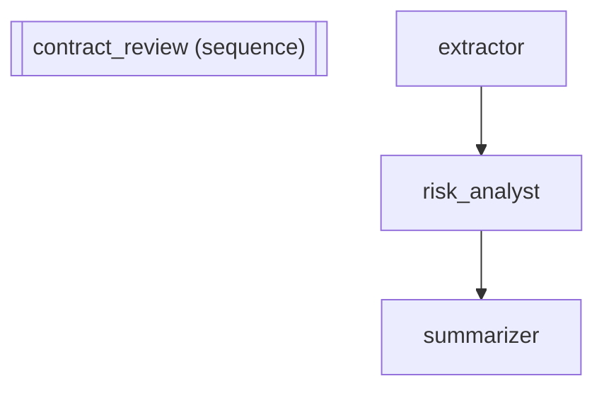

# Document Processing Pipeline -- Sequential Pipeline

Real-world use case: Contract review system used by legal teams to process
vendor agreements at scale. Extracts key terms, identifies legal risks,
and produces executive summaries -- replacing hours of manual review.

In other frameworks: LangGraph requires a StateGraph with TypedDict state,
3 node functions, and 5 edge declarations (~35 lines). CrewAI needs 3 Agent
objects with role/goal/backstory plus 3 Task objects (~30 lines). Native ADK
needs 3 LlmAgent + 1 SequentialAgent (~20 lines). adk-fluent composes the
same pipeline in a single expression.

Pipeline topology:
    extractor >> risk_analyst >> summarizer

:::{admonition} Why this matters
:class: important
Sequential pipelines are the workhorse of production AI systems. Legal contract review, medical diagnosis, financial analysis -- all follow the same pattern: extract, analyze, summarize. Each stage builds on the previous stage's output. The `>>` operator makes the pipeline topology visible in a single line of code, so anyone can understand the data flow at a glance without navigating across 4+ class definitions.
:::

:::{warning} Without this
In native ADK, a 3-stage pipeline requires 3 separate `LlmAgent` declarations plus a `SequentialAgent` wrapper -- 20+ lines where the topology is implicit in the `sub_agents` list. When pipelines grow to 5-10 stages, the topology becomes invisible. With LangGraph, you need ~35 lines of StateGraph wiring. With adk-fluent, the same pipeline is a single readable expression: `extractor >> analyst >> summarizer`.
:::

:::{tip} What you'll learn
How to compose agents into a sequential pipeline with the >> operator.
:::

_Source: `04_sequential_pipeline.py`_

::::{tab-set}
:::{tab-item} adk-fluent
```python
from adk_fluent import Agent, Pipeline

pipeline_fluent = (
    Pipeline("contract_review")
    .describe("Extract, analyze, and summarize contracts")
    .step(
        Agent("extractor")
        .model("gemini-2.5-flash")
        .instruct(
            "Extract key terms from the contract: parties involved, "
            "effective dates, payment terms, and termination clauses."
        )
    )
    .step(
        Agent("risk_analyst")
        .model("gemini-2.5-flash")
        .instruct(
            "Analyze the extracted terms for legal risks. Flag any "
            "unusual clauses, missing protections, or liability concerns."
        )
    )
    .step(
        Agent("summarizer")
        .model("gemini-2.5-flash")
        .instruct(
            "Produce a one-page executive summary combining the extracted "
            "terms and risk analysis. Use clear, non-legal language."
        )
    )
    .build()
)
```
:::
:::{tab-item} Native ADK
```python
from google.adk.agents.llm_agent import LlmAgent
from google.adk.agents.sequential_agent import SequentialAgent

extractor = LlmAgent(
    name="extractor",
    model="gemini-2.5-flash",
    instruction=(
        "Extract key terms from the contract: parties involved, "
        "effective dates, payment terms, and termination clauses."
    ),
)
analyst = LlmAgent(
    name="risk_analyst",
    model="gemini-2.5-flash",
    instruction=(
        "Analyze the extracted terms for legal risks. Flag any "
        "unusual clauses, missing protections, or liability concerns."
    ),
)
summarizer = LlmAgent(
    name="summarizer",
    model="gemini-2.5-flash",
    instruction=(
        "Produce a one-page executive summary combining the extracted "
        "terms and risk analysis. Use clear, non-legal language."
    ),
)
pipeline_native = SequentialAgent(
    name="contract_review",
    description="Extract, analyze, and summarize contracts",
    sub_agents=[extractor, analyst, summarizer],
)
```
:::
:::{tab-item} Architecture

:::
::::

## Equivalence

```python
assert type(pipeline_native) == type(pipeline_fluent)
assert len(pipeline_fluent.sub_agents) == 3
assert pipeline_fluent.sub_agents[0].name == "extractor"
assert pipeline_fluent.sub_agents[1].name == "risk_analyst"
assert pipeline_fluent.sub_agents[2].name == "summarizer"
```

:::{seealso}
API reference: [Pipeline](../api/workflow.md#builder-Pipeline)
:::
