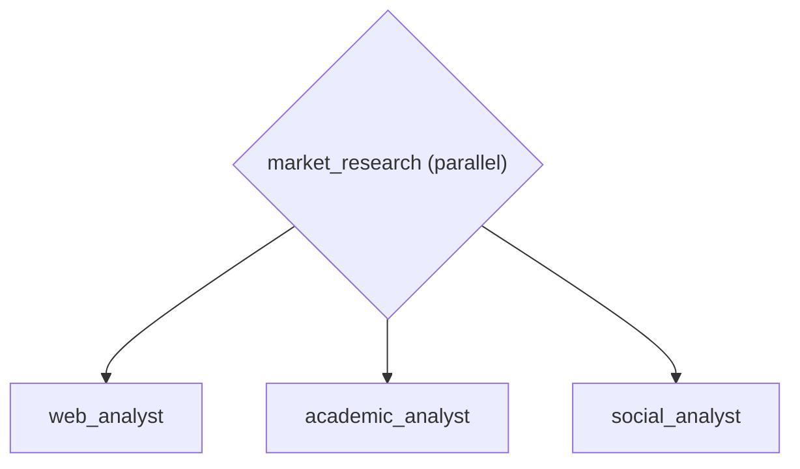

# Market Research Fan-Out -- Parallel FanOut

Demonstrates a ParallelAgent that runs branches concurrently.  The
scenario: a market research system that simultaneously gathers
intelligence from web sources, academic papers, and social media
to produce a comprehensive competitive analysis.

Real-world use case: Competitive intelligence system that simultaneously
gathers data from web, academic, and social media sources. Used by market
research teams to produce comprehensive analysis in minutes instead of days.

In other frameworks: LangGraph requires a StateGraph with fan-out nodes and
edge wiring (~30 lines). CrewAI supports parallel via Crew(process="parallel")
but lacks explicit fan-out composition. adk-fluent uses the | operator for
declarative parallel execution.

Pipeline topology:
    ( web_analyst | academic_analyst | social_analyst )

:::{admonition} Why this matters
:class: important
Many real-world tasks are embarrassingly parallel -- gathering competitive intelligence from multiple sources, running security and style checks on the same code, or querying multiple databases simultaneously. Running these sequentially wastes time. The `|` operator expresses parallel execution declaratively, and the resulting pipeline automatically manages concurrency. Market research that takes days of sequential gathering completes in minutes with parallel fan-out.
:::

:::{warning} Without this
Without parallel composition, independent tasks run sequentially, multiplying latency by the number of branches. A 3-source research pipeline that could complete in 5 seconds takes 15. In native ADK, you need a separate `ParallelAgent` wrapper class with manual `sub_agents` wiring. In adk-fluent, `agent_a | agent_b | agent_c` is a single expression.
:::

:::{tip} What you'll learn
How to run agents concurrently using the | (parallel) operator.
:::

_Source: `05_parallel_fanout.py`_

::::{tab-set}
:::{tab-item} adk-fluent
```python
from adk_fluent import Agent, FanOut

fanout_fluent = (
    FanOut("market_research")
    .branch(
        Agent("web_analyst")
        .model("gemini-2.5-flash")
        .instruct(
            "Search the web for recent news articles, press releases, "
            "and blog posts about competitors in this market segment."
        )
    )
    .branch(
        Agent("academic_analyst")
        .model("gemini-2.5-flash")
        .instruct("Search academic databases for recent research papers and industry reports relevant to this market.")
    )
    .branch(
        Agent("social_analyst")
        .model("gemini-2.5-flash")
        .instruct("Analyze social media sentiment and trending discussions about products and brands in this market.")
    )
    .build()
)
```
:::
:::{tab-item} Native ADK
```python
from google.adk.agents.llm_agent import LlmAgent
from google.adk.agents.parallel_agent import ParallelAgent

fanout_native = ParallelAgent(
    name="market_research",
    sub_agents=[
        LlmAgent(
            name="web_analyst",
            model="gemini-2.5-flash",
            instruction=(
                "Search the web for recent news articles, press releases, "
                "and blog posts about competitors in this market segment."
            ),
        ),
        LlmAgent(
            name="academic_analyst",
            model="gemini-2.5-flash",
            instruction=(
                "Search academic databases for recent research papers and industry reports relevant to this market."
            ),
        ),
        LlmAgent(
            name="social_analyst",
            model="gemini-2.5-flash",
            instruction=(
                "Analyze social media sentiment and trending discussions about products and brands in this market."
            ),
        ),
    ],
)
```
:::
:::{tab-item} Architecture

:::
::::

## Equivalence

```python
assert type(fanout_native) == type(fanout_fluent)
assert len(fanout_fluent.sub_agents) == 3
assert fanout_fluent.sub_agents[0].name == "web_analyst"
assert fanout_fluent.sub_agents[1].name == "academic_analyst"
assert fanout_fluent.sub_agents[2].name == "social_analyst"
```

:::{seealso}
API reference: [FanOut](../api/workflow.md#builder-FanOut)
:::
