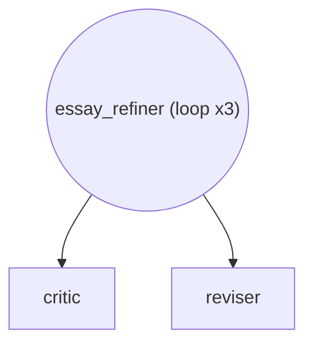

# Essay Refinement Loop -- Loop Agent

Demonstrates a LoopAgent that iterates sub-agents until a maximum
iteration count.  The scenario: an essay refinement workflow where
a critic evaluates the draft and a reviser improves it, repeating
up to 3 times until quality standards are met.

*How to create looping agent workflows.*

_Source: `06_loop_agent.py`_

### Architecture



::::{tab-set}
:::{tab-item} Native ADK
```python
from google.adk.agents.llm_agent import LlmAgent
from google.adk.agents.loop_agent import LoopAgent

loop_native = LoopAgent(
    name="essay_refiner",
    max_iterations=3,
    sub_agents=[
        LlmAgent(
            name="critic",
            model="gemini-2.5-flash",
            instruction=(
                "Evaluate the essay for clarity, structure, grammar, "
                "and argument strength. Provide specific, actionable "
                "feedback. If the essay meets a high quality bar, "
                "say APPROVED."
            ),
        ),
        LlmAgent(
            name="reviser",
            model="gemini-2.5-flash",
            instruction=(
                "Revise the essay based on the critic's feedback. "
                "Improve clarity, fix grammatical issues, and strengthen "
                "weak arguments while preserving the author's voice."
            ),
        ),
    ],
)
```
:::
:::{tab-item} adk-fluent
```python
from adk_fluent import Agent, Loop

loop_fluent = (
    Loop("essay_refiner")
    .max_iterations(3)
    .step(
        Agent("critic")
        .model("gemini-2.5-flash")
        .instruct(
            "Evaluate the essay for clarity, structure, grammar, "
            "and argument strength. Provide specific, actionable "
            "feedback. If the essay meets a high quality bar, "
            "say APPROVED."
        )
    )
    .step(
        Agent("reviser")
        .model("gemini-2.5-flash")
        .instruct(
            "Revise the essay based on the critic's feedback. "
            "Improve clarity, fix grammatical issues, and strengthen "
            "weak arguments while preserving the author's voice."
        )
    )
    .build()
)
```
:::
::::

## Equivalence

```python
assert type(loop_native) == type(loop_fluent)
assert loop_fluent.max_iterations == 3
assert len(loop_fluent.sub_agents) == 2
assert loop_fluent.sub_agents[0].name == "critic"
assert loop_fluent.sub_agents[1].name == "reviser"
```

:::{seealso}
API reference: [Agent](../api/agent.md#builder-Agent)
:::
