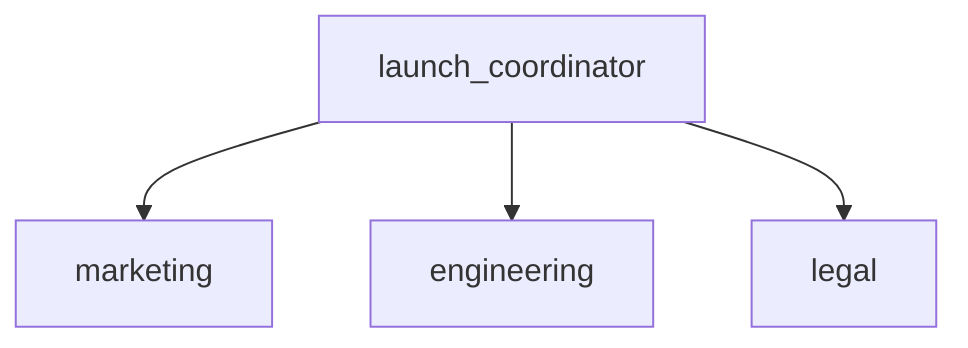

# Product Launch Coordinator -- Team Coordinator Pattern

Demonstrates an LLM agent that delegates to specialized sub-agents.
The scenario: a product launch coordinator that routes tasks to
marketing, engineering, and legal teams based on the request.

Pipeline topology:
    launch_coordinator
        |-- marketing
        |-- engineering
        '-- legal

:::{admonition} Why this matters
:class: important
Most complex tasks require multiple specialists. A product launch needs marketing copy, engineering specs, and legal review. A coordinator agent with sub-agents delegates based on the request, using the LLM's judgment to match tasks to the right specialist. This pattern scales naturally -- adding a new specialist is just adding one more `.sub_agent()` call rather than rewriting routing logic.
:::

:::{warning} Without this
Without a coordinator pattern, you either hardcode routing logic (brittle and inflexible) or force a single agent to handle everything (jack-of-all-trades, master-of-none). The coordinator pattern provides the best of both worlds: an LLM makes the delegation decision, but each specialist has focused expertise and tools.
:::

:::{tip} What you'll learn
How to build a team of agents with a coordinator that delegates.
:::

_Source: `07_team_coordinator.py`_

::::{tab-set}
:::{tab-item} adk-fluent
```python
from adk_fluent import Agent

coordinator_fluent = (
    Agent("launch_coordinator")
    .model("gemini-2.5-flash")
    .instruct(
        "You coordinate product launches. Analyze each request and "
        "delegate to the right team: marketing for campaigns and "
        "messaging, engineering for release readiness and deployment, "
        "or legal for compliance and licensing reviews."
    )
    .sub_agent(
        Agent("marketing")
        .model("gemini-2.5-flash")
        .instruct("Draft marketing campaigns, press releases, and social media strategies for the product launch.")
    )
    .sub_agent(
        Agent("engineering")
        .model("gemini-2.5-flash")
        .instruct("Review technical readiness: CI/CD pipelines, load testing results, and deployment checklists.")
    )
    .sub_agent(
        Agent("legal")
        .model("gemini-2.5-flash")
        .instruct(
            "Review licensing terms, privacy compliance (GDPR/CCPA), and terms-of-service updates for the launch."
        )
    )
    .build()
)
```
:::
:::{tab-item} Native ADK
```python
from google.adk.agents.llm_agent import LlmAgent

coordinator_native = LlmAgent(
    name="launch_coordinator",
    model="gemini-2.5-flash",
    instruction=(
        "You coordinate product launches. Analyze each request and "
        "delegate to the right team: marketing for campaigns and "
        "messaging, engineering for release readiness and deployment, "
        "or legal for compliance and licensing reviews."
    ),
    sub_agents=[
        LlmAgent(
            name="marketing",
            model="gemini-2.5-flash",
            instruction=(
                "Draft marketing campaigns, press releases, and social media strategies for the product launch."
            ),
        ),
        LlmAgent(
            name="engineering",
            model="gemini-2.5-flash",
            instruction=(
                "Review technical readiness: CI/CD pipelines, load testing results, and deployment checklists."
            ),
        ),
        LlmAgent(
            name="legal",
            model="gemini-2.5-flash",
            instruction=(
                "Review licensing terms, privacy compliance (GDPR/CCPA), and terms-of-service updates for the launch."
            ),
        ),
    ],
)
```
:::
:::{tab-item} Architecture

:::
::::

## Equivalence

```python
assert type(coordinator_native) == type(coordinator_fluent)
assert len(coordinator_fluent.sub_agents) == 3
assert coordinator_fluent.sub_agents[0].name == "marketing"
assert coordinator_fluent.sub_agents[1].name == "engineering"
assert coordinator_fluent.sub_agents[2].name == "legal"
```
