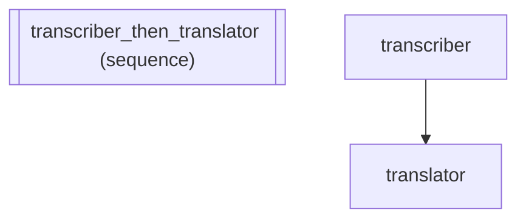

# Live Translation Pipeline -- Streaming with .stream()

Real-world use case: Real-time translation pipeline for live event
transcription. Transcribes audio, translates, and formats subtitles --
all streaming. Critical for live conferences, court interpreting, and
broadcast captioning where latency matters.

In other frameworks: LangGraph supports streaming via astream_events but
requires graph compilation and manual event filtering. adk-fluent exposes
.stream() directly on any pipeline, making token-by-token output a single
async for loop.

:::{tip} What you'll learn
How to compose agents into a sequential pipeline.
:::

_Source: `09_streaming.py`_

::::{tab-set}
:::{tab-item} adk-fluent
```python
from adk_fluent import Agent

# The fluent API makes streaming a single async for loop:
# async for chunk in pipeline.stream("audio data here"):
#     print(chunk, end="")

transcriber = (
    Agent("transcriber")
    .model("gemini-2.5-flash")
    .instruct("Transcribe the incoming audio stream to text. Preserve speaker labels and timestamps.")
    .writes("transcript")
)

translator = (
    Agent("translator")
    .model("gemini-2.5-flash")
    .instruct("Translate the transcript to Spanish. Preserve speaker labels and formatting.")
)

pipeline_fluent = transcriber >> translator

# Build both to compare
built_native = pipeline_native
built_fluent = pipeline_fluent.build()
```
:::
:::{tab-item} Native ADK
```python
from google.adk.agents.llm_agent import LlmAgent
from google.adk.agents.sequential_agent import SequentialAgent

# Native ADK: streaming requires manual event iteration
#   async for event in runner.run_async(...):
#       if event.content and event.content.parts:
#           for part in event.content.parts:
#               if part.text:
#                   yield part.text

transcriber_native = LlmAgent(
    name="transcriber",
    model="gemini-2.5-flash",
    instruction=("Transcribe the incoming audio stream to text. Preserve speaker labels and timestamps."),
    output_key="transcript",
)

translator_native = LlmAgent(
    name="translator",
    model="gemini-2.5-flash",
    instruction=("Translate the transcript to Spanish. Preserve speaker labels and formatting."),
)

pipeline_native = SequentialAgent(
    name="translation_pipeline",
    sub_agents=[transcriber_native, translator_native],
)
```
:::
:::{tab-item} Architecture

:::
::::

## Equivalence

```python
# Both produce SequentialAgent with 2 sub-agents
assert type(built_native) == type(built_fluent)
assert len(built_native.sub_agents) == len(built_fluent.sub_agents)
assert built_fluent.sub_agents[0].name == "transcriber"
assert built_fluent.sub_agents[1].name == "translator"

# Transcriber stores output in state for downstream consumption
assert built_fluent.sub_agents[0].output_key == "transcript"

# stream() is available on Agent builders
assert hasattr(transcriber, "stream")
assert callable(transcriber.stream)

# stream() is also available on the translator Agent builder
assert hasattr(translator, "stream")
assert callable(translator.stream)
```
