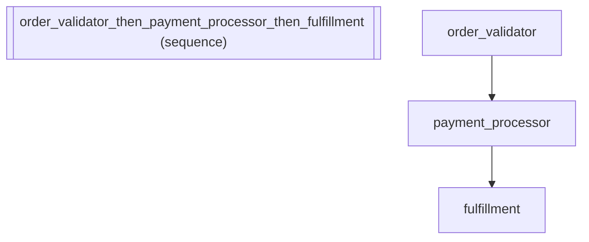

# Production Deployment -- to_app() with Middleware Stack

Real-world use case: E-commerce order processing with retry middleware
for transient failures. Production systems need resilience -- this shows
how middleware and pipelines compose to handle validation, payment, and
fulfillment with automatic retries and structured logging.

In other frameworks: LangGraph handles retries via custom node wrappers
that must be applied to each node individually. adk-fluent uses middleware
composition with the M module, applying cross-cutting concerns uniformly
across the entire pipeline.

:::{tip} What you'll learn
How to compose agents into a sequential pipeline.
:::

_Source: `15_production_runtime.py`_

### Architecture



::::{tab-set}
:::{tab-item} Native ADK
```python
from google.adk.agents.llm_agent import LlmAgent
from google.adk.agents.sequential_agent import SequentialAgent

# Native ADK production setup: manually assemble agent, runner, session
order_validator = LlmAgent(
    name="order_validator",
    model="gemini-2.5-flash",
    instruction="Validate the incoming order: check required fields, verify pricing, confirm inventory.",
)
payment_processor = LlmAgent(
    name="payment_processor",
    model="gemini-2.5-flash",
    instruction="Process payment for the validated order. Apply discounts and calculate tax.",
)
fulfillment = LlmAgent(
    name="fulfillment",
    model="gemini-2.5-flash",
    instruction="Create shipping label and dispatch order to the nearest warehouse.",
)
pipeline_native = SequentialAgent(
    name="order_pipeline",
    sub_agents=[order_validator, payment_processor, fulfillment],
)
```
:::
:::{tab-item} adk-fluent
```python
from adk_fluent import Agent, RetryMiddleware, StructuredLogMiddleware

# to_app() compiles through IR to a production-ready ADK App.
# Middleware wraps every agent invocation with cross-cutting concerns.
pipeline = (
    Agent("order_validator")
    .model("gemini-2.5-flash")
    .instruct("Validate the incoming order: check required fields, verify pricing, confirm inventory.")
    >> Agent("payment_processor")
    .model("gemini-2.5-flash")
    .instruct("Process payment for the validated order. Apply discounts and calculate tax.")
    >> Agent("fulfillment")
    .model("gemini-2.5-flash")
    .instruct("Create shipping label and dispatch order to the nearest warehouse.")
)

# Add production middleware
pipeline.middleware(RetryMiddleware(max_attempts=3))
pipeline.middleware(StructuredLogMiddleware())

# Compile to native App -- ready for Runner
app = pipeline.to_app()

# Also build the sequential agent directly for comparison
built_fluent = pipeline.build()
```
:::
::::

## Equivalence

```python
from google.adk.apps.app import App

# to_app() produces a native ADK App
assert isinstance(app, App)

# build() produces the same type as native
assert type(pipeline_native) == type(built_fluent)
assert len(built_fluent.sub_agents) == 3
assert built_fluent.sub_agents[0].name == "order_validator"
assert built_fluent.sub_agents[1].name == "payment_processor"
assert built_fluent.sub_agents[2].name == "fulfillment"

# Middleware is attached
assert len(pipeline._middlewares) == 2
assert isinstance(pipeline._middlewares[0], RetryMiddleware)
assert isinstance(pipeline._middlewares[1], StructuredLogMiddleware)
```

:::{seealso}
API reference: [Runner](../api/runtime.md#builder-Runner)
:::
