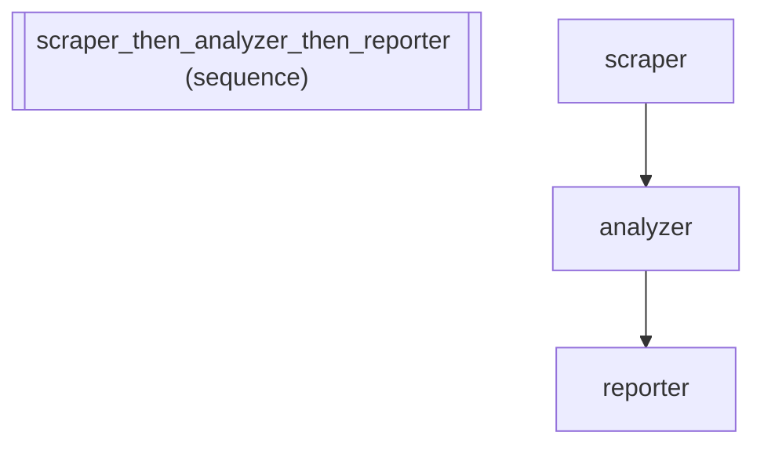

# News Analysis Pipeline with Operator Composition: >>, |, \*

*How to compose agents into a sequential pipeline.*

_Source: `16_operator_composition.py`_

### Architecture



::::\{tab-set}
:::\{tab-item} Native ADK

```python
from google.adk.agents.llm_agent import LlmAgent
from google.adk.agents.sequential_agent import SequentialAgent
from google.adk.agents.parallel_agent import ParallelAgent
from google.adk.agents.loop_agent import LoopAgent

# Native: a news analysis pipeline requires 15+ lines of boilerplate
scraper = LlmAgent(name="scraper", model="gemini-2.5-flash", instruction="Scrape news articles from sources.")
analyzer = LlmAgent(name="analyzer", model="gemini-2.5-flash", instruction="Analyze sentiment and key themes.")
reporter = LlmAgent(name="reporter", model="gemini-2.5-flash", instruction="Write a summary news report.")

pipeline_native = SequentialAgent(
    name="news_pipeline",
    sub_agents=[scraper, analyzer, reporter],
)

# Native: parallel data gathering
politics = LlmAgent(name="politics", model="gemini-2.5-flash", instruction="Gather political news.")
markets = LlmAgent(name="markets", model="gemini-2.5-flash", instruction="Gather financial market data.")
parallel_native = ParallelAgent(name="news_sources", sub_agents=[politics, markets])

# Native: editorial loop for quality refinement
draft_writer = LlmAgent(name="draft_writer", model="gemini-2.5-flash", instruction="Write a news draft.")
fact_checker = LlmAgent(name="fact_checker", model="gemini-2.5-flash", instruction="Fact-check the draft.")
loop_native = LoopAgent(name="editorial_loop", max_iterations=3, sub_agents=[draft_writer, fact_checker])
```

:::
:::\{tab-item} adk-fluent

```python
from adk_fluent import Agent, Pipeline

s = Agent("scraper").model("gemini-2.5-flash").instruct("Scrape news articles from sources.")
a = Agent("analyzer").model("gemini-2.5-flash").instruct("Analyze sentiment and key themes.")
r = Agent("reporter").model("gemini-2.5-flash").instruct("Write a summary news report.")

# >> creates Pipeline (SequentialAgent): scrape -> analyze -> report
pipeline_fluent = s >> a >> r

# | creates FanOut (ParallelAgent): gather from multiple beats simultaneously
pol = Agent("politics").model("gemini-2.5-flash").instruct("Gather political news.")
mkt = Agent("markets").model("gemini-2.5-flash").instruct("Gather financial market data.")
parallel_fluent = pol | mkt

# * creates Loop (LoopAgent): draft and fact-check up to 3 times
dw = Agent("draft_writer").model("gemini-2.5-flash").instruct("Write a news draft.")
fc = Agent("fact_checker").model("gemini-2.5-flash").instruct("Fact-check the draft.")
loop_fluent = (dw >> fc) * 3
```

:::
::::

## Equivalence

```python
# Pipeline via >>
assert isinstance(pipeline_fluent, Pipeline)
built_pipeline = pipeline_fluent.build()
assert type(pipeline_native) == type(built_pipeline)
assert len(built_pipeline.sub_agents) == 3

# FanOut via |
built_parallel = parallel_fluent.build()
assert type(parallel_native) == type(built_parallel)
assert len(built_parallel.sub_agents) == 2

# Loop via *
built_loop = loop_fluent.build()
assert type(loop_native) == type(built_loop)
assert built_loop.max_iterations == 3
```
