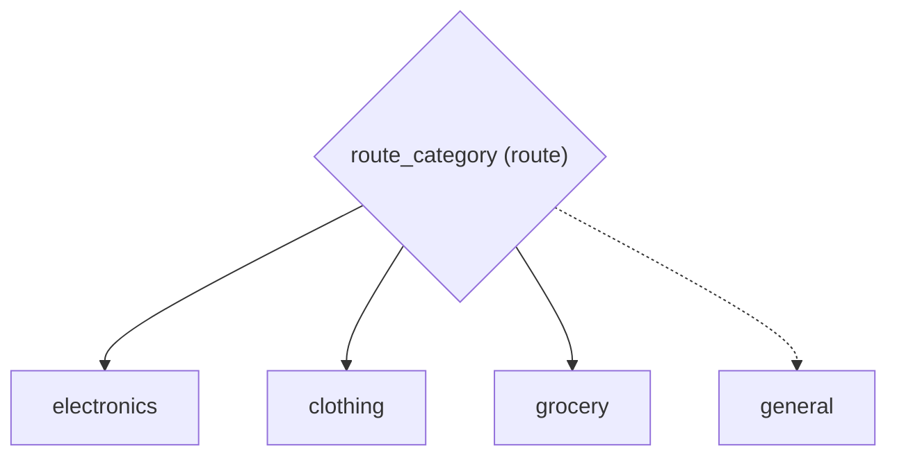

# E-Commerce Order Routing with Deterministic Branching

*How to implement conditional routing and branching.*

_Source: `17_route_branching.py`_

### Architecture



::::{tab-set}
:::{tab-item} Native ADK
```python
# Native ADK has no built-in deterministic router. You'd need:
#   1. An LlmAgent coordinator (wastes API calls for simple routing), OR
#   2. A custom BaseAgent subclass with predicate logic (~30 lines)
# Neither approach is ergonomic for common routing patterns.
```
:::
:::{tab-item} adk-fluent
```python
from adk_fluent import Agent
from adk_fluent._routing import Route

# Route on exact match: direct orders to the correct fulfillment team
electronics = Agent("electronics").model("gemini-2.5-flash").instruct("Process electronics orders.")
clothing = Agent("clothing").model("gemini-2.5-flash").instruct("Process clothing orders.")
grocery = Agent("grocery").model("gemini-2.5-flash").instruct("Process grocery orders with cold chain.")

category_route = (
    Route("category")
    .eq("electronics", electronics)
    .eq("clothing", clothing)
    .eq("grocery", grocery)
    .otherwise(Agent("general").model("gemini-2.5-flash").instruct("Process general merchandise."))
)

# Route on substring: detect priority keywords in order notes
express = Agent("express").model("gemini-2.5-flash").instruct("Expedite with next-day delivery.")
standard = Agent("standard").model("gemini-2.5-flash").instruct("Process with standard shipping.")
priority_route = Route("order_notes").contains("RUSH", express).otherwise(standard)

# Route on threshold: handle high-value orders differently
vip_handler = Agent("vip_handler").model("gemini-2.5-flash").instruct("Assign dedicated account manager.")
regular_handler = Agent("regular_handler").model("gemini-2.5-flash").instruct("Process normally.")
value_route = Route("order_total").gt(500.0, vip_handler).otherwise(regular_handler)

# Complex multi-key predicate: combine membership status and order value
complex_route = (
    Route()
    .when(lambda s: s.get("membership") == "platinum" and float(s.get("order_total", 0)) > 100, vip_handler)
    .otherwise(regular_handler)
)
```
:::
::::

## Equivalence

```python
from google.adk.agents.base_agent import BaseAgent
from google.adk.agents.llm_agent import LlmAgent

# Route builds to BaseAgent (deterministic, no LLM needed for routing)
built = category_route.build()
assert isinstance(built, BaseAgent)
assert not isinstance(built, LlmAgent)
assert len(built.sub_agents) == 4  # electronics, clothing, grocery, general

# Priority route works
built_priority = priority_route.build()
assert len(built_priority.sub_agents) == 2

# Value route works
built_value = value_route.build()
assert len(built_value.sub_agents) == 2
```
