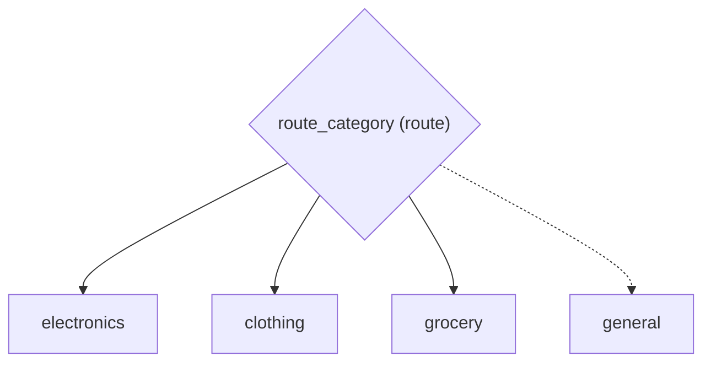

# E-Commerce Order Routing with Deterministic Branching

Real-world use case: E-commerce order routing system that directs orders to
different fulfillment handlers based on order type (standard, express,
international).

In other frameworks: LangGraph uses conditional_edges with a routing function
that returns the target node name. adk-fluent uses Route("key").eq() for
declarative, readable branching without routing functions.

Pipeline topology:
    Route("category")
        ├─ "electronics" -> electronics
        ├─ "clothing"    -> clothing
        ├─ "grocery"     -> grocery
        └─ otherwise     -> general

:::{admonition} Why this matters
:class: important
Routing decisions based on simple state values -- order category, language code, priority level -- should be instant, deterministic, and free. Using an LLM to decide whether to route an order to the electronics or clothing handler wastes API calls and introduces unpredictability. The `Route` primitive provides deterministic branching on state keys with `.eq()`, `.contains()`, `.gt()`, and `.when()` predicates.
:::

:::{warning} Without this
Without deterministic routing, you either waste LLM calls on trivial decisions (sending every order through a coordinator agent just to read a category field) or write custom `BaseAgent` subclasses with manual predicate logic (~30 lines per router). Both approaches are slower, more expensive, and harder to test than `Route("category").eq("electronics", handler)`.
:::

:::{tip} What you'll learn
How to route agents deterministically based on state values.
:::

_Source: `17_route_branching.py`_

::::{tab-set}
:::{tab-item} adk-fluent
```python
from adk_fluent import Agent
from adk_fluent._routing import Route

# Route on exact match: direct orders to the correct fulfillment team
electronics = Agent("electronics").model("gemini-2.5-flash").instruct("Process electronics orders.")
clothing = Agent("clothing").model("gemini-2.5-flash").instruct("Process clothing orders.")
grocery = Agent("grocery").model("gemini-2.5-flash").instruct("Process grocery orders with cold chain.")

category_route = (
    Route("category")
    .eq("electronics", electronics)
    .eq("clothing", clothing)
    .eq("grocery", grocery)
    .otherwise(Agent("general").model("gemini-2.5-flash").instruct("Process general merchandise."))
)

# Route on substring: detect priority keywords in order notes
express = Agent("express").model("gemini-2.5-flash").instruct("Expedite with next-day delivery.")
standard = Agent("standard").model("gemini-2.5-flash").instruct("Process with standard shipping.")
priority_route = Route("order_notes").contains("RUSH", express).otherwise(standard)

# Route on threshold: handle high-value orders differently
vip_handler = Agent("vip_handler").model("gemini-2.5-flash").instruct("Assign dedicated account manager.")
regular_handler = Agent("regular_handler").model("gemini-2.5-flash").instruct("Process normally.")
value_route = Route("order_total").gt(500.0, vip_handler).otherwise(regular_handler)

# Complex multi-key predicate: combine membership status and order value
complex_route = (
    Route()
    .when(lambda s: s.get("membership") == "platinum" and float(s.get("order_total", 0)) > 100, vip_handler)
    .otherwise(regular_handler)
)
```
:::
:::{tab-item} Native ADK
```python
# Native ADK has no built-in deterministic router. You'd need:
#   1. An LlmAgent coordinator (wastes API calls for simple routing), OR
#   2. A custom BaseAgent subclass with predicate logic (~30 lines)
# Neither approach is ergonomic for common routing patterns.
```
:::
:::{tab-item} Architecture

```mermaid
graph TD
    n1{"route_category (route)"}
    n2["electronics"]
    n3["clothing"]
    n4["grocery"]
    n5["general"]
    n1 --> n2
    n1 --> n3
    n1 --> n4
    n1 -.-> n5
```
:::
::::

## Equivalence

```python
from google.adk.agents.base_agent import BaseAgent
from google.adk.agents.llm_agent import LlmAgent

# Route builds to BaseAgent (deterministic, no LLM needed for routing)
built = category_route.build()
assert isinstance(built, BaseAgent)
assert not isinstance(built, LlmAgent)
assert len(built.sub_agents) == 4  # electronics, clothing, grocery, general

# Priority route works
built_priority = priority_route.build()
assert len(built_priority.sub_agents) == 2

# Value route works
built_value = value_route.build()
assert len(built_value.sub_agents) == 2
```
