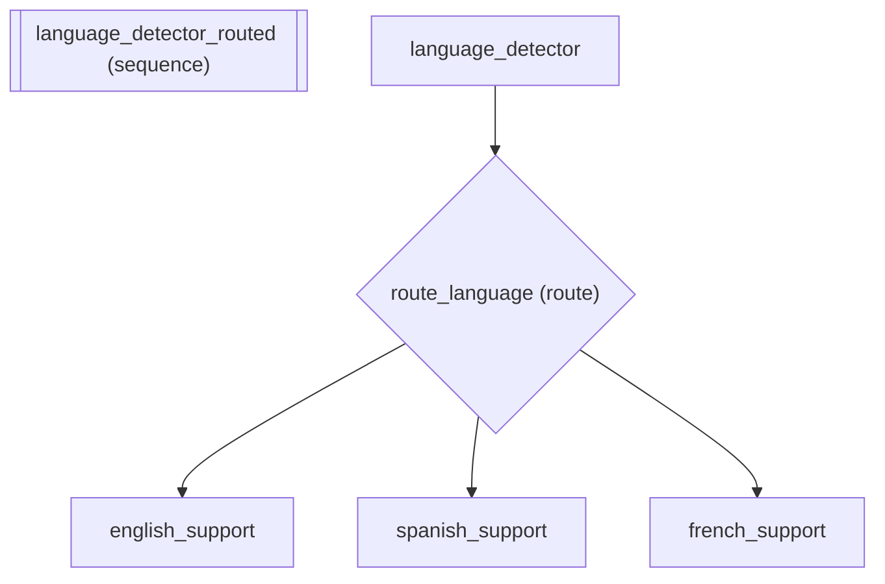

# Multi-Language Support Routing with Dict >> Shorthand

*How to use dict-based routing.*

_Source: `18_dict_routing.py`_

### Architecture



::::{tab-set}
:::{tab-item} Native ADK
```python
# Native ADK has no concise syntax for intent-based routing.
# You'd wire up a coordinator LlmAgent with sub_agents,
# which uses LLM calls to decide routing -- slow and expensive
# for deterministic decisions like language detection.
```
:::
:::{tab-item} adk-fluent
```python
from adk_fluent import Agent, Pipeline

# Step 1: Language detector outputs the detected language to state
detector = (
    Agent("language_detector")
    .model("gemini-2.5-flash")
    .instruct("Detect the language of the customer message. Output exactly one of: 'english', 'spanish', 'french'.")
    .outputs("language")
)

# Step 2: Dict >> creates deterministic routing (zero LLM calls for routing)
english_support = (
    Agent("english_support")
    .model("gemini-2.5-flash")
    .instruct("Respond to the customer in English. Be helpful and professional.")
)
spanish_support = (
    Agent("spanish_support")
    .model("gemini-2.5-flash")
    .instruct("Responde al cliente en espanol. Se profesional y amable.")
)
french_support = (
    Agent("french_support")
    .model("gemini-2.5-flash")
    .instruct("Repondez au client en francais. Soyez professionnel et aimable.")
)

pipeline = detector >> {
    "english": english_support,
    "spanish": spanish_support,
    "french": french_support,
}
```
:::
::::

## Equivalence

```python
from google.adk.agents.base_agent import BaseAgent
from google.adk.agents.llm_agent import LlmAgent

# Result is a Pipeline (detector -> router)
assert isinstance(pipeline, Pipeline)

# Pipeline has 2 steps: detector + route
assert len(pipeline._lists["sub_agents"]) == 2

# Build the pipeline to verify the route agent is deterministic
built_pipeline = pipeline.build()
assert len(built_pipeline.sub_agents) == 2

# The second sub_agent (the router) is deterministic (BaseAgent, NOT LlmAgent)
route_agent = built_pipeline.sub_agents[1]
assert isinstance(route_agent, BaseAgent)
assert not isinstance(route_agent, LlmAgent)

# Route agent has the 3 language-specific agents as sub_agents
assert len(route_agent.sub_agents) == 3
```
