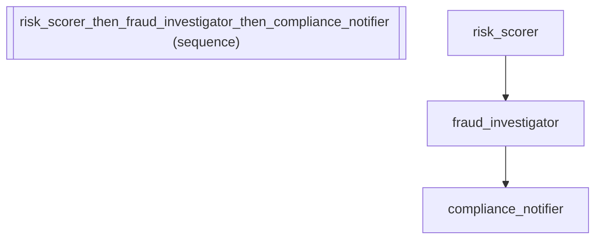

# Fraud Detection Pipeline with Conditional Gating

*How to compose agents into a sequential pipeline.*

_Source: `19_conditional_gating.py`_

### Architecture



::::\{tab-set}
:::\{tab-item} Native ADK

```python
# Native ADK requires manually implementing before_agent_callback
# that returns Content to skip an agent:
#
#   from google.genai import types
#
#   def fraud_gate(callback_context):
#       if callback_context.state.get("risk_level") != "high":
#           return types.Content(role="model", parts=[])
#       return None
#
#   agent = LlmAgent(
#       name="fraud_investigator", model="gemini-2.5-flash",
#       instruction="Perform deep fraud investigation on flagged transactions.",
#       before_agent_callback=fraud_gate,
#   )
```

:::
:::\{tab-item} adk-fluent

```python
from adk_fluent import Agent

# proceed_if: the fraud investigator only runs for high-risk transactions
fraud_investigator = (
    Agent("fraud_investigator")
    .model("gemini-2.5-flash")
    .instruct(
        "Perform deep fraud investigation. Check transaction patterns, "
        "verify merchant history, and flag suspicious activity."
    )
    .proceed_if(lambda s: s.get("risk_level") == "high")
)

# Full fraud detection pipeline:
# 1. Score the transaction risk
# 2. Only investigate if risk is high
# 3. Only notify compliance if investigation found fraud
risk_scorer = (
    Agent("risk_scorer")
    .model("gemini-2.5-flash")
    .instruct("Analyze the transaction and assign a risk level: 'low', 'medium', or 'high'.")
    .outputs("risk_level")
)

compliance_notifier = (
    Agent("compliance_notifier")
    .model("gemini-2.5-flash")
    .instruct("Generate a compliance report and notify the fraud team.")
    .proceed_if(lambda s: s.get("fraud_confirmed") == "yes")
)

pipeline = risk_scorer >> fraud_investigator >> compliance_notifier
```

:::
::::

## Equivalence

```python
# proceed_if registers a before_agent_callback
assert len(fraud_investigator._callbacks["before_agent_callback"]) == 1
assert len(compliance_notifier._callbacks["before_agent_callback"]) == 1

# The callback is a closure that checks state
cb = fraud_investigator._callbacks["before_agent_callback"][0]


# Simulate: callback returns None (proceed) when risk is high
class FakeCtx:
    def __init__(self, state_dict):
        self.state = state_dict


result = cb(FakeCtx({"risk_level": "high"}))
assert result is None  # Proceed with investigation

# Simulate: callback returns Content (skip) when risk is not high
result = cb(FakeCtx({"risk_level": "low"}))
assert result is not None  # Skip investigation
```
