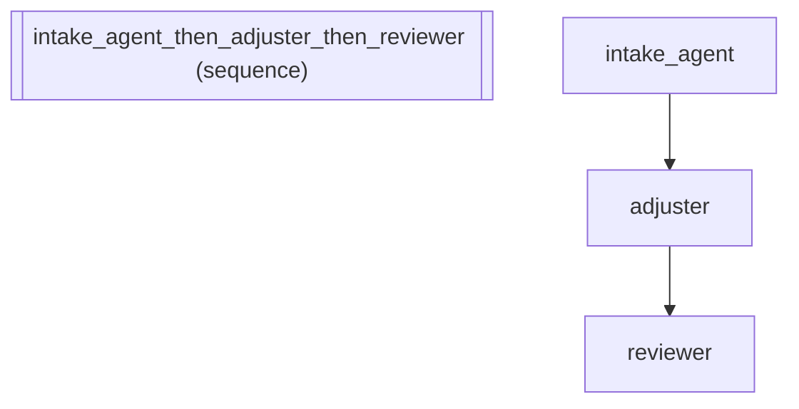

# Introspection & Debugging -- validate(), explain(), inspect()

Demonstrates the introspection methods that help debug and understand
agent configurations before deployment. The scenario: a compliance
team reviewing an insurance claims pipeline to verify correct wiring
before going live.

:::{tip} What you'll learn
How to compose agents into a sequential pipeline.
:::

_Source: `25_validate_explain.py`_

::::{tab-set}
:::{tab-item} adk-fluent
```python
from adk_fluent import Agent, Pipeline

# Build a multi-stage insurance claims pipeline
claims_pipeline = (
    Agent("intake_agent")
    .model("gemini-2.5-flash")
    .instruct("Receive and log the incoming insurance claim with policy number and incident details.")
    .describe("Front-desk claim intake")
    .writes("claim_data")
    >> Agent("adjuster")
    .model("gemini-2.5-flash")
    .instruct("Assess the claim: verify coverage, estimate damages, and recommend payout.")
    .describe("Claims adjuster")
    .writes("assessment")
    >> Agent("reviewer")
    .model("gemini-2.5-flash")
    .instruct("Review the adjuster's assessment for accuracy and compliance with policy terms.")
    .describe("Senior reviewer")
)

# 1. validate() -- check configuration before building
intake = Agent("intake_agent").model("gemini-2.5-flash").instruct("Receive claims.")
validation = intake.validate()

# 2. explain() -- human-readable summary for team review
explanation = claims_pipeline.explain()

# 3. inspect() -- full config values for debugging
inspection = claims_pipeline.inspect()

# 4. Copy-on-write -- frozen builders fork safely
base = Agent("agent").model("gemini-2.5-flash").instruct("Base instruction.")
variant_a = base >> Agent("downstream_a")  # base is now frozen
variant_b = base.instruct("Modified instruction.")  # forks a new clone
```
:::
:::{tab-item} Architecture

:::
::::

## Equivalence

```python
# validate() returns self for chaining (not a dict)
assert isinstance(validation, Agent)
assert validation._config["name"] == "intake_agent"

# explain() returns a non-empty string
assert isinstance(explanation, str)
assert len(explanation) > 0
assert "intake_agent" in explanation or "pipeline" in explanation.lower()

# inspect() returns a non-empty string with config details
assert isinstance(inspection, str)
assert len(inspection) > 0

# Pipeline builds correctly
assert isinstance(claims_pipeline, Pipeline)
built = claims_pipeline.build()
assert len(built.sub_agents) == 3

# Copy-on-write: variant_b is independent from base
assert isinstance(variant_a, Pipeline)
assert id(variant_b) != id(base)  # forked clone
assert variant_b._config["instruction"] == "Modified instruction."
assert base._config["instruction"] == "Base instruction."  # original unchanged
```
