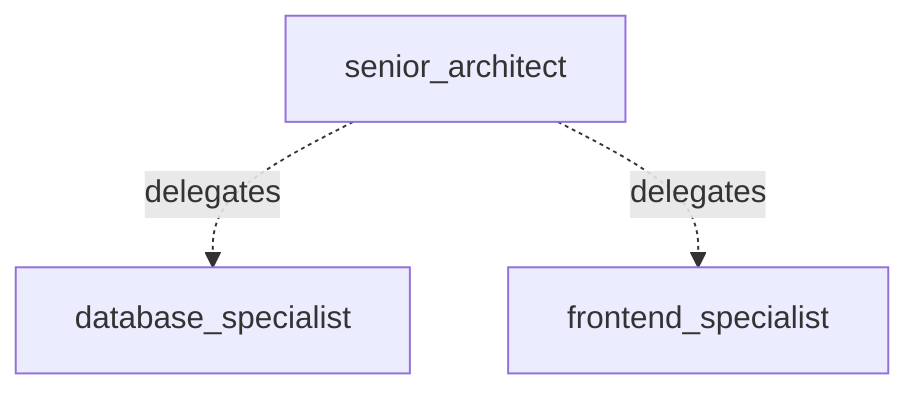

# Senior Architect Delegates to Junior Specialists (LLM-Driven Routing)

:::{admonition} Why this matters
:class: important
Some routing decisions are too complex for deterministic rules -- "should this architecture question go to the database specialist or the frontend specialist?" requires understanding the question's content. The `.agent_tool()` pattern wraps specialist agents as tools that the coordinator's LLM can invoke based on its judgment. This provides flexible, context-aware delegation without sacrificing the specialist's focused expertise.
:::

:::{warning} Without this
Without agent-as-tool delegation, you either force deterministic routing on complex decisions (requiring fragile keyword matching) or give a single agent all specialist knowledge (diluting its expertise). The `.agent_tool()` pattern lets the LLM decide who to delegate to while keeping each specialist focused on their domain.
:::

:::{tip} What you'll learn
How to delegate tasks between agents using .agent_tool().
:::

_Source: `27_agent_tool_pattern.py`_

::::{tab-set}
:::{tab-item} adk-fluent
```python
from adk_fluent import Agent

# Junior specialists — each focused on a specific domain
db_expert = (
    Agent("database_specialist")
    .model("gemini-2.5-flash")
    .instruct(
        "You are a database architecture specialist. Design schemas, "
        "optimize queries, and recommend indexing strategies."
    )
)

frontend_expert = (
    Agent("frontend_specialist")
    .model("gemini-2.5-flash")
    .instruct(
        "You are a frontend architecture specialist. Design component "
        "hierarchies, state management patterns, and performance optimizations."
    )
)

# .agent_tool() wraps each agent as AgentTool — the senior architect's LLM
# decides when to agent_tool (LLM-driven routing, unlike Route which is deterministic)
senior_architect = (
    Agent("senior_architect")
    .model("gemini-2.5-flash")
    .instruct(
        "You are a senior software architect. Analyze incoming architecture "
        "requests and agent_tool to the appropriate specialist based on the "
        "technical domain involved."
    )
    .agent_tool(db_expert)
    .agent_tool(frontend_expert)
)
```
:::
:::{tab-item} Native ADK
```python
from google.adk.agents.llm_agent import LlmAgent
from google.adk.tools.agent_tool import AgentTool

# Native: manually create an AgentTool for each specialist
database_specialist = LlmAgent(
    name="database_specialist",
    model="gemini-2.5-flash",
    instruction=(
        "You are a database architecture specialist. Design schemas, "
        "optimize queries, and recommend indexing strategies."
    ),
)

coordinator_native = LlmAgent(
    name="tech_lead",
    model="gemini-2.5-flash",
    instruction=(
        "You are a senior tech lead. Analyze architecture requests and agent_tool to the appropriate specialist."
    ),
    tools=[AgentTool(agent=database_specialist)],
)
```
:::
:::{tab-item} Architecture

:::
::::

## Equivalence

```python
# agent_tool adds to tools list
assert len(senior_architect._lists["tools"]) == 2

# Each tool is an AgentTool wrapping the built specialist
built = senior_architect.build()
assert len(built.tools) == 2
assert all(isinstance(t, AgentTool) for t in built.tools)

# --- T Module equivalent ---
# T.agent() wraps agents as AgentTool, composable with | operator
from adk_fluent._tools import T

coordinator_t = (
    Agent("senior_architect_t")
    .model("gemini-2.5-flash")
    .instruct("Coordinate the team.")
    .tools(T.agent(db_expert) | T.agent(frontend_expert))
)
ir_t = coordinator_t.to_ir()
assert len(ir_t.tools) == 2
assert all(isinstance(t, AgentTool) for t in ir_t.tools)
```

:::{seealso}
API reference: [FunctionTool](../api/tool.md#builder-FunctionTool)
:::
