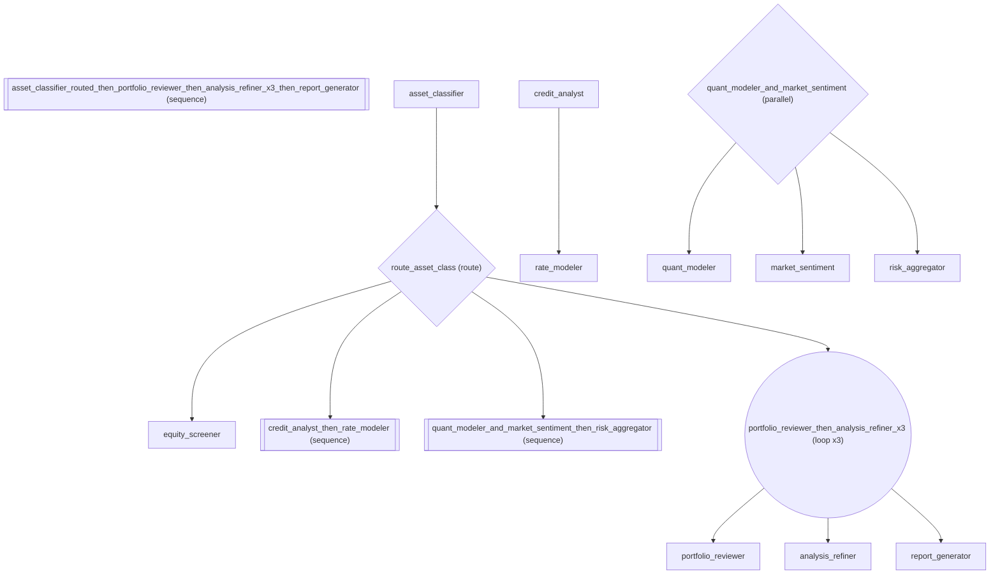

# Investment Analysis Pipeline: Full Expression Language in Production

*How to compose agents into a sequential pipeline.*

_Source: `28_real_world_pipeline.py`_

### Architecture



::::{tab-set}
:::{tab-item} Native ADK
```python
# A real-world investment analysis pipeline in native ADK would be 100+ lines
# of explicit agent construction, manual routing, callback wiring, and
# custom BaseAgent subclasses for state logic. See below for the fluent
# equivalent that reads like a business process document.
```
:::
:::{tab-item} adk-fluent
```python
from adk_fluent import Agent, Pipeline
from adk_fluent._routing import Route
from adk_fluent.presets import Preset


# Shared production preset — every agent in the pipeline logs for compliance
def compliance_log(callback_context, llm_response):
    """Log all model responses for SEC/FINRA audit trail."""
    pass


production = Preset(model="gemini-2.5-flash", after_model=compliance_log)

# Step 1: Classify the investment request by asset class
asset_classifier = (
    Agent("asset_classifier")
    .instruct(
        "Classify the investment request into one of: 'equity', 'fixed_income', "
        "or 'alternative'. Consider the asset type, risk profile, and market context."
    )
    .outputs("asset_class")
    .use(production)
)

# Step 2: Route to the appropriate analysis team
equity_analysis = (
    Agent("equity_screener")
    .instruct("Screen equities using fundamental analysis: P/E ratio, revenue growth, moat.")
    .use(production)
)

fixed_income_analysis = Agent("credit_analyst").instruct("Analyze credit risk, yield curves, and duration.").use(
    production
) >> Agent("rate_modeler").instruct("Model interest rate scenarios and their impact on bond prices.").use(production)

alternative_analysis = (
    Agent("quant_modeler").instruct("Build quantitative models for alternative assets.").use(production)
    | Agent("market_sentiment").instruct("Analyze market sentiment from news and social media.").use(production)
) >> Agent("risk_aggregator").instruct("Aggregate risk factors from quantitative and sentiment analysis.").use(
    production
)

# Step 3: Quality review loop — portfolio manager reviews until satisfied
quality_review = (
    Agent("portfolio_reviewer")
    .instruct("Review the investment analysis for completeness and accuracy. Rate quality.")
    .outputs("review_quality")
    .use(production)
    >> Agent("analysis_refiner")
    .instruct("Refine the analysis based on reviewer feedback. Address gaps.")
    .use(production)
).loop_until(lambda s: s.get("review_quality") == "approved", max_iterations=3)

# Step 4: Generate client-ready report (only if approved)
report_generator = (
    Agent("report_generator")
    .instruct(
        "Generate a client-ready investment memo with executive summary, "
        "thesis, risks, and recommended position sizing."
    )
    .proceed_if(lambda s: s.get("review_quality") == "approved")
    .use(production)
)

# Compose the full investment analysis pipeline
pipeline = (
    asset_classifier
    >> Route("asset_class")
    .eq("equity", equity_analysis)
    .eq("fixed_income", fixed_income_analysis)
    .eq("alternative", alternative_analysis)
    >> quality_review
    >> report_generator
)
```
:::
::::

## Equivalence

```python
# The full pipeline is a Pipeline builder
assert isinstance(pipeline, Pipeline)

# It can be built into a real ADK agent graph
built = pipeline.build()

# Top level is SequentialAgent
from google.adk.agents.sequential_agent import SequentialAgent

assert isinstance(built, SequentialAgent)

# Has multiple stages: classifier, route, quality_review, report
assert len(built.sub_agents) >= 3
```

:::{seealso}
API reference: [Pipeline](../api/workflow.md#builder-Pipeline)
:::
