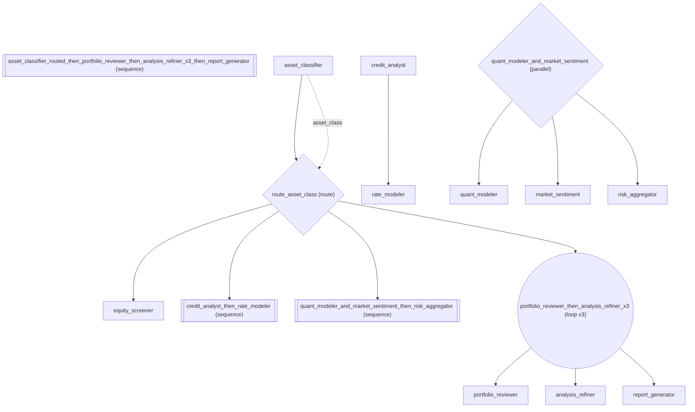

# Investment Analysis Pipeline: Full Expression Language in Production

Real-world use case: Investment analysis pipeline for portfolio managers.
Classifies assets, routes to specialized analysts, and performs quality
review before delivery. Replaces manual triage and review cycles that
typically span multiple teams and days of back-and-forth.

In other frameworks: LangGraph requires StateGraph with conditional_edges
for routing (~50 lines). adk-fluent uses Route() and >> to express the
same topology declaratively.

Pipeline topology:
    asset_classifier
        >> Route("asset_class")
            ├─ "equity"       -> equity_screener
            ├─ "fixed_income" -> credit_analyst >> rate_modeler
            └─ "alternative"  -> ( quant_modeler | market_sentiment ) >> risk_aggregator
        >> ( portfolio_reviewer >> analysis_refiner ) * until(approved)
        >> report_generator  [gated: only if approved]

:::{admonition} Why this matters
:class: important
This recipe demonstrates the full power of adk-fluent's expression language in a realistic investment analysis scenario. It combines routing (classify assets), parallel composition (multiple analysts), iterative quality review (loop until approved), and conditional gating (only generate reports when approved) -- all in a single readable expression. This is the kind of pipeline that would require 100+ lines of boilerplate in native ADK or LangGraph.
:::

:::{warning} Without this
Building this pipeline in native ADK requires 7+ separate agent declarations, a custom routing BaseAgent, a SequentialAgent wrapper, a ParallelAgent for the alternative asset branch, a custom LoopAgent with quality-check logic, and manual state wiring between all of them. The topology is invisible -- buried in nested constructor arguments across 100+ lines. In adk-fluent, the entire topology is visible in the pipeline expression.
:::

:::{tip} What you'll learn
How to combine routing, loops, gating, and parallel composition in a single expression.
:::

_Source: `28_real_world_pipeline.py`_

::::{tab-set}
:::{tab-item} adk-fluent
```python
from adk_fluent import Agent, Pipeline
from adk_fluent._routing import Route
from adk_fluent.presets import Preset


# Shared production preset — every agent in the pipeline logs for compliance
def compliance_log(callback_context, llm_response):
    """Log all model responses for SEC/FINRA audit trail."""
    pass


production = Preset(model="gemini-2.5-flash", after_model=compliance_log)

# Step 1: Classify the investment request by asset class
asset_classifier = (
    Agent("asset_classifier")
    .instruct(
        "Classify the investment request into one of: 'equity', 'fixed_income', "
        "or 'alternative'. Consider the asset type, risk profile, and market context."
    )
    .writes("asset_class")
    .use(production)
)

# Step 2: Route to the appropriate analysis team
equity_analysis = (
    Agent("equity_screener")
    .instruct("Screen equities using fundamental analysis: P/E ratio, revenue growth, moat.")
    .use(production)
)

fixed_income_analysis = Agent("credit_analyst").instruct("Analyze credit risk, yield curves, and duration.").use(
    production
) >> Agent("rate_modeler").instruct("Model interest rate scenarios and their impact on bond prices.").use(production)

alternative_analysis = (
    Agent("quant_modeler").instruct("Build quantitative models for alternative assets.").use(production)
    | Agent("market_sentiment").instruct("Analyze market sentiment from news and social media.").use(production)
) >> Agent("risk_aggregator").instruct("Aggregate risk factors from quantitative and sentiment analysis.").use(
    production
)

# Step 3: Quality review loop — portfolio manager reviews until satisfied
quality_review = (
    Agent("portfolio_reviewer")
    .instruct("Review the investment analysis for completeness and accuracy. Rate quality.")
    .writes("review_quality")
    .use(production)
    >> Agent("analysis_refiner")
    .instruct("Refine the analysis based on reviewer feedback. Address gaps.")
    .use(production)
).loop_until(lambda s: s.get("review_quality") == "approved", max_iterations=3)

# Step 4: Generate client-ready report (only if approved)
report_generator = (
    Agent("report_generator")
    .instruct(
        "Generate a client-ready investment memo with executive summary, "
        "thesis, risks, and recommended position sizing."
    )
    .proceed_if(lambda s: s.get("review_quality") == "approved")
    .use(production)
)

# Compose the full investment analysis pipeline
pipeline = (
    asset_classifier
    >> Route("asset_class")
    .eq("equity", equity_analysis)
    .eq("fixed_income", fixed_income_analysis)
    .eq("alternative", alternative_analysis)
    >> quality_review
    >> report_generator
)
```
:::
:::{tab-item} Native ADK
```python
# A real-world investment analysis pipeline in native ADK would be 100+ lines
# of explicit agent construction, manual routing, callback wiring, and
# custom BaseAgent subclasses for state logic. See below for the fluent
# equivalent that reads like a business process document.
```
:::
:::{tab-item} Architecture

```mermaid
graph TD
    n1[["asset_classifier_routed_then_portfolio_reviewer_then_analysis_refiner_x3_then_report_generator (sequence)"]]
    n2["asset_classifier"]
    n3{"route_asset_class (route)"}
    n4["equity_screener"]
    n5[["credit_analyst_then_rate_modeler (sequence)"]]
    n6["credit_analyst"]
    n7["rate_modeler"]
    n8[["quant_modeler_and_market_sentiment_then_risk_aggregator (sequence)"]]
    n9{"quant_modeler_and_market_sentiment (parallel)"}
    n10["quant_modeler"]
    n11["market_sentiment"]
    n12["risk_aggregator"]
    n13(("portfolio_reviewer_then_analysis_refiner_x3 (loop x3)"))
    n14["portfolio_reviewer"]
    n15["analysis_refiner"]
    n16["report_generator"]
    n3 --> n4
    n6 --> n7
    n3 --> n5
    n9 --> n10
    n9 --> n11
    n9 --> n12
    n3 --> n8
    n13 --> n14
    n13 --> n15
    n2 --> n3
    n3 --> n13
    n13 --> n16
    n2 -. "asset_class" .-> n3
```
:::
::::

## Equivalence

```python
# The full pipeline is a Pipeline builder
assert isinstance(pipeline, Pipeline)

# It can be built into a real ADK agent graph
built = pipeline.build()

# Top level is SequentialAgent
from google.adk.agents.sequential_agent import SequentialAgent

assert isinstance(built, SequentialAgent)

# Has multiple stages: classifier, route, quality_review, report
assert len(built.sub_agents) >= 3
```

:::{seealso}
API reference: [Pipeline](../api/workflow.md#builder-Pipeline)
:::
