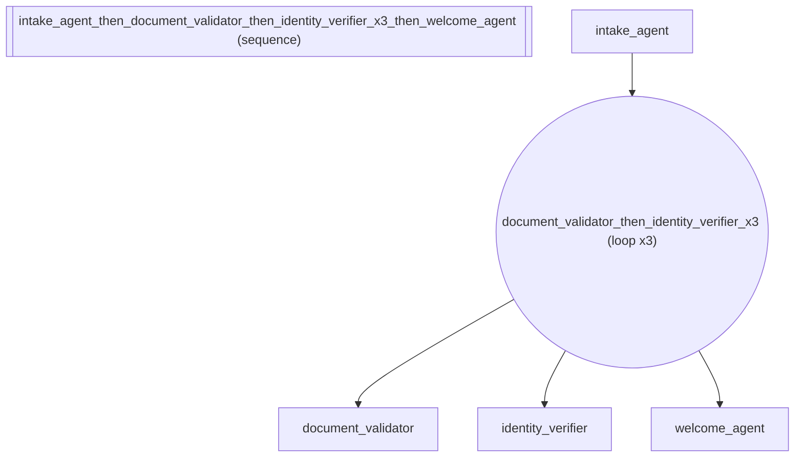

# Customer Onboarding: Conditional Loops with * until(pred) Operator

*How to create looping agent workflows.*

_Source: `30_until_operator.py`_

### Architecture



::::{tab-set}
:::{tab-item} Native ADK
```python
# Native ADK has no conditional loop exit built in. You'd need:
#   1. A custom BaseAgent subclass evaluating the predicate
#   2. Yield Event(actions=EventActions(escalate=True)) to break
#   3. Wire it into LoopAgent.sub_agents manually
# This is ~25 lines of boilerplate per loop condition.
```
:::
:::{tab-item} adk-fluent
```python
from adk_fluent import Agent, Pipeline, until

# until() creates a spec for the * operator.
# In a customer onboarding flow, we loop until all verification steps pass.
identity_verified = until(lambda s: s.get("identity_status") == "verified", max=5)

# agent * until(pred) — loop the verification flow until identity is confirmed
onboarding_loop = (
    Agent("document_checker")
    .model("gemini-2.5-flash")
    .instruct("Review the uploaded identity documents for completeness and clarity.")
    .outputs("identity_status")
    >> Agent("verification_agent")
    .model("gemini-2.5-flash")
    .instruct("Cross-reference document data against external databases. Report verification status.")
) * identity_verified

# Default max is 10 — used for compliance checks that may take several rounds
compliance_check = (
    Agent("kyc_screener").model("gemini-2.5-flash").instruct("Screen customer against KYC/AML watchlists.")
    >> Agent("risk_assessor")
    .model("gemini-2.5-flash")
    .instruct("Assess customer risk level based on screening results.")
) * until(lambda s: s.get("kyc_clear"))

# Works in larger expressions: full customer onboarding pipeline
full_onboarding = (
    Agent("intake_agent").model("gemini-2.5-flash").instruct("Collect customer information and upload instructions.")
    >> (
        Agent("document_validator")
        .model("gemini-2.5-flash")
        .instruct("Validate documents meet format and quality requirements.")
        >> Agent("identity_verifier")
        .model("gemini-2.5-flash")
        .instruct("Verify identity using biometric and document matching.")
    )
    * until(lambda s: s.get("verification_passed"), max=3)
    >> Agent("welcome_agent").model("gemini-2.5-flash").instruct("Send welcome package and account activation details.")
)

# int * agent still works — fixed retry count for simple cases
document_retry = Agent("doc_requester").model("gemini-2.5-flash").instruct("Request missing documents.") * 3
```
:::
::::

## Equivalence

```python
from adk_fluent.workflow import Loop

# * until() creates a Loop
assert isinstance(onboarding_loop, Loop)
assert onboarding_loop._config["max_iterations"] == 5
assert onboarding_loop._config["_until_predicate"] is not None

# Default max is 10
assert compliance_check._config["max_iterations"] == 10

# Builds with checkpoint agent for loop exit
built = onboarding_loop.build()
assert built.sub_agents[-1].name == "_until_check"

# In larger expression — pipeline with loop in middle
assert isinstance(full_onboarding, Pipeline)
built_full = full_onboarding.build()
assert len(built_full.sub_agents) == 3  # intake, loop, welcome

# int * agent still works
assert isinstance(document_retry, Loop)
assert document_retry._config["max_iterations"] == 3
```
