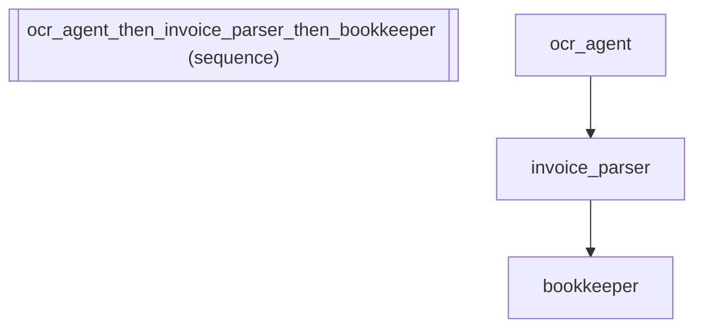

# Structured Invoice Parsing: Typed Output Contracts with @ Operator

*How to use operator syntax for composing agents.*

_Source: `31_typed_output.py`_

### Architecture



::::\{tab-set}
:::\{tab-item} Native ADK

```python
from google.adk.agents.llm_agent import LlmAgent
from pydantic import BaseModel


class Invoice(BaseModel):
    vendor: str
    total_amount: float
    due_date: str


# Native: pass output_schema directly to enforce structured output
parser_native = LlmAgent(
    name="invoice_parser",
    model="gemini-2.5-flash",
    instruction="Parse the uploaded invoice image and extract structured data.",
    output_schema=Invoice,
)
```

:::
:::\{tab-item} adk-fluent

```python
from adk_fluent import Agent, Pipeline

# @ binds a Pydantic model as the output schema — the LLM must return
# data matching this structure, enabling downstream type-safe processing
parser_fluent = (
    Agent("invoice_parser")
    .model("gemini-2.5-flash")
    .instruct("Parse the uploaded invoice image and extract structured data.")
    @ Invoice
)

# @ is immutable — original unchanged, so you can build variants
base_extractor = Agent("extractor").model("gemini-2.5-flash").instruct("Extract financial data.")
typed_extractor = base_extractor @ Invoice
# base_extractor has no schema, typed_extractor does


class PurchaseOrder(BaseModel):
    order_id: str
    line_items: list[str]
    subtotal: float


# Composes with >> — typed parser feeds structured data into downstream agents
accounts_pipeline = (
    Agent("ocr_agent").model("gemini-2.5-flash").instruct("Perform OCR on the uploaded document and extract raw text.")
    >> Agent("invoice_parser").model("gemini-2.5-flash").instruct("Parse the raw text into structured invoice fields.")
    @ Invoice
    >> Agent("bookkeeper").model("gemini-2.5-flash").instruct("Record the parsed invoice in the general ledger.")
)

# @ preserves all existing config — output_key and schema coexist
detailed_parser = (
    Agent("detailed_parser")
    .model("gemini-2.5-flash")
    .instruct("Extract every line item from the purchase order with amounts.")
    .outputs("parsed_po")
    @ PurchaseOrder
)
```

:::
::::

## Equivalence

```python
# @ wires into ADK's native output_schema
built = parser_fluent.build()
assert built.output_schema is Invoice
assert parser_native.output_schema is Invoice

# Original unchanged (immutable)
assert "_output_schema" not in base_extractor._config
assert typed_extractor._config["_output_schema"] is Invoice

# Composes with >>
assert isinstance(accounts_pipeline, Pipeline)

# Preserves config
assert detailed_parser._config["instruction"] == "Extract every line item from the purchase order with amounts."
assert detailed_parser._config["output_key"] == "parsed_po"
assert detailed_parser._config["_output_schema"] is PurchaseOrder
```
