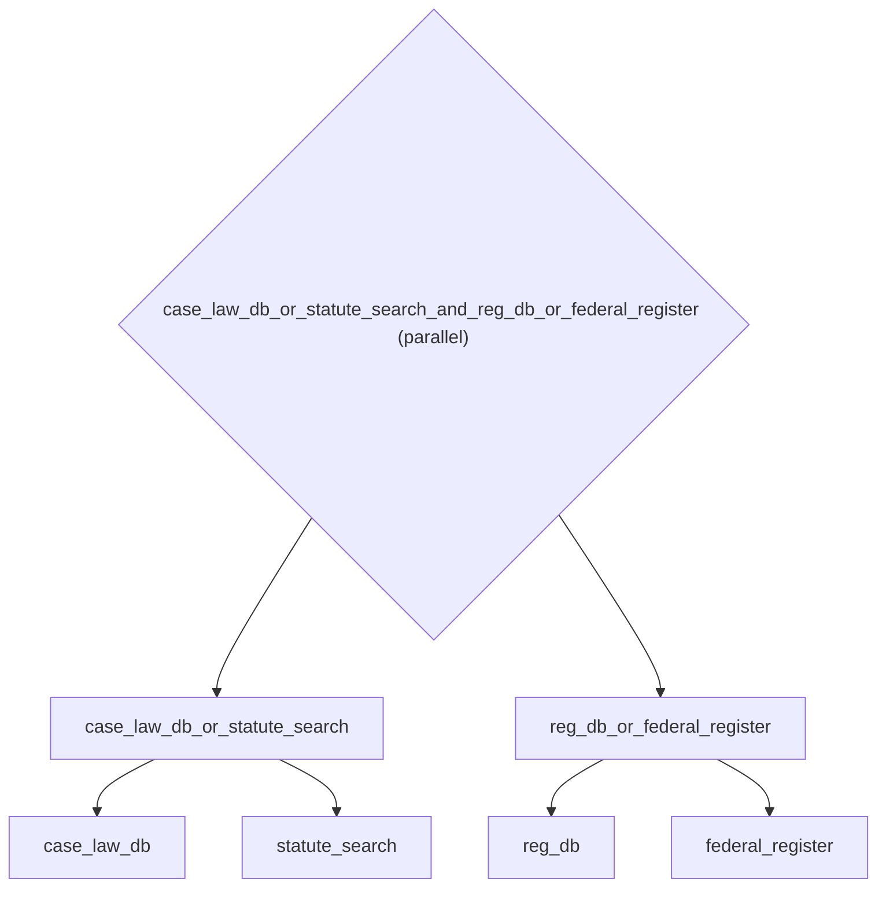

# Knowledge Retrieval: Primary API + Fallback Search with // Operator

*How to use operator syntax for composing agents.*

_Source: `32_fallback_operator.py`_

### Architecture



::::{tab-set}
:::{tab-item} Native ADK
```python
# Native ADK has no built-in fallback mechanism. You'd need:
#   1. Custom BaseAgent subclass with try/except logic
#   2. Sub-agents list for each fallback tier
#   3. Manual error handling and re-delegation
# This is ~30 lines per fallback chain.
```
:::
:::{tab-item} adk-fluent
```python
from adk_fluent import Agent, Pipeline
from adk_fluent._base import _FallbackBuilder

# // creates a fallback chain — first success wins.
# In a knowledge retrieval system: try the fast vector DB first,
# fall back to full-text search if vectors miss.
vector_search = (
    Agent("vector_db")
    .model("gemini-2.0-flash")
    .instruct("Query the vector database for semantically similar documents.")
)
fulltext_search = (
    Agent("fulltext_search")
    .model("gemini-2.5-flash")
    .instruct("Perform full-text search across the document corpus with BM25 ranking.")
)

retrieval = vector_search // fulltext_search  # Try vector first, fall back to fulltext

# Three-way fallback — enterprise knowledge retrieval with graceful degradation
internal_kb = (
    Agent("internal_kb")
    .model("gemini-2.0-flash")
    .instruct("Search the internal company knowledge base for relevant articles.")
)
web_search = (
    Agent("web_search")
    .model("gemini-2.5-flash")
    .instruct("Search the public web for relevant technical documentation.")
)
expert_consult = (
    Agent("expert_system")
    .model("gemini-2.5-pro")
    .instruct("Use expert reasoning to synthesize an answer from first principles.")
)

resilient_retrieval = internal_kb // web_search // expert_consult

# Composes with >> in pipelines — retrieval is one step in a larger RAG pipeline
rag_pipeline = (
    Agent("query_rewriter").model("gemini-2.5-flash").instruct("Rewrite the user query for optimal retrieval.")
    >> (vector_search // fulltext_search)
    >> Agent("answer_generator").model("gemini-2.5-flash").instruct("Generate an answer using the retrieved context.")
)

# Composes with | in parallel — search multiple domains simultaneously
legal_retrieval = Agent("case_law_db").model("gemini-2.0-flash") // Agent("statute_search").model("gemini-2.5-pro")
regulatory_retrieval = Agent("reg_db").model("gemini-2.0-flash") // Agent("federal_register").model("gemini-2.5-pro")
parallel_legal = legal_retrieval | regulatory_retrieval

# // works with functions too — static fallback for when all LLMs fail
fallback_with_default = Agent("primary_search").model("gemini-2.5-flash").instruct("Search for the answer.") // (
    lambda s: {"result": "No results found. Please contact support."}
)
```
:::
::::

## Equivalence

```python
# // creates a _FallbackBuilder
assert isinstance(retrieval, _FallbackBuilder)
assert len(retrieval._children) == 2

# Three-way fallback has 3 children
assert len(resilient_retrieval._children) == 3

# Builds to a BaseAgent with sub_agents
from google.adk.agents.base_agent import BaseAgent

built = Agent("a").model("gemini-2.5-flash").instruct("A") // Agent("b").model("gemini-2.5-pro").instruct("B")
built_agent = built.build()
assert isinstance(built_agent, BaseAgent)
assert len(built_agent.sub_agents) == 2

# Composes with >>
assert isinstance(rag_pipeline, Pipeline)
built_pipeline = rag_pipeline.build()
assert len(built_pipeline.sub_agents) == 3

# // with function
assert isinstance(fallback_with_default, _FallbackBuilder)
assert len(fallback_with_default._children) == 2
```
