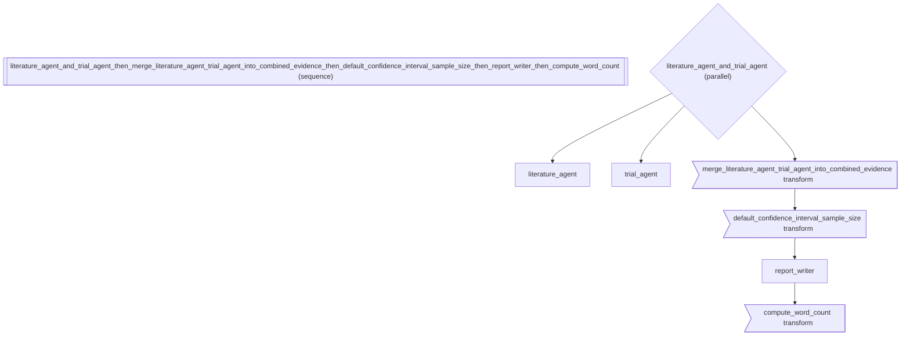

# Research Data Pipeline: State Transforms with S Factories

*How to compose agents into a sequential pipeline.*

_Source: `33_state_transforms.py`_

### Architecture



::::\{tab-set}
:::\{tab-item} Native ADK

```python
# Native ADK requires custom BaseAgent subclasses for any state transform.
# In a clinical research pipeline, each data cleaning step becomes a class:
from google.adk.agents.base_agent import BaseAgent as NativeBaseAgent


class SelectResearchFields(NativeBaseAgent):
    async def _run_async_impl(self, ctx):
        # Keep only "clinical_findings" and "lab_results"
        for key in list(ctx.session.state.keys()):
            if key not in ("clinical_findings", "lab_results"):
                del ctx.session.state[key]


class RenameForReport(NativeBaseAgent):
    async def _run_async_impl(self, ctx):
        if "clinical_findings" in ctx.session.state:
            ctx.session.state["analysis"] = ctx.session.state.pop("clinical_findings")


# Each transform = a new class. No composability.
```

:::
:::\{tab-item} adk-fluent

```python
from adk_fluent import Agent, S, Pipeline
from adk_fluent._transforms import StateDelta, StateReplacement

# S.pick — keep only the research-relevant fields, drop noise
# Returns StateReplacement (replaces session-scoped state entirely)
picked = S.pick("clinical_findings", "lab_results")
result = picked({"clinical_findings": "positive", "lab_results": [1.2, 3.4], "patient_notes": "misc"})
assert isinstance(result, StateReplacement)
assert result.new_state == {"clinical_findings": "positive", "lab_results": [1.2, 3.4]}

# S.drop — remove internal/debug fields before publishing results
dropped = S.drop("_raw_sensor_data", "_debug_log")
result = dropped({"conclusion": "significant", "_raw_sensor_data": "..."})
assert isinstance(result, StateReplacement)
assert result.new_state == {"conclusion": "significant"}

# S.rename — normalize field names for the downstream report template
renamed = S.rename(clinical_findings="analysis", raw_score="p_value")
result = renamed({"clinical_findings": "data", "sample_size": 100})
assert isinstance(result, StateReplacement)
assert result.new_state == {"analysis": "data", "sample_size": 100}

# S.default — fill missing fields with safe defaults for statistical analysis
# Returns StateDelta (additive merge — only missing keys are added)
defaulted = S.default(confidence_interval=0.95, significance_level=0.05)
result = defaulted({"confidence_interval": 0.99})
assert isinstance(result, StateDelta)
assert result.updates == {"significance_level": 0.05}  # existing key not overwritten

# S.merge — combine results from parallel research streams
merged = S.merge("literature_review", "experimental_data", into="combined_research")
result = merged({"literature_review": "Prior work shows...", "experimental_data": "Trial results..."})
assert isinstance(result, StateDelta)
assert result.updates == {"combined_research": "Prior work shows...\nTrial results..."}

# S.merge with custom function — aggregate numerical results
averaged = S.merge("trial_a_score", "trial_b_score", into="mean_score", fn=lambda a, b: (a + b) / 2)
result = averaged({"trial_a_score": 0.82, "trial_b_score": 0.88})
assert isinstance(result, StateDelta)
assert result.updates == {"mean_score": 0.85}

# S.transform — apply function to a single field
transformed = S.transform("abstract", str.upper)
result = transformed({"abstract": "results indicate"})
assert isinstance(result, StateDelta)
assert result.updates == {"abstract": "RESULTS INDICATE"}

# S.compute — derive new fields from full state (e.g., statistical metrics)
computed = S.compute(
    word_count=lambda s: len(s.get("manuscript", "").split()),
    preview=lambda s: s.get("manuscript", "")[:80],
)
result = computed({"manuscript": "This study demonstrates significant results"})
assert isinstance(result, StateDelta)
assert result.updates == {"word_count": 5, "preview": "This study demonstrates significant results"}

# S.guard — assert state invariant before proceeding
guarded = S.guard(lambda s: "patient_id" in s, msg="Missing required patient_id")

# Compose with >> in a clinical data pipeline
pipeline = (
    Agent("data_extractor")
    .model("gemini-2.5-flash")
    .instruct("Extract structured clinical data from the patient records.")
    >> S.pick("clinical_findings", "lab_results")
    >> S.rename(clinical_findings="analysis_input")
    >> S.default(confidence_interval=0.95)
    >> Agent("statistical_analyzer")
    .model("gemini-2.5-flash")
    .instruct("Perform statistical analysis on the clinical data.")
)

# Full research pipeline with parallel data collection and S transforms
research_pipeline = (
    (
        Agent("literature_agent")
        .model("gemini-2.5-flash")
        .instruct("Search medical literature databases for relevant studies.")
        | Agent("trial_agent")
        .model("gemini-2.5-flash")
        .instruct("Query clinical trial registries for comparable trials.")
    )
    >> S.merge("literature_agent", "trial_agent", into="combined_evidence")
    >> S.default(confidence_interval=0.95, sample_size=0)
    >> Agent("report_writer")
    .model("gemini-2.5-flash")
    .instruct("Write a systematic review report from the combined evidence.")
    >> S.compute(
        word_count=lambda s: len(s.get("report", "").split()),
    )
)
```

:::
::::

## Equivalence

```python
# S transforms compose with >> into Pipeline
assert isinstance(pipeline, Pipeline)
built = pipeline.build()
assert len(built.sub_agents) == 5  # extractor, pick, rename, default, analyzer

# All transform agent names are valid identifiers
for sub in built.sub_agents:
    assert sub.name.isidentifier(), f"Invalid name: {sub.name}"

# Research pipeline builds correctly
assert isinstance(research_pipeline, Pipeline)
built_research = research_pipeline.build()
assert len(built_research.sub_agents) == 5  # fanout, merge, default, writer, compute
```
