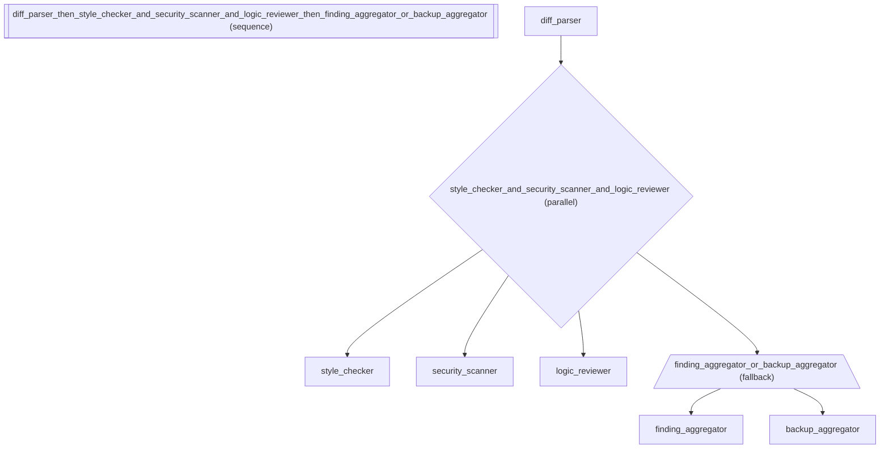

# Code Review Pipeline -- Expression Algebra in Practice

Demonstrates how composition operators (>>, |, @, //) combine naturally
in a real-world code review system. A diff parser extracts changes,
parallel reviewers check style, security, and logic independently,
then findings are aggregated into a structured verdict.

Real-world use case: Automated code review pipeline that runs style, security,
and logic reviewers in parallel, then merges findings. Used by engineering teams
as a pre-merge quality gate.

In other frameworks: LangGraph models this as a fan-out subgraph with merge
node (~45 lines). adk-fluent composes parallel reviewers with | and sequences
with >> in a single expression.

Pipeline topology:
    diff_parser
        >> ( style_checker | security_scanner | logic_reviewer )
        >> ( finding_aggregator @ ReviewVerdict // backup_aggregator @ ReviewVerdict )

:::{admonition} Why this matters
:class: important
This recipe demonstrates the full composition algebra in a realistic code review pipeline. Sequential (`>>`), parallel (`|`), typed output (`@`), and fallback (`//`) operators combine in a single expression to express: parse changes, run reviewers in parallel, aggregate findings into a structured verdict, and fall back to a backup aggregator if the primary fails. This is the expressive power that makes complex topologies readable and maintainable.
:::

:::{warning} Without this
Building this pipeline in native ADK requires separate `ParallelAgent`, `SequentialAgent`, and custom fallback classes nested together -- ~45 lines where the topology is invisible. When the pipeline structure needs to change (add a new reviewer, change the fallback strategy), the modification is spread across multiple class definitions instead of being visible in a single expression.
:::

:::{tip} What you'll learn
How to combine all composition operators in a single real-world expression.
:::

_Source: `34_full_algebra.py`_

::::{tab-set}
:::{tab-item} adk-fluent
```python
from pydantic import BaseModel

from adk_fluent import Agent


class ReviewVerdict(BaseModel):
    """Structured output from the code review pipeline."""

    has_issues: bool
    critical_count: int
    summary: str


# The code review pipeline uses 4 operators:
#   >>  sequential flow (parse -> review -> aggregate)
#   |   parallel fan-out (style + security + logic run concurrently)
#   @   typed output (aggregator returns ReviewVerdict)
#   //  fallback (primary model -> backup model)
#
# The E module adds evaluation — quality-gate the pipeline output:
#   E.suite(review_pipeline)
#       .case("Review a SQL injection bug", expect="critical")
#       .criteria(E.trajectory() | E.response_match() | E.safety())
# See cookbook #11 for inline eval, #46 for eval + contracts.

review_pipeline = (
    # Step 1: Parse the diff into reviewable chunks
    Agent("diff_parser")
    .model("gemini-2.5-flash")
    .instruct("Parse the git diff into individual file changes with context.")
    .writes("parsed_diff")
    # Step 2: Three reviewers run in parallel
    >> (
        Agent("style_checker")
        .model("gemini-2.5-flash")
        .instruct("Check code style: naming conventions, formatting, docstrings.")
        | Agent("security_scanner")
        .model("gemini-2.5-flash")
        .instruct("Scan for security issues: injection, auth bypass, secrets in code.")
        | Agent("logic_reviewer")
        .model("gemini-2.5-flash")
        .instruct("Review business logic: edge cases, error handling, race conditions.")
    )
    # Step 3: Aggregate findings with typed output and model fallback
    >> (
        Agent("finding_aggregator")
        .model("gemini-2.5-flash")
        .instruct("Aggregate all review findings into a final verdict.")
        @ ReviewVerdict
        // Agent("backup_aggregator")
        .model("gemini-2.5-pro")
        .instruct("Aggregate all review findings into a final verdict.")
        @ ReviewVerdict
    )
)
```
:::
:::{tab-item} Native ADK
```python
# A native ADK code review pipeline requires:
#   - 5 LlmAgent declarations
#   - 1 ParallelAgent for fan-out
#   - 1 SequentialAgent for the overall pipeline
#   - Manual output_schema wiring on the aggregator
# That's ~60 lines of boilerplate. The fluent algebra below
# expresses the same architecture in a single readable expression.
```
:::
:::{tab-item} Architecture

:::
::::

## Equivalence

```python
from adk_fluent import Pipeline
from adk_fluent._base import _FallbackBuilder

# Pipeline builds correctly
assert isinstance(review_pipeline, Pipeline)
built = review_pipeline.build()

# Has 3 top-level steps: diff_parser, fanout, fallback_aggregator
assert len(built.sub_agents) == 3

# First step is the diff parser
assert built.sub_agents[0].name == "diff_parser"
assert built.sub_agents[0].output_key == "parsed_diff"

# Second step is a parallel fan-out with 3 reviewers
fanout = built.sub_agents[1]
assert len(fanout.sub_agents) == 3

# Third step is the fallback aggregator
fallback = built.sub_agents[2]
assert len(fallback.sub_agents) == 2  # primary + backup
```
