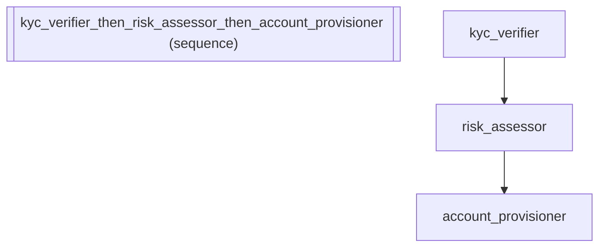

# Mock Testing: Customer Onboarding Pipeline with Deterministic Mocks

:::{admonition} Why this matters
:class: important
Testing agent pipelines with real LLM calls is slow, expensive, and non-deterministic. Mock backends provide deterministic responses for each agent in the pipeline, enabling fast, repeatable CI tests that verify pipeline topology and data flow without making any API calls. This is essential for regression testing: ensure that refactoring the pipeline doesn't break the data flow between agents.
:::

:::{warning} Without this
Without mock backends, every test requires real LLM calls -- adding 5-30 seconds per test, costing real money, and producing non-deterministic results that cause flaky CI pipelines. Teams either skip testing entirely (shipping bugs) or test manually (slow and unreliable). Mock backends make agent testing as fast and reliable as unit testing regular functions.
:::

:::{tip} What you'll learn
How to test pipelines deterministically with mock backends.
:::

_Source: `37_mock_testing.py`_

::::{tab-set}
:::{tab-item} adk-fluent
```python
from adk_fluent import Agent

# Scenario: Customer onboarding pipeline with three stages:
#   1. KYC verification -- checks identity documents
#   2. Risk assessment -- evaluates financial risk profile
#   3. Account provisioning -- creates the customer account

# .mock(list): cycle through scripted responses for repeatable tests
kyc_verifier = (
    Agent("kyc_verifier")
    .model("gemini-2.5-flash")
    .instruct("Verify the customer's identity documents and return approval status.")
    .writes("kyc_status")
    .mock(["KYC: approved", "KYC: pending review"])
)

# .mock(callable): dynamic responses based on the LLM request context
risk_assessor = (
    Agent("risk_assessor")
    .model("gemini-2.5-flash")
    .instruct("Evaluate the customer's financial risk profile.")
    .writes("risk_level")
    .mock(lambda req: "risk_level: low")
)

# Chainable -- .mock() returns self so it composes with other builder methods
account_provisioner = (
    Agent("account_provisioner")
    .model("gemini-2.5-flash")
    .mock(["Account ACT-10042 created successfully."])
    .instruct("Provision a new bank account for the approved customer.")
    .writes("account_id")
)

# Full onboarding pipeline with all agents mocked for integration testing
onboarding_pipeline = kyc_verifier >> risk_assessor >> account_provisioner
```
:::
:::{tab-item} Native ADK
```python
# Native ADK uses before_model_callback to bypass the LLM during tests:
#
#   from google.adk.models.llm_response import LlmResponse
#   from google.genai import types
#
#   def mock_callback(callback_context, llm_request):
#       return LlmResponse(
#           content=types.Content(
#               role="model",
#               parts=[types.Part(text="KYC: approved")]
#           )
#       )
#
#   kyc_agent = LlmAgent(
#       name="kyc_verifier", model="gemini-2.5-flash",
#       instruction="Verify customer KYC documents.",
#       before_model_callback=mock_callback,
#   )
#
# For a multi-step onboarding pipeline, you'd need one callback per agent,
# making test setup verbose and fragile.
```
:::
:::{tab-item} Architecture

:::
::::

## Equivalence

```python
from google.adk.models.llm_response import LlmResponse

# .mock(list) registers a before_model_callback
assert len(kyc_verifier._callbacks["before_model_callback"]) == 1

# The callback returns LlmResponse (bypasses the actual LLM)
cb = kyc_verifier._callbacks["before_model_callback"][0]
result = cb(callback_context=None, llm_request=None)
assert isinstance(result, LlmResponse)
assert result.content.parts[0].text == "KYC: approved"

# List responses cycle through deterministically
r2 = cb(None, None)
assert r2.content.parts[0].text == "KYC: pending review"
r3 = cb(None, None)
assert r3.content.parts[0].text == "KYC: approved"  # cycles back

# .mock(callable) also registers a callback
assert len(risk_assessor._callbacks["before_model_callback"]) == 1
cb_fn = risk_assessor._callbacks["before_model_callback"][0]
result_fn = cb_fn(None, None)
assert result_fn.content.parts[0].text == "risk_level: low"

# Chainable: .mock() returns self, preserving all builder state
assert account_provisioner._config["instruction"] == "Provision a new bank account for the approved customer."
assert account_provisioner._config["output_key"] == "account_id"
```
