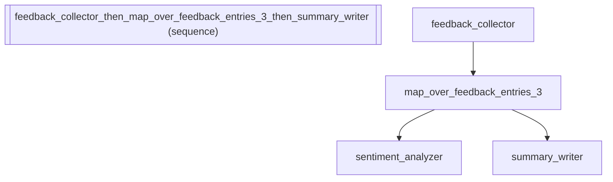

# Map Over: Batch Processing Customer Feedback with Iteration

*How to use map over: batch processing customer feedback with iteration with the fluent API.*

_Source: `39_map_over.py`_

### Architecture



::::{tab-set}
:::{tab-item} Native ADK
```python
# Native ADK requires a custom BaseAgent to iterate over list items:
from google.adk.agents.base_agent import BaseAgent as NativeBaseAgent
from google.adk.agents.llm_agent import LlmAgent


class MapOverAgent(NativeBaseAgent):
    """Custom agent that iterates a sub-agent over each item in a state list."""

    async def _run_async_impl(self, ctx):
        items = ctx.session.state.get("feedback_entries", [])
        results = []
        for item in items:
            ctx.session.state["_item"] = item
            async for event in self.sub_agents[0].run_async(ctx):
                yield event
            results.append(ctx.session.state.get("_item", None))
        ctx.session.state["sentiment_scores"] = results


sentiment_analyzer = LlmAgent(
    name="sentiment_analyzer",
    model="gemini-2.5-flash",
    instruction="Analyze the sentiment of the customer feedback in _item. Rate as positive, neutral, or negative.",
)
native_mapper = MapOverAgent(name="feedback_mapper", sub_agents=[sentiment_analyzer])
```
:::
:::{tab-item} adk-fluent
```python
from adk_fluent import Agent, Pipeline, map_over

# Scenario: A customer success platform ingests feedback from multiple channels.
# Each feedback entry needs individual sentiment analysis before aggregation.

# map_over(): iterate an agent over each item in a state list
# For each item in state["feedback_entries"], runs the sentiment analyzer
feedback_mapper = map_over(
    "feedback_entries",
    Agent("sentiment_analyzer")
    .model("gemini-2.5-flash")
    .instruct("Analyze the sentiment of the customer feedback in _item. Rate as positive, neutral, or negative."),
    output_key="sentiment_scores",
)

# Custom item_key and output_key for processing support tickets
ticket_mapper = map_over(
    "support_tickets",
    Agent("priority_classifier")
    .model("gemini-2.5-flash")
    .instruct("Classify the urgency of the support ticket in _ticket. Assign P1, P2, or P3."),
    item_key="_ticket",
    output_key="priority_assignments",
)

# map_over in a full feedback processing pipeline:
#   1. Collect feedback from all channels
#   2. Analyze each piece individually
#   3. Generate an executive summary
feedback_pipeline = (
    Agent("feedback_collector")
    .model("gemini-2.5-flash")
    .instruct("Collect customer feedback from all channels.")
    .outputs("feedback_entries")
    >> map_over(
        "feedback_entries",
        Agent("sentiment_analyzer").model("gemini-2.5-flash").instruct("Analyze sentiment of this feedback entry."),
    )
    >> Agent("summary_writer")
    .model("gemini-2.5-flash")
    .instruct("Write an executive summary of the sentiment analysis results.")
)
```
:::
::::

## Equivalence

```python
from adk_fluent._base import _MapOverBuilder, BuilderBase

# map_over returns a _MapOverBuilder
assert isinstance(feedback_mapper, _MapOverBuilder)
assert isinstance(feedback_mapper, BuilderBase)

# Stores configuration correctly
assert feedback_mapper._list_key == "feedback_entries"
assert feedback_mapper._item_key == "_item"
assert feedback_mapper._output_key == "sentiment_scores"

# Custom keys are preserved
assert ticket_mapper._list_key == "support_tickets"
assert ticket_mapper._item_key == "_ticket"
assert ticket_mapper._output_key == "priority_assignments"

# Builds with the sub-agent
built = feedback_mapper.build()
assert len(built.sub_agents) == 1
assert built.sub_agents[0].name == "sentiment_analyzer"

# Composable in pipeline
assert isinstance(feedback_pipeline, Pipeline)
built_pipeline = feedback_pipeline.build()
assert len(built_pipeline.sub_agents) == 3

# Name includes the list key for traceability
assert "feedback_entries" in feedback_mapper._config["name"]
```
