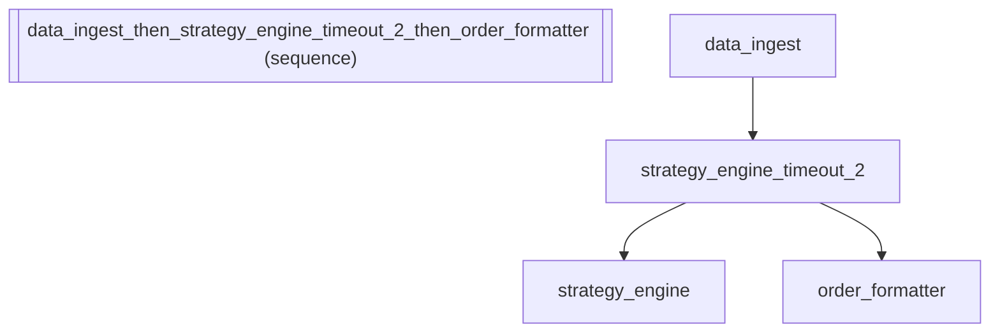

# Timeout: Real-Time Trading Agent with Strict Execution Deadline

*How to use timeout: real-time trading agent with strict execution deadline with the fluent API.*

_Source: `40_timeout.py`_

### Architecture



::::{tab-set}
:::{tab-item} Native ADK
```python
# Native ADK has no built-in timeout mechanism. You'd need to:
#   1. Subclass BaseAgent
#   2. Run the sub-agent in an asyncio.create_task
#   3. Use asyncio.Queue to forward events with deadline tracking
#   4. Cancel the task on timeout
# For trading systems, a missed deadline can mean significant losses.
# This is ~40 lines of async boilerplate per timeout.
```
:::
:::{tab-item} adk-fluent
```python
from adk_fluent import Agent, Pipeline

# Scenario: A real-time trading system where market analysis must complete
# within strict time bounds. Stale analysis is worse than no analysis.

# .timeout(seconds): wrap any agent with a time limit
# Market data analysis must complete within 5 seconds or be discarded
market_analyzer = (
    Agent("market_analyzer")
    .model("gemini-2.5-flash")
    .instruct(
        "Analyze current market conditions for the requested ticker symbol. Identify trend direction and volatility."
    )
    .timeout(5)
)

# Timeout in a pipeline -- only the slow step is time-bounded
# The strategy computation gets 30 seconds; other steps run without limits
trading_pipeline = (
    Agent("data_ingest").model("gemini-2.5-flash").instruct("Ingest real-time market data for the portfolio.")
    >> Agent("strategy_engine")
    .model("gemini-2.5-flash")
    .instruct("Compute optimal trading strategy based on current positions and market conditions.")
    .timeout(30)
    >> Agent("order_formatter").model("gemini-2.5-flash").instruct("Format the strategy as executable trade orders.")
)

# Timeout on an entire pipeline -- the full analysis-to-execution flow
# must complete within 60 seconds to catch the trading window
bounded_execution = (
    Agent("pre_trade_check").model("gemini-2.5-flash").instruct("Verify margin requirements and position limits.")
    >> Agent("trade_executor").model("gemini-2.5-flash").instruct("Execute the trade orders against the exchange.")
).timeout(60)
```
:::
::::

## Equivalence

```python
from adk_fluent._base import _TimeoutBuilder, BuilderBase

# .timeout() returns a _TimeoutBuilder
assert isinstance(market_analyzer, _TimeoutBuilder)
assert isinstance(market_analyzer, BuilderBase)

# Stores the timeout duration
assert market_analyzer._seconds == 5

# Builds with sub-agent
built = market_analyzer.build()
assert len(built.sub_agents) == 1
assert built.sub_agents[0].name == "market_analyzer"

# Name includes original agent name for tracing
assert "market_analyzer" in market_analyzer._config["name"]

# Composable in pipeline -- timeout is transparent to pipeline construction
assert isinstance(trading_pipeline, Pipeline)
built_pipeline = trading_pipeline.build()
assert len(built_pipeline.sub_agents) == 3

# Pipeline-level timeout
assert isinstance(bounded_execution, _TimeoutBuilder)
assert bounded_execution._seconds == 60
```
