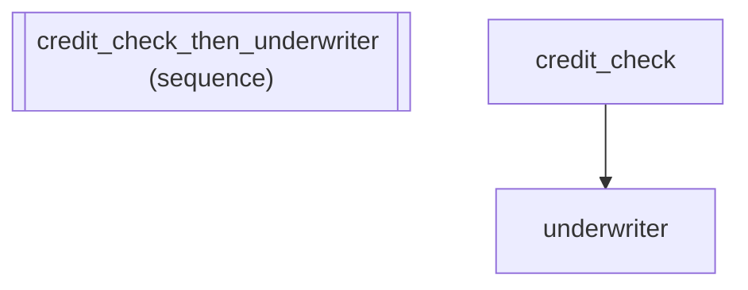

# IR and Backends: Analyzing Pipeline Structure for Optimization

*How to compose agents into a sequential pipeline.*

_Source: `44_ir_and_backends.py`_

### Architecture



::::\{tab-set}
:::\{tab-item} Native ADK

```python
from google.adk.agents.llm_agent import LlmAgent
from google.adk.agents.sequential_agent import SequentialAgent

# A native two-step loan application pipeline
credit_check = LlmAgent(
    name="credit_check",
    model="gemini-2.5-flash",
    instruction="Run credit check on the applicant.",
)
underwriter = LlmAgent(
    name="underwriter",
    model="gemini-2.5-flash",
    instruction="Evaluate loan eligibility based on credit report.",
)
seq = SequentialAgent(name="pipeline", sub_agents=[credit_check, underwriter])
```

:::
:::\{tab-item} adk-fluent

```python
from adk_fluent import Agent

# Scenario: A loan application pipeline where we want to inspect and
# optimize the pipeline structure before deployment.

pipeline = Agent("credit_check").instruct("Run credit check on the applicant.") >> Agent("underwriter").instruct(
    "Evaluate loan eligibility based on credit report."
)

# Inspect the IR tree (frozen dataclasses) -- useful for:
#   - Automated pipeline validation before deployment
#   - Generating architecture diagrams
#   - Computing cost estimates based on model usage
ir = pipeline.to_ir()

# Compile to native ADK App via IR -- the production deployment path
app = pipeline.to_app()

# .build() still works for direct agent construction
agent_fluent = pipeline.build()
```

:::
::::

## Equivalence

```python
from adk_fluent._ir_generated import AgentNode, SequenceNode

# IR is a SequenceNode containing two AgentNodes
assert isinstance(ir, SequenceNode)
assert len(ir.children) == 2
assert isinstance(ir.children[0], AgentNode)
assert ir.children[0].name == "credit_check"
assert ir.children[1].name == "underwriter"

# to_app() produces a native ADK App
from google.adk.apps.app import App

assert isinstance(app, App)
assert type(seq) == type(agent_fluent)
```
