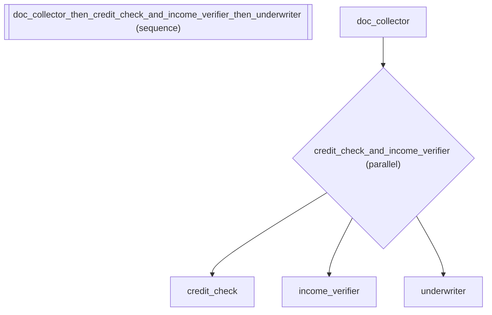

# Pipeline Optimization with IR -- Inspecting and Compiling Agent Graphs

Demonstrates to_ir() for pipeline analysis, to_app() for production
compilation, and to_mermaid() for architecture documentation. The
scenario: a mortgage approval pipeline where the platform team
inspects the agent graph for optimization before deployment.

:::{tip} What you'll learn
How to compose agents into a sequential pipeline.
:::

_Source: `44_ir_and_backends.py`_

::::{tab-set}
:::{tab-item} adk-fluent
```python
from adk_fluent import Agent

# Same pipeline expressed fluently
mortgage_pipeline = (
    Agent("doc_collector").model("gemini-2.5-flash").instruct("Collect and validate required mortgage documents.")
    >> (
        Agent("credit_check").model("gemini-2.5-flash").instruct("Run credit check on the applicant.")
        | Agent("income_verifier")
        .model("gemini-2.5-flash")
        .instruct("Verify employment and income from pay stubs and tax returns.")
    )
    >> Agent("underwriter")
    .model("gemini-2.5-flash")
    .instruct("Make final loan approval decision based on all gathered data.")
)

# 1. Inspect the IR tree -- frozen dataclass graph for analysis
ir = mortgage_pipeline.to_ir()

# 2. Compile to native ADK App -- production deployment
app = mortgage_pipeline.to_app()

# 3. Generate architecture diagram -- auto-sync documentation
mermaid = mortgage_pipeline.to_mermaid()

# 4. Build directly for comparison
built_fluent = mortgage_pipeline.build()
```
:::
:::{tab-item} Native ADK
```python
from google.adk.agents.llm_agent import LlmAgent
from google.adk.agents.sequential_agent import SequentialAgent
from google.adk.agents.parallel_agent import ParallelAgent

# Native mortgage pipeline: 5 agents across sequential + parallel stages
doc_collector = LlmAgent(
    name="doc_collector", model="gemini-2.5-flash", instruction="Collect and validate required mortgage documents."
)
credit_check = LlmAgent(name="credit_check", model="gemini-2.5-flash", instruction="Run credit check on the applicant.")
income_verifier = LlmAgent(
    name="income_verifier",
    model="gemini-2.5-flash",
    instruction="Verify employment and income from pay stubs and tax returns.",
)
parallel_checks = ParallelAgent(name="parallel_checks", sub_agents=[credit_check, income_verifier])
underwriter = LlmAgent(
    name="underwriter",
    model="gemini-2.5-flash",
    instruction="Make final loan approval decision based on all gathered data.",
)
pipeline_native = SequentialAgent(name="mortgage_pipeline", sub_agents=[doc_collector, parallel_checks, underwriter])
```
:::
:::{tab-item} Architecture

```mermaid
graph TD
    n1[["doc_collector_then_credit_check_and_income_verifier_then_underwriter (sequence)"]]
    n2["doc_collector"]
    n3{"credit_check_and_income_verifier (parallel)"}
    n4["credit_check"]
    n5["income_verifier"]
    n6["underwriter"]
    n3 --> n4
    n3 --> n5
    n2 --> n3
    n3 --> n6
```
:::
::::

## Equivalence

```python
from adk_fluent._ir_generated import SequenceNode, ParallelNode, AgentNode

# IR is a SequenceNode with 3 children: doc_collector, parallel, underwriter
assert isinstance(ir, SequenceNode)
assert len(ir.children) == 3
assert isinstance(ir.children[0], AgentNode)
assert ir.children[0].name == "doc_collector"
assert isinstance(ir.children[1], ParallelNode)
assert len(ir.children[1].children) == 2
assert isinstance(ir.children[2], AgentNode)
assert ir.children[2].name == "underwriter"

# to_app() produces a native ADK App
from google.adk.apps.app import App

assert isinstance(app, App)

# to_mermaid() generates valid diagram text
assert "graph TD" in mermaid
assert "doc_collector" in mermaid
assert "credit_check" in mermaid
assert "underwriter" in mermaid
assert "-->" in mermaid

# build() matches native structure
assert type(pipeline_native) == type(built_fluent)
assert len(built_fluent.sub_agents) == 3
```
