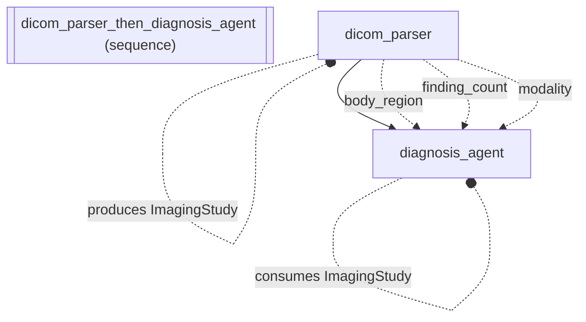

# Contracts and Testing: Medical Imaging Pipeline with Strict Data Contracts

:::{admonition} Why this matters
:class: important
Data contracts (`.produces()`, `.consumes()`) declare what each agent writes to and reads from state. The contract checker validates these declarations at build time, catching data flow bugs before the pipeline ever runs. In a medical imaging pipeline, this means catching a missing `diagnosis` field before it surfaces at runtime with patient data at stake -- not after.
:::

:::{warning} Without this
Without data contracts, data flow bugs are silent at build time. Agent B expects a `diagnosis` field from Agent A, but Agent A never writes it. The pipeline compiles and starts running. When Agent B tries to read `diagnosis`, it gets `None`, produces a garbage report, and nobody notices until a clinician flags the output. Data contracts catch this at build time with a clear error message.
:::

:::{tip} What you'll learn
How to enforce data contracts and test pipelines with mock backends.
:::

_Source: `46_contracts_and_testing.py`_

::::{tab-set}
:::{tab-item} adk-fluent
```python
from pydantic import BaseModel

from adk_fluent import Agent
from adk_fluent.testing import check_contracts, mock_backend


class ImagingStudy(BaseModel):
    """Structured data contract for a medical imaging study."""

    modality: str  # CT, MRI, X-ray, etc.
    body_region: str  # chest, abdomen, brain, etc.
    finding_count: int  # number of notable findings


# 1. Declare data contracts between pipeline stages
# The DICOM parser produces an ImagingStudy; the diagnosis agent consumes it
imaging_pipeline = Agent("dicom_parser").produces(ImagingStudy) >> Agent("diagnosis_agent").consumes(ImagingStudy)

# 2. Verify at build time (no LLM calls needed)
# Catches mismatches before the pipeline ever runs on real patient data
issues = check_contracts(imaging_pipeline.to_ir())

# 3. Create a mock backend for deterministic testing
# Simulates the full pipeline without any LLM or PACS system calls
mb = mock_backend(
    {
        "dicom_parser": {"modality": "CT", "body_region": "chest", "finding_count": 3},
        "diagnosis_agent": "Findings: 2 nodules, 1 consolidation. Recommend follow-up CT in 3 months.",
    }
)

# Build the pipeline for deployment
agent_fluent = imaging_pipeline.build()
```
:::
:::{tab-item} Native ADK
```python
# Native ADK has no built-in contract verification or mock testing.
# In a medical imaging pipeline, data flow errors between the DICOM
# parser and the diagnosis agent would only surface at runtime --
# potentially with patient data at stake.
```
:::
:::{tab-item} Architecture

```mermaid
graph TD
    n1[["dicom_parser_then_diagnosis_agent (sequence)"]]
    n2["dicom_parser"]
    n3["diagnosis_agent"]
    n2 --> n3
    n2 -. "produces ImagingStudy" .-o n2
    n3 -. "consumes ImagingStudy" .-o n3
    n2 -. "body_region" .-> n3
    n2 -. "finding_count" .-> n3
    n2 -. "modality" .-> n3
```
:::
::::

## Equivalence

```python
# Contract verification passes -- dicom_parser produces what diagnosis_agent consumes
assert issues == []

# Mock backend satisfies the Backend protocol
from adk_fluent.backends import Backend

assert isinstance(mb, Backend)

# Catch contract violations: diagnosis_agent consumes ImagingStudy but nothing produces it
broken_pipeline = Agent("preprocessor") >> Agent("diagnosis_agent").consumes(ImagingStudy)
broken_issues = check_contracts(broken_pipeline.to_ir())
assert len(broken_issues) == 3  # modality, body_region, and finding_count are all missing
assert any("modality" in str(issue) for issue in broken_issues)
```
