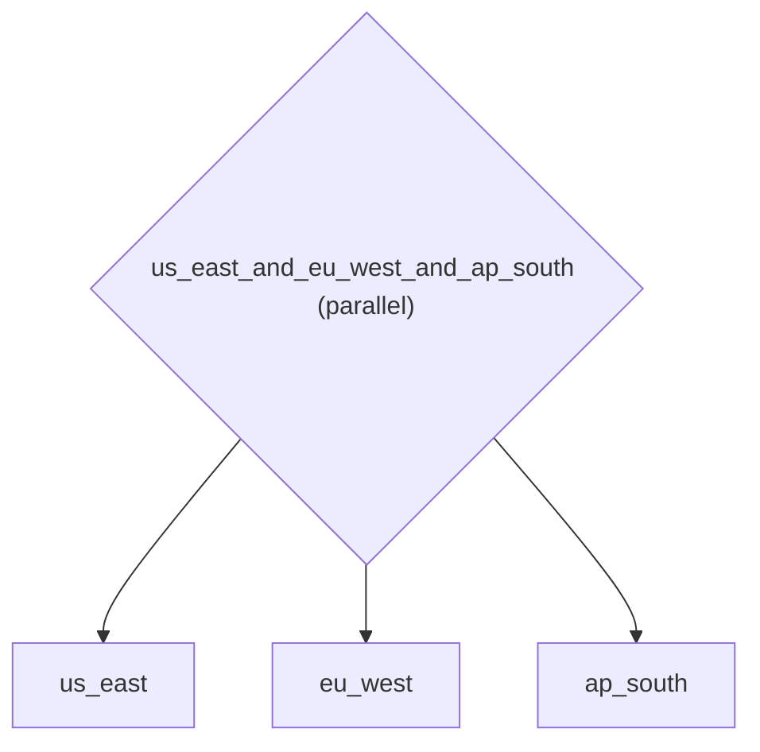

# Visualization: Pipeline Architecture Diagrams for Documentation

*How to compose agents into a sequential pipeline.*

_Source: `48_visualization.py`_

### Architecture



::::\{tab-set}
:::\{tab-item} Native ADK

```python
# Native ADK has no built-in visualization.
# Complex agent trees must be manually diagrammed in Mermaid, PlantUML,
# or draw.io -- diagrams that immediately go stale as the code evolves.
```

:::
:::\{tab-item} adk-fluent

```python
from adk_fluent import Agent

# Scenario: An incident response platform with a multi-stage pipeline.
# The team needs architecture diagrams for runbooks and design reviews.
# With .to_mermaid(), diagrams are always in sync with the code.

incident_pipeline = Agent("alert_triage") >> Agent("severity_classifier") >> Agent("responder_dispatch")
mermaid = incident_pipeline.to_mermaid()

# Build the pipeline for deployment
agent_fluent = incident_pipeline.build()
```

:::
::::

## Equivalence

```python
assert "graph TD" in mermaid
assert "alert_triage" in mermaid
assert "severity_classifier" in mermaid
assert "responder_dispatch" in mermaid
assert "-->" in mermaid

# Parallel branches also produce valid Mermaid diagrams
# Useful for documenting fan-out patterns like multi-region health checks
health_check = Agent("us_east") | Agent("eu_west") | Agent("ap_south")
health_mermaid = health_check.to_mermaid()
assert "graph TD" in health_mermaid
```
