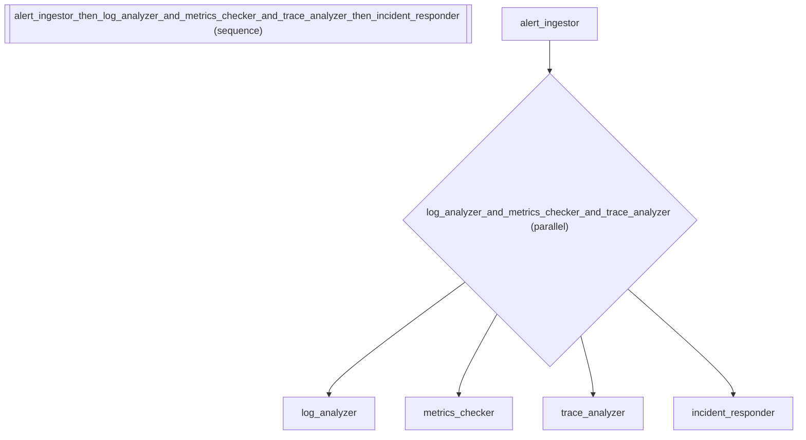

# Architecture Documentation -- Mermaid Diagrams from Live Code

Demonstrates to_mermaid() for generating architecture diagrams that
stay in sync with code. The scenario: a DevOps team documenting their
incident response platform's agent topology for runbooks and onboarding.

*How to build a team of agents with a coordinator.*

_Source: `48_visualization.py`_

### Architecture


```mermaid
graph TD
    n1[["alert_ingestor_then_log_analyzer_and_metrics_checker_and_trace_analyzer_then_incident_responder (sequence)"]]
    n2["alert_ingestor"]
    n3{"log_analyzer_and_metrics_checker_and_trace_analyzer (parallel)"}
    n4["log_analyzer"]
    n5["metrics_checker"]
    n6["trace_analyzer"]
    n7["incident_responder"]
    n3 --> n4
    n3 --> n5
    n3 --> n6
    n2 --> n3
    n3 --> n7
```

::::\{tab-set}
:::\{tab-item} Native ADK

```python
# Native ADK has no built-in visualization. Complex agent graphs
# must be manually diagrammed and maintained separately from code.
# Diagrams go stale after the first refactor.
```

:::
:::\{tab-item} adk-fluent

```python
from adk_fluent import Agent

# Incident response platform with multiple topology types:
# sequential stages, parallel fan-out, and conditional routing

# Stage 1: Alert triage
triage = (
    Agent("alert_ingestor")
    .model("gemini-2.5-flash")
    .instruct("Ingest alert from PagerDuty/OpsGenie and extract severity, service, and description.")
    .writes("alert_data")
)

# Stage 2: Parallel diagnosis from multiple sources
diagnosis = (
    Agent("log_analyzer")
    .model("gemini-2.5-flash")
    .instruct("Search application logs for errors correlated with the alert timeframe.")
    | Agent("metrics_checker")
    .model("gemini-2.5-flash")
    .instruct("Check Prometheus/Grafana metrics for anomalies in the affected service.")
    | Agent("trace_analyzer")
    .model("gemini-2.5-flash")
    .instruct("Analyze distributed traces to identify the failing component.")
)

# Stage 3: Resolution
resolution = (
    Agent("incident_responder")
    .model("gemini-2.5-flash")
    .instruct("Synthesize findings and recommend remediation steps. Draft incident report.")
)

# Full pipeline: sequential with parallel fan-out in the middle
incident_pipeline = triage >> diagnosis >> resolution

# Generate architecture diagram
mermaid_diagram = incident_pipeline.to_mermaid()

# Generate human-readable explanation
explanation = incident_pipeline.explain()

# Build for deployment
built = incident_pipeline.build()
```

:::
::::

## Equivalence

```python
# Mermaid diagram contains all agent names
assert "graph TD" in mermaid_diagram
for agent_name in ["alert_ingestor", "log_analyzer", "metrics_checker", "trace_analyzer", "incident_responder"]:
    assert agent_name in mermaid_diagram, f"Missing {agent_name} in diagram"

# Diagram has arrows showing flow
assert "-->" in mermaid_diagram

# explain() returns a non-empty description
assert isinstance(explanation, str)
assert len(explanation) > 0

# Pipeline builds with correct structure
assert len(built.sub_agents) == 3  # triage, fanout, resolution

# Parallel stage has 3 diagnostic agents
fanout = built.sub_agents[1]
assert len(fanout.sub_agents) == 3

# Simple pipeline also generates valid diagrams
simple = Agent("a") >> Agent("b")
simple_mermaid = simple.to_mermaid()
assert "graph TD" in simple_mermaid
assert "a" in simple_mermaid and "b" in simple_mermaid
```
