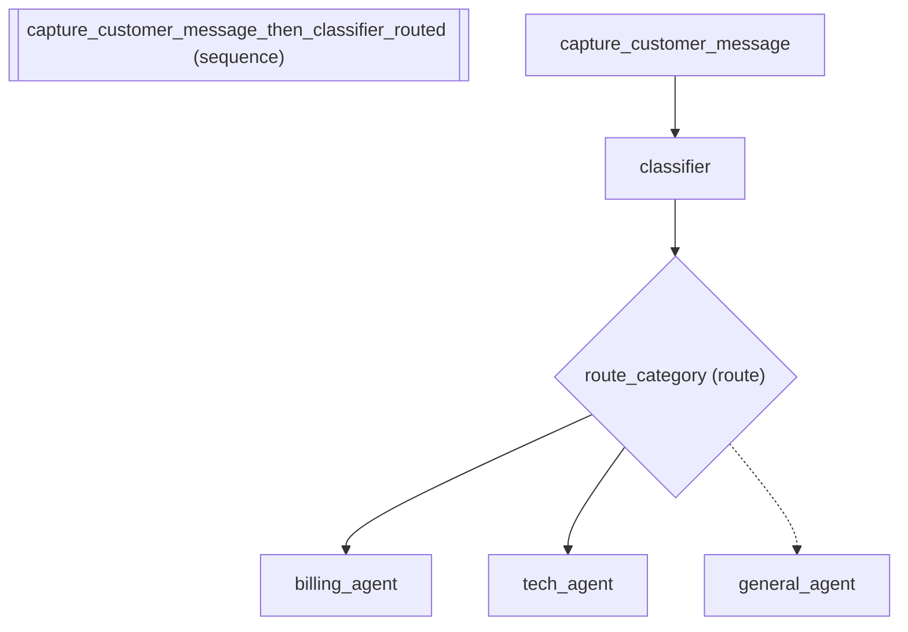

# Context Engineering: Customer Support Pipeline

*How to compose agents into a sequential pipeline.*

_Source: `49_context_engineering.py`_

### Architecture



::::\{tab-set}
:::\{tab-item} Native ADK

```python
# In native ADK, a 4-agent support pipeline where each agent sees all
# conversation history — including internal classifier reasoning and
# draft responses — wastes tokens and confuses downstream agents.
# Fixing this requires manually setting include_contents="none" on each
# LlmAgent and writing custom InstructionProvider callables that filter
# session.events and inject state keys. That's ~40 lines of boilerplate
# per agent.
```

:::
:::\{tab-item} adk-fluent

```python
from adk_fluent import Agent, S, C
from adk_fluent._routing import Route

MODEL = "gemini-2.5-flash"

# Customer support pipeline: capture → classify → route → respond
# Each agent sees exactly the context it needs — nothing more.

support_pipeline = (
    S.capture("customer_message")
    >> Agent("classifier")
    .model(MODEL)
    .instruct(
        "Classify the customer's message into one of: billing, technical, general.\nCustomer said: {customer_message}"
    )
    .context(C.none())  # No history needed — just the captured message
    .outputs("category")
    >> Route("category")
    .eq(
        "billing",
        Agent("billing_agent")
        .model(MODEL)
        .instruct(
            "You are a billing specialist. Help the customer with their billing issue.\n"
            "Customer message: {customer_message}"
        )
        .context(C.from_state("customer_message")),
    )
    .eq(
        "technical",
        Agent("tech_agent")
        .model(MODEL)
        .instruct(
            "You are a technical support engineer. Diagnose and resolve the issue.\n"
            "Customer message: {customer_message}\n"
            "Urgency: {urgency}"
        )
        .context(C.from_state("customer_message", "urgency") + C.window(n=3)),
    )
    .otherwise(
        Agent("general_agent")
        .model(MODEL)
        .instruct("Help the customer with their general inquiry.")
        .context(C.user_only())  # See only what the customer said
    )
)

built = support_pipeline.build()
```

:::
::::

## Equivalence

```python
# Pipeline builds successfully with 3+ sub-agents
assert built is not None
assert len(built.sub_agents) >= 3

# Classifier sees no conversation history (C.none)
classifier = built.sub_agents[1]  # After capture agent
assert classifier.include_contents == "none"

# The capture agent is first
from adk_fluent._base import CaptureAgent

assert isinstance(built.sub_agents[0], CaptureAgent)
```
