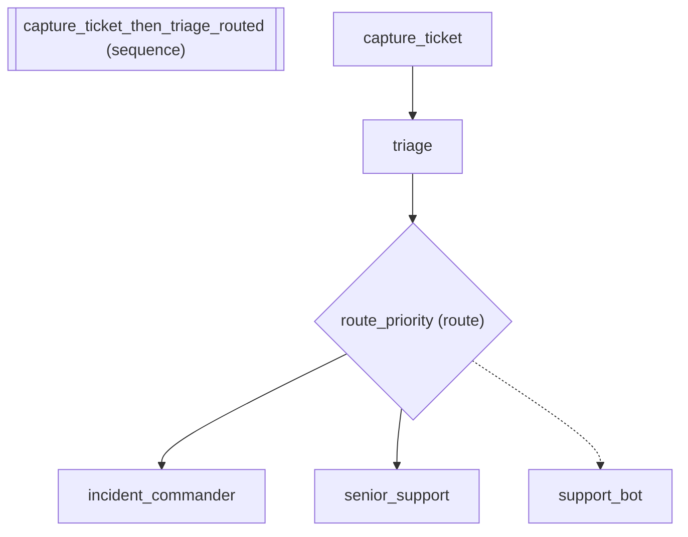

# Capture and Route: IT Helpdesk Triage

*How to implement conditional routing and branching.*

_Source: `50_capture_and_route.py`_

### Architecture



::::\{tab-set}
:::\{tab-item} Native ADK

```python
# In native ADK, capturing the user's message into state for downstream
# agents requires writing a custom BaseAgent subclass:
#
# class CaptureUserMessage(BaseAgent):
#     async def _run_async_impl(self, ctx):
#         for event in reversed(ctx.session.events):
#             if event.author == "user":
#                 ctx.session.state["ticket"] = event.content.parts[0].text
#                 break
#
# Then manually wiring it as the first step in a SequentialAgent.
# Route-based dispatch requires another custom agent with if/elif logic.
```

:::
:::\{tab-item} adk-fluent

```python
from adk_fluent import Agent, S
from adk_fluent._routing import Route
from adk_fluent.testing import check_contracts

MODEL = "gemini-2.5-flash"

# IT Helpdesk: capture ticket → classify priority → route to team
helpdesk = (
    S.capture("ticket")
    >> Agent("triage")
    .model(MODEL)
    .instruct(
        "You are an IT helpdesk triage agent.\n"
        "Read the support ticket and classify it.\n"
        "Ticket: {ticket}\n"
        "Output the priority level: p1, p2, or p3."
    )
    .outputs("priority")
    >> Route("priority")
    .eq(
        "p1",
        Agent("incident_commander")
        .model(MODEL)
        .instruct(
            "CRITICAL INCIDENT.\nOriginal ticket: {ticket}\nCoordinate immediate response. Page on-call engineer."
        ),
    )
    .eq(
        "p2",
        Agent("senior_support")
        .model(MODEL)
        .instruct("Priority ticket.\nTicket: {ticket}\nInvestigate and provide a resolution plan within 4 hours."),
    )
    .otherwise(
        Agent("support_bot")
        .model(MODEL)
        .instruct("Routine support request.\nTicket: {ticket}\nProvide self-service instructions or FAQ links.")
    )
)

# Verify data contracts before deployment
issues = check_contracts(helpdesk.to_ir())
contract_errors = [i for i in issues if isinstance(i, dict) and i.get("level") == "error"]

built = helpdesk.build()
```

:::
::::

## Equivalence

```python
# Contract checking passes — all {ticket}, {priority} resolve
assert len(contract_errors) == 0

# Pipeline builds with capture agent first
from adk_fluent._base import CaptureAgent

assert isinstance(built.sub_agents[0], CaptureAgent)
assert built.sub_agents[0].name == "capture_ticket"

# Triage agent is second
assert built.sub_agents[1].name == "triage"

# Full pipeline builds
assert built is not None
assert len(built.sub_agents) >= 3
```
