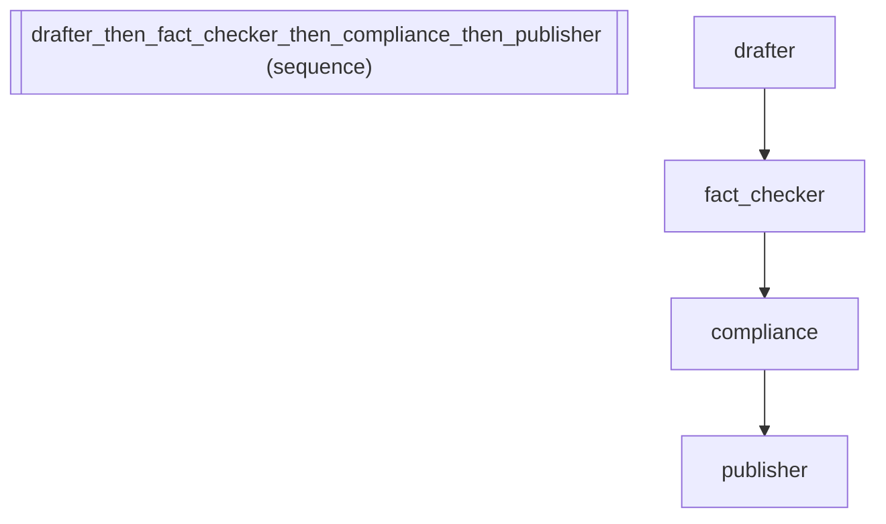

# Visibility: Content Review Pipeline

*How to compose agents into a sequential pipeline.*

_Source: `51_visibility_policies.py`_

### Architecture



::::{tab-set}
:::{tab-item} Native ADK
```python
# In native ADK, a 4-agent content pipeline (draft → fact-check →
# compliance → publish) sends all intermediate outputs to the user.
# The user sees the raw draft, the fact-checker's internal notes, and
# the compliance report — when they only want the final published version.
# There's no built-in way to suppress intermediate events.
```
:::
:::{tab-item} adk-fluent
```python
from adk_fluent import Agent
from adk_fluent._visibility import infer_visibility

MODEL = "gemini-2.5-flash"

# Content review pipeline: only the final publisher output matters to the user.
# Internal agents (drafter, fact-checker, compliance) should be silent.

content_pipeline = (
    Agent("drafter")
    .model(MODEL)
    .instruct(
        "Write a first draft of the article based on the research notes.\n"
        "Focus on clarity and structure. Don't worry about polish yet."
    )
    >> Agent("fact_checker")
    .model(MODEL)
    .instruct(
        "Review the draft for factual accuracy.\n"
        "Flag any unsupported claims. Add source annotations.\n"
        "Output the corrected draft with inline notes."
    )
    >> Agent("compliance")
    .model(MODEL)
    .instruct("Review for brand guidelines, legal requirements, and tone.\nFlag anything that needs legal review.")
    >> Agent("publisher")
    .model(MODEL)
    .instruct(
        "Produce the final published version.\n"
        "Incorporate fact-check corrections and compliance feedback.\n"
        "Remove all internal annotations."
    )
)

# Infer visibility from pipeline topology
ir = content_pipeline.to_ir()
visibility = infer_visibility(ir)

# For debugging: make all agents visible
debug_pipeline = (
    Agent("a").model(MODEL).instruct("Step 1.")
    >> Agent("b").model(MODEL).instruct("Step 2.")
    >> Agent("c").model(MODEL).instruct("Step 3.")
)
debug_pipeline.transparent()

# For production: only terminal agent visible (default behavior)
prod_pipeline = (
    Agent("a").model(MODEL).instruct("Step 1.")
    >> Agent("b").model(MODEL).instruct("Step 2.")
    >> Agent("c").model(MODEL).instruct("Step 3.")
)
prod_pipeline.filtered()

# Per-agent overrides: force an intermediate agent to be visible
compliance_agent = Agent("compliance").model(MODEL).instruct("Review.").show()
cleanup_agent = Agent("cleanup").model(MODEL).instruct("Clean up.").hide()
```
:::
::::

## Equivalence

```python
# Only the terminal agent (publisher) is user-facing
assert visibility["drafter"] == "internal"
assert visibility["fact_checker"] == "internal"
assert visibility["compliance"] == "internal"
assert visibility["publisher"] == "user"

# Debug mode: all agents transparent
assert debug_pipeline._config["_visibility_policy"] == "transparent"

# Production mode: filtered
assert prod_pipeline._config["_visibility_policy"] == "filtered"

# Per-agent overrides set config
assert compliance_agent._config["_visibility_override"] == "user"
assert cleanup_agent._config["_visibility_override"] == "internal"
```
