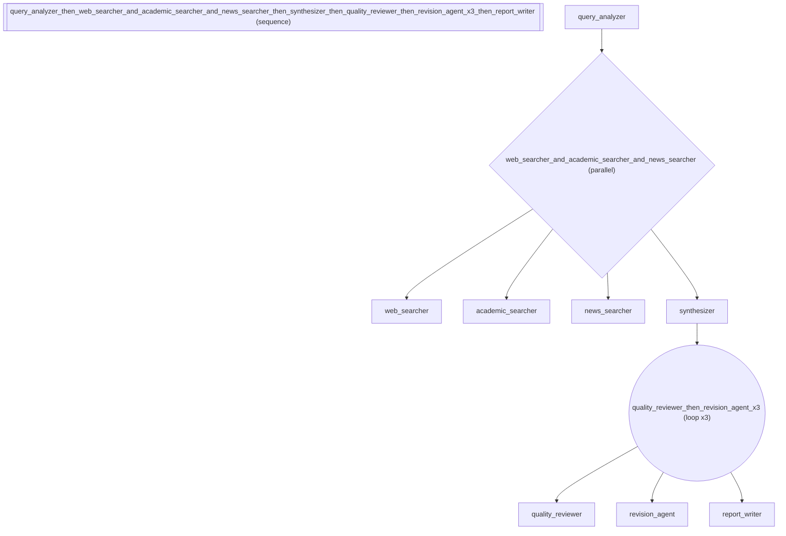

# Deep Research Agent -- Gemini Deep Research / Perplexity Clone

Demonstrates building a multi-stage research pipeline inspired by
Gemini's Deep Research feature and Perplexity. A query is decomposed
into sub-questions, searched in parallel across multiple sources,
synthesized, quality-reviewed in a loop, and formatted as a report.

Real-world use case: Deep research agent inspired by Gemini Deep Research and
Perplexity. Decomposes queries, searches multiple sources in parallel,
synthesizes with quality review loop, and produces typed reports. Used by
analysts for comprehensive research briefs.

In other frameworks: LangGraph requires StateGraph with conditional back-edges
for the quality loop, fan-out nodes for parallel search, and Pydantic
integration for typed output (~60 lines of graph wiring). adk-fluent expresses
the entire topology -- parallel search, quality loop, typed output -- in one
expression using >>, |, \*, and @.

Pipeline topology:
query_analyzer
\>> ( web_searcher | academic_searcher | news_searcher )
\>> synthesizer
\>> ( quality_reviewer >> revision_agent ) * until(score >= 0.85)
\>> report_writer @ ResearchReport

Uses: >>, |, *, @, S.*, C.\*, save_as, loop_until

:::\{tip} What you'll learn
How to compose agents into a sequential pipeline.
:::

_Source: `55_deep_research.py`_

::::\{tab-set}
:::\{tab-item} adk-fluent

```python
from pydantic import BaseModel

from adk_fluent import Agent, Pipeline, S, C
from adk_fluent._routing import Route

MODEL = "gemini-2.5-flash"


class ResearchReport(BaseModel):
    """Structured output for the final research report."""

    title: str
    executive_summary: str
    key_findings: list[str]
    confidence_score: float


# Stage 1: Analyze the research query and decompose into sub-questions
query_analyzer = (
    Agent("query_analyzer")
    .model(MODEL)
    .instruct(
        "Analyze the research query. Identify the core question, "
        "decompose it into 3-5 sub-questions, and determine which "
        "sources are most relevant (academic, news, web)."
    )
    .writes("research_plan")
)

# Stage 2: Parallel search across multiple source types
parallel_search = (
    Agent("web_searcher")
    .model(MODEL)
    .instruct("Search the web for relevant articles and blog posts. Summarize key findings.")
    .context(C.from_state("research_plan"))
    .writes("web_results")
    | Agent("academic_searcher")
    .model(MODEL)
    .instruct("Search academic databases for peer-reviewed papers. Extract methodology and conclusions.")
    .context(C.from_state("research_plan"))
    .writes("academic_results")
    | Agent("news_searcher")
    .model(MODEL)
    .instruct("Search recent news for current developments and expert commentary.")
    .context(C.from_state("research_plan"))
    .writes("news_results")
)

# Stage 3: Synthesize findings from all sources
synthesizer = (
    Agent("synthesizer")
    .model(MODEL)
    .instruct(
        "Synthesize findings from web, academic, and news sources. "
        "Identify consensus, contradictions, and gaps. "
        "Rate confidence on a 0-1 scale."
    )
    .context(C.from_state("web_results", "academic_results", "news_results"))
    .writes("synthesis")
)

# Stage 4: Quality review loop — reviewer scores until confident
quality_loop = (
    Agent("quality_reviewer")
    .model(MODEL)
    .instruct(
        "Review the research synthesis for accuracy, completeness, and bias. "
        "Score quality from 0 to 1. If below 0.85, specify what needs improvement."
    )
    .context(C.from_state("synthesis"))
    .writes("quality_score")
    >> Agent("revision_agent")
    .model(MODEL)
    .instruct("Revise the synthesis based on reviewer feedback. Address gaps and improve weak sections.")
    .context(C.from_state("synthesis", "quality_score"))
    .writes("synthesis")
).loop_until(lambda s: float(s.get("quality_score", 0)) >= 0.85, max_iterations=3)

# Stage 5: Format final report with typed output
report_writer = (
    Agent("report_writer")
    .model(MODEL)
    .instruct("Write the final research report with executive summary, key findings, and confidence assessment.")
    .context(C.from_state("synthesis"))
    @ ResearchReport
)

# Compose the full deep research pipeline
deep_research = query_analyzer >> parallel_search >> synthesizer >> quality_loop >> report_writer
```

:::
:::\{tab-item} Native ADK

```python
# A native ADK deep research pipeline requires:
#   - 7+ LlmAgent declarations with manual output_key wiring
#   - ParallelAgent for multi-source search
#   - SequentialAgent for overall pipeline + review loop
#   - Custom LoopAgent subclass with quality check logic
#   - Manual include_contents="none" on stateless agents
#   - Pydantic schema wiring for the final report
# Total: ~120 lines of boilerplate
```

:::
:::\{tab-item} Architecture



:::
::::

## Equivalence

```python
# Pipeline builds correctly
assert isinstance(deep_research, Pipeline)
built = deep_research.build()

# Has 5 top-level stages
assert len(built.sub_agents) == 5

# First stage is the query analyzer
assert built.sub_agents[0].name == "query_analyzer"
assert built.sub_agents[0].output_key == "research_plan"

# Second stage is parallel search with 3 searchers
fanout = built.sub_agents[1]
assert len(fanout.sub_agents) == 3

# Third stage is the synthesizer
assert built.sub_agents[2].name == "synthesizer"

# Fourth stage is the quality review loop
# loop_until adds a checkpoint agent, so 3 sub_agents total
loop_agent = built.sub_agents[3]
assert len(loop_agent.sub_agents) == 3  # reviewer + revision + _until_check

# Fifth stage has typed output schema
assert built.sub_agents[4].output_schema is ResearchReport
```
