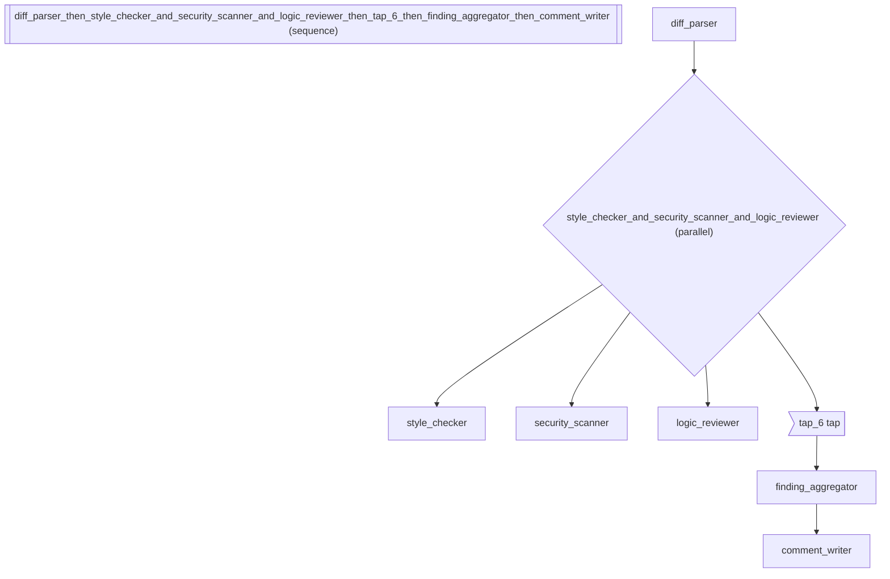

# Code Review Agent -- Gemini CLI / GitHub Copilot Inspired

Demonstrates building an automated code review agent inspired by
Gemini CLI's code review and GitHub Copilot's review features.
Uses parallel fan-out for concurrent analysis, typed output for
structured findings, and conditional gating.

Pipeline topology:
diff_parser \[save_as: parsed_changes\]
\>> ( style_checker | security_scanner | logic_reviewer )
\>> tap(log)
\>> finding_aggregator @ ReviewResult
\>> comment_writer \[gated: findings_count > 0\]

Uses: >>, |, @, proceed_if, save_as, tap

*How to compose agents into a sequential pipeline.*

_Source: `57_code_review_agent.py`_

### Architecture



::::\{tab-set}
:::\{tab-item} Native ADK

```python
# A native ADK code review agent requires:
#   - 6 LlmAgent declarations
#   - ParallelAgent for concurrent review passes
#   - SequentialAgent for the pipeline
#   - Manual output_schema wiring
#   - Custom BaseAgent for conditional gating
# Total: ~80 lines of boilerplate
```

:::
:::\{tab-item} adk-fluent

```python
from pydantic import BaseModel

from adk_fluent import Agent, Pipeline, tap

MODEL = "gemini-2.5-flash"

review_log = []


class ReviewFinding(BaseModel):
    """A single code review finding."""

    file: str
    line: int
    severity: str  # critical, warning, info
    message: str


class ReviewResult(BaseModel):
    """Aggregated code review result."""

    approved: bool
    findings_count: int
    critical_count: int
    summary: str


# Stage 1: Parse the diff into reviewable chunks
diff_parser = (
    Agent("diff_parser")
    .model(MODEL)
    .instruct(
        "Parse the git diff into individual file changes. "
        "For each file, extract the changed lines with surrounding context. "
        "Identify the programming language and framework."
    )
    .writes("parsed_changes")
)

# Stage 2: Three parallel review passes
style_review = (
    Agent("style_checker")
    .model(MODEL)
    .instruct(
        "Review code style and conventions:\n"
        "- Naming conventions (camelCase, snake_case as appropriate)\n"
        "- Function length and complexity\n"
        "- Missing docstrings and type hints\n"
        "- Dead code and unused imports"
    )
    .writes("style_findings")
)

security_review = (
    Agent("security_scanner")
    .model(MODEL)
    .instruct(
        "Scan for security vulnerabilities:\n"
        "- SQL injection and XSS vectors\n"
        "- Hardcoded secrets and API keys\n"
        "- Missing input validation\n"
        "- Insecure deserialization"
    )
    .writes("security_findings")
)

logic_review = (
    Agent("logic_reviewer")
    .model(MODEL)
    .instruct(
        "Review business logic correctness:\n"
        "- Edge cases and boundary conditions\n"
        "- Error handling completeness\n"
        "- Race conditions in concurrent code\n"
        "- Off-by-one errors in loops"
    )
    .writes("logic_findings")
)

# Stage 3: Aggregate findings into structured result
aggregator = (
    Agent("finding_aggregator")
    .model(MODEL)
    .instruct(
        "Aggregate findings from style, security, and logic reviews. "
        "Count critical issues. Determine if the PR should be approved."
    )
    @ ReviewResult
)

# Stage 4: Write detailed review comment (only if there are findings)
comment_writer = (
    Agent("comment_writer")
    .model(MODEL)
    .instruct(
        "Write a constructive, actionable code review comment. "
        "Group findings by file. Lead with praise for good patterns."
    )
    .proceed_if(lambda s: s.get("findings_count", 0) > 0)
)

# Compose the full code review pipeline
code_review = (
    diff_parser
    >> (style_review | security_review | logic_review)
    >> tap(lambda s: review_log.append("reviews_complete"))
    >> aggregator
    >> comment_writer
)
```

:::
::::

## Equivalence

```python
# Pipeline builds correctly
assert isinstance(code_review, Pipeline)
built = code_review.build()

# Has 5 stages: parser, fanout, tap, aggregator, comment_writer
assert len(built.sub_agents) == 5

# Parser saves to state
assert built.sub_agents[0].name == "diff_parser"
assert built.sub_agents[0].output_key == "parsed_changes"

# Fan-out has 3 parallel reviewers
fanout = built.sub_agents[1]
assert len(fanout.sub_agents) == 3

# Aggregator has typed output
assert built.sub_agents[3].output_schema is ReviewResult
```

:::\{seealso}
API reference: [Agent](../api/agent.md#builder-Agent)
:::
