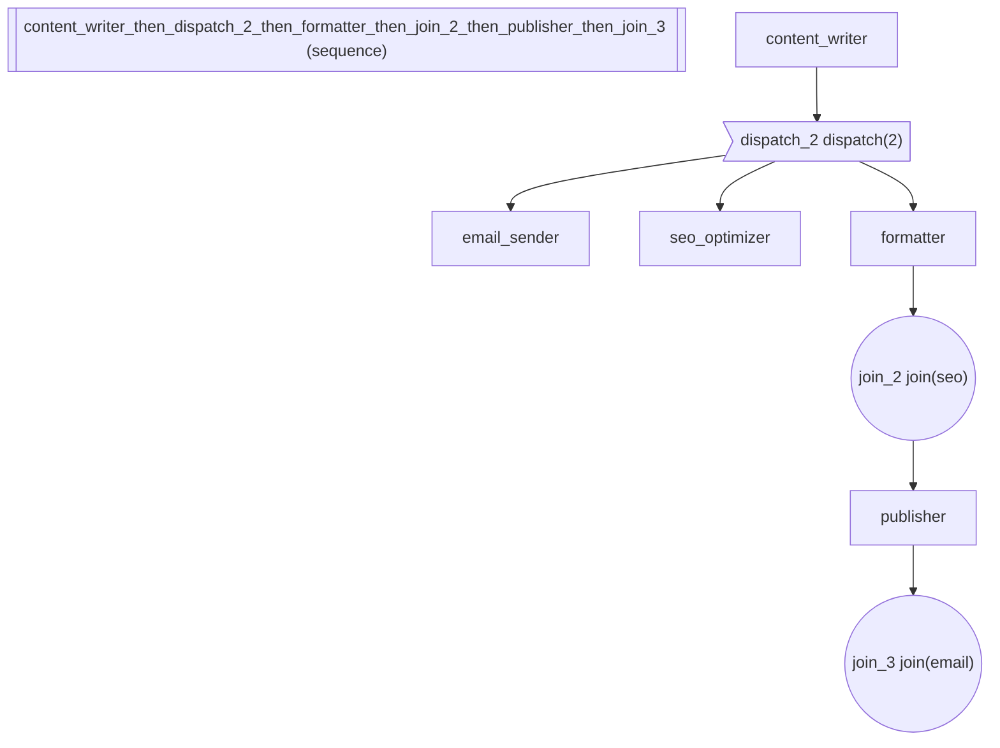

# Dispatch & Join: Fire-and-Continue Background Execution

Demonstrates the dispatch/join primitives for non-blocking background
agent execution.  Unlike FanOut (which blocks until all complete) or
race (which takes first and cancels rest), dispatch fires agents as
background tasks and lets the pipeline continue immediately.

Pipeline topology:
writer
\>> dispatch(email_sender, seo_optimizer)   -- fire-and-continue
\>> formatter                                -- runs immediately
\>> join()                                   -- barrier: wait for all
\>> publisher

```
Selective join:
    writer >> dispatch(email, seo) >> formatter >> join("seo") >> publisher >> join("email")
```

Key concepts:

- dispatch(\*agents): launches agents as asyncio.Tasks, pipeline continues
- join(): barrier that waits for dispatched tasks to complete
- join("name"): selective join -- wait for specific tasks only
- .dispatch(name="x"): method form for any builder
- Named tasks, callbacks, timeout, progress streaming

:::\{tip} What you'll learn
How to register lifecycle callbacks with accumulation semantics.
:::

_Source: `59_dispatch_join.py`_

::::\{tab-set}
:::\{tab-item} adk-fluent

```python
from adk_fluent import Agent, Pipeline, dispatch, join
from adk_fluent._primitive_builders import BackgroundTask, _JoinBuilder
from adk_fluent._base import BuilderBase

# Scenario: A content publishing pipeline that fires off email notification
# and SEO optimization in the background while the main pipeline continues
# with formatting and publishing.

writer = Agent("content_writer").model("gemini-2.5-flash").instruct("Write a blog post about the given topic.")
email_sender = (
    Agent("email_sender").model("gemini-2.5-flash").instruct("Send email notification about the new content.")
)
seo_optimizer = Agent("seo_optimizer").model("gemini-2.5-flash").instruct("Optimize the content for search engines.")
formatter = Agent("formatter").model("gemini-2.5-flash").instruct("Format the content for the website.")
publisher = Agent("publisher").model("gemini-2.5-flash").instruct("Publish the formatted content.")

# 1. Basic dispatch: fire-and-continue
basic_pipeline = (
    writer
    >> dispatch(email_sender, seo_optimizer)  # non-blocking background tasks
    >> formatter  # runs immediately, doesn't wait
    >> join()  # barrier: wait for all dispatched
    >> publisher
)

# 2. Named dispatch with selective join
named_pipeline = (
    writer
    >> dispatch(
        email_sender,
        seo_optimizer,
        names=["email", "seo"],
    )
    >> formatter
    >> join("seo", timeout=30)  # wait only for SEO before publishing
    >> publisher
    >> join("email")  # collect email result at the end
)

# 3. Method form: .dispatch() on any builder
bg_email = email_sender.dispatch(name="email")
bg_pipeline = (writer >> formatter).dispatch(name="content")
method_workflow = bg_email >> bg_pipeline >> publisher >> join()

# 4. Dispatch with callbacks
callback_results = []
callback_pipeline = (
    writer
    >> dispatch(
        email_sender,
        on_complete=lambda name, result: callback_results.append((name, "ok")),
        on_error=lambda name, exc: callback_results.append((name, "error")),
    )
    >> formatter
    >> join()
)

# 5. Dispatch with progress streaming
progress_pipeline = (
    writer
    >> dispatch(
        seo_optimizer,
        progress_key="seo_progress",  # partial results stream here as agent runs
    )
    >> formatter  # can read state["seo_progress"] for live updates
    >> join()
)
```

:::
:::\{tab-item} Architecture



:::
::::

## Equivalence

```python
# dispatch() creates a BackgroundTask
d = dispatch(email_sender, seo_optimizer)
assert isinstance(d, BackgroundTask)
assert isinstance(d, BuilderBase)

# join() creates a _JoinBuilder
j = join()
assert isinstance(j, _JoinBuilder)
assert isinstance(j, BuilderBase)

# dispatch builds with correct number of sub-agents
built_d = dispatch(email_sender, seo_optimizer).build()
assert len(built_d.sub_agents) == 2
assert built_d.sub_agents[0].name == "email_sender"
assert built_d.sub_agents[1].name == "seo_optimizer"

# Named tasks are stored correctly
named_d = dispatch(email_sender, seo_optimizer, names=["email", "seo"])
built_named = named_d.build()
assert built_named._task_names == ("email", "seo")

# Auto-names from agent names
auto_d = dispatch(email_sender, seo_optimizer)
assert auto_d._task_names == ("email_sender", "seo_optimizer")

# .dispatch() method works on any builder
bg = email_sender.dispatch(name="bg_email")
assert isinstance(bg, BackgroundTask)
built_bg = bg.build()
assert len(built_bg.sub_agents) == 1
assert built_bg._task_names == ("bg_email",)

# Pipeline .dispatch() works (dispatch a whole pipeline)
pipeline_bg = (writer >> formatter).dispatch(name="content_pipeline")
assert isinstance(pipeline_bg, BackgroundTask)

# join with timeout
j_timeout = join(timeout=30)
built_j = j_timeout.build()
assert built_j._timeout == 30.0

# join with target names
j_selective = join("email", "seo")
built_js = j_selective.build()
assert built_js._target_names == ("email", "seo")

# Composable in pipeline with >>
assert isinstance(basic_pipeline, Pipeline)
built_pipeline = basic_pipeline.build()
# writer >> dispatch >> formatter >> join >> publisher = 5 sub-agents
assert len(built_pipeline.sub_agents) == 5

# Named pipeline composition works
assert isinstance(named_pipeline, Pipeline)

# IR generation works
ir = d.to_ir()
from adk_fluent._ir import DispatchNode

assert isinstance(ir, DispatchNode)
assert len(ir.children) == 2

ir_j = join("email").to_ir()
from adk_fluent._ir import JoinNode

assert isinstance(ir_j, JoinNode)
assert ir_j.target_names == ("email",)

# Backend compilation works
from adk_fluent.backends.adk import ADKBackend

backend = ADKBackend()
compiled = backend._compile_dispatch(ir)
assert compiled.name == d._config["name"]
assert len(compiled.sub_agents) == 2

# Progress key is passed through (stored as _stream_to internally)
progress_d = dispatch(seo_optimizer, progress_key="seo_progress")
assert progress_d._stream_to == "seo_progress"
built_progress = progress_d.build()
assert built_progress._stream_to == "seo_progress"
```
