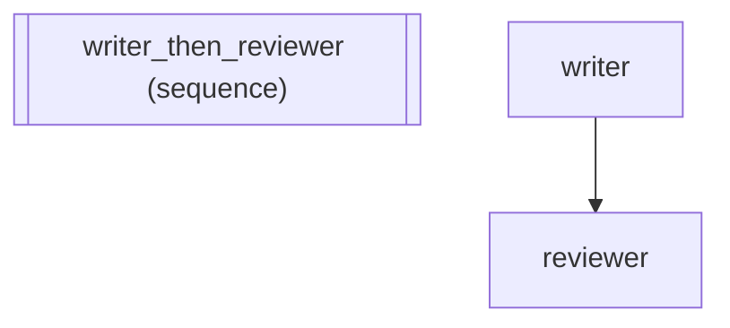

# M Module: Fluent Middleware Composition

Demonstrates the M module -- a fluent composition surface for middleware,
consistent with P (prompts), C (context), S (state transforms).

Key concepts:
  - M.retry(), M.log(), M.cost(), M.latency(): built-in factories
  - M.topology_log(), M.dispatch_log(): topology and dispatch observability
  - | operator: compose middleware chains (M.retry(3) | M.log())
  - M.scope("agent", mw): restrict middleware to specific agents
  - M.when(condition, mw): conditional middleware (string, callable, PredicateSchema)
  - M.before_agent(fn): single-hook shortcut for quick observability
  - MComposite: composable chain class with to_stack() for flattening

:::{tip} What you'll learn
How to use operator syntax for composing agents.
:::

_Source: `62_m_module_composition.py`_

### Architecture



::::{tab-set}
:::{tab-item} adk-fluent
```python
from adk_fluent import Agent, Pipeline
from adk_fluent._middleware import M, MComposite

# --- 1. Built-in factories produce MComposite ---
retry = M.retry(3)
assert isinstance(retry, MComposite)
assert len(retry) == 1

log = M.log()
assert isinstance(log, MComposite)

cost = M.cost()
latency = M.latency()
topo = M.topology_log()
disp = M.dispatch_log()

# --- 2. Pipe operator composes middleware chains ---
stack = M.retry(3) | M.log() | M.cost()
assert isinstance(stack, MComposite)
assert len(stack) == 3  # three middleware instances

# Flattening gives protocol-level instances
flat = stack.to_stack()
assert len(flat) == 3
from adk_fluent.middleware import CostTracker, RetryMiddleware, StructuredLogMiddleware

assert isinstance(flat[0], RetryMiddleware)
assert isinstance(flat[1], StructuredLogMiddleware)
assert isinstance(flat[2], CostTracker)

# --- 3. Custom middleware mixes with M factories ---


class AuditMiddleware:
    """Custom middleware tracking agent invocations."""

    def __init__(self):
        self.calls = []

    async def before_agent(self, ctx, agent_name):
        self.calls.append(agent_name)


audit = AuditMiddleware()
mixed = M.retry(3) | audit | M.dispatch_log()
assert len(mixed) == 3
assert mixed.to_stack()[1] is audit  # custom instance in the middle

# --- 4. M.scope() restricts middleware to specific agents ---
scoped = M.scope("writer", M.cost())
assert len(scoped) == 1

# The wrapped middleware has agents attribute set
wrapped = scoped.to_stack()[0]
assert wrapped.agents == "writer"

# Tuple scoping for multiple agents
multi_scoped = M.scope(("writer", "reviewer"), M.log())
assert multi_scoped.to_stack()[0].agents == ("writer", "reviewer")

# --- 5. M.when() applies middleware conditionally ---

# String shortcut: match execution mode
stream_only = M.when("stream", M.latency())
assert len(stream_only) == 1

# Callable condition
debug_mode = False
debug_log = M.when(lambda: debug_mode, M.log())
assert len(debug_log) == 1

# --- 6. Single-hook shortcuts for quick observability ---
agents_seen = []
hook = M.before_agent(lambda ctx, name: agents_seen.append(name))
assert len(hook) == 1

# The wrapped middleware has before_agent set
inner = hook.to_stack()[0]
assert hasattr(inner, "before_agent")

# Other single-hook shortcuts exist
assert len(M.after_agent(lambda ctx, name: None)) == 1
assert len(M.before_model(lambda ctx, req: None)) == 1
assert len(M.after_model(lambda ctx, resp: None)) == 1
assert len(M.on_loop(lambda ctx, name, i: None)) == 1
assert len(M.on_timeout(lambda ctx, name, s, t: None)) == 1
assert len(M.on_route(lambda ctx, name, sel: None)) == 1
assert len(M.on_fallback(lambda ctx, name, agent, att, err: None)) == 1

# --- 7. Pipeline integration ---
writer = Agent("writer").model("gemini-2.5-flash").instruct("Write content.")
reviewer = Agent("reviewer").model("gemini-2.5-flash").instruct("Review content.")

pipeline = (writer >> reviewer).middleware(M.retry(3) | M.log() | M.topology_log())

# Middleware is flattened and stored on the pipeline builder
assert len(pipeline._middlewares) == 3

# Scoped cost tracking -- only for the writer agent
pipeline.middleware(M.scope("writer", M.cost()))
assert len(pipeline._middlewares) == 4

# --- 8. MComposite repr ---
combo = M.retry(3) | M.log()
r = repr(combo)
assert "MComposite" in r
assert "RetryMiddleware" in r
assert "StructuredLogMiddleware" in r

# --- 9. M.when with PredicateSchema ---
from adk_fluent._predicate_schema import PredicateSchema


class IsPremium(PredicateSchema):
    @staticmethod
    def evaluate():
        return True


predicate_mw = M.when(IsPremium, M.cost())
assert len(predicate_mw) == 1
# The condition is deferred -- wraps inner in _ConditionalMiddleware
inner_mw = predicate_mw.to_stack()[0]
assert callable(getattr(inner_mw, "after_model", None))  # guarded wrapper

print("All M module composition assertions passed!")
```
:::
::::
