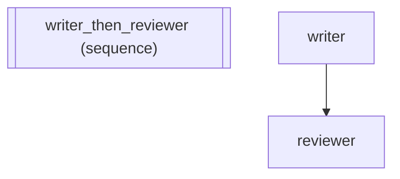

# Built-in Middleware: CostTracker, LatencyMiddleware, TopologyLogMiddleware

Demonstrates the built-in middleware classes for production observability
and the error boundary mechanism that prevents middleware failures from
crashing the pipeline.

Key concepts:
  - CostTracker: token usage accumulation via after_model
  - LatencyMiddleware: per-agent timing via TraceContext
  - TopologyLogMiddleware: structured logging for topology events
  - Error boundary: middleware exceptions caught, logged, and reported
  - on_middleware_error: notification hook for other middleware
  - Custom middleware with typed MiddlewareSchema

:::{tip} What you'll learn
How to compose agents into a sequential pipeline.
:::

_Source: `65_builtin_middleware.py`_

::::{tab-set}
:::{tab-item} adk-fluent
```python
from adk_fluent._middleware import M, MComposite
from adk_fluent.middleware import (
    CostTracker,
    LatencyMiddleware,
    Middleware,
    TopologyLogMiddleware,
    TraceContext,
)

# --- 1. CostTracker: token usage accumulation ---
tracker = CostTracker()

# Initial state
assert tracker.total_input_tokens == 0
assert tracker.total_output_tokens == 0
assert tracker.calls == 0

# Has after_model hook
assert hasattr(tracker, "after_model")

# CostTracker conforms to Middleware protocol
assert isinstance(tracker, Middleware)

# Via M factory
cost_chain = M.cost()
assert isinstance(cost_chain, MComposite)
assert isinstance(cost_chain.to_stack()[0], CostTracker)

# --- 2. LatencyMiddleware: per-agent timing ---
latency = LatencyMiddleware()

# Initial state
assert isinstance(latency.latencies, dict)
assert len(latency.latencies) == 0

# Has before_agent and after_agent hooks
assert hasattr(latency, "before_agent")
assert hasattr(latency, "after_agent")

# Conforms to Middleware protocol
assert isinstance(latency, Middleware)

# Via M factory
latency_chain = M.latency()
assert isinstance(latency_chain.to_stack()[0], LatencyMiddleware)

# --- 3. TopologyLogMiddleware: structured topology logging ---
topo = TopologyLogMiddleware()

# Initial state
assert isinstance(topo.log, list)
assert len(topo.log) == 0

# Has all topology hooks
assert hasattr(topo, "on_loop_iteration")
assert hasattr(topo, "on_fanout_start")
assert hasattr(topo, "on_fanout_complete")
assert hasattr(topo, "on_route_selected")
assert hasattr(topo, "on_fallback_attempt")
assert hasattr(topo, "on_timeout")

# Conforms to Middleware protocol
assert isinstance(topo, Middleware)

# Via M factory
topo_chain = M.topology_log()
assert isinstance(topo_chain.to_stack()[0], TopologyLogMiddleware)

# --- 4. Test TopologyLogMiddleware event capture ---
import asyncio

ctx = TraceContext()


async def _run_topo_logging():
    await topo.on_loop_iteration(ctx, "review_loop", 1)
    await topo.on_loop_iteration(ctx, "review_loop", 2)
    await topo.on_route_selected(ctx, "intent_router", "support")
    await topo.on_fanout_start(ctx, "analysis", ["risk", "fraud"])
    await topo.on_fanout_complete(ctx, "analysis", ["risk", "fraud"])


asyncio.run(_run_topo_logging())

# Events are captured in the log
assert len(topo.log) == 5
assert topo.log[0]["event"] == "loop_iteration"
assert topo.log[0]["loop"] == "review_loop"
assert topo.log[0]["iteration"] == 1
assert topo.log[2]["event"] == "route_selected"
assert topo.log[2]["selected"] == "support"
assert topo.log[3]["event"] == "fanout_start"
assert topo.log[3]["branches"] == ["risk", "fraud"]

# --- 5. Error boundary: Middleware protocol includes on_middleware_error ---
assert hasattr(Middleware, "on_middleware_error")


class ErrorAwareMiddleware:
    """Middleware that tracks errors from other middleware."""

    def __init__(self):
        self.errors = []

    async def on_middleware_error(self, ctx, hook_name, error, middleware):
        self.errors.append(
            {
                "hook": hook_name,
                "error": str(error),
                "middleware": type(middleware).__name__,
            }
        )


error_tracker = ErrorAwareMiddleware()
assert isinstance(error_tracker, Middleware)

# --- 6. Composing built-in middleware ---
# Production observability stack
production_stack = M.retry(3) | M.log() | M.cost() | M.latency() | M.topology_log()
assert len(production_stack) == 5

# Scoped cost tracking: only track LLM costs for the expensive agent
from adk_fluent import Agent, Pipeline

writer = Agent("writer").model("gemini-2.5-flash").instruct("Write content.")
reviewer = Agent("reviewer").model("gemini-2.5-flash").instruct("Review content.")

pipeline = (writer >> reviewer).middleware(
    # Global: retry + logging for everything
    M.retry(3) | M.log()
)
assert len(pipeline._middlewares) == 2

# Scoped: cost tracking only for writer
pipeline.middleware(M.scope("writer", M.cost()))
# Conditional: latency tracking only in stream mode
pipeline.middleware(M.when("stream", M.latency()))
assert len(pipeline._middlewares) == 4

# --- 7. Custom middleware with MiddlewareSchema ---
from typing import Annotated

from adk_fluent._middleware_schema import MiddlewareSchema
from adk_fluent._schema_base import Reads, Writes


class ComplianceState(MiddlewareSchema):
    """Declares state dependencies for HIPAA compliance middleware."""

    patient_id: Annotated[str, Reads()]
    audit_log: Annotated[str, Writes(scope="temp")]


class ComplianceMiddleware:
    """HIPAA compliance middleware for healthcare pipelines."""

    agents = "patient_lookup"
    schema = ComplianceState

    async def before_agent(self, ctx, agent_name):
        # In production: verify patient consent, log access
        pass

    async def after_agent(self, ctx, agent_name):
        # In production: write audit entry
        pass


compliance = ComplianceMiddleware()
assert compliance.schema.reads_keys() == frozenset({"patient_id"})
assert compliance.schema.writes_keys() == frozenset({"temp:audit_log"})

# Works with M.scope() and M.when()
scoped_compliance = M.scope("patient_lookup", compliance)
assert scoped_compliance.to_stack()[0].schema is ComplianceState

# --- 8. Repr for built-in middleware ---
assert "CostTracker" in repr(CostTracker())
assert "LatencyMiddleware" in repr(LatencyMiddleware())

# --- 9. Full production example ---
# E-commerce order processing with comprehensive observability

order_agent = Agent("order_processor").model("gemini-2.5-flash").instruct("Process incoming orders.")

fraud_agent = Agent("fraud_detector").model("gemini-2.5-flash").instruct("Detect fraudulent orders.")

production_pipeline = (order_agent >> fraud_agent).middleware(
    # Global retry + structured logging
    M.retry(3)
    | M.log()
    # Topology logging for loop/fanout visibility
    | M.topology_log()
)
# Cost tracking only for the LLM-heavy fraud detection
production_pipeline.middleware(M.scope("fraud_detector", M.cost()))

assert len(production_pipeline._middlewares) == 4

print("All built-in middleware assertions passed!")
```
:::
:::{tab-item} Architecture

:::
::::
