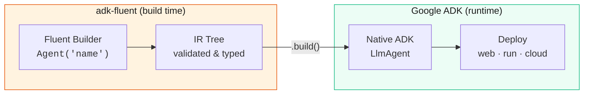
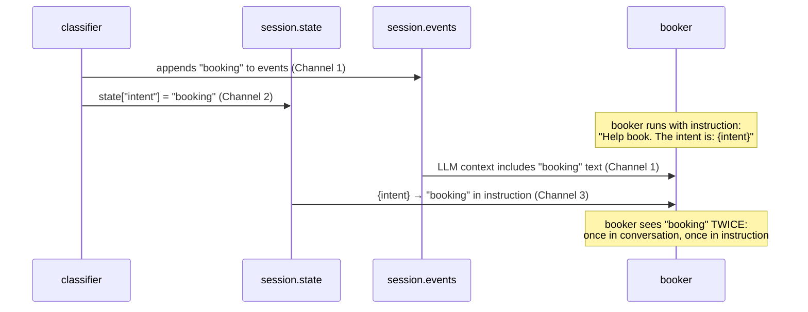
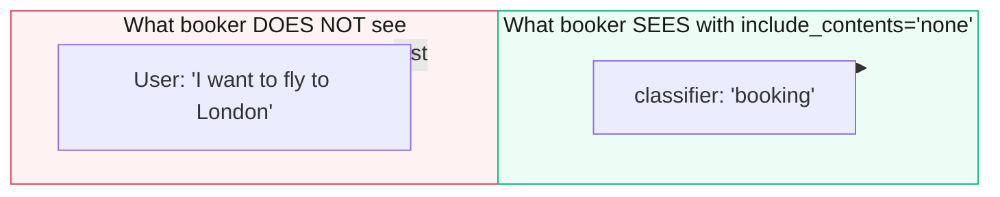
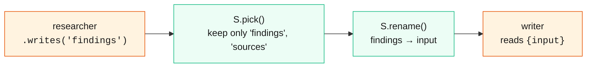
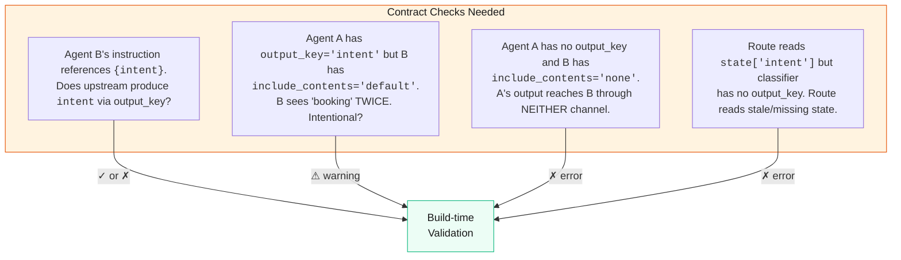

# Architecture & Core Concepts

Before diving into builders and operators, it's crucial to understand the underlying mechanics of ADK and how `adk-fluent` interacts with them. This conceptual foundation will help you design robust, predictable agent systems.

## How adk-fluent Works

adk-fluent is a **zero-overhead builder layer** on top of Google ADK. Every `.build()` produces a native ADK object — `LlmAgent`, `SequentialAgent`, `ParallelAgent`, etc. There is no custom runtime.



The builder validates configuration, checks contracts, and compiles to native ADK objects. After `.build()`, adk-fluent is out of the picture — the runtime is pure ADK.

## The Three Channels

ADK has three independent mechanisms for agents to communicate. Every confusion about state traces back to developers not realizing they're coordinating three systems manually.

```{raw} html
<div class="channel-grid">

  <div class="channel-card channel-card--history">
    <h4>Channel 1: Conversation History</h4>
    <p>All events (user messages, agent responses, tool calls) are appended to <code>session.events</code>. When the next agent runs, <code>contents.py</code> assembles these into the LLM prompt. Every agent sees every prior agent's raw text output by default.</p>
    <p>Controlled by <code>include_contents</code>: <code>'default'</code> (everything) or <code>'none'</code> (current turn only). Binary switch. No middle ground.</p>
  </div>

  <div class="channel-card channel-card--state">
    <h4>Channel 2: Session State</h4>
    <p>Flat dictionary at <code>session.state</code>. Written via <code>output_key</code> (auto), <code>ctx.session.state[k] = v</code> (manual), or <code>event.actions.state_delta</code> (event-carried).</p>
    <p>Scoped: unprefixed (session), <code>app:</code>, <code>user:</code>, <code>temp:</code>.</p>
  </div>

  <div class="channel-card channel-card--template">
    <h4>Channel 3: Instruction Templating</h4>
    <p><code>inject_session_state()</code> replaces <code>{key}</code> placeholders in instruction strings with <code>session.state[key]</code> values. Runs every invocation, just before the LLM call.</p>
    <p>This is the bridge: state values appear inside the system prompt.</p>
  </div>

</div>
```

These three channels are configured independently but deeply entangled at runtime. Here's what happens in a `classifier >> booker` pipeline:



This duplication is not a bug. It's the natural consequence of three independent channels converging on one LLM prompt. The developer is expected to manage this. Most don't realize it's happening.

## What include_contents Actually Does

The source (`contents.py`) reveals `include_contents='none'` finds the most recent user message or other-agent reply and only includes events from that point forward. In a pipeline:



The user's original message is lost. `include_contents='none'` was designed for stateless utility agents that get all their context from state variables in the instruction template. It was not designed for pipeline composition where a downstream agent needs the conversation *and* structured data from an upstream agent.

There is no `include_contents='user_only'` or `include_contents='exclude_agents'`. The switch is binary: everything, or current turn. ADK has no mechanism for topology-aware content filtering.

## What output_key Actually Does

`__maybe_save_output_to_state` runs inside `LlmAgent._run_async_impl`:

```python
async for event in self._llm_flow.run_async(ctx):
    self.__maybe_save_output_to_state(event)  # mutates event.actions.state_delta
    yield event                                # yields event WITH content AND state_delta
```

It mutates the event's `state_delta` field in-place. It does not suppress, replace, or redirect the content. The event still carries full text. `append_event` in the Runner then: (1) appends the event to `session.events`, and (2) applies `state_delta` to `session.state`. Both writes happen atomically from the same event.

`output_key` is therefore a *duplication* mechanism, not a *routing* mechanism. It copies the LLM's text response into state under a named key. The original text still exists in conversation history. Downstream agents get it through both channels.

## What the S Module Does Today

The S module provides pure state transforms that compile to `FnAgent` — a zero-cost agent that mutates `ctx.session.state` directly and yields no events:

```python
pipeline = (
    Agent("researcher").instruct("Find data.").writes("findings")
    >> S.pick("findings", "sources")
    >> S.rename(findings="input")
    >> Agent("writer").instruct("Write report using {input}.")
)
```



S transforms operate exclusively on Channel 2 (session state). They don't touch Channel 1 (conversation history) or Channel 3 (instruction templating). FnAgent writes directly to `ctx.session.state` and yields nothing — no events, no state_delta, no conversation history entry.

**Common S transforms:**

| Transform | Effect |
|---|---|
| `S.pick(*keys)` | Keep only named keys, null everything else |
| `S.drop(*keys)` | Remove named keys |
| `S.rename(**mapping)` | Rename keys |
| `S.default(**kv)` | Fill missing keys |
| `S.merge(*keys, into=)` | Combine keys |
| `S.transform(key, fn)` | Apply function to single key |
| `S.compute(**factories)` | Derive new keys from full state |
| `S.set(**kv)` | Set explicit values |
| `S.guard(pred, msg=)` | Assert invariant |
| `S.log(*keys)` | Debug print |

## What's Actually Missing

The S module is fine for what it does. It's a clean set of state transforms. The problem isn't the transforms — it's that the developer has to manually coordinate all three channels, and the common patterns require getting the coordination exactly right.

### Missing: The >> operator doesn't encode data flow

When a developer writes `a >> b`, they mean "a's output feeds b." But `>>` in adk-fluent compiles to `SequentialAgent`, which just runs agents in order within the same session. The operator implies data flow but implements sequential execution.

Unix pipes work because `|` means "stdout of left connects to stdin of right." The shell handles the plumbing. `>>` should carry that same weight: the developer declares the relationship, the library figures out the wiring.

### Missing: output_key should be inferred from topology, not manually assigned

If an agent has a successor in a pipeline and the successor reads from state, the intermediate agent needs an `output_key`. Today the developer has to know this. There's no signal from the library that says "you put classifier before a Route that reads 'intent', but classifier has no output_key — its output won't be in state."

### Missing: include_contents should have a topology-aware mode

The binary choice (everything / current turn) is insufficient for pipelines. A downstream agent often needs: the user's original message (conversational context) + structured data from state (routing info, extracted entities) — but NOT the raw text of intermediate agents (noise, duplication).

This isn't something adk-fluent can fix at the ADK level. But it could provide a mechanism: a custom `InstructionProvider` that assembles context from state rather than relying on ADK's conversation history.

### Missing: Contract validation across all three channels

The build-time check the developer actually needs isn't "does key X exist in state." It's a coherence analysis across channels:



## What the Thoughtful Library Does

The 100x team doesn't add more S transforms. The S module is already complete for explicit state manipulation. They focus on three things:

### 1. Make >> aware of data contracts

`output_key` is not just a storage mechanism — it's a declaration of agent role. An agent with `output_key` is saying "my text is data, not conversation." An agent without `output_key` is saying "my text IS the conversation."

The `>>` operator should respect this:

```python
# When classifier writes "intent", the >> operator knows
# that downstream agents can read it from state
classifier = Agent("classify").instruct("Classify intent.").writes("intent")
resolver = Agent("resolve").instruct("Resolve the {intent} issue.")

pipeline = classifier >> resolver
# adk-fluent infers: classifier needs output_key="intent"
# adk-fluent infers: resolver needs include_contents behavior
```

### 2. Infer output_key from topology

If an agent has `.writes("intent")` and appears before a `Route("intent")`, the library can verify at build time that the data contract is satisfiable. If the developer forgets `.writes()`, the contract checker flags it before any LLM call.

### 3. Provide topology-aware context filtering

The C module (`C.none()`, `C.from_state()`, `C.user_only()`, `C.window()`) gives developers fine-grained control over what each agent sees — without relying on ADK's binary `include_contents` switch. See [Context Engineering](context-engineering.md) for the full catalog.

---

## Context Engineering: The Five Operations

Context engineering is not just overflow handling. It is the *continuous discipline* of assembling the smallest, highest-signal token set that maximizes an agent's likelihood of producing the desired outcome.

The five operations that adk-fluent exposes on every agent builder correspond to five orthogonal concerns:

| Operation | Builder method | What it controls |
|-----------|---------------|-----------------|
| **Context** | `.reads()`, `.context()` | What history/state the agent sees |
| **Input** | `.accepts()` | What schema is expected when invoked as a tool |
| **Output** | `.returns()` | What schema the LLM must produce |
| **Storage** | `.writes()` | Where the agent's response is stored in state |
| **Contract** | `.produces()`, `.consumes()` | Static annotations for build-time validation |

These five concerns are independent. Setting `.writes("intent")` does not affect what the agent *sees* (context), and setting `.context(C.none())` does not affect where the agent *stores* its output (storage). This orthogonality is what makes pipelines predictable.

For a deep dive into each concern with diagrams and examples, see [Data Flow](data-flow.md).
