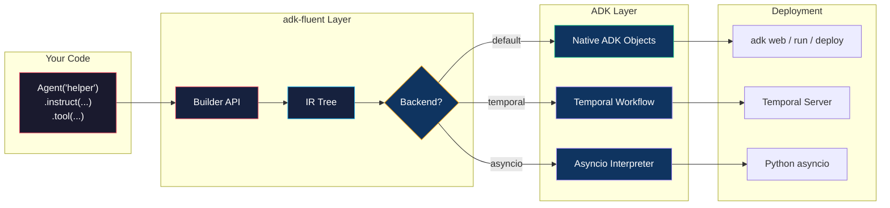
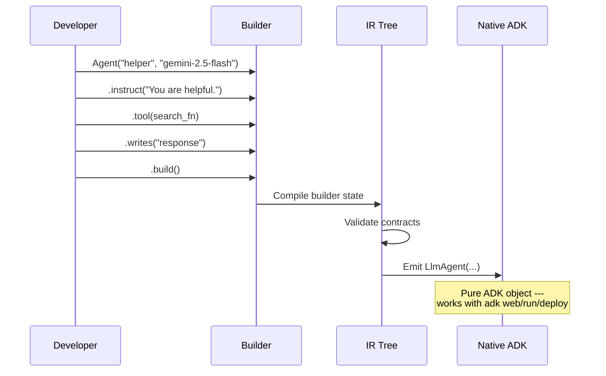
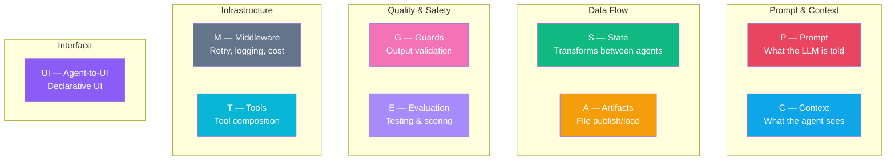
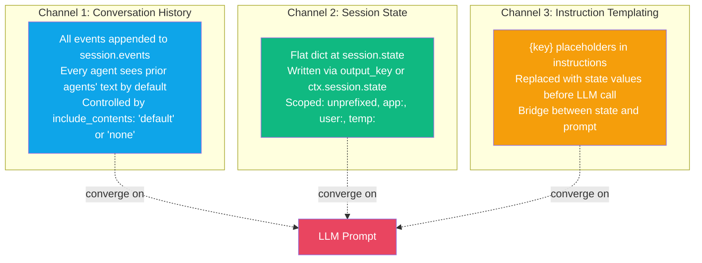
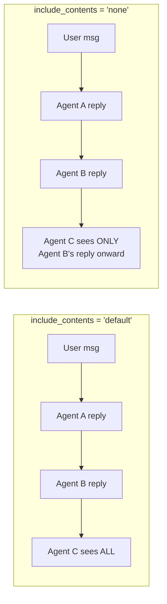
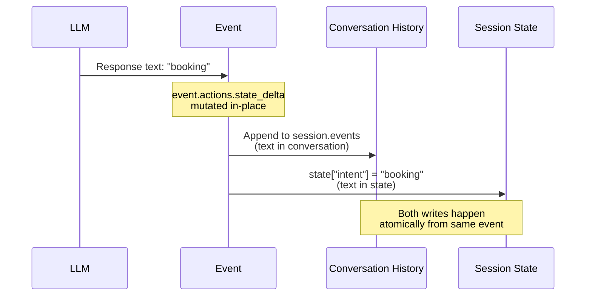
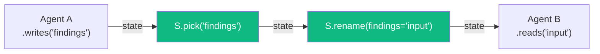
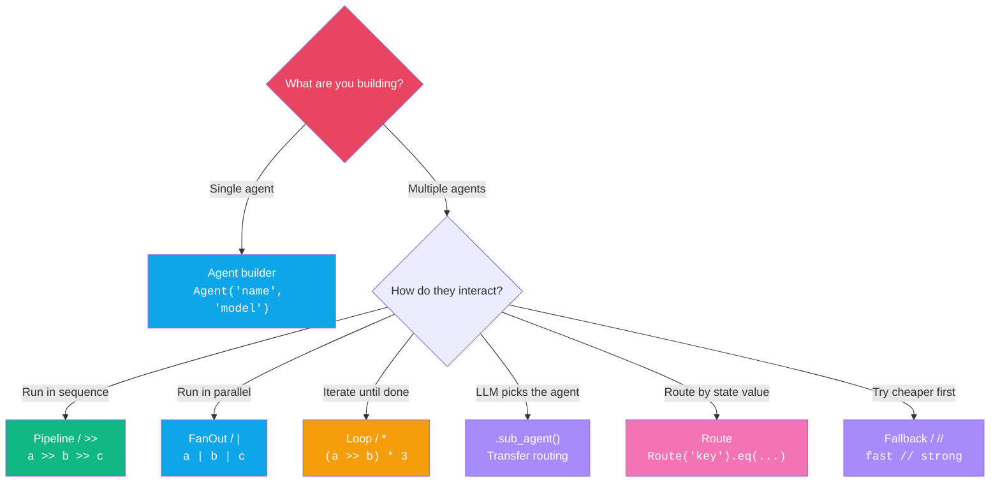
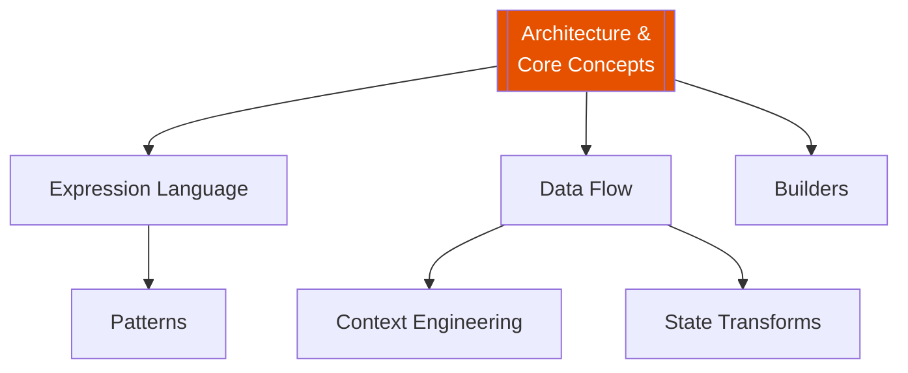

# Architecture & Core Concepts

:::{admonition} At a Glance
:class: tip

- **adk-fluent** is a thin builder layer on top of Google ADK --- every `.build()` returns a real ADK object
- Builders are typed configuration objects that compile to native ADK at build time
- Nine modules (S, C, P, A, M, T, E, G, UI) provide composable, orthogonal concerns
:::

## System Architecture

adk-fluent sits between your code and Google ADK. It adds zero runtime overhead --- builders exist only at definition time.



:::{tip}
**Mental model:** Think of builders as typed configuration objects that compile to ADK at `.build()` time. After `.build()`, adk-fluent is gone --- you have a pure ADK object.
:::

## Lifecycle of an Agent

Every agent follows the same path: configure with fluent methods, then compile to a native ADK object.



## adk-fluent Concepts vs ADK Concepts

Every adk-fluent concept maps directly to an ADK concept. Nothing is invented --- everything compiles down.

| adk-fluent | ADK Equivalent | Relationship |
|---|---|---|
| `Agent` builder | `LlmAgent` | 1:1 --- identical object after `.build()` |
| `Pipeline` / `>>` | `SequentialAgent` | Sequential execution |
| `FanOut` / `\|` | `ParallelAgent` | Concurrent execution |
| `Loop` / `*` | `LoopAgent` | Iterative execution |
| `.instruct()` | `instruction` kwarg | System prompt |
| `.writes()` | `output_key` kwarg | State storage |
| `.returns()` | `output_schema` kwarg | Structured output |
| `.tool()` | `tools` list | Tool registration |
| `.sub_agent()` | `sub_agents` list | Transfer targets |
| S transforms | `FnAgent` (zero-cost) | State dict manipulation |
| IR Tree | _(no equivalent)_ | adk-fluent's compile step |

## The Nine Modules

adk-fluent organizes capabilities into nine composable modules. Each controls one concern.



| Module | Import | Used With | Compose With |
|--------|--------|-----------|-------------|
| **S** — State | `from adk_fluent import S` | `>>` operator | `>>` (chain), `+` (combine) |
| **C** — Context | `from adk_fluent import C` | `.context()` | `+` (union), `\|` (pipe) |
| **P** — Prompt | `from adk_fluent import P` | `.instruct()` | `+` (union), `\|` (pipe) |
| **A** — Artifacts | `from adk_fluent import A` | `.artifacts()`, `>>` | `>>` (chain) |
| **M** — Middleware | `from adk_fluent import M` | `.middleware()` | `\|` (chain) |
| **T** — Tools | `from adk_fluent import T` | `.tools()` | `\|` (chain) |
| **E** — Evaluation | `from adk_fluent import E` | `.eval()` | builder pattern |
| **G** — Guards | `from adk_fluent import G` | `.guard()` | `\|` (chain) |
| **UI** — Agent-to-UI | `from adk_fluent import UI` | `.ui()` | `\|` (row), `>>` (column) |

---

## The Three Channels of ADK Communication

ADK has three independent mechanisms for agents to communicate. Every confusion about state traces back to not realizing they're three separate systems.



:::{warning}
These three channels are configured independently but deeply entangled at runtime. A single agent response flows through **all three** simultaneously --- it becomes a conversation event, may be stored in state, and state values may appear in downstream instructions. This duplication is the source of most multi-agent debugging confusion.
:::

### Example: How Channels Converge

```python
classifier = Agent("classify").instruct("Classify intent.").writes("intent")
booker = Agent("booker").instruct("Help book. The intent is: {intent}")

pipeline = classifier >> booker
```

When `classifier` produces `"booking"`:

| Channel | What Happens | Result |
|---------|-------------|--------|
| **1. History** | `"booking"` appended to `session.events` | `booker` sees it in conversation |
| **2. State** | `state["intent"] = "booking"` via `output_key` | Available for `{intent}` template |
| **3. Template** | `{intent}` in `booker`'s instruction replaced | Instruction becomes `"Help book. The intent is: booking"` |

The booker's LLM sees `"booking"` **twice**: once in conversation history, once in the instruction. This isn't a bug --- it's three channels converging. adk-fluent's context engineering (C module) helps you control this.

---

## What `include_contents` Actually Does

The binary switch that controls conversation history visibility:

| Value | Behavior | Use Case |
|-------|----------|----------|
| `"default"` | Full conversation history (filtered, rearranged) | Conversational agents |
| `"none"` | Current turn only (latest user/agent message forward) | Stateless utility agents |

:::{warning}
`include_contents="none"` was designed for stateless utility agents that get all context from state variables. In a pipeline, a downstream agent with `"none"` **loses the user's original message**. Use `.reads()` or `.context(C.from_state(...))` to inject exactly the state keys you need.
:::



There is no `"user_only"` or `"exclude_agents"` in native ADK. adk-fluent bridges this gap with the **C module**: `C.user_only()`, `C.from_agents()`, `C.window()`, and more. See [Context Engineering](context-engineering.md).

---

## What `output_key` Actually Does

:::{note}
`output_key` is a **duplication** mechanism, not a **routing** mechanism. It copies the LLM's text response into state under a named key. The original text still exists in conversation history.
:::



Downstream agents get the response through **both** channels. Use `.context(C.none())` or `.reads()` on downstream agents to suppress the conversation channel when you only want structured state data.

---

## The Five Orthogonal Data Flow Concerns

Every data-flow method in adk-fluent maps to exactly one of five concerns. They are fully independent of each other.

| Concern | Method | Controls | When |
|---------|--------|----------|------|
| **Context** | `.reads()`, `.context()` | What the agent SEES | Before LLM call |
| **Input** | `.accepts()` | Schema for tool-mode invocation | At tool-call time |
| **Output** | `.returns()`, `@ Schema` | Response shape (structured JSON) | During LLM call |
| **Storage** | `.writes()` | Where response is saved in state | After LLM call |
| **Contract** | `.produces()`, `.consumes()` | Static annotations for validation | Build time only |

```python
classifier = (
    Agent("classifier", "gemini-2.0-flash")
    .instruct("Classify the user query: {query}")
    .reads("query")              # CONTEXT: sees state["query"] only
    .accepts(SearchQuery)        # INPUT:   tool-mode validation
    .returns(Intent)             # OUTPUT:  structured JSON response
    .writes("intent")            # STORAGE: save to state["intent"]
    .produces(Intent)            # CONTRACT: static annotation
)
```

:::{seealso}
[Data Flow](data-flow.md) for detailed diagrams and examples of each concern.
:::

---

## What the S Module Does

The S module provides pure state transforms that compile to zero-cost `FnAgent` nodes --- no LLM calls, no events, just dict manipulation.



S transforms operate exclusively on **Channel 2** (session state). They don't touch conversation history or instruction templating. This makes them predictable and composable.

| Transform | Effect | Type |
|-----------|--------|------|
| `S.pick(*keys)` | Keep only named keys | Replacement |
| `S.drop(*keys)` | Remove named keys | Replacement |
| `S.rename(**mapping)` | Rename keys | Replacement |
| `S.merge(*keys, into=)` | Combine keys | Delta |
| `S.transform(key, fn)` | Apply function to value | Delta |
| `S.compute(**factories)` | Derive new keys | Delta |
| `S.set(**kv)` | Set explicit values | Delta |
| `S.default(**kv)` | Fill missing keys | Delta |
| `S.guard(pred, msg=)` | Assert state invariant | Inspection |
| `S.log(*keys)` | Debug print | Inspection |

:::{seealso}
[State Transforms](state-transforms.md) for visual before/after diagrams of each transform.
:::

---

## What adk-fluent Infers From Topology

The library doesn't just wrap ADK --- it performs three kinds of inference that native ADK requires you to do manually:

### 1. Data contract verification

When you write `.writes("intent")` upstream and `Route("intent")` downstream, the contract checker verifies at build time that the data flow is satisfiable. If you forget `.writes()`, it flags the issue before any LLM call.

### 2. Topology-aware context filtering

The C module provides fine-grained control that ADK's binary `include_contents` switch cannot:

```python
# Agent sees only the user's messages + last 3 turns
agent.context(C.user_only() + C.window(n=3))

# Agent sees only state keys, no conversation history
agent.reads("topic", "constraints")
```

### 3. Cross-channel coherence analysis

The contract checker warns about common pitfalls:

| Pitfall | What Happens | How to Fix |
|---------|-------------|------------|
| Agent B references `{intent}` but no upstream writes `"intent"` | Template resolves to empty string | Add `.writes("intent")` to upstream agent |
| Agent A has `.writes("intent")` but B has full history | B sees `"booking"` twice (state + conversation) | Add `.reads("intent")` to B |
| Agent A has no `.writes()` and B has `.context(C.none())` | A's output reaches B through neither channel | Add `.writes()` to A or change B's context |

---

## Native ADK vs adk-fluent

::::{tab-set}
:::{tab-item} Native ADK
```python
from google.adk.agents import LlmAgent, SequentialAgent
from google.adk.tools import FunctionTool

classifier = LlmAgent(
    name="classifier",
    model="gemini-2.5-flash",
    instruction="Classify the intent.",
    output_key="intent",
)

handler = LlmAgent(
    name="handler",
    model="gemini-2.5-flash",
    instruction="Handle the {intent} query.",
    include_contents="none",
)

pipeline = SequentialAgent(
    name="pipeline",
    sub_agents=[classifier, handler],
)
```
:::
:::{tab-item} adk-fluent
```python
from adk_fluent import Agent

pipeline = (
    Agent("classifier", "gemini-2.5-flash")
    .instruct("Classify the intent.")
    .writes("intent")
    >> Agent("handler", "gemini-2.5-flash")
    .instruct("Handle the {intent} query.")
    .reads("intent")
).build()
```
:::
::::

Both produce identical ADK objects. The fluent version is shorter, catches typos at definition time, and makes data flow explicit.

---

## When to Use What



---

## Common Mistakes

::::{grid} 1
:gutter: 3

:::{grid-item-card} Forgetting `.writes()` before a Route
:class-card: sd-border-danger

```python
# ❌ Wrong — Route reads state["intent"] but nobody writes it
classifier = Agent("classify").instruct("Classify.")
pipeline = classifier >> Route("intent").eq("booking", booker)
```

```python
# ✅ Correct — classifier writes to state
classifier = Agent("classify").instruct("Classify.").writes("intent")
pipeline = classifier >> Route("intent").eq("booking", booker)
```
:::

:::{grid-item-card} Using full history when you only need state
:class-card: sd-border-danger

```python
# ❌ Wrong — handler sees "booking" twice (history + template)
handler = Agent("handler").instruct("Handle {intent}.")
```

```python
# ✅ Correct — suppress history, use only state
handler = Agent("handler").instruct("Handle {intent}.").reads("intent")
```
:::

:::{grid-item-card} Calling `.build()` on sub-builders
:class-card: sd-border-danger

```python
# ❌ Wrong — don't build sub-builders manually
Pipeline("flow")
    .step(Agent("a").instruct("...").build())  # NO!
    .build()
```

```python
# ✅ Correct — let the parent auto-build children
Pipeline("flow")
    .step(Agent("a").instruct("..."))
    .build()
```
:::
::::

---

## Interplay With Other Concepts



| Concept | Relationship |
|---------|-------------|
| [Expression Language](expression-language.md) | Operators that compose builders into topologies |
| [Data Flow](data-flow.md) | The five concerns that control agent I/O |
| [Builders](builders.md) | The fluent API for configuring agents |
| [Context Engineering](context-engineering.md) | Fine-grained control over what agents see |
| [State Transforms](state-transforms.md) | Data manipulation between pipeline steps |
| [Patterns](patterns.md) | Higher-order constructors for common architectures |

---

## API Quick Reference

| Method | Purpose | Details |
|--------|---------|---------|
| `.model(str)` | Set LLM model | [Builders](builders.md) |
| `.instruct(str \| P)` | System prompt | [Prompts](prompts.md) |
| `.tool(fn)` | Add tool | [Builders](builders.md) |
| `.writes(key)` | Store output in state | [Data Flow](data-flow.md) |
| `.reads(*keys)` | Inject state keys | [Data Flow](data-flow.md) |
| `.returns(Schema)` | Structured output | [Structured Data](structured-data.md) |
| `.context(C)` | Context control | [Context Engineering](context-engineering.md) |
| `.sub_agent(agent)` | Transfer target | [Transfer Control](transfer-control.md) |
| `.build()` | Compile to ADK | [Builders](builders.md) |

---

:::{seealso}
- {doc}`expression-language` --- compose agents with operators
- {doc}`data-flow` --- the five orthogonal data flow concerns
- {doc}`builders` --- full builder method reference
- {doc}`../getting-started` --- 5-minute quickstart
- [ADK Documentation](https://google.github.io/adk-docs/) --- upstream Google ADK docs
:::
