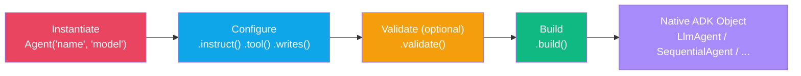
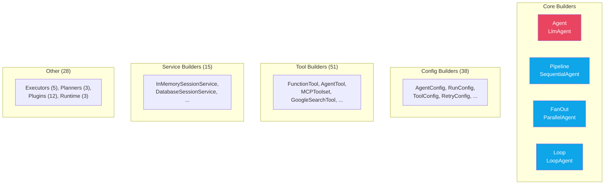

# Builders

:::{admonition} At a Glance
:class: tip

- Every builder turns fluent method calls into a native ADK object via `.build()`
- 132 builders across 9 modules, all with IDE autocomplete and typo detection
- Sub-builders in workflows auto-build --- don't call `.build()` on children
:::

## Builder vs Native ADK

::::{tab-set}
:::{tab-item} adk-fluent (6 lines)
```python
from adk_fluent import Agent

agent = (
    Agent("helper", "gemini-2.5-flash")
    .instruct("You are a helpful assistant.")
    .describe("A general-purpose helper")
    .writes("response")
    .tool(search_fn)
    .build()
)
```
:::
:::{tab-item} Native ADK (10 lines)
```python
from google.adk.agents import LlmAgent
from google.adk.tools import FunctionTool

agent = LlmAgent(
    name="helper",
    model="gemini-2.5-flash",
    instruction="You are a helpful assistant.",
    description="A general-purpose helper",
    output_key="response",
    tools=[FunctionTool(search_fn)],
)
```
:::
::::

Both produce the **exact same `LlmAgent`**. The builder catches typos at definition time, provides IDE autocomplete, and chains naturally.

---

## Builder Lifecycle



## Quick Start

```python
from adk_fluent import Agent

# Minimal agent --- name + model + instruction
agent = Agent("helper", "gemini-2.5-flash").instruct("You are helpful.").build()
```

---

## Constructor Arguments

Every builder takes a required `name` as the first positional argument. `Agent` accepts an optional `model` as second:

```python
# These are equivalent:
agent = Agent("helper", "gemini-2.5-flash")
agent = Agent("helper").model("gemini-2.5-flash")
```

## Method Chaining

Every configuration method returns `self`. Methods can be called in **any order**:

```python
agent = (
    Agent("helper", "gemini-2.5-flash")
    .instruct("You are a helpful assistant.")
    .describe("A general-purpose helper agent")
    .writes("response")
    .tool(search_fn)
    .build()
)
```

## `.build()` --- Compile to ADK

`.build()` resolves the builder into a native ADK object:

| Builder | ADK Object | Example |
|---------|-----------|---------|
| `Agent` | `LlmAgent` | `Agent("x").build()` |
| `Pipeline` | `SequentialAgent` | `Pipeline("p").step(...).build()` |
| `FanOut` | `ParallelAgent` | `FanOut("f").branch(...).build()` |
| `Loop` | `LoopAgent` | `Loop("l").step(...).build()` |

:::{warning}
Sub-builders passed to workflow builders are **auto-built**. Do NOT call `.build()` on individual steps:
```python
# ❌ Wrong
Pipeline("p").step(Agent("a").build()).build()

# ✅ Correct
Pipeline("p").step(Agent("a").instruct("...")).build()
```
:::

---

## Builder Taxonomy



| Module | Count | Key Builders |
|--------|-------|-------------|
| **agent** | 2 | `Agent`, `BaseAgent` |
| **workflow** | 3 | `Pipeline`, `FanOut`, `Loop` |
| **tool** | 51 | `FunctionTool`, `AgentTool`, `MCPToolset`, `GoogleSearchTool`, ... |
| **config** | 38 | `AgentConfig`, `RunConfig`, `ToolConfig`, `RetryConfig`, ... |
| **service** | 15 | `InMemorySessionService`, `DatabaseSessionService`, ... |
| **plugin** | 12 | `LoggingPlugin`, `DebugLoggingPlugin`, ... |
| **executor** | 5 | `BuiltInCodeExecutor`, `VertexAiCodeExecutor`, ... |
| **planner** | 3 | `BuiltInPlanner`, `PlanReActPlanner`, ... |
| **runtime** | 3 | `App`, `InMemoryRunner`, `Runner` |

---

## Typo Detection

Misspelled method names raise `AttributeError` with the closest match:

```python
agent = Agent("demo")
agent.instuction("oops")
# AttributeError: 'instuction' is not a recognized field.
#    Did you mean: 'instruction'?
```

## `__getattr__` Forwarding

Any ADK field without an explicit builder method can still be set through dynamic forwarding:

```python
agent = Agent("x").generate_content_config(my_config)  # Works via forwarding
```

---

## Introspection Methods

| Method | Purpose | Returns |
|--------|---------|---------|
| `.explain()` | Full builder state summary | Multi-line string |
| `.validate()` | Early error detection (chainable) | `self` |
| `.data_flow()` | Five-concern snapshot | Formatted string |
| `.llm_anatomy()` | What the LLM will see | Formatted string |
| `.inspect()` | Plain-text state | String |
| `.diagnose()` | Structured IR diagnosis | Dict |
| `.doctor()` | Formatted diagnostic report | String |
| `.to_ir()` | IR tree node | `AgentNode` / `SequenceNode` / ... |
| `.to_mermaid()` | Mermaid diagram | String |

### `.explain()` Example

```python
print(Agent("demo", "gemini-2.5-flash").instruct("Help.").writes("response").explain())
# Agent: demo
#   model: gemini-2.5-flash
#   instruction: Help.
#   writes: response
```

---

## Cloning and Variants

### `.clone(new_name)` --- Deep Copy

```python
base = Agent("base", "gemini-2.5-flash").instruct("Be helpful.")

math_agent = base.clone("math").instruct("Solve math.")   # Independent copy
code_agent = base.clone("code").instruct("Write code.")    # Independent copy
```

### `.with_(**overrides)` --- Immutable Variant

```python
base = Agent("base", "gemini-2.5-flash").instruct("Be helpful.")
creative = base.with_(name="creative", model="gemini-2.5-pro")
# base is unchanged
```

---

## Serialization

```python
# Serialize
data = agent.to_dict()
yaml_str = agent.to_yaml()   # requires adk-fluent[yaml]

# Reconstruct
agent = Agent.from_dict(data)
agent = Agent.from_yaml(yaml_str)
```

---

## Dependency Injection

`.inject()` registers resources injected into tool functions at call time. Injected parameters are **hidden from the LLM schema**:

```python
agent = (
    Agent("lookup")
    .tool(search_db)       # search_db(query: str, db: Database) -> str
    .inject(db=my_database)
)
# LLM sees: search_db(query: str) -> str
# At call time: db=my_database injected automatically
```

:::{tip}
Use `.inject()` for infrastructure dependencies (DB clients, API keys, config objects). Never expose these in the LLM tool schema.
:::

---

## Data Contracts

`.produces()` and `.consumes()` declare schemas for build-time validation:

```python
from pydantic import BaseModel

class Intent(BaseModel):
    category: str
    confidence: float

classifier = Agent("classifier").produces(Intent)
resolver = Agent("resolver").consumes(Intent)

pipeline = classifier >> resolver  # Contract checker verifies compatibility
```

---

## Workflow Builders

### Pipeline (Sequential)

```python
from adk_fluent import Pipeline, Agent

pipeline = (
    Pipeline("data_processing")
    .step(Agent("extractor", "gemini-2.5-flash").instruct("Extract entities.").writes("entities"))
    .step(Agent("enricher", "gemini-2.5-flash").instruct("Enrich {entities}."))
    .step(Agent("formatter", "gemini-2.5-flash").instruct("Format output."))
    .build()
)
```

### FanOut (Parallel)

```python
from adk_fluent import FanOut, Agent

fanout = (
    FanOut("research")
    .branch(Agent("web", "gemini-2.5-flash").instruct("Search web.").writes("web_results"))
    .branch(Agent("papers", "gemini-2.5-pro").instruct("Search papers.").writes("paper_results"))
    .build()
)
```

### Loop

```python
from adk_fluent import Loop, Agent

loop = (
    Loop("quality_loop")
    .step(Agent("writer", "gemini-2.5-flash").instruct("Write draft.").writes("quality"))
    .step(Agent("reviewer", "gemini-2.5-flash").instruct("Review and score."))
    .max_iterations(5)
    .until(lambda s: s.get("quality") == "good")
    .build()
)
```

### Workflow Builder Methods

| Builder | Key Methods | ADK Type |
|---------|-----------|----------|
| **Pipeline** | `.step(agent)` | `SequentialAgent` |
| **FanOut** | `.branch(agent)` | `ParallelAgent` |
| **Loop** | `.step(agent)`, `.max_iterations(n)`, `.until(pred)` | `LoopAgent` |

---

## Escape Hatches

When the fluent API doesn't expose an ADK feature:

### `.with_raw_config(**kwargs)` --- Declarative

```python
agent = (
    Agent("helper", "gemini-2.5-flash")
    .instruct("Help.")
    .with_raw_config(disallow_transfer_to_parent=True)
    .build()
)
```

### `.native(fn)` --- Programmatic

```python
def customize(adk_agent):
    if len(adk_agent.sub_agents) > 3:
        adk_agent.disallow_transfer_to_peers = True

agent = Agent("router").native(customize).build()
```

| Approach | Best For |
|----------|---------|
| `.with_raw_config()` | Setting known fields to fixed values |
| `.native(fn)` | Conditional logic, complex mutations |

---

## Combining Builder and Operator Styles

Builders and operators mix freely:

```python
from adk_fluent import Agent, FanOut, S, until

# Complex agents with full builder configuration
researcher = (
    Agent("researcher", "gemini-2.5-flash")
    .instruct("Find relevant information.")
    .tool(search_tool)
    .writes("findings")
)

writer = Agent("writer", "gemini-2.5-pro").instruct("Write about {findings}.").writes("draft")
reviewer = Agent("reviewer", "gemini-2.5-flash").instruct("Score 1-10.").writes("score")

# Compose with operators
pipeline = (
    (researcher.clone("web").tool(web_search) | researcher.clone("papers").tool(paper_search))
    >> S.merge("web", "papers", into="findings")
    >> writer
    >> (reviewer >> writer) * until(lambda s: int(s.get("score", 0)) >= 8, max=3)
)
```

---

## Common Mistakes

::::{grid} 1
:gutter: 3

:::{grid-item-card} Confusing `.instruct()` with `.describe()`
:class-card: sd-border-danger

```python
# ❌ .describe() is metadata for routing, NOT sent to the LLM
agent = Agent("helper").describe("You are a helpful assistant.")
```

```python
# ✅ .instruct() sets the system prompt (what the LLM sees)
agent = Agent("helper").instruct("You are a helpful assistant.")
# .describe() is for transfer routing metadata
agent = Agent("helper").instruct("Help users.").describe("General-purpose helper")
```
:::

:::{grid-item-card} Missing `.build()` when using outside a workflow
:class-card: sd-border-danger

```python
# ❌ Passing a builder where ADK expects an agent
runner.run(Agent("helper").instruct("Help."))  # Error!
```

```python
# ✅ Call .build() to get the native ADK object
runner.run(Agent("helper").instruct("Help.").build())
```
:::
::::

---

## Interplay With Other Concepts

| Combines With | To Achieve | Example |
|--------------|-----------|---------|
| [Expression Language](expression-language.md) | Compose into workflows | `Agent("a") >> Agent("b")` |
| [Data Flow](data-flow.md) | Explicit I/O contracts | `.writes("k")`, `.reads("k")` |
| [Presets](presets.md) | Reuse configuration bundles | `.use(production_preset)` |
| [Callbacks](callbacks.md) | Lifecycle hooks | `.before_model(fn)` |
| [Middleware](middleware.md) | Cross-cutting concerns | `.middleware(M.retry())` |

---

:::{seealso}
- {doc}`expression-language` --- compose builders with operators
- {doc}`data-flow` --- the five data flow concerns
- {doc}`presets` --- reusable configuration bundles
- {doc}`../generated/api/index` --- full API reference for all 132 builders
:::
