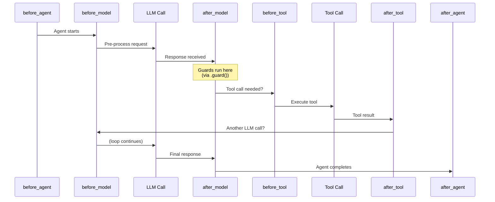
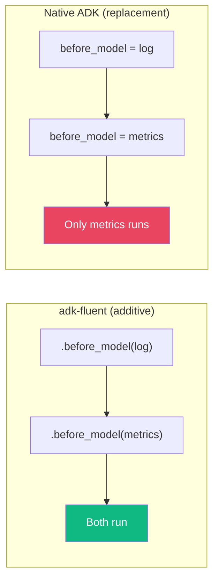
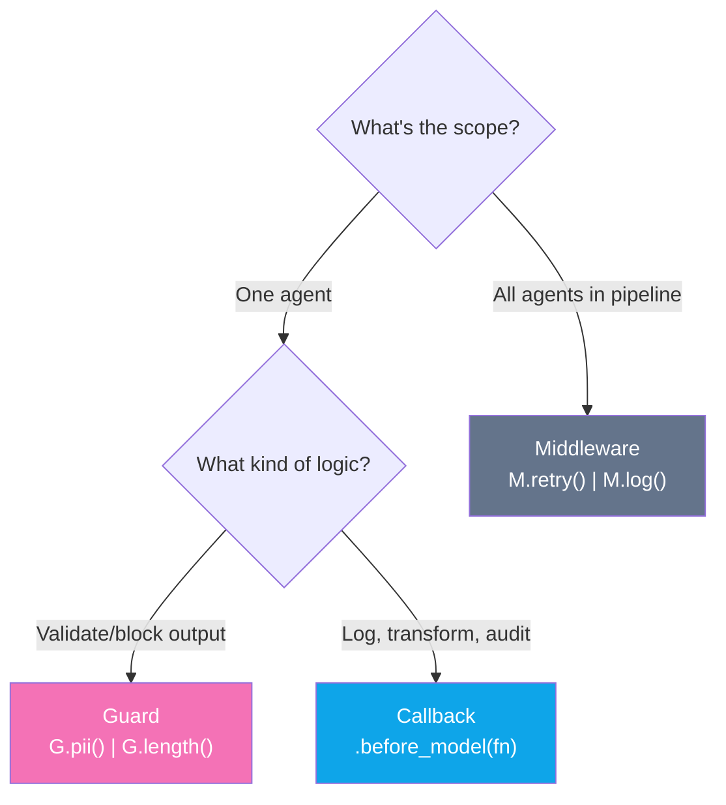
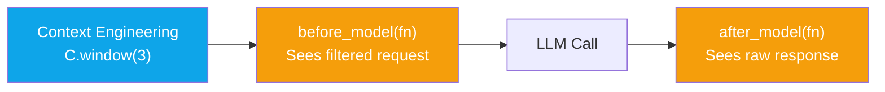

# Callbacks

:::{admonition} At a Glance
:class: tip

- Eight callback methods for hooking into the agent lifecycle (before/after model, agent, tool + error handlers)
- All callback methods are **additive** --- multiple calls accumulate handlers, never replace
- Use callbacks for per-agent behavior; use middleware for pipeline-wide concerns
:::

## Callback Execution Order



---

## All Eight Callback Methods

| Method | ADK Field | Timing | Receives |
|--------|----------|--------|----------|
| `.before_agent(fn)` | `before_agent_callback` | Before agent execution | `(callback_context,)` |
| `.after_agent(fn)` | `after_agent_callback` | After agent execution | `(callback_context,)` |
| `.before_model(fn)` | `before_model_callback` | Before each LLM call | `(callback_context, llm_request)` |
| `.after_model(fn)` | `after_model_callback` | After each LLM call | `(callback_context, llm_response)` |
| `.before_tool(fn)` | `before_tool_callback` | Before each tool call | `(callback_context, tool_call)` |
| `.after_tool(fn)` | `after_tool_callback` | After each tool call | `(callback_context, tool_result)` |
| `.on_model_error(fn)` | `on_model_error_callback` | On LLM failure | `(callback_context, error)` |
| `.on_tool_error(fn)` | `on_tool_error_callback` | On tool failure | `(callback_context, error)` |

---

## Quick Start

```python
from adk_fluent import Agent

def log_request(ctx, req):
    print(f"[LOG] LLM request for {ctx.agent_name}")

agent = (
    Agent("helper", "gemini-2.5-flash")
    .instruct("Help the user.")
    .before_model(log_request)
    .build()
)
```

---

## Additive Semantics

Each call **appends** to the handler list. This differs from native ADK where setting a callback replaces the previous one:



```python
# Both handlers run before every LLM call
agent = (
    Agent("service", "gemini-2.5-flash")
    .instruct("Handle requests.")
    .before_model(log_fn)       # Handler 1
    .before_model(metrics_fn)   # Handler 2 (stacks, doesn't replace)
    .build()
)
```

---

## Conditional Callbacks

Append only when a condition is true:

```python
debug_mode = True
audit_enabled = False

agent = (
    Agent("service", "gemini-2.5-flash")
    .instruct("Handle requests.")
    .before_model_if(debug_mode, log_fn)      # Added (debug_mode is True)
    .after_model_if(audit_enabled, audit_fn)   # Skipped (audit_enabled is False)
    .build()
)
```

---

## Guards as Callbacks

`.guard(fn)` registers a function as an `after_model` callback for output validation. The G module provides structured, composable guards:

```python
from adk_fluent import Agent, G

# G module: declarative, composable
agent = Agent("safe").guard(G.pii("redact") | G.length(max=500))

# Raw callback: custom validation logic
agent = Agent("custom").after_model(my_validation_fn)
```

:::{seealso}
{doc}`guards` for the full G module reference.
:::

---

## Error Handling

```python
def handle_model_error(ctx, error):
    print(f"Model error: {error}")
    # Optionally return a fallback response

def handle_tool_error(ctx, error):
    print(f"Tool error: {error}")

agent = (
    Agent("service", "gemini-2.5-flash")
    .on_model_error(handle_model_error)
    .on_tool_error(handle_tool_error)
    .build()
)
```

---

## Full Example: Production Agent

```python
from adk_fluent import Agent

def log_request(ctx, req):
    print(f"[LOG] Model request at {ctx.agent_name}")

def log_response(ctx, resp):
    print(f"[LOG] Model response at {ctx.agent_name}")

def validate_output(ctx, resp):
    if not resp:
        raise ValueError("Empty response")

def audit_tool(ctx, result):
    print(f"[AUDIT] Tool result: {result}")

agent = (
    Agent("production_agent", "gemini-2.5-flash")
    .instruct("You are a production service.")
    .before_model(log_request)              # Logging
    .after_model(log_response)              # Logging
    .after_model(validate_output)           # Validation (stacks with above)
    .before_tool(lambda ctx, tool: print(f"Calling: {tool}"))
    .after_tool(audit_tool)                 # Audit
    .on_model_error(lambda ctx, e: print(f"Error: {e}"))
    .build()
)
```

---

## Callbacks vs Middleware vs Guards



| Aspect | Callbacks | Middleware | Guards |
|--------|-----------|-----------|--------|
| **Scope** | Single agent | Entire pipeline | Single agent (output) |
| **Attachment** | `.before_model(fn)` | `.middleware(mw)` | `.guard(G.xxx())` |
| **Purpose** | Logging, transforms, audit | Retry, cost tracking, circuit breaker | Safety, validation, PII |
| **Multiplicity** | Multiple per agent | Stack on pipeline | Chain with `\|` |
| **Compilation** | Stored on IR node | Stored in ExecutionConfig | Compiles to `after_model` |

---

## Reusable Callback Bundles with Presets

Bundle callbacks into reusable Presets to avoid repetition:

```python
from adk_fluent.presets import Preset

observability = Preset(before_model=log_fn, after_model=metrics_fn)
security = Preset(before_model=safety_check, after_model=audit_fn)

# Apply to multiple agents
agent_a = Agent("a").use(observability).use(security)
agent_b = Agent("b").use(observability).use(security)
```

:::{seealso}
{doc}`presets` for reusable configuration bundles.
:::

---

## Callback Timing With Context Engineering

Callbacks run **after** context engineering. The LLM request that `before_model` receives already has context filtering applied:



---

## Common Mistakes

::::{grid} 1
:gutter: 3

:::{grid-item-card} Using callbacks for pipeline-wide concerns
:class-card: sd-border-danger

```python
# ❌ Repeating the same callback on every agent
agent_a = Agent("a").before_model(log_fn)
agent_b = Agent("b").before_model(log_fn)
agent_c = Agent("c").before_model(log_fn)
```

```python
# ✅ Use middleware for pipeline-wide concerns
pipeline = (Agent("a") >> Agent("b") >> Agent("c")).middleware(M.log())
```
:::

:::{grid-item-card} Side effects in callbacks
:class-card: sd-border-danger

```python
# ❌ Heavy side effects make testing hard
def before_model(ctx, req):
    db.insert(req)                 # DB write in callback
    external_api.notify(req)       # API call in callback
```

```python
# ✅ Keep callbacks light: log, validate, transform
def before_model(ctx, req):
    logger.info(f"Request: {req}")  # Log only
```
:::
::::

---

## Interplay With Other Concepts

| Combines With | To Achieve | Example |
|--------------|-----------|---------|
| [Guards](guards.md) | Structured output validation | `.guard(G.pii() \| G.length(max=500))` |
| [Middleware](middleware.md) | Pipeline-wide concerns | `.middleware(M.retry() \| M.log())` |
| [Presets](presets.md) | Reusable callback bundles | `.use(observability_preset)` |
| [Context Engineering](context-engineering.md) | Context runs before callbacks | `.context(C.none()).before_model(fn)` |
| [Testing](testing.md) | Verify callbacks in IR | `assert ir.before_model_callbacks` |

---

## Best Practices

1. **Callbacks for per-agent behavior.** Logging one agent? Callback. Logging all? Middleware.
2. **Use additive semantics intentionally.** Multiple `.before_model()` calls stack.
3. **Use `.guard()` for safety.** Guards are semantically clearer than raw `after_model` callbacks.
4. **Use Presets for shared callbacks.** Don't repeat `.before_model().after_model()` on 10 agents.
5. **Keep callbacks pure.** Log, validate, or transform --- don't orchestrate.

---

:::{seealso}
- {doc}`middleware` --- pipeline-wide cross-cutting concerns
- {doc}`presets` --- reusable callback bundles
- {doc}`guards` --- structured safety with the G module
- {doc}`testing` --- verifying callbacks are attached correctly
:::
