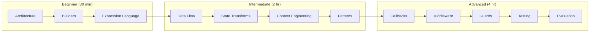

# Concept Map

:::{admonition} At a Glance
:class: tip

- Single-page visual map of ALL adk-fluent concepts and how they relate
- Start anywhere --- follow arrows to discover related concepts
- Every box links to its dedicated documentation page
:::

## The Full Picture

```mermaid
graph TB
    %% Core
    AGENT[["Agent Builder<br/><i>The starting point</i>"]]
    BUILD[".build()<br/>Compile to ADK"]

    %% Composition
    EXPR["Expression Language<br/>>>, |, *, @, //"]
    PIPE["Pipeline >>"]
    FAN["FanOut |"]
    LOOP["Loop *"]
    ROUTE["Route(key)"]
    FALL["Fallback //"]

    %% Data Flow
    DATA["Data Flow<br/>5 orthogonal concerns"]
    WRITES[".writes(key)"]
    READS[".reads(*keys)"]
    RETURNS[".returns(Schema)"]
    ACCEPTS[".accepts(Schema)"]

    %% Modules
    S_MOD["S — State Transforms<br/>S.pick, S.merge, S.rename"]
    C_MOD["C — Context Engineering<br/>C.none, C.window, C.from_state"]
    P_MOD["P — Prompt Composition<br/>P.role, P.task, P.constraint"]
    T_MOD["T — Tool Composition<br/>T.fn, T.agent, T.mcp"]
    M_MOD["M — Middleware<br/>M.retry, M.log, M.cost"]
    G_MOD["G — Guards<br/>G.pii, G.length, G.schema"]
    E_MOD["E — Evaluation<br/>E.case, EvalSuite"]
    A_MOD["A — Artifacts<br/>A.publish, A.snapshot"]
    UI_MOD["UI — Agent-to-UI<br/>UI.text, UI.button"]

    %% Quality
    CALLBACKS["Callbacks<br/>before/after model/agent/tool"]
    PRESETS["Presets<br/>Reusable config bundles"]
    TESTING["Testing<br/>contracts, mocks, harness"]

    %% Patterns
    PATTERNS["Composition Patterns<br/>review_loop, cascade, map_reduce"]

    %% Infrastructure
    IR["IR Tree<br/>Intermediate Representation"]
    BACKENDS["Execution Backends<br/>ADK, Temporal, asyncio"]
    MEMORY["Memory<br/>Persistent state"]
    TRANSFER["Transfer Control<br/>sub_agent, isolate, stay"]

    %% Advanced
    A2A["A2A<br/>Remote agents"]
    A2UI["A2UI<br/>Declarative UI"]
    SKILLS["Skills<br/>Composable packages"]

    %% Connections
    AGENT --> BUILD
    AGENT --> EXPR
    AGENT --> DATA
    AGENT --> CALLBACKS
    AGENT --> PRESETS

    EXPR --> PIPE
    EXPR --> FAN
    EXPR --> LOOP
    EXPR --> ROUTE
    EXPR --> FALL
    EXPR --> PATTERNS

    DATA --> WRITES
    DATA --> READS
    DATA --> RETURNS
    DATA --> ACCEPTS

    READS --> C_MOD
    WRITES --> S_MOD
    AGENT --> P_MOD
    AGENT --> T_MOD
    AGENT --> G_MOD

    CALLBACKS --> M_MOD
    TESTING --> E_MOD
    AGENT --> A_MOD

    BUILD --> IR
    IR --> BACKENDS
    AGENT --> MEMORY
    AGENT --> TRANSFER

    TRANSFER --> A2A
    AGENT --> A2UI
    AGENT --> SKILLS
    UI_MOD --> A2UI

    %% Styling
    style AGENT fill:#e65100,color:#fff
    style EXPR fill:#e94560,color:#fff
    style DATA fill:#0ea5e9,color:#fff
    style S_MOD fill:#10b981,color:#fff
    style C_MOD fill:#0ea5e9,color:#fff
    style P_MOD fill:#e94560,color:#fff
    style T_MOD fill:#06b6d4,color:#fff
    style M_MOD fill:#64748b,color:#fff
    style G_MOD fill:#f472b6,color:#fff
    style E_MOD fill:#a78bfa,color:#fff
    style A_MOD fill:#f59e0b,color:#fff
    style UI_MOD fill:#8b5cf6,color:#fff
    style PATTERNS fill:#e94560,color:#fff
    style CALLBACKS fill:#f59e0b,color:#fff
    style IR fill:#64748b,color:#fff
    style BACKENDS fill:#64748b,color:#fff
```

---

## Concept Directory

### Foundations

| Concept | Page | One-line summary |
|---------|------|-----------------|
| Architecture | {doc}`architecture-and-concepts` | How builders wrap ADK, the three channels |
| Expression Language | {doc}`expression-language` | Nine operators for composing agent topologies |
| Builders | {doc}`builders` | Fluent API for configuring agents |
| Data Flow | {doc}`data-flow` | Five orthogonal concerns: context, input, output, storage, contract |

### Composition & Data

| Concept | Page | One-line summary |
|---------|------|-----------------|
| Patterns | {doc}`patterns` | Higher-order constructors (review_loop, cascade, ...) |
| State Transforms | {doc}`state-transforms` | S module: manipulate state between agents |
| Context Engineering | {doc}`context-engineering` | C module: control what agents see |
| Prompts | {doc}`prompts` | P module: structured prompt composition |

### Quality & Lifecycle

| Concept | Page | One-line summary |
|---------|------|-----------------|
| Callbacks | {doc}`callbacks` | Lifecycle hooks (before/after model, agent, tool) |
| Guards | {doc}`guards` | G module: output validation (PII, length, schema) |
| Middleware | {doc}`middleware` | M module: pipeline-wide retry, logging, cost tracking |
| Testing | {doc}`testing` | Contract checks, mocks, evaluation |
| Evaluation | {doc}`evaluation` | E module: quality scoring and regression testing |

### Infrastructure

| Concept | Page | One-line summary |
|---------|------|-----------------|
| Presets | {doc}`presets` | Reusable configuration bundles |
| Transfer Control | {doc}`transfer-control` | Sub-agents, isolation, transfer routing |
| Memory | {doc}`memory` | Persistent state across sessions |
| IR & Backends | {doc}`ir-and-backends` | Intermediate representation and compilation |
| Execution Backends | {doc}`execution-backends` | ADK vs Temporal vs asyncio |
| Visibility | {doc}`visibility` | Topology visibility control |

### Advanced

| Concept | Page | One-line summary |
|---------|------|-----------------|
| A2A | {doc}`a2a` | Remote agent-to-agent communication |
| A2UI | {doc}`a2ui` | Declarative UI composition |
| Skills | {doc}`skills` | Composable agent packages |
| Structured Data | {doc}`structured-data` | Schema validation and contracts |

---

## Learning Paths

---

:::{seealso}
- {doc}`../getting-started` --- 5-minute quickstart
- {doc}`cheat-sheet` --- one-page API quick reference
- {doc}`glossary` --- term definitions
:::
