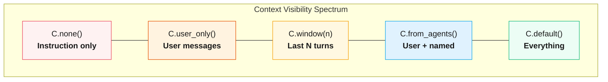

# Context Engineering

`C` factories return frozen descriptors that control what conversation history and state each agent sees. They compose with `+` (union) and `|` (pipe) and are passed to `Agent.context()`.

:::{tip}
**Visual learner?** Open the [P·C·S Visual Reference](../pcs-visual-reference.html){target="_blank"} for interactive diagrams showing how Prompt, Context, and State modules compose to assemble what the LLM sees.
:::



| Factory | LLM sees | Effect |
|---|---|---|
| `C.none()` | Instruction only | No history, no state injection |
| `C.user_only()` | User messages | User turns only, no agent outputs |
| `C.window(n)` | Last N turns | Recent history slice |
| `C.from_state(*keys)` | State keys | Named keys injected into prompt |
| `C.from_agents(*names)` | User + named agents | Selective agent outputs |
| `C.template(str)` | Rendered string | Template filled from state values |
| `C.default()` | Everything | All history + all state (pass-through) |

**Composition operators:**

::::{tab-set}
:::{tab-item} Python
:sync: python

```python
C.window(3) + C.from_state("topic")    # union: both applied
C.window(5) | C.template("{history}")   # pipe: output → input
```
:::
:::{tab-item} TypeScript
:sync: ts

```ts
C.window(3).add(C.fromState("topic"));    // union: both applied
C.window(5).pipe(C.template("{history}")); // pipe: output → input
```
:::
::::

:::{note} TypeScript naming
TypeScript uses camelCase: `C.fromState`, `C.userOnly`, `C.fromAgents`, `C.excludeAgents`. The `+` operator from Python becomes `.add()` and `|` becomes `.pipe()`.
:::

## Quick Start

::::{tab-set}
:::{tab-item} Python
:sync: python

```python
from adk_fluent import Agent, C

# Suppress all conversation history
clean_agent = Agent("processor").context(C.none()).instruct("Process input.").build()

# Only see last 3 turn-pairs + state keys
focused_agent = (
    Agent("analyst")
    .context(C.window(n=3) + C.from_state("topic"))
    .instruct("Analyze {topic}.")
    .build()
)
```
:::
:::{tab-item} TypeScript
:sync: ts

```ts
import { Agent, C } from "adk-fluent-ts";

// Suppress all conversation history
const cleanAgent = new Agent("processor", "gemini-2.5-flash")
  .context(C.none())
  .instruct("Process input.")
  .build();

// Only see last 3 turn-pairs + state keys
const focusedAgent = new Agent("analyst", "gemini-2.5-flash")
  .context(C.window(3).add(C.fromState("topic")))
  .instruct("Analyze {topic}.")
  .build();
```
:::
::::

## Which `C.*` do I want?

Pick the **first** branch that matches. Most agents only need one.

```{mermaid}
flowchart TD
    start[What does the agent need to see?] --> q1{Is this a utility /<br/>classifier /<br/>pure function?}
    q1 -->|yes| none[C.none<br/>instruction only]
    q1 -->|no| q2{Does it need specific<br/>state keys, not history?}
    q2 -->|yes| state[C.from_state k1, k2<br/>or .reads k1, k2<br/>same + no history]
    q2 -->|no| q3{Only the user's turns,<br/>not other agents?}
    q3 -->|yes| user[C.user_only]
    q3 -->|no| q4{Long session —<br/>only recent turns matter?}
    q4 -->|yes| win[C.window n=5]
    q4 -->|no| q5{Need output from<br/>specific sibling agents?}
    q5 -->|yes| agents[C.from_agents writer<br/>or C.exclude_agents researcher]
    q5 -->|no| def[leave blank<br/>C.default]

    classDef q fill:#e3f2fd,stroke:#1565c0,color:#0d47a1
    classDef a fill:#fff3e0,stroke:#e65100,color:#bf360c
    class start,q1,q2,q3,q4,q5 q
    class none,state,user,win,agents,def a
```

| I want… | Use | Suppresses history? |
|---|---|---|
| Instruction only, zero history | `C.none()` | yes |
| State keys only, no history | `.reads("k")` *or* `C.none() + C.from_state("k")` | yes |
| State keys + history (pass-through) | `C.from_state("k")` | no |
| Last N turns | `C.window(n=5)` | yes |
| User turns only | `C.user_only()` | yes |
| Specific siblings' output | `C.from_agents("writer")` | yes |
| Drop one noisy agent | `C.exclude_agents("researcher")` | no |
| Default behaviour | omit `.context()` | no |

:::{tip} `.reads()` is the shortcut
`.reads("topic", "style")` is equivalent to `.context(C.none() + C.from_state("topic", "style"))`. Reach for it whenever a pipeline step only needs named state and shouldn't be polluted by prior turns.
:::

## The Problem

In multi-agent pipelines, every agent shares the same conversation session. Without context engineering, each agent sees the full history -- including irrelevant turns, other agents' internal reasoning, and tool-call noise. This wastes token budget and degrades output quality.

Context engineering solves three problems:

1. **Token budgets.** LLMs have finite context windows. Passing the full history to every agent burns tokens on content that does not help the current task.
1. **Irrelevant history.** A classifier agent does not need to see the drafts produced by a writer agent three steps earlier. Passing them in adds noise.
1. **Leaked reasoning.** When agents see each other's chain-of-thought, they anchor on prior conclusions instead of reasoning independently.

`C` primitives let you declare exactly what each agent should see -- and nothing more.

## Primitives Reference

| Factory                    | Purpose                             |
| -------------------------- | ----------------------------------- |
| `C.none()`                 | Suppress all conversation history   |
| `C.default()`              | Keep default history (pass-through) |
| `C.user_only()`            | Include only user messages          |
| `C.from_state(*keys)`      | Inject state keys into instruction  |
| `C.from_agents(*names)`    | Include user + named agent outputs  |
| `C.exclude_agents(*names)` | Exclude named agent outputs         |
| `C.window(n=)`             | Last N turn-pairs only              |
| `C.template(str)`          | Render template from state          |
| `S.capture(key)`           | Capture user message to state       |
| `C.budget(max_tokens=)`    | Token budget constraint             |
| `C.priority(tier=)`        | Priority tier for ordering          |

## `C.none()`

Suppress all conversation history. The agent sees only its instruction:

::::{tab-set}
:::{tab-item} Python
:sync: python

```python
agent = Agent("classifier").context(C.none()).instruct("Classify the input.").build()
```
:::
:::{tab-item} TypeScript
:sync: ts

```ts
const agent = new Agent("classifier", "gemini-2.5-flash")
  .context(C.none())
  .instruct("Classify the input.")
  .build();
```
:::
::::

## `C.default()`

Keep the default conversation history. This is the pass-through -- equivalent to not calling `.context()` at all:

::::{tab-set}
:::{tab-item} Python
:sync: python

```python
agent = Agent("assistant").context(C.default()).instruct("Help the user.").build()
```
:::
:::{tab-item} TypeScript
:sync: ts

```ts
// In TypeScript, `default` is reserved — use `default_()`.
const agent = new Agent("assistant", "gemini-2.5-flash")
  .context(C.default_())
  .instruct("Help the user.")
  .build();
```
:::
::::

## `C.userOnly()` / `C.user_only()`

Include only user messages, filtering out all agent and tool responses:

::::{tab-set}
:::{tab-item} Python
:sync: python

```python
# The reviewer sees what the user said, not what other agents produced
agent = Agent("reviewer").context(C.user_only()).instruct("Review the request.").build()
```
:::
:::{tab-item} TypeScript
:sync: ts

```ts
const agent = new Agent("reviewer", "gemini-2.5-flash")
  .context(C.userOnly())
  .instruct("Review the request.")
  .build();
```
:::
::::

## `C.fromState()` / `C.from_state()`

Read named keys from session state and inject them as context. This is a **pure data-injection transform** — it injects state values without suppressing conversation history:

::::{tab-set}
:::{tab-item} Python
:sync: python

```python
# Inject state AND keep conversation history
agent = (
    Agent("writer")
    .context(C.from_state("topic", "style"))
    .instruct("Write about {topic} in {style} style.")
    .build()
)

# Inject state, suppress history (common pipeline pattern)
agent = (
    Agent("writer")
    .context(C.none() + C.from_state("topic", "style"))
    .instruct("Write about {topic} in {style} style.")
    .build()
)

# Or use .reads() which suppresses history by default
agent = Agent("writer").reads("topic", "style").instruct("Write about {topic} in {style} style.").build()
```
:::
:::{tab-item} TypeScript
:sync: ts

```ts
// Inject state AND keep conversation history
const a = new Agent("writer", "gemini-2.5-flash")
  .context(C.fromState("topic", "style"))
  .instruct("Write about {topic} in {style} style.")
  .build();

// Inject state, suppress history (common pipeline pattern)
const b = new Agent("writer", "gemini-2.5-flash")
  .context(C.none().add(C.fromState("topic", "style")))
  .instruct("Write about {topic} in {style} style.")
  .build();

// Or use .reads() which suppresses history by default
const c = new Agent("writer", "gemini-2.5-flash")
  .reads("topic", "style")
  .instruct("Write about {topic} in {style} style.")
  .build();
```
:::
::::

## `C.fromAgents()` / `C.from_agents()`

Include user messages plus outputs from specific named agents. All other agent outputs are excluded:

::::{tab-set}
:::{tab-item} Python
:sync: python

```python
# The editor sees only what the user said and what "writer" produced
agent = (
    Agent("editor")
    .context(C.from_agents("writer"))
    .instruct("Edit the draft for clarity.")
    .build()
)
```
:::
:::{tab-item} TypeScript
:sync: ts

```ts
const agent = new Agent("editor", "gemini-2.5-flash")
  .context(C.fromAgents("writer"))
  .instruct("Edit the draft for clarity.")
  .build();
```
:::
::::

## `C.excludeAgents()` / `C.exclude_agents()`

Include everything except outputs from the named agents:

::::{tab-set}
:::{tab-item} Python
:sync: python

```python
# The summarizer sees the full history but ignores the verbose "researcher" output
agent = (
    Agent("summarizer")
    .context(C.exclude_agents("researcher"))
    .instruct("Summarize the conversation.")
    .build()
)
```
:::
:::{tab-item} TypeScript
:sync: ts

```ts
const agent = new Agent("summarizer", "gemini-2.5-flash")
  .context(C.excludeAgents("researcher"))
  .instruct("Summarize the conversation.")
  .build();
```
:::
::::

## `C.window(n)`

Include only the last N turn-pairs (user message + model response). Useful for long-running conversations where only recent context matters:

::::{tab-set}
:::{tab-item} Python
:sync: python

```python
# Only see the last 3 exchanges
agent = Agent("responder").context(C.window(n=3)).instruct("Continue the conversation.").build()
```
:::
:::{tab-item} TypeScript
:sync: ts

```ts
const agent = new Agent("responder", "gemini-2.5-flash")
  .context(C.window(3))
  .instruct("Continue the conversation.")
  .build();
```
:::
::::

## `C.template(str)`

Render a template string using state values. Supports `{key}` (required) and `{key?}` (optional, replaced with empty string if missing):

::::{tab-set}
:::{tab-item} Python
:sync: python

```python
agent = (
    Agent("reporter")
    .context(C.template("Topic: {topic}\nNotes: {notes?}"))
    .instruct("Write a report from the context above.")
    .build()
)
```
:::
:::{tab-item} TypeScript
:sync: ts

```ts
const agent = new Agent("reporter", "gemini-2.5-flash")
  .context(C.template("Topic: {topic}\nNotes: {notes?}"))
  .instruct("Write a report from the context above.")
  .build();
```
:::
::::

## `S.capture(key)`

Capture the most recent user message into a state key. Used as a pipeline step, not inside `.context()`:

::::{tab-set}
:::{tab-item} Python
:sync: python

```python
from adk_fluent import Agent, C, S

pipeline = (
    S.capture("user_message")
    >> Agent("handler")
        .context(C.from_state("user_message"))
        .instruct("Respond to: {user_message}")
)
```
:::
:::{tab-item} TypeScript
:sync: ts

```ts
import { Agent, C, S } from "adk-fluent-ts";

const pipeline = S.capture("user_message").then(
  new Agent("handler", "gemini-2.5-flash")
    .context(C.fromState("user_message"))
    .instruct("Respond to: {user_message}"),
);
```
:::
::::

## `C.budget(max_tokens=)`

Declare a token budget constraint on the context. Defaults to 8000 tokens with `truncate_oldest` overflow:

```python
agent = (
    Agent("analyst")
    .context(C.budget(max_tokens=4000))
    .instruct("Analyze the data.")
    .build()
)
```

## `C.priority(tier=)`

Set a priority tier for context ordering. Lower tier values mean higher priority:

```python
agent = (
    Agent("critical")
    .context(C.priority(tier=1))
    .instruct("Handle urgent requests.")
    .build()
)
```

## Composition

Primitives compose with two operators:

**Union** combines transforms. Both are applied to produce the final context:

::::{tab-set}
:::{tab-item} Python
:sync: python

```python
# Window + state keys: agent sees last 3 turns AND the topic from state
ctx = C.window(n=3) + C.from_state("topic", "style")

agent = Agent("analyst").context(ctx).instruct("Analyze {topic}.").build()
```
:::
:::{tab-item} TypeScript
:sync: ts

```ts
const ctx = C.window(3).add(C.fromState("topic", "style"));
const agent = new Agent("analyst", "gemini-2.5-flash")
  .context(ctx)
  .instruct("Analyze {topic}.")
  .build();
```
:::
::::

**Pipe** feeds the output of one transform into another:

::::{tab-set}
:::{tab-item} Python
:sync: python

```python
# Window output piped through a template
ctx = C.window(n=5) | C.template("Recent conversation:\n{history}")

agent = Agent("summarizer").context(ctx).instruct("Summarize.").build()
```
:::
:::{tab-item} TypeScript
:sync: ts

```ts
const ctx = C.window(5).pipe(C.template("Recent conversation:\n{history}"));
const agent = new Agent("summarizer", "gemini-2.5-flash")
  .context(ctx)
  .instruct("Summarize.")
  .build();
```
:::
::::

You can chain multiple unions:

::::{tab-set}
:::{tab-item} Python
:sync: python

```python
ctx = C.window(n=3) + C.from_state("topic") + C.budget(max_tokens=4000)
```
:::
:::{tab-item} TypeScript
:sync: ts

```ts
const ctx = C.window(3).add(C.fromState("topic")).add(C.budget({ maxTokens: 4000 }));
```
:::
::::

## Integration with Agent Builder

Pass any `C` transform to `.context()` on the agent builder. The transform is compiled at `.build()` time into the underlying ADK configuration:

```python
agent = Agent("writer").context(C.from_state("topic")).instruct("Write about {topic}.").build()
```

When a context transform sets `include_contents="none"`, the agent's conversation history is suppressed and replaced by the transform's output. Data-injection transforms (`C.from_state`, `C.template`, `C.notes`) are **neutral** — they do not suppress history. History-filtering transforms (`C.none`, `C.window`, `C.user_only`) suppress history and replace it with their own view. Compose them for both:

## Complete Example

A realistic multi-agent pipeline where context engineering keeps each agent focused. Each agent sees only what it needs:

```
Context flow through a pipeline:

  user msg ──► S.capture("user_message") ──► state["user_message"]
                                                     │
                ┌────────────────────────────────────┘
                ▼
  classifier ─── C.none() ───────────────── sees: instruction only
       │                                    writes: state["intent"]
       ▼
  handler ────── C.from_state("user_message", "intent")
              + C.user_only() ───────────── sees: user msg + intent
                                                 + user history
```

::::{tab-set}
:::{tab-item} Python
:sync: python

```python
from adk_fluent import Agent, C, S

pipeline = (
    S.capture("user_message")
    >> Agent("classifier")
        .model("gemini-2.5-flash")
        .instruct("Classify the user's intent.")
        .context(C.none())  # No history needed
        .writes("intent")
    >> Agent("handler")
        .model("gemini-2.5-flash")
        .instruct("Help the user.")
        .context(C.from_state("user_message", "intent") + C.user_only())
)
```
:::
:::{tab-item} TypeScript
:sync: ts

```ts
import { Agent, C, S } from "adk-fluent-ts";

const pipeline = S.capture("user_message")
  .then(
    new Agent("classifier", "gemini-2.5-flash")
      .instruct("Classify the user's intent.")
      .context(C.none()) // No history needed
      .writes("intent"),
  )
  .then(
    new Agent("handler", "gemini-2.5-flash")
      .instruct("Help the user.")
      .context(C.fromState("user_message", "intent").add(C.userOnly())),
  );
```
:::
::::

The classifier sees only its instruction -- no history, no prior agent output. The handler sees the original user message and classified intent from state, plus user-only history for conversational continuity. Each agent gets exactly the context it needs.

## What Gets Sent to the LLM

Understanding exactly what the LLM receives helps debug unexpected behavior.

### `.reads()` suppresses history by default

When you use `.reads("topic")`, the agent's `include_contents` is set to `"none"`. This means **no conversation history is sent**. The agent sees only:

1. Its instruction text (with `{template}` variables resolved)
1. The injected state values as a `<conversation_context>` block

```python
# This agent sees NO conversation history — only state["topic"]
Agent("writer").reads("topic").instruct("Write about {topic}.")

# Inject state WITHOUT suppressing history
Agent("writer").reads("topic", keep_history=True).instruct("Write about {topic}.")
```

### `.context()` controls what history is included

Context transforms fall into two categories:

**History-filtering transforms** suppress the default conversation history and replace it with their own view:

| Primitive             | `include_contents` | What the LLM sees                          |
| --------------------- | ------------------ | ------------------------------------------ |
| _(default)_           | `"default"`        | All conversation history                   |
| `C.none()`            | `"none"`           | Nothing — just the instruction             |
| `C.user_only()`       | `"none"`           | User messages only (injected via provider) |
| `C.window(n=3)`       | `"none"`           | Last 3 turns (injected via provider)       |

**Data-injection transforms** are neutral — they inject state without touching history:

| Primitive             | `include_contents` | What the LLM sees                          |
| --------------------- | ------------------ | ------------------------------------------ |
| `C.from_state("key")` | `"default"`        | State values + full conversation history   |
| `C.template("...")`   | `"default"`        | Templated text + full conversation history |
| `C.notes("key")`      | `"default"`        | Scratchpad notes + full conversation history |

### Composing: suppression wins

When composing with `+`, the result inherits `include_contents="none"` if **any** component suppresses. This makes composition intuitive:

```python
C.window(n=3) + C.from_state("topic")   # → "none" (window suppresses)
C.from_state("x") + C.template("...")    # → "default" (both neutral)
C.none() + C.from_state("key")           # → "none" (none suppresses)
```

### Unreferenced state is NOT sent

Only state keys explicitly declared in `.reads()` or `{template}` variables are sent to the LLM. All other state keys are invisible to the agent.

See also: [Data Flow Between Agents](data-flow.md) for the complete picture of all five data-flow concerns.
