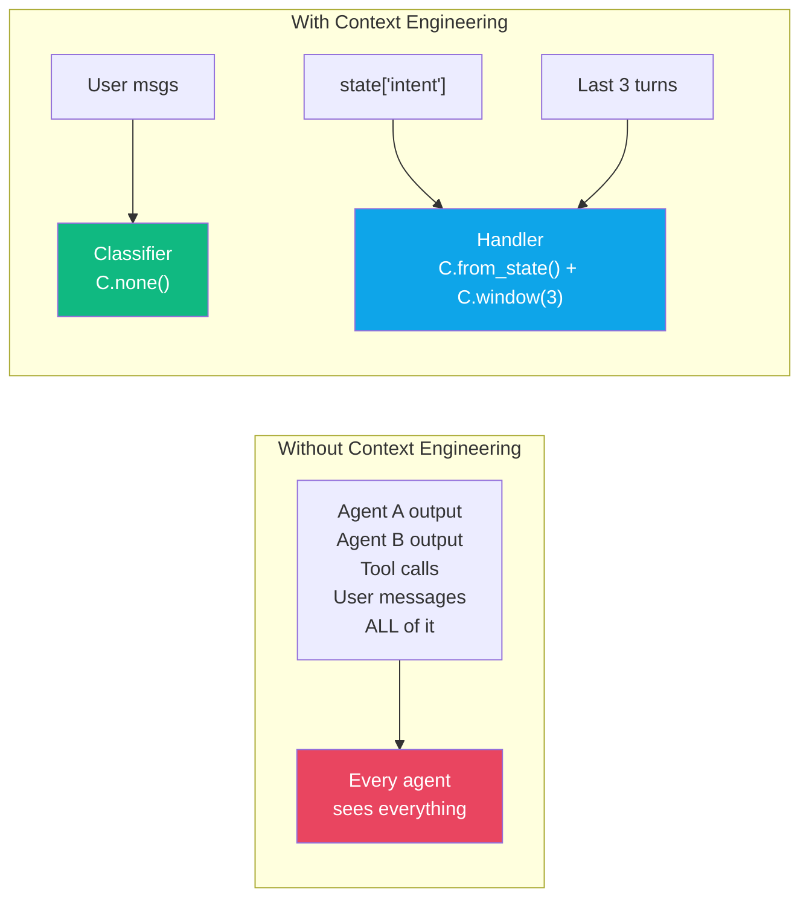
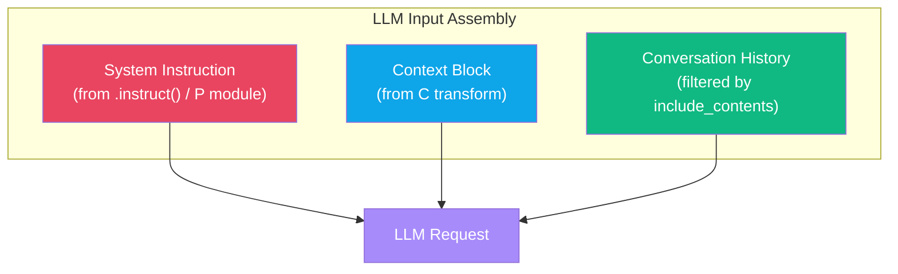
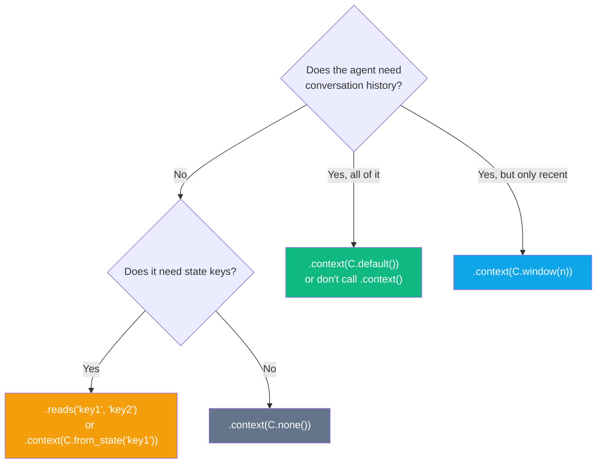
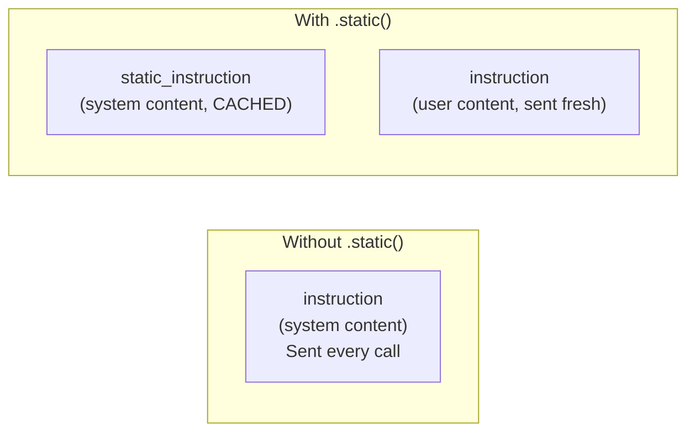
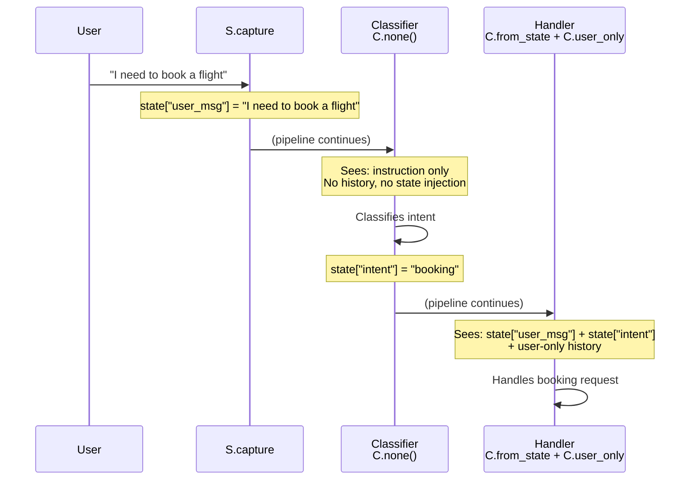
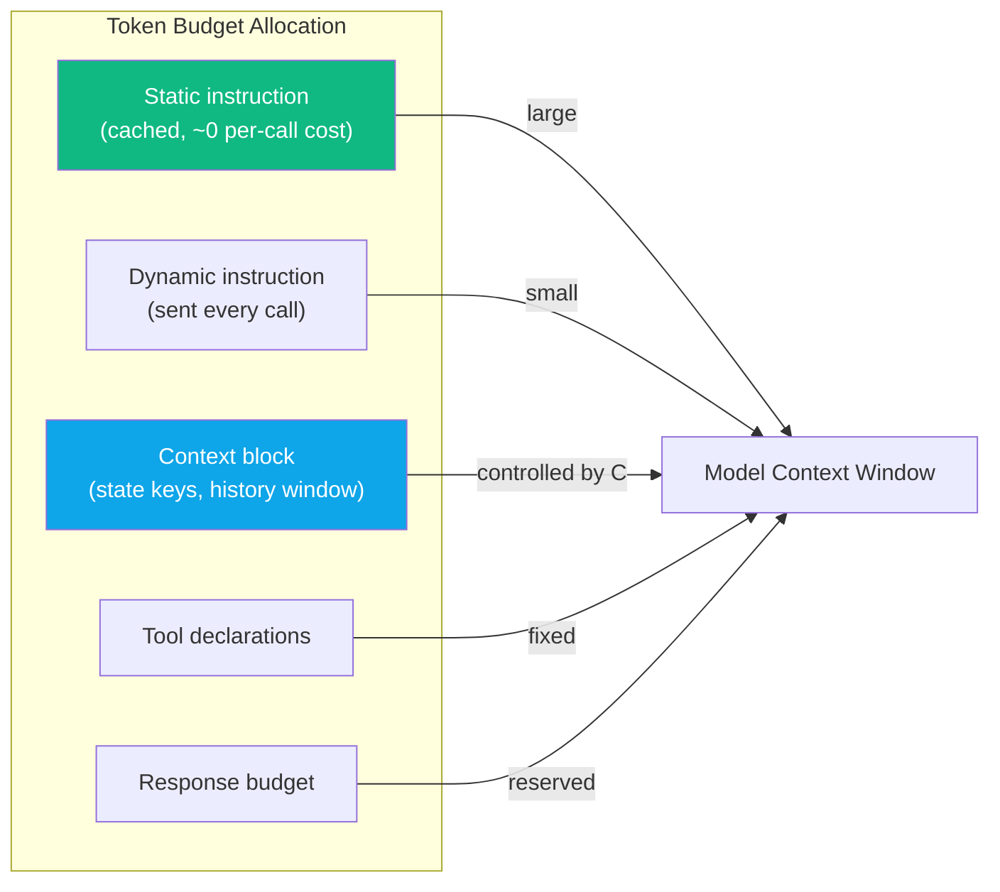

# Context Engineering

:::{admonition} At a Glance
:class: tip

- `C` factories control what conversation history and state each agent sees
- Solves three problems: token budgets, irrelevant history, leaked reasoning
- Compose with `+` (union) or `|` (pipe), pass to `.context()`
:::

## The Problem

In multi-agent pipelines, every agent shares the same conversation session. Without context engineering, each agent sees **everything** --- other agents' reasoning, tool-call noise, and irrelevant turns.



| Problem | Impact | C Module Solution |
|---------|--------|------------------|
| **Token budgets** | Full history burns tokens on irrelevant content | `C.window(n)`, `C.budget(max_tokens=)` |
| **Irrelevant history** | Classifier doesn't need writer's drafts | `C.none()`, `C.from_state()` |
| **Leaked reasoning** | Agents anchor on prior conclusions | `C.user_only()`, `C.from_agents()` |

---

## What the LLM Actually Sees



When `.reads("topic")` or `.context(C.from_state("topic"))` is set, the LLM receives:

```
[Your instruction text]

<conversation_context>
[topic]: value from state
</conversation_context>
```

---

## Quick Start

```python
from adk_fluent import Agent, C

# Suppress all conversation history
Agent("processor").context(C.none()).instruct("Process input.")

# Only see last 3 turn-pairs + state keys
Agent("analyst").context(C.window(n=3) + C.from_state("topic")).instruct("Analyze {topic}.")

# Only user messages (no agent/tool noise)
Agent("reviewer").context(C.user_only()).instruct("Review the request.")
```

---

## Primitives Reference

### Core Primitives

| Factory | LLM Sees | `include_contents` |
|---------|----------|-------------------|
| `C.default()` | All history + all state | `"default"` |
| `C.none()` | Instruction only | `"none"` |
| `C.user_only()` | User messages only | `"none"` + provider |
| `C.window(n=)` | Last N turn-pairs | `"none"` + provider |
| `C.from_state(*keys)` | Named state keys | `"none"` + provider |
| `C.from_agents(*names)` | User + named agent outputs | `"none"` + provider |
| `C.exclude_agents(*names)` | Everything except named agents | `"none"` + provider |
| `C.template(str)` | Rendered template from state | `"none"` + provider |

### Filtering & Constraints

| Factory | Purpose |
|---------|---------|
| `C.select(*names)` | Select specific agents |
| `C.recent(n=)` | Recent messages only |
| `C.compact()` | Remove redundant messages |
| `C.dedup()` | Remove duplicate messages |
| `C.truncate(max_turns=)` | Hard turn limit |
| `C.budget(max_tokens=)` | Token budget constraint |
| `C.fresh(max_age=)` | Filter by recency |
| `C.redact(*patterns)` | Redact sensitive content |

### LLM-Powered

| Factory | Purpose |
|---------|---------|
| `C.summarize(scope=)` | LLM-powered summarization |
| `C.relevant(query_key=)` | Semantic relevance filtering |
| `C.extract(key=)` | Extract structured data |
| `C.distill()` | Distill to key points |

### Convenience

| Factory | Purpose |
|---------|---------|
| `C.rolling(n=)` | Rolling window with compaction |
| `C.from_agents_windowed(n=)` | Windowed agent output filtering |
| `C.user()` | Alias for `C.user_only()` |
| `C.manus_cascade()` | Manus-style cascading context |
| `C.notes()` | Attach notes |
| `C.when(pred, transform)` | Conditional context transform |

---

## `.reads()` vs `.context()` --- When to Use Which

| Method | Effect | Best For |
|--------|--------|---------|
| `.reads("topic")` | Suppresses history, injects `state["topic"]` | Stateless utility agents that only need specific state keys |
| `.context(C.from_state("topic"))` | Same as `.reads()` | When you want to compose with other C transforms |
| `.context(C.window(3))` | Shows last 3 turns only | Long conversations where recent context matters |
| `.context(C.none())` | Instruction only, no context | Pure function-like agents |
| No `.reads()` or `.context()` | Full history (default) | Conversational agents |



---

## `.static()` vs `.instruct()` --- Context Caching



| Method | Goes To | Cached? | Variable Substitution |
|--------|---------|---------|----------------------|
| `.instruct()` alone | System content | No | Yes --- `{key}` replaced |
| `.static()` | System content | Yes --- context cached | No --- sent as-is |
| `.instruct()` with `.static()` | User content | No | Yes --- `{key}` replaced |

```python
# 50-page style guide cached; dynamic instruction sent fresh each turn
agent = (
    Agent("editor", "gemini-2.5-flash")
    .static("Company style guide: [50 pages of text]...")
    .instruct("Edit this text using the style guide above: {draft}")
)
```

:::{tip}
Use `.static()` for large, stable prompt sections (style guides, knowledge bases, reference docs). The dynamic `.instruct()` text moves to user content, enabling model-level context caching and reducing per-call token costs.
:::

---

## Composition

### `+` (union) --- Combine transforms

Both transforms are applied to produce the final context:

```python
# Agent sees last 3 turns AND state["topic"]
ctx = C.window(n=3) + C.from_state("topic", "style")
agent = Agent("analyst").context(ctx).instruct("Analyze {topic}.")
```

### `|` (pipe) --- Feed output into next transform

```python
# Window output piped through a template
ctx = C.window(n=5) | C.template("Recent conversation:\n{history}")
agent = Agent("summarizer").context(ctx).instruct("Summarize.")
```

### Chaining multiple unions

```python
ctx = C.window(n=3) + C.from_state("topic") + C.budget(max_tokens=4000)
```

---

## Full Example: Multi-Agent Context Flow



```python
from adk_fluent import Agent, C, S

pipeline = (
    S.capture("user_message")
    >> Agent("classifier", "gemini-2.5-flash")
        .instruct("Classify the user's intent.")
        .context(C.none())              # No history needed — pure classification
        .writes("intent")
    >> Agent("handler", "gemini-2.5-flash")
        .instruct("Help the user with their {intent} request.")
        .context(
            C.from_state("user_message", "intent")  # Structured state
            + C.user_only()                           # + user conversation context
        )
)
```

The classifier sees only its instruction. The handler sees the original user message and classified intent from state, plus user-only history for conversational continuity.

---

## Context Budget Planning



| Strategy | Method | Token Impact |
|----------|--------|-------------|
| Cache large prompts | `.static()` | Near-zero per-call cost |
| Limit history | `C.window(n=3)` | ~3 turn-pairs |
| Only state keys | `.reads("k1", "k2")` | Only declared keys |
| Set hard budget | `C.budget(max_tokens=4000)` | Hard limit |
| Suppress everything | `C.none()` | Zero context tokens |

---

## Common Mistakes

::::{grid} 1
:gutter: 3

:::{grid-item-card} Using `.reads()` when you also need conversation history
:class-card: sd-border-danger

```python
# ❌ .reads() suppresses ALL history
agent = Agent("helper").reads("topic").instruct("Answer about {topic}.")
# Agent can't see the user's conversation!
```

```python
# ✅ Combine state injection with history window
agent = Agent("helper").context(
    C.from_state("topic") + C.window(n=3)
).instruct("Answer about {topic}.")
```
:::

:::{grid-item-card} Expecting `C.none()` to still show the user message
:class-card: sd-border-danger

```python
# ❌ C.none() means NO context at all — not even the user's message
Agent("classifier").context(C.none()).instruct("Classify.")
# Current turn still visible, but no conversation history
```

```python
# ✅ If you need the user message, capture it to state first
S.capture("user_msg") >> Agent("classifier")
    .context(C.from_state("user_msg"))
    .instruct("Classify: {user_msg}")
```
:::

:::{grid-item-card} Forgetting that `C.from_state()` suppresses history
:class-card: sd-border-danger

```python
# ❌ Agent sees state["topic"] but no conversation history
agent = Agent("helper").context(C.from_state("topic")).instruct("Help.")
```

```python
# ✅ Add C.window() or C.user_only() if you need some history
agent = Agent("helper").context(
    C.from_state("topic") + C.user_only()
).instruct("Help with {topic}.")
```
:::
::::

---

## Interplay With Other Concepts

| Combines With | To Achieve | Example |
|--------------|-----------|---------|
| [State Transforms](state-transforms.md) | Prepare state keys for injection | `S.rename(old="topic") >> agent.reads("topic")` |
| [Data Flow](data-flow.md) | Control the "Context" concern | `.reads("k")` = Context concern |
| [Prompts](prompts.md) | Structured instructions + context | `.instruct(P.role() + P.task()).context(C.window(3))` |
| [Patterns](patterns.md) | Context isolation in review loops | `review_loop(worker.context(C.none()), ...)` |
| [Callbacks](callbacks.md) | Dynamic context via `before_model` | `.prepend(fn)` for turn-level injection |

---

:::{seealso}
- {doc}`data-flow` --- the five orthogonal data flow concerns
- {doc}`state-transforms` --- S module for preparing state keys
- {doc}`prompts` --- P module for structured prompt composition
- {doc}`architecture-and-concepts` --- the three channels of ADK communication
:::
