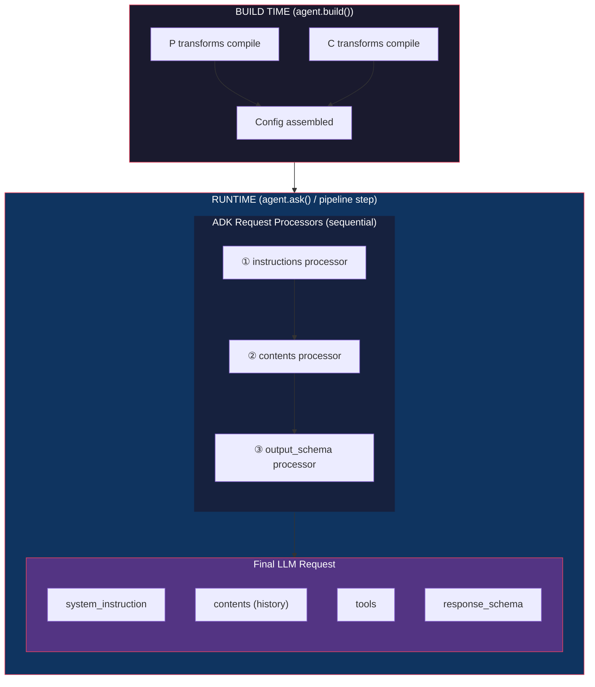
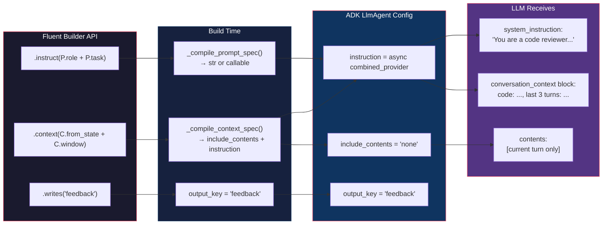

# Data Flow Between Agents

Every data-flow method in adk-fluent maps to exactly one of **five orthogonal concerns**. Understanding these five concerns eliminates all confusion about which method to use.

:::{tip}
**Visual learner?** Open the [Data Flow Interactive Reference](../data-flow-reference.html){target="_blank"} for SVG diagrams, a confusion matrix, and a decision flowchart.
:::

## The Five Concerns

```{raw} html
<div class="arch-diagram-wrapper">
  <svg viewBox="0 0 720 240" fill="none" xmlns="http://www.w3.org/2000/svg" class="arch-diagram" aria-label="Five orthogonal data flow concerns: Context, Input, Output, Storage, and Contract">
    <defs>
      <marker id="df-arr" viewBox="0 0 10 8" refX="9" refY="4" markerWidth="7" markerHeight="5" orient="auto">
        <path d="M0 0 L10 4 L0 8Z" fill="#64748b"/>
      </marker>
    </defs>

    <!-- Title -->
    <text x="360" y="18" text-anchor="middle" fill="#64748b" font-family="'IBM Plex Sans', sans-serif" font-size="10" font-weight="700" letter-spacing="0.12em">FIVE ORTHOGONAL CONCERNS</text>
    <line x1="60" y1="26" x2="660" y2="26" stroke="#1e2d4a" stroke-width="0.5"/>

    <!-- Context box -->
    <g transform="translate(30, 40)">
      <rect width="130" height="100" rx="10" fill="#0ea5e90a" stroke="#0ea5e9" stroke-width="1.5"/>
      <text x="65" y="22" text-anchor="middle" fill="#0ea5e9" font-family="'IBM Plex Sans', sans-serif" font-size="11" font-weight="700">CONTEXT</text>
      <text x="65" y="40" text-anchor="middle" fill="#94a3b8" font-family="'IBM Plex Sans', sans-serif" font-size="8">What the agent</text>
      <text x="65" y="52" text-anchor="middle" fill="#0ea5e9" font-family="'IBM Plex Sans', sans-serif" font-size="9" font-weight="700">SEES</text>
      <line x1="15" y1="62" x2="115" y2="62" stroke="#0ea5e930" stroke-width="0.5"/>
      <text x="65" y="78" text-anchor="middle" fill="#38bdf8" font-family="'JetBrains Mono', monospace" font-size="8">.reads()</text>
      <text x="65" y="92" text-anchor="middle" fill="#38bdf8" font-family="'JetBrains Mono', monospace" font-size="8">.context()</text>
    </g>

    <!-- Input box -->
    <g transform="translate(180, 40)">
      <rect width="130" height="100" rx="10" fill="#f59e0b0a" stroke="#f59e0b" stroke-width="1.5"/>
      <text x="65" y="22" text-anchor="middle" fill="#f59e0b" font-family="'IBM Plex Sans', sans-serif" font-size="11" font-weight="700">INPUT</text>
      <text x="65" y="40" text-anchor="middle" fill="#94a3b8" font-family="'IBM Plex Sans', sans-serif" font-size="8">What the agent</text>
      <text x="65" y="52" text-anchor="middle" fill="#f59e0b" font-family="'IBM Plex Sans', sans-serif" font-size="9" font-weight="700">ACCEPTS</text>
      <line x1="15" y1="62" x2="115" y2="62" stroke="#f59e0b30" stroke-width="0.5"/>
      <text x="65" y="78" text-anchor="middle" fill="#fbbf24" font-family="'JetBrains Mono', monospace" font-size="8">.accepts()</text>
    </g>

    <!-- Output box -->
    <g transform="translate(410, 40)">
      <rect width="130" height="100" rx="10" fill="#a78bfa0a" stroke="#a78bfa" stroke-width="1.5"/>
      <text x="65" y="22" text-anchor="middle" fill="#a78bfa" font-family="'IBM Plex Sans', sans-serif" font-size="11" font-weight="700">OUTPUT</text>
      <text x="65" y="40" text-anchor="middle" fill="#94a3b8" font-family="'IBM Plex Sans', sans-serif" font-size="8">Response</text>
      <text x="65" y="52" text-anchor="middle" fill="#a78bfa" font-family="'IBM Plex Sans', sans-serif" font-size="9" font-weight="700">SHAPE</text>
      <line x1="15" y1="62" x2="115" y2="62" stroke="#a78bfa30" stroke-width="0.5"/>
      <text x="65" y="78" text-anchor="middle" fill="#c4b5fd" font-family="'JetBrains Mono', monospace" font-size="8">.returns()</text>
      <text x="65" y="92" text-anchor="middle" fill="#c4b5fd" font-family="'JetBrains Mono', monospace" font-size="8">@ Model</text>
    </g>

    <!-- Storage box -->
    <g transform="translate(560, 40)">
      <rect width="130" height="100" rx="10" fill="#10b9810a" stroke="#10b981" stroke-width="1.5"/>
      <text x="65" y="22" text-anchor="middle" fill="#10b981" font-family="'IBM Plex Sans', sans-serif" font-size="11" font-weight="700">STORAGE</text>
      <text x="65" y="40" text-anchor="middle" fill="#94a3b8" font-family="'IBM Plex Sans', sans-serif" font-size="8">Where response</text>
      <text x="65" y="52" text-anchor="middle" fill="#10b981" font-family="'IBM Plex Sans', sans-serif" font-size="9" font-weight="700">is STORED</text>
      <line x1="15" y1="62" x2="115" y2="62" stroke="#10b98130" stroke-width="0.5"/>
      <text x="65" y="78" text-anchor="middle" fill="#34d399" font-family="'JetBrains Mono', monospace" font-size="8">.writes()</text>
    </g>

    <!-- Arrows showing flow direction -->
    <text x="170" y="170" fill="#64748b" font-family="'IBM Plex Sans', sans-serif" font-size="8" font-weight="600">◀── BEFORE LLM call</text>
    <text x="490" y="170" fill="#64748b" font-family="'IBM Plex Sans', sans-serif" font-size="8" font-weight="600">AFTER LLM call ──▶</text>
    <line x1="155" y1="165" x2="555" y2="165" stroke="#1e2d4a" stroke-width="0.5" stroke-dasharray="4,3"/>

    <!-- Contract box (spanning center) -->
    <g transform="translate(200, 186)">
      <rect width="320" height="40" rx="8" fill="#64748b08" stroke="#64748b" stroke-width="1" stroke-dasharray="4,3"/>
      <text x="160" y="18" text-anchor="middle" fill="#64748b" font-family="'IBM Plex Sans', sans-serif" font-size="9" font-weight="700">CONTRACT</text>
      <text x="160" y="32" text-anchor="middle" fill="#94a3b8" font-family="'JetBrains Mono', monospace" font-size="8">.produces() / .consumes() — static annotations, no runtime effect</text>
    </g>
  </svg>
</div>
```

| Concern      | Method                        | What it controls                        | ADK field                            |
| ------------ | ----------------------------- | --------------------------------------- | ------------------------------------ |
| **Context**  | `.reads()` / `.context()`     | What the agent SEES                     | `include_contents` + `instruction`\* |
| **Input**    | `.accepts()`                  | What input the agent ACCEPTS as a tool  | `input_schema`                       |
| **Output**   | `.returns()` / `@ Model`      | What SHAPE the response takes           | `output_schema`                      |
| **Storage**  | `.writes()`                   | Where the response is STORED            | `output_key`                         |
| **Contract** | `.produces()` / `.consumes()` | Checker ANNOTATIONS (no runtime effect) | _(extension fields)_                 |

\* Context compiles into the `instruction` field itself (as an async callable), not a separate `instruction_provider` field.

### Recommended builder chain

::::{tab-set}
:::{tab-item} Python
:sync: python

```python
from adk_fluent import Agent
from pydantic import BaseModel

class SearchQuery(BaseModel):
    query: str
    max_results: int = 10

class Intent(BaseModel):
    category: str
    confidence: float

classifier = (
    Agent("classifier", "gemini-2.0-flash")
    .instruct("Classify the user query: {query}")
    .reads("query")              # CONTEXT: I see state["query"]
    .accepts(SearchQuery)        # INPUT:   Tool-mode validation
    .returns(Intent)             # OUTPUT:  Structured JSON response
    .writes("intent")            # STORAGE: Save to state["intent"]
)
```
:::
:::{tab-item} TypeScript
:sync: ts

```ts
import { Agent } from "adk-fluent-ts";

const SearchQuerySchema = {
  type: "object",
  properties: {
    query: { type: "string" },
    max_results: { type: "number" },
  },
  required: ["query"],
} as const;

const IntentSchema = {
  type: "object",
  properties: {
    category: { type: "string" },
    confidence: { type: "number" },
  },
  required: ["category", "confidence"],
} as const;

const classifier = new Agent("classifier", "gemini-2.0-flash")
  .instruct("Classify the user query: {query}")
  .reads("query")              // CONTEXT: I see state["query"]
  .accepts(SearchQuerySchema)  // INPUT:   Tool-mode validation
  .outputAs(IntentSchema)      // OUTPUT:  Structured JSON response
  .writes("intent");           // STORAGE: Save to state["intent"]
```
:::
::::

:::{note} TypeScript naming
TypeScript uses `.outputAs(schema)` for structured output (Python's `.returns()` / `@` operator). Reads / writes / accepts map one-to-one. All five concerns (Context, Input, Output, Storage, Contract) are available via the same method names.
:::

Each line maps to exactly one ADK field. Each verb is unambiguous.

______________________________________________________________________

## The Three Composition Modules: P, C, S

adk-fluent provides three orthogonal composition namespaces for declarative agent construction:

```
┌─────────────────────────────────────────────────────────────────────────────┐
│                        P · C · S  MODULES                                  │
│                                                                             │
│  ┌──────────────────┐  ┌──────────────────┐  ┌──────────────────┐          │
│  │   P = Prompt     │  │   C = Context    │  │   S = State      │          │
│  │   _prompt.py     │  │   _context.py    │  │   _transforms.py │          │
│  │                  │  │                  │  │                  │          │
│  │  WHAT the LLM    │  │  WHAT the agent  │  │  HOW state flows │          │
│  │  is told to do   │  │  can see         │  │  between agents  │          │
│  │                  │  │                  │  │                  │          │
│  │  Frozen          │  │  Frozen          │  │  Callable        │          │
│  │  Descriptors     │  │  Descriptors     │  │  Transforms      │          │
│  │                  │  │                  │  │                  │          │
│  │  P.role()        │  │  C.window(n)     │  │  S.pick(*keys)   │          │
│  │  P.task()        │  │  C.from_state()  │  │  S.rename()      │          │
│  │  P.constraint()  │  │  C.user_only()   │  │  S.merge()       │          │
│  │  P.format()      │  │  C.none()        │  │  S.default()     │          │
│  │  P.example()     │  │  C.summarize()   │  │  S.transform()   │          │
│  │  P.when()        │  │  C.relevant()    │  │  S.guard()       │          │
│  │  ...17 factories │  │  ...29 factories │  │  ...14 factories │          │
│  └────────┬─────────┘  └────────┬─────────┘  └────────┬─────────┘          │
│           │                     │                      │                    │
│           ▼                     ▼                      ▼                    │
│     .instruct(P...)       .context(C...)         >> S.xxx() >>             │
│           │                     │                      │                    │
│           ▼                     ▼                      ▼                    │
│    ADK instruction       ADK include_contents    FnAgent step              │
│    (str or callable)     + instruction            in pipeline              │
│                          (async callable)                                   │
└─────────────────────────────────────────────────────────────────────────────┘
```

### Composition operators

All three modules use one grammar: `|` = union/combine, `>>` = pipe/chain.

| Operator | P (Prompt)            | C (Context)           | S (State)                           |
| -------- | --------------------- | --------------------- | ----------------------------------- |
| `\|`     | Union (merge sections) | Union (merge specs)   | Combine (both run, deltas merge)    |
| `>>`     | Pipe (post-process)    | Pipe (post-process)   | Chain (sequential, pipe output)     |

::::{tab-set}
:::{tab-item} Python
:sync: python

```python
# P: compose prompt sections
prompt = P.role("Expert coder") | P.task("Review code") | P.constraint("Be brief")

# C: compose context specs
context = C.window(n=3) | C.from_state("topic")

# S: chain state transforms
transform = S.pick("a", "b") >> S.rename(a="x") >> S.default(y=1)
```
:::
:::{tab-item} TypeScript
:sync: ts

```ts
// P: compose prompt sections (use .union() instead of |)
const prompt = P.role("Expert coder").union(P.task("Review code")).union(P.constraint("Be brief"));

// C: compose context specs (use .union() instead of |)
const context = C.window(3).union(C.fromState("topic"));

// S: chain state transforms (use .pipe() instead of >>)
const transform = S.pick("a", "b").pipe(S.rename({ a: "x" })).pipe(S.default_({ y: 1 }));
```
:::
::::

______________________________________________________________________

## What Gets Sent to the LLM

When an agent runs, ADK assembles the request through a **sequential processor pipeline**. The following diagram shows the exact order:



### Processor 1: Instruction Assembly

The instructions processor builds the system message from three fields, in this order:

```
┌─────────────────────────────────────────────────────────────────────────────┐
│                    INSTRUCTION ASSEMBLY ORDER                               │
│                                                                             │
│  ① global_instruction                                                       │
│     │  (root agent only, deprecated)                                        │
│     │  State variables {key} injected                                       │
│     ▼                                                                       │
│  ┌─────────────────────────────────────────┐                                │
│  │         system_instruction              │                                │
│  └─────────────────────────────────────────┘                                │
│     ▲                                                                       │
│     │                                                                       │
│  ② static_instruction                                                       │
│     │  (cached, no variable substitution)                                   │
│     │                                                                       │
│     └──── if set, forces ③ to become user content ─────┐                   │
│                                                         │                   │
│  ③ instruction                                          │                   │
│     │  (main instruction from .instruct() / P / C)      │                   │
│     │  State variables {key} injected                   │                   │
│     │                                                    │                   │
│     ├── if static NOT set ─► system_instruction          │                   │
│     │                                                    │                   │
│     └── if static IS set ──► user content ◄──────────────┘                  │
│                              (enables context caching)                      │
│                                                                             │
└─────────────────────────────────────────────────────────────────────────────┘
```

**Key insight:** When `static_instruction` is set, the dynamic `instruction` moves from system to user content. This enables context caching — the static part is cached by the model provider, while the dynamic part is sent fresh each time.

Template variables like `{query}` are replaced with `state["query"]` at runtime (unless `bypass_state_injection=True`).

### Processor 2: Conversation History

Controlled by `include_contents`:

- **`"default"`** (the default) — full conversation history is included, filtered to:

  - Remove empty events (no text, no function calls)
  - Remove framework-internal events (auth, confirmations)
  - Rearrange function call/response pairs for proper pairing
  - Multi-agent: other agents' messages reformatted as `[agent_name] said: ...`

- **`"none"`** — conversation history is suppressed, but the **current turn is still included**:

  - Latest user input (or the invoking agent's message)
  - Current turn's tool calls and responses

**Important:** `.reads()` sets `include_contents="none"`. When you use `.reads("topic")`, the agent does **not** see conversation history — but it still sees the current user input and any in-progress tool interactions.

### Processor 3: Output Schema

When `output_schema` is set (via `.returns(Model)` or `@ Model`):

```
┌─────────────────────────────────────────────────────────────────────────────┐
│                    OUTPUT SCHEMA + TOOLS BEHAVIOR                           │
│                                                                             │
│  ┌─── output_schema set? ───┐                                              │
│  │                           │                                              │
│  No                         Yes                                             │
│  │                           │                                              │
│  ▼                           ├─── tools defined? ───┐                       │
│  Free-form text              │                       │                      │
│  Tools enabled               No                    Yes                      │
│                              │                       │                      │
│                              ▼                       ├── model supports     │
│                          response_schema             │   both natively?     │
│                          set directly                │                      │
│                          (pure JSON mode)           Yes                No   │
│                                                      │                 │    │
│                                                      ▼                 ▼    │
│                                                  Both enabled     Workaround│
│                                                  natively        tool added │
│                                                                 (set_model_ │
│                                                                  response)  │
│                                                                             │
└─────────────────────────────────────────────────────────────────────────────┘
```

**Note:** Tools are NOT unconditionally disabled when `output_schema` is set. ADK checks model capabilities:

- If the model supports both tools and structured output natively → both work
- If not → ADK injects a `set_model_response` workaround tool, allowing the agent to use other tools during reasoning but requiring the final answer as structured JSON via that tool

### Context Injection

When `.reads("topic", "tone")` is set (or `.context(C.from_state("topic", "tone"))`), state values are injected into the instruction as a `<conversation_context>` block. Note: `.reads()` suppresses conversation history by default (pass `keep_history=True` to override). `C.from_state()` is neutral — it injects state without suppressing history:

```
[Your instruction text]

<conversation_context>
[topic]: value from state
[tone]: value from state
</conversation_context>
```

This is delivered by compiling the context spec into an async callable that replaces the `instruction` field at build time. At runtime, that callable resolves state variables and assembles the combined instruction + context block.

### Full LLM Request Assembly

```
┌─────────────────────────────────────────────────────────────────────────────┐
│                  WHAT THE LLM ACTUALLY RECEIVES                             │
│                                                                             │
│  ┌── config.system_instruction ──────────────────────────────────────────┐  │
│  │                                                                       │  │
│  │  [global_instruction, if root agent has one]                          │  │
│  │  [static_instruction, if set]                                         │  │
│  │  [instruction, if no static_instruction]                              │  │
│  │                                                                       │  │
│  └───────────────────────────────────────────────────────────────────────┘  │
│                                                                             │
│  ┌── contents[] ─────────────────────────────────────────────────────────┐  │
│  │                                                                       │  │
│  │  if include_contents="default":                                       │  │
│  │    [Full conversation history — filtered, branch-matched, rearranged] │  │
│  │                                                                       │  │
│  │  if include_contents="none":                                          │  │
│  │    [Current turn only — latest user input + active tool calls]        │  │
│  │                                                                       │  │
│  │  [instruction as user content, if static_instruction was set]         │  │
│  │                                                                       │  │
│  └───────────────────────────────────────────────────────────────────────┘  │
│                                                                             │
│  ┌── config.tools[] ─────────────────────────────────────────────────────┐  │
│  │  [Function declarations for all registered tools]                     │  │
│  │  [+ set_model_response tool, if output_schema workaround needed]     │  │
│  └───────────────────────────────────────────────────────────────────────┘  │
│                                                                             │
│  ┌── config.response_schema ─────────────────────────────────────────────┐  │
│  │  [JSON schema from output_schema, if set and no workaround needed]   │  │
│  │  config.response_mime_type = "application/json"                       │  │
│  └───────────────────────────────────────────────────────────────────────┘  │
│                                                                             │
└─────────────────────────────────────────────────────────────────────────────┘
```

### What Does NOT Get Sent

| Not sent                               | Why                                                       |
| -------------------------------------- | --------------------------------------------------------- |
| State keys not in `.reads()`           | Only explicitly declared keys are injected                |
| State keys not in `{template}`         | Only template variables in the instruction are resolved   |
| `.produces()` / `.consumes()`          | Contract annotations — never sent to the LLM              |
| `.writes()` target key                 | Only used AFTER the LLM responds                          |
| `.accepts()` schema                    | Only validated at tool-call time, not sent to LLM         |
| History when `include_contents="none"` | Conversation history is suppressed (current turn remains) |

### After the LLM Responds

1. Response text is captured
1. If `output_key` is set (`.writes()`), `state[key] = response_text`
1. If `output_schema` is set and using `.ask()`, response is parsed to a Pydantic model
1. `after_model_callback` / `after_agent_callback` hooks run

______________________________________________________________________

## P Module: Prompt Composition

The P module declaratively composes prompt sections using frozen dataclasses. Each `P.xxx()` factory returns a `PTransform` descriptor that compiles at build time.

### Section ordering

P enforces a canonical section order:

```
┌────────────────────────────────────────────────────┐
│              PROMPT SECTION ORDER                   │
│                                                     │
│  ① role        "You are a senior engineer."         │
│  ② context     "Context: ..."                       │
│  ③ task        "Task: Review the code."             │
│  ④ constraint  "Constraints: Be concise."           │
│  ⑤ format      "Output Format: Return markdown."    │
│  ⑥ example     "Examples: ..."                      │
│  ⑦ (custom)    Any P.section("name", "...")         │
│                                                     │
└────────────────────────────────────────────────────┘
```

Multiple sections of the same kind are concatenated. Custom sections appear after the standard ones.

### All P factories

| Phase             | Methods                                                                               | Purpose                       |
| ----------------- | ------------------------------------------------------------------------------------- | ----------------------------- |
| **Core Sections** | `role()`, `context()`, `task()`, `constraint()`, `format()`, `example()`, `section()` | Define prompt structure       |
| **Dynamic**       | `when()`, `from_state()`, `template()`                                                | Conditional + state-dependent |
| **Structural**    | `reorder()`, `only()`, `without()`                                                    | Post-process section ordering |
| **LLM-Powered**   | `compress()`, `adapt()`                                                               | Smart prompt optimization     |
| **Sugar**         | `scaffolded()`, `versioned()`                                                         | Defensive wrapping + tagging  |

### Compilation paths

```
┌─────────────────────────────────────────────────────────────────────────┐
│                    P COMPILATION PATHS                                   │
│                                                                         │
│  PTransform                                                             │
│     │                                                                   │
│     ├── all static? (role, task, constraint, format, example, section)  │
│     │   │                                                               │
│     │   Yes ──► _compile_prompt_spec_static()                           │
│     │           │                                                       │
│     │           ▼                                                       │
│     │       returns str ──► ADK instruction (string)                    │
│     │                                                                   │
│     └── has dynamic blocks? (when, from_state, template, compress, adapt)│
│         │                                                               │
│         Yes ──► returns async _prompt_provider(ctx)                     │
│                 │                                                       │
│                 ▼                                                       │
│             At runtime: resolves state, evaluates conditions,           │
│             calls LLM transforms ──► ADK instruction (callable)        │
│                                                                         │
└─────────────────────────────────────────────────────────────────────────┘
```

### Usage

::::{tab-set}
:::{tab-item} Python
:sync: python

```python
from adk_fluent import Agent, P

agent = Agent("reviewer").instruct(
    P.role("You are a senior code reviewer.")
    + P.task("Review the provided code for bugs and style issues.")
    + P.constraint("Be concise.", "Focus on correctness.")
    + P.format("Return a bulleted list of findings.")
    + P.example(
        input="x = eval(user_input)",
        output="- Security: injection risk via eval()"
    )
)

# Compiles to:
# You are a senior code reviewer.
#
# Task:
# Review the provided code for bugs and style issues.
#
# Constraints:
# Be concise.
# Focus on correctness.
#
# Output Format:
# Return a bulleted list of findings.
#
# Examples:
# Input: x = eval(user_input)
# Output: - Security: injection risk via eval()
```
:::
:::{tab-item} TypeScript
:sync: ts

```ts
import { Agent, P } from "adk-fluent-ts";

const agent = new Agent("reviewer", "gemini-2.5-flash").instruct(
  P.role("You are a senior code reviewer.")
    .add(P.task("Review the provided code for bugs and style issues."))
    .add(P.constraint("Be concise.", "Focus on correctness."))
    .add(P.format("Return a bulleted list of findings."))
    .add(
      P.example({
        input: "x = eval(user_input)",
        output: "- Security: injection risk via eval()",
      }),
    ),
);
```
:::
::::

______________________________________________________________________

## C Module: Context Engineering

The C module declaratively controls what conversation history and state each agent can see. Each `C.xxx()` factory returns a `CTransform` descriptor.

### How C compiles

Every C transform compiles to two ADK knobs:

```
┌─────────────────────────────────────────────────────────────────────────┐
│                    C COMPILATION                                        │
│                                                                         │
│  CTransform                                                             │
│     │                                                                   │
│     ├── include_contents ──► "default" or "none"                        │
│     │   (all C transforms except C.default() set "none")                │
│     │                                                                   │
│     └── instruction_provider ──► async callable or None                 │
│         │                                                               │
│         ▼                                                               │
│     _compile_context_spec() combines:                                   │
│                                                                         │
│     ┌───────────────────────────────────────────────────────────────┐   │
│     │  async def combined_provider(ctx):                            │   │
│     │      instruction = resolve(developer_instruction)             │   │
│     │      instruction = inject_state_vars(instruction, ctx.state)  │   │
│     │      context = await spec.instruction_provider(ctx)           │   │
│     │      return f"{instruction}\n\n<conversation_context>\n"      │   │
│     │             f"{context}\n</conversation_context>"             │   │
│     └───────────────────────────────────────────────────────────────┘   │
│         │                                                               │
│         ▼                                                               │
│     Overwrites ADK instruction field with this async callable           │
│                                                                         │
└─────────────────────────────────────────────────────────────────────────┘
```

### All C factories

| Category        | Methods                                                                                                                   | Purpose                       |
| --------------- | ------------------------------------------------------------------------------------------------------------------------- | ----------------------------- |
| **Primitives**  | `none()`, `default()`, `user_only()`                                                                                      | Suppress / keep all / users   |
| **Selection**   | `from_state()`, `from_agents()`, `exclude_agents()`, `window()`, `last_n_turns()`, `template()`                           | Select what to include        |
| **Filtering**   | `select()`, `recent()`, `compact()`, `dedup()`, `truncate()`, `project()`                                                 | Smart filtering               |
| **Constraints** | `budget()`, `priority()`, `fit()`, `fresh()`, `redact()`                                                                  | Token budgets + freshness     |
| **LLM-Powered** | `summarize()`, `relevant()`, `extract()`, `distill()`                                                                     | Intelligent context selection |
| **Sugar**       | `rolling()`, `from_agents_windowed()`, `user()`, `manus_cascade()`, `notes()`, `write_notes()`, `validate()`, `capture()` | Convenience patterns          |

### Default: Full history

By default, an agent sees the entire conversation history from all agents. No `.reads()` or `.context()` needed.

### `.reads()`: Selective state injection

::::{tab-set}
:::{tab-item} Python
:sync: python

```python
Agent("writer").reads("topic", "tone")
```
:::
:::{tab-item} TypeScript
:sync: ts

```ts
new Agent("writer", "gemini-2.5-flash").reads("topic", "tone");
```
:::
::::

This does two things:

1. Sets `include_contents="none"` — conversation history is **suppressed**
1. Injects `state["topic"]` and `state["tone"]` as a `<conversation_context>` block

### `.context()`: Advanced context control

::::{tab-set}
:::{tab-item} Python
:sync: python

```python
from adk_fluent import Agent, C

Agent("writer").context(C.window(n=3))      # Last 3 turns only
Agent("writer").context(C.user_only())       # User messages only
Agent("writer").context(C.none())            # No context at all
```
:::
:::{tab-item} TypeScript
:sync: ts

```ts
import { Agent, C } from "adk-fluent-ts";

new Agent("writer", "gemini-2.5-flash").context(C.window(3));      // Last 3 turns only
new Agent("writer", "gemini-2.5-flash").context(C.userOnly());     // User messages only
new Agent("writer", "gemini-2.5-flash").context(C.none());         // No context at all
```
:::
::::

### Composing context

`.context()` and `.reads()` compose additively with the `+` / `.add()` operator:

::::{tab-set}
:::{tab-item} Python
:sync: python

```python
Agent("writer")
    .context(C.window(n=3))   # Include last 3 turns
    .reads("topic")           # AND inject state["topic"]
```
:::
:::{tab-item} TypeScript
:sync: ts

```ts
new Agent("writer", "gemini-2.5-flash")
  .context(C.window(3))       // Include last 3 turns
  .reads("topic");            // AND inject state["topic"]
```
:::
::::

______________________________________________________________________

## S Module: State Transforms

The S module transforms session state between pipeline steps using callable `STransform` wrappers. Unlike P and C (frozen descriptors), S transforms are callable and execute at runtime.

### Two kinds of state change

```
┌─────────────────────────────────────────────────────────────────────────┐
│                    STATE TRANSFORM TYPES                                 │
│                                                                         │
│  ┌─────────────────────────────┐  ┌─────────────────────────────────┐  │
│  │     StateReplacement        │  │        StateDelta               │  │
│  │                             │  │                                 │  │
│  │  Replaces session-scoped    │  │  Additive merge: only           │  │
│  │  keys. Unmentioned keys     │  │  specified keys updated.        │  │
│  │  set to None.               │  │  Existing keys preserved.       │  │
│  │                             │  │                                 │  │
│  │  S.pick(*keys)              │  │  S.default(**kv)                │  │
│  │  S.drop(*keys)              │  │  S.merge(*keys, into=, fn=)    │  │
│  │  S.rename(**mapping)        │  │  S.transform(key, fn)          │  │
│  │                             │  │  S.compute(**factories)         │  │
│  │                             │  │  S.set(**values)               │  │
│  └─────────────────────────────┘  └─────────────────────────────────┘  │
│                                                                         │
│  Conditional: S.when(), S.branch()                                      │
│  Inspection:  S.guard(), S.log(), S.identity(), S.capture()            │
│                                                                         │
│  Conflict rule: Replacement + Delta ──► Replacement wins               │
│                                                                         │
└─────────────────────────────────────────────────────────────────────────┘
```

### Usage in pipelines

S transforms appear as steps between agents using the `>>` / `.then()` operator:

::::{tab-set}
:::{tab-item} Python
:sync: python

```python
from adk_fluent import Agent, S

pipeline = (
    Agent("researcher").writes("findings")
    >> S.pick("findings")                  # Keep only "findings"
    >> S.rename(findings="input")          # Rename for next agent
    >> S.default(depth="comprehensive")    # Add default value
    >> Agent("writer").reads("input")
)
```
:::
:::{tab-item} TypeScript
:sync: ts

```ts
import { Agent, S } from "adk-fluent-ts";

const pipeline = new Agent("researcher", "gemini-2.5-flash")
  .writes("findings")
  .then(S.pick("findings"))                        // Keep only "findings"
  .then(S.rename({ findings: "input" }))           // Rename for next agent
  .then(S.default_({ depth: "comprehensive" }))    // Add default value
  .then(new Agent("writer", "gemini-2.5-flash").reads("input"));
```
:::
::::

______________________________________________________________________

## Input: What the Agent Accepts (Tool Mode)

### `.accepts(Model)`: Schema validation at tool-call time

::::{tab-set}
:::{tab-item} Python
:sync: python

```python
class SearchQuery(BaseModel):
    query: str

Agent("searcher").accepts(SearchQuery)
```
:::
:::{tab-item} TypeScript
:sync: ts

```ts
const SearchQuerySchema = {
  type: "object",
  properties: { query: { type: "string" } },
  required: ["query"],
} as const;

new Agent("searcher", "gemini-2.5-flash").accepts(SearchQuerySchema);
```
:::
::::

When another agent invokes this agent via `AgentTool`, the input is validated against this schema. **This has no effect for top-level agents** — only for agents used as tools.

______________________________________________________________________

## Output: What Shape the Response Takes

### Default: Plain text

Without `.returns()`, the agent responds in free-form text and **can use tools**.

### `.returns(Model)` / `.outputAs(schema)`: Structured JSON

::::{tab-set}
:::{tab-item} Python
:sync: python

```python
class Intent(BaseModel):
    category: str
    confidence: float

Agent("classifier").returns(Intent)
```

Forces the LLM to respond with JSON matching the schema. The `@` operator is shorthand: `Agent("classifier") @ Intent`
:::
:::{tab-item} TypeScript
:sync: ts

```ts
const IntentSchema = {
  type: "object",
  properties: {
    category: { type: "string" },
    confidence: { type: "number" },
  },
  required: ["category", "confidence"],
} as const;

new Agent("classifier", "gemini-2.5-flash").outputAs(IntentSchema);
```

The `@` operator shorthand is Python-only; in TypeScript, use `.outputAs()` explicitly.
:::
::::

**Tool interaction:** When `output_schema` is set, whether tools remain available depends on model capabilities. For models that don't natively support both, ADK injects a `set_model_response` workaround tool so the agent can still reason with tools but must deliver its final answer as structured JSON.

### Using `.ask()` with structured output

::::{tab-set}
:::{tab-item} Python
:sync: python

```python
result = await Agent("classifier").returns(Intent).ask_async("Classify this query")
# result is an Intent instance (automatically parsed)
```
:::
:::{tab-item} TypeScript
:sync: ts

```ts
const result = await new Agent("classifier", "gemini-2.5-flash")
  .outputAs(IntentSchema)
  .askAsync("Classify this query");
// result is a parsed object matching IntentSchema
```
:::
::::

______________________________________________________________________

## Storage: Where the Response Goes

### `.writes(key)`: Store raw text in state

::::{tab-set}
:::{tab-item} Python
:sync: python

```python
Agent("researcher").writes("findings")
```
:::
:::{tab-item} TypeScript
:sync: ts

```ts
new Agent("researcher", "gemini-2.5-flash").writes("findings");
```
:::
::::

After the agent runs, `state["findings"]` holds the **raw text response** (not a parsed Pydantic model).

### Template variables

Downstream agents reference stored values with `{key}` placeholders:

::::{tab-set}
:::{tab-item} Python
:sync: python

```python
pipeline = (
    Agent("researcher").writes("findings")
    >> Agent("writer").instruct("Summarize: {findings}")
)
```
:::
:::{tab-item} TypeScript
:sync: ts

```ts
const pipeline = new Agent("researcher", "gemini-2.5-flash")
  .writes("findings")
  .then(new Agent("writer", "gemini-2.5-flash").instruct("Summarize: {findings}"));
```
:::
::::

______________________________________________________________________

## Contracts: Static Annotations

### `.produces(Model)` / `.consumes(Model)`

These have **no runtime effect**. They are annotations for the contract checker:

::::{tab-set}
:::{tab-item} Python
:sync: python

```python
Agent("classifier").produces(Intent).consumes(SearchQuery)
```
:::
:::{tab-item} TypeScript
:sync: ts

```ts
new Agent("classifier", "gemini-2.5-flash")
  .produces(IntentSchema)
  .consumes(SearchQuerySchema);
```
:::
::::

The contract checker uses these to verify data flow between agents at build time.

______________________________________________________________________

## End-to-End Compilation: From Builder to LLM Call

This diagram traces a complete example from fluent builder calls through compilation to the final LLM request:



### Build-time compilation order

Within `_prepare_build_config()`, the compilation happens in this order:

1. Run IR contract checks
1. Extract internal directives (`_context_spec`, `_prompt_spec`, `_output_schema`)
1. Strip internal fields
1. **Context spec compiles first** → sets `include_contents` + creates instruction provider
1. **Prompt spec compiles second** → can override the instruction from step 4
1. Assemble final config dict for ADK `LlmAgent` instantiation

______________________________________________________________________

## Inspecting Data Flow

### `.data_flow()`: Five-concern snapshot

```python
agent = Agent("classifier").reads("query").returns(Intent).writes("intent")
print(agent.data_flow())
# Data Flow:
#   reads:    C.from_state('query') — state keys only
#   accepts:  (not set — accepts any input as tool)
#   returns:  structured JSON → Intent (tools disabled)
#   writes:   state['intent']
#   contract: (not set)
```

### `.llm_anatomy()`: What the LLM will see

```python
print(agent.llm_anatomy())
# LLM Call Anatomy: classifier
#   1. System:     "Classify the user query: {query}"
#   2. History:    SUPPRESSED
#   3. Context:    state["query"] injected
#   4. Tools:      DISABLED (output_schema is set)
#   5. Constraint: must return Intent {category: ..., confidence: ...}
#   6. After:      response stored → state["intent"]
```

### `.explain()`: Full builder state

```python
print(agent.explain())
```

Shows model, instruction, data flow (five concerns), tools, callbacks, children, and contract issues.

______________________________________________________________________

## Common Patterns

### Classify then route

::::{tab-set}
:::{tab-item} Python
:sync: python

```python
pipeline = (
    Agent("classifier")
    .instruct("Classify the query.")
    .returns(Intent)
    .writes("intent")
    >> Agent("handler")
    .reads("intent")
    .instruct("Handle the {intent} query.")
    .writes("response")
)
```
:::
:::{tab-item} TypeScript
:sync: ts

```ts
const pipeline = new Agent("classifier", "gemini-2.5-flash")
  .instruct("Classify the query.")
  .outputAs(IntentSchema)
  .writes("intent")
  .then(
    new Agent("handler", "gemini-2.5-flash")
      .reads("intent")
      .instruct("Handle the {intent} query.")
      .writes("response"),
  );
```
:::
::::

### Fan-out research with merge

::::{tab-set}
:::{tab-item} Python
:sync: python

```python
from adk_fluent import Agent, FanOut, S

research = (
    FanOut("research")
    .branch(Agent("web").writes("web_results"))
    .branch(Agent("docs").writes("doc_results"))
    >> S.merge("web_results", "doc_results", into="all_results")
    >> Agent("synthesizer").reads("all_results").writes("synthesis")
)
```
:::
:::{tab-item} TypeScript
:sync: ts

```ts
import { Agent, S } from "adk-fluent-ts";

const research = new Agent("web", "gemini-2.5-flash")
  .writes("web_results")
  .parallel(new Agent("docs", "gemini-2.5-flash").writes("doc_results"))
  .then(S.merge_(["web_results", "doc_results"], "all_results"))
  .then(new Agent("synthesizer", "gemini-2.5-flash").reads("all_results").writes("synthesis"));
```
:::
::::

### Review loop

::::{tab-set}
:::{tab-item} Python
:sync: python

```python
from adk_fluent.patterns import review_loop

pipeline = review_loop(
    worker=Agent("writer").instruct("Write a draft."),
    reviewer=Agent("reviewer").instruct("Review the draft."),
    quality_key="review_score",
    target=0.8,
    max_rounds=3,
)
```
:::
:::{tab-item} TypeScript
:sync: ts

```ts
import { Agent, reviewLoop } from "adk-fluent-ts";

const pipeline = reviewLoop(
  new Agent("writer", "gemini-2.5-flash").instruct("Write a draft."),
  new Agent("reviewer", "gemini-2.5-flash").instruct("Review the draft."),
  { qualityKey: "review_score", target: 0.8, maxRounds: 3 },
);
```
:::
::::

______________________________________________________________________

## T Module: Tool Composition

The T module provides a compositional namespace for tool construction. Compose with `|` (chain).

::::{tab-set}
:::{tab-item} Python
:sync: python

```python
from adk_fluent import Agent, T

agent = Agent("assistant").tools(
    T.google_search()
    | T.fn(my_func)
    | T.agent(specialist_agent)
)
```
:::
:::{tab-item} TypeScript
:sync: ts

```ts
import { Agent, T } from "adk-fluent-ts";

const agent = new Agent("assistant", "gemini-2.5-flash").tools(
  T.googleSearch().pipe(T.fn(myFunc)).pipe(T.agent(specialistAgent)),
);
```
:::
::::

See the [CLAUDE.md T namespace reference](../../CLAUDE.md) for all T factories.

______________________________________________________________________

## A Module: Artifact Operations

The A module handles artifact publishing, snapshotting, and transformations. Used with `.artifacts()` or `>>`.

::::{tab-set}
:::{tab-item} Python
:sync: python

```python
from adk_fluent import Agent, A

agent = (
    Agent("generator")
    .writes("report_text")
    .artifacts(A.publish("report.md", from_key="report_text"))
)
```
:::
:::{tab-item} TypeScript
:sync: ts

```ts
import { Agent, A } from "adk-fluent-ts";

const agent = new Agent("generator", "gemini-2.5-flash")
  .writes("report_text")
  .artifacts(A.publish("report.md", { fromKey: "report_text" }));
```
:::
::::

See the [CLAUDE.md A namespace reference](../../CLAUDE.md) for all A factories.
