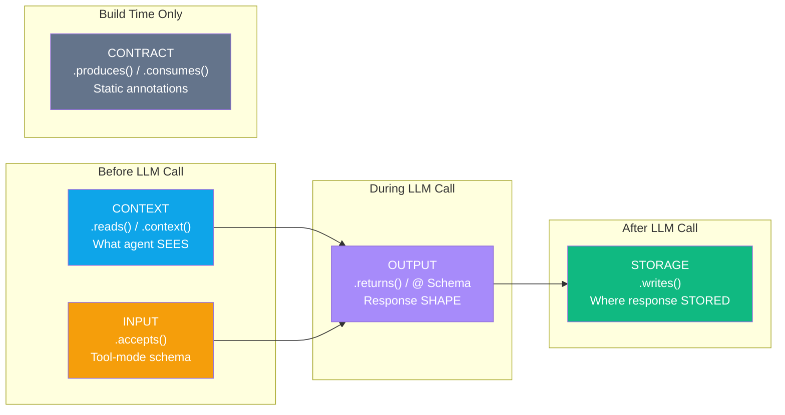
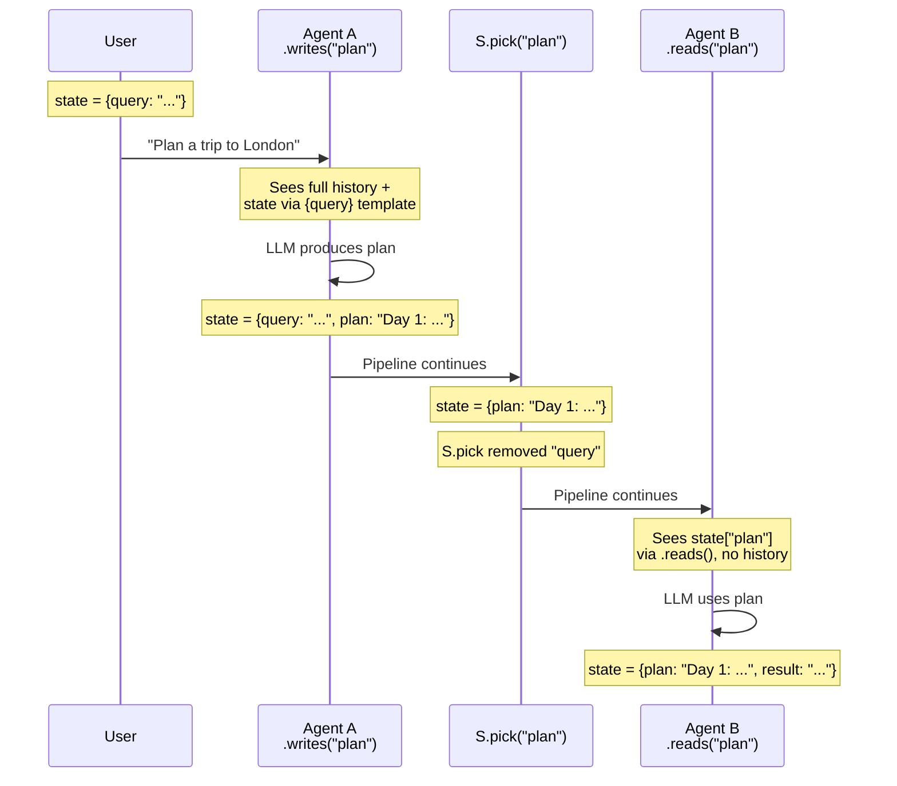
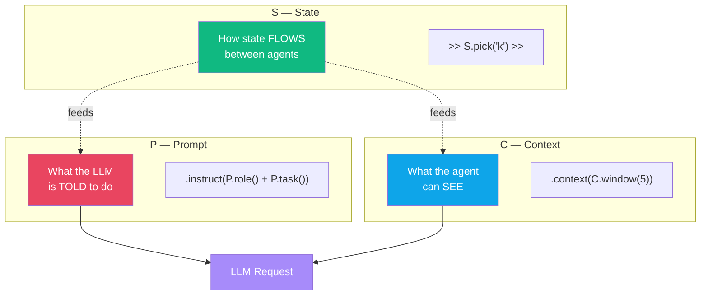
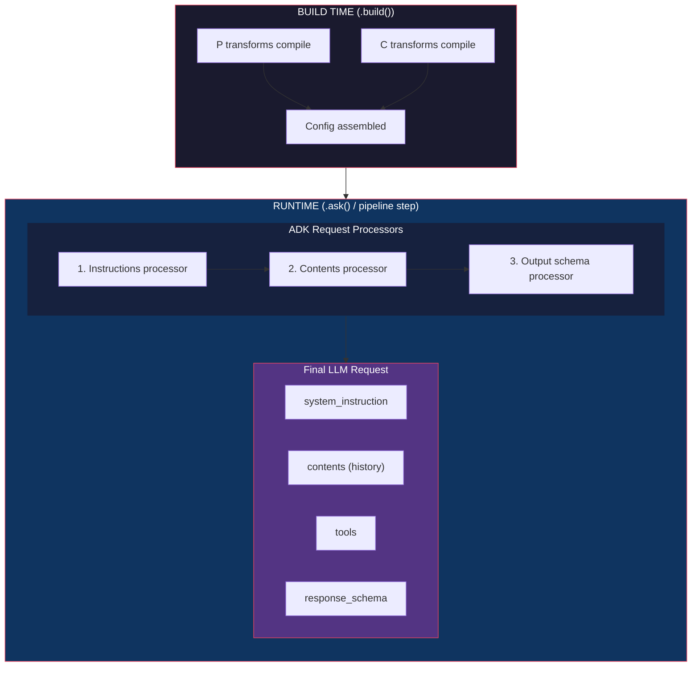
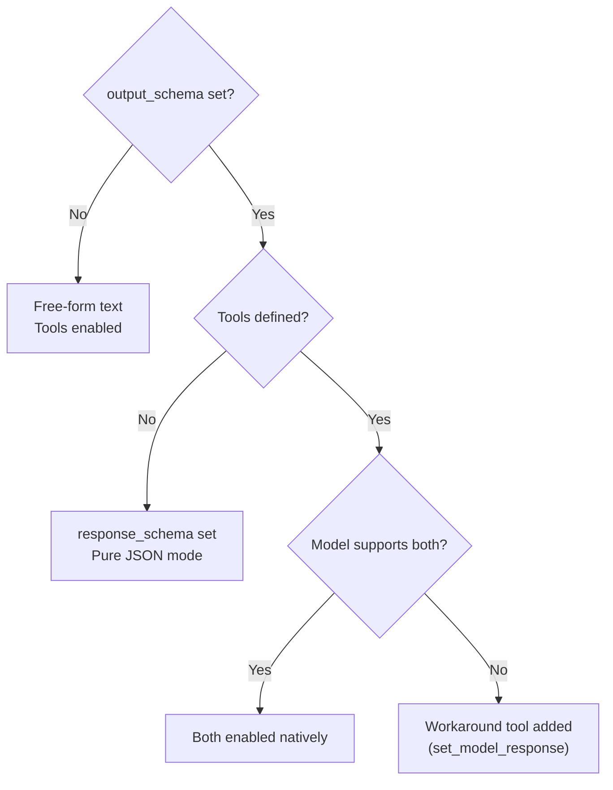
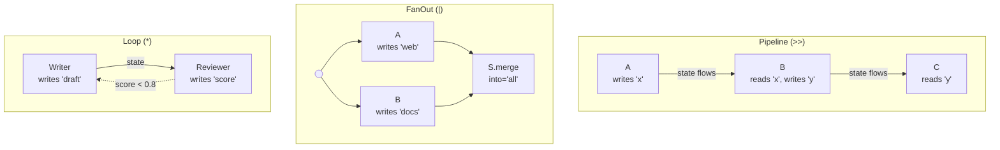
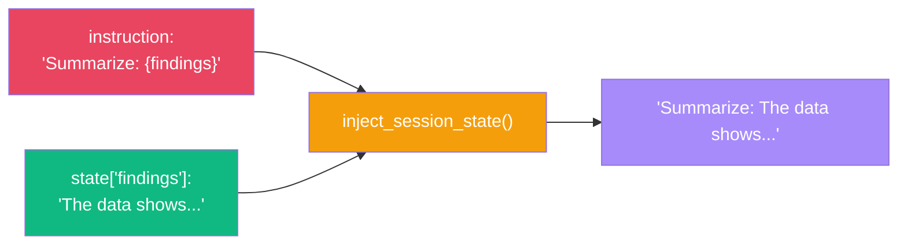

# Data Flow Between Agents

:::{admonition} At a Glance
:class: tip

- Every data-flow method maps to exactly one of **five orthogonal concerns**: Context, Input, Output, Storage, Contract
- `.reads()` and `.context()` control what agents see; `.writes()` controls where output goes
- State flows through pipelines as a shared dict --- use S transforms to clean data between steps
:::

## The Five Concerns



| Concern | Method | What It Controls | ADK Field |
|---------|--------|-----------------|-----------|
| **Context** | `.reads()` / `.context()` | What the agent SEES | `include_contents` + `instruction` |
| **Input** | `.accepts()` | Schema validation as a tool | `input_schema` |
| **Output** | `.returns()` / `@ Model` | Response shape (structured JSON) | `output_schema` |
| **Storage** | `.writes()` | Where response is saved in state | `output_key` |
| **Contract** | `.produces()` / `.consumes()` | Static annotations (no runtime effect) | _(extension fields)_ |

### Recommended Builder Chain

```python
from adk_fluent import Agent
from pydantic import BaseModel

class SearchQuery(BaseModel):
    query: str
    max_results: int = 10

class Intent(BaseModel):
    category: str
    confidence: float

classifier = (
    Agent("classifier", "gemini-2.0-flash")
    .instruct("Classify the user query: {query}")
    .reads("query")              # CONTEXT: sees state["query"] only
    .accepts(SearchQuery)        # INPUT:   tool-mode validation
    .returns(Intent)             # OUTPUT:  structured JSON response
    .writes("intent")            # STORAGE: save to state["intent"]
)
```

Each line maps to exactly one ADK field. Each verb is unambiguous.

---

## State Flow Through a Pipeline



### State Snapshots at Each Stage

| Stage | `state` contents | What changed |
|-------|-----------------|-------------|
| Start | `{query: "Plan a trip to London"}` | User input |
| After Agent A | `{query: "...", plan: "Day 1: ..."}` | `.writes("plan")` stored output |
| After S.pick | `{plan: "Day 1: ..."}` | `S.pick("plan")` kept only "plan" |
| After Agent B | `{plan: "...", result: "Itinerary: ..."}` | `.writes("result")` stored output |

---

## The Three Composition Modules: P, C, S

Three modules control what goes into and comes out of the LLM:



| Operator | P (Prompt) | C (Context) | S (State) |
|----------|-----------|-------------|-----------|
| `+` | Union (merge sections) | Union (merge specs) | Combine (run both) |
| `\|` | Pipe (transform) | Pipe (transform) | --- |
| `>>` | --- | --- | Chain (sequential) |

```python
from adk_fluent import P, C, S

# P: compose prompt sections
prompt = P.role("Expert coder") + P.task("Review code") + P.constraint("Be brief")

# C: compose context specs
context = C.window(n=3) + C.from_state("topic")

# S: chain state transforms
transform = S.pick("a", "b") >> S.rename(a="x") >> S.default(y=1)
```

---

## What Gets Sent to the LLM



### Processor 1: Instruction Assembly

Three fields combine into the system message, in order:

| Field | Source | Variable Substitution |
|-------|--------|----------------------|
| `global_instruction` | `.global_instruct()` on root agent | Yes --- `{key}` replaced |
| `static_instruction` | `.static()` | No --- cached as-is |
| `instruction` | `.instruct()` / P module | Yes --- `{key}` replaced |

:::{note}
When `.static()` is set, the dynamic `.instruct()` text moves from **system** to **user** content. This enables context caching --- the static part is cached by the model provider, while the dynamic part is sent fresh each turn.
:::

### Processor 2: Conversation History

Controlled by `include_contents`:

| Value | Behavior | Set By |
|-------|----------|--------|
| `"default"` | Full conversation history (filtered, rearranged) | Default behavior |
| `"none"` | Current turn only (latest user input + active tool calls) | `.reads()`, `.context(C.none())` |

:::{warning}
`.reads()` sets `include_contents="none"`. When you use `.reads("topic")`, the agent does **not** see conversation history --- but it still sees the current user input and any in-progress tool interactions.
:::

### Processor 3: Output Schema



:::{tip}
Tools are NOT unconditionally disabled when `output_schema` is set. ADK checks model capabilities. For models that don't support both, ADK injects a `set_model_response` workaround tool.
:::

### Context Injection with `.reads()`

When `.reads("topic", "tone")` is set, state values are injected into the instruction:

```
[Your instruction text]

<conversation_context>
[topic]: value from state
[tone]: value from state
</conversation_context>
```

### What Does NOT Get Sent

| Not Sent | Why |
|----------|-----|
| State keys not in `.reads()` | Only declared keys are injected |
| State keys not in `{template}` | Only template variables are resolved |
| `.produces()` / `.consumes()` | Contract annotations --- never sent to LLM |
| `.writes()` target key | Only used AFTER the LLM responds |
| `.accepts()` schema | Only validated at tool-call time |
| History when `.reads()` is set | `include_contents` set to `"none"` |

---

## Data Flow in Pipeline vs FanOut vs Loop



| Topology | State Behavior | Key Pattern |
|----------|---------------|-------------|
| **Pipeline** `>>` | State accumulates --- each step adds keys | `.writes("k")` → `{k}` template in next step |
| **FanOut** `\|` | Branches write to separate keys | `.writes("web")`, `.writes("docs")` → `S.merge()` |
| **Loop** `*` | State persists across iterations | Writer overwrites `"draft"`, reviewer overwrites `"score"` |

:::{warning}
**FanOut state race conditions:** If two parallel branches write to the same key, the last branch to finish wins. Always use distinct `.writes()` keys in parallel branches, then merge with `S.merge()`.
:::

---

## Template Variable Resolution

`{key}` placeholders in instructions are resolved from session state at runtime:



| Syntax | Behavior |
|--------|----------|
| `{key}` | Replaced with `state["key"]` or empty string if missing |
| `{key}` in `.static()` | **Not replaced** --- static text is cached |
| `{key}` in `.instruct()` | Replaced every invocation |

---

## After the LLM Responds

1. Response text is captured
2. If `.writes(key)` is set → `state[key] = response_text`
3. If `.returns(Schema)` is set and using `.ask()` → response is parsed to Pydantic model
4. `after_model_callback` / `after_agent_callback` hooks run

---

## Inspecting Data Flow

Three introspection methods show exactly what's happening:

### `.data_flow()` --- Five-concern snapshot

```python
agent = Agent("classifier").reads("query").returns(Intent).writes("intent")
print(agent.data_flow())
# Data Flow:
#   reads:    C.from_state('query') — state keys only
#   accepts:  (not set — accepts any input as tool)
#   returns:  structured JSON → Intent
#   writes:   state['intent']
#   contract: (not set)
```

### `.llm_anatomy()` --- What the LLM will see

```python
print(agent.llm_anatomy())
# LLM Call Anatomy: classifier
#   1. System:     "Classify the user query: {query}"
#   2. History:    SUPPRESSED
#   3. Context:    state["query"] injected
#   4. Tools:      depends on model capabilities
#   5. Constraint: must return Intent {category, confidence}
#   6. After:      response stored → state["intent"]
```

### `.explain()` --- Full builder state

```python
print(agent.explain())
# Shows: model, instruction, data flow, tools, callbacks, children, contract issues
```

---

## Data Flow Cheat Sheet

| I Want To... | Method | Example |
|-------------|--------|---------|
| Store agent output in state | `.writes(key)` | `.writes("findings")` |
| Read state keys in agent | `.reads(*keys)` | `.reads("topic", "tone")` |
| Use state in instruction | `{key}` template | `.instruct("About {topic}")` |
| Constrain output to JSON | `.returns(Model)` or `@ Model` | `.returns(Intent)` |
| Validate tool-mode input | `.accepts(Model)` | `.accepts(SearchQuery)` |
| Annotate for contract checker | `.produces()` / `.consumes()` | `.produces(Intent)` |
| Suppress conversation history | `.context(C.none())` | `.context(C.none())` |
| Show last N turns only | `.context(C.window(n))` | `.context(C.window(5))` |
| Transform state between agents | `>> S.xxx() >>` | `>> S.pick("k") >>` |

---

## Common Patterns

### Classify Then Route

```python
from adk_fluent import Agent
from adk_fluent._routing import Route

pipeline = (
    Agent("classifier", "gemini-2.5-flash")
    .instruct("Classify the query.")
    .returns(Intent)
    .writes("intent")
    >> Route("intent")
    .eq("booking", Agent("booker").instruct("Book flights."))
    .eq("info", Agent("info").instruct("Provide info."))
)
```

### Fan-Out Research with Merge

```python
from adk_fluent import Agent, FanOut, S

pipeline = (
    (   Agent("web", "gemini-2.5-flash").instruct("Search web.").writes("web")
      | Agent("docs", "gemini-2.5-flash").instruct("Search docs.").writes("docs")
    )
    >> S.merge("web", "docs", into="all_results")
    >> Agent("synth", "gemini-2.5-flash").reads("all_results").writes("synthesis")
)
```

### Review Loop

```python
from adk_fluent.patterns import review_loop

pipeline = review_loop(
    worker=Agent("writer").instruct("Write a draft."),
    reviewer=Agent("reviewer").instruct("Score the draft 0-1."),
    quality_key="review_score",
    target=0.8,
    max_rounds=3,
)
```

---

## Common Mistakes

::::{grid} 1
:gutter: 3

:::{grid-item-card} Using `.reads()` when you also need conversation history
:class-card: sd-border-danger

```python
# ❌ .reads() suppresses ALL history — agent can't see user's question
agent = Agent("helper").instruct("Answer: {topic}").reads("topic")
```

```python
# ✅ Use .context() to combine state injection with history
agent = Agent("helper").instruct("Answer about the topic.").context(
    C.from_state("topic") + C.window(n=3)
)
```
:::

:::{grid-item-card} Expecting `.writes()` to produce structured data
:class-card: sd-border-danger

```python
# ❌ .writes() stores raw text, not a parsed Pydantic model
agent = Agent("classifier").returns(Intent).writes("intent")
# state["intent"] is a string like '{"category": "booking", "confidence": 0.9}'
```

```python
# ✅ Use .returns() with .ask() for parsed output, .writes() for raw text in pipelines
result = await Agent("classifier").returns(Intent).ask_async("Classify this")
# result is an Intent instance
```
:::

:::{grid-item-card} Forgetting that FanOut branches share state
:class-card: sd-border-danger

```python
# ❌ Both branches write to "result" — last writer wins
(Agent("a").writes("result") | Agent("b").writes("result"))
```

```python
# ✅ Use distinct keys, then merge
(Agent("a").writes("a_result") | Agent("b").writes("b_result"))
>> S.merge("a_result", "b_result", into="result")
```
:::
::::

---

## Interplay With Other Concepts

| Combines With | To Achieve | Example |
|--------------|-----------|---------|
| [Expression Language](expression-language.md) | Compose agents into pipelines | `a >> b \| c` |
| [State Transforms](state-transforms.md) | Clean/reshape data between steps | `>> S.pick("k") >> S.rename(k="v") >>` |
| [Context Engineering](context-engineering.md) | Fine-grained history control | `.context(C.window(3) + C.from_state("k"))` |
| [Prompts](prompts.md) | Structured instructions with state | `.instruct(P.role("...") + P.task("..."))` |
| [Structured Data](structured-data.md) | Schema-constrained output | `.returns(Model)` / `@ Model` |
| [Callbacks](callbacks.md) | Post-processing after output | `.after_model(validate_fn)` |

---

:::{seealso}
- {doc}`state-transforms` --- full S module reference with before/after diagrams
- {doc}`context-engineering` --- C module for controlling what agents see
- {doc}`prompts` --- P module for structured prompt composition
- {doc}`structured-data` --- schema validation and contracts
- {doc}`architecture-and-concepts` --- the three channels of ADK communication
:::
