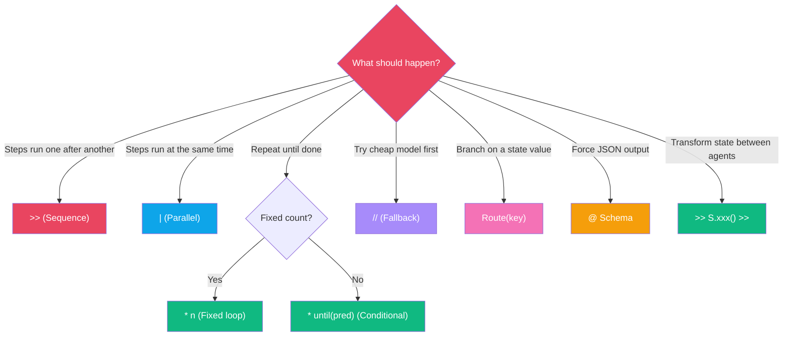
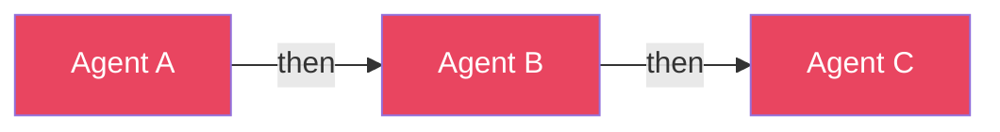
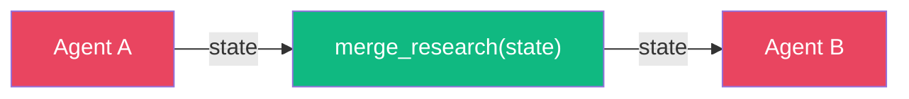
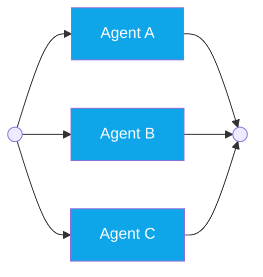
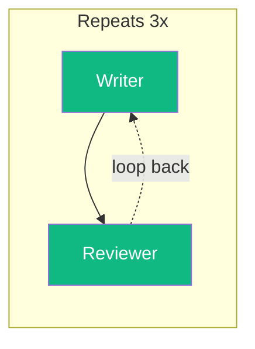
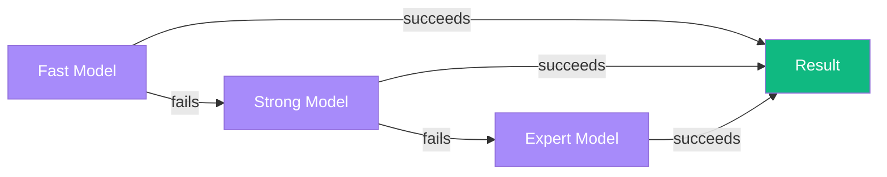
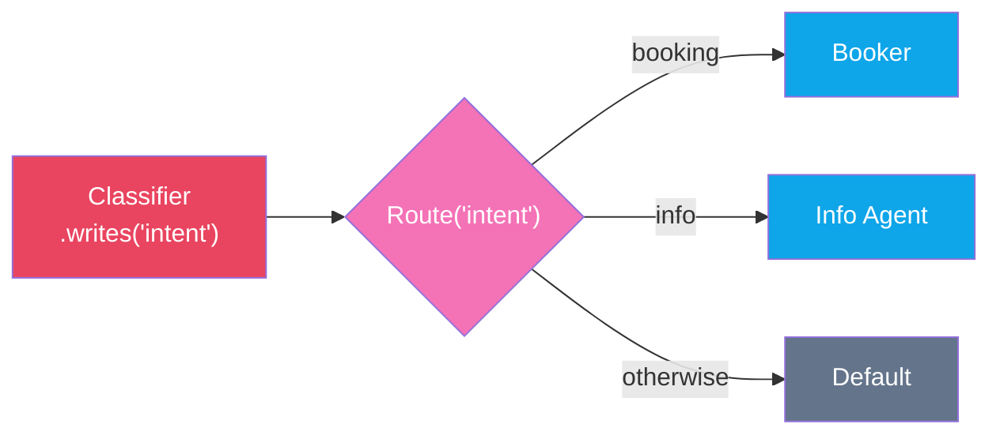
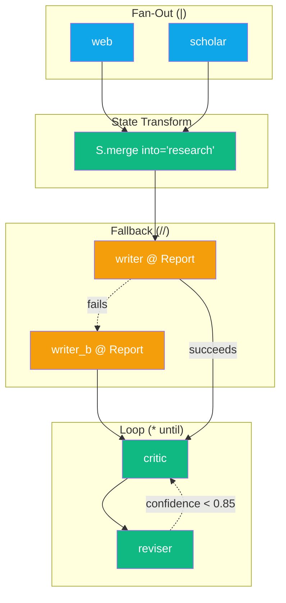

# Expression Language

:::{admonition} At a Glance
:class: tip

- Nine operators compose any agent topology using familiar Python syntax
- All operators are **immutable** --- sub-expressions can be safely reused
- Every expression compiles to native ADK objects (`SequentialAgent`, `ParallelAgent`, `LoopAgent`)
:::

## Operator Algebra at a Glance

| Operator | Symbol | Meaning | ADK Type | Example |
|----------|--------|---------|----------|---------|
| Sequence | `>>` | Run in order | `SequentialAgent` | `a >> b >> c` |
| Function step | `>> fn` | Zero-cost transform | `FnAgent` | `a >> my_func >> b` |
| Parallel | `\|` | Run concurrently | `ParallelAgent` | `a \| b \| c` |
| Loop (fixed) | `* n` | Repeat n times | `LoopAgent` | `(a >> b) * 3` |
| Loop (conditional) | `* until(...)` | Repeat until predicate | `LoopAgent` + check | `(a >> b) * until(pred)` |
| Typed output | `@` | Constrain to schema | `output_schema` | `a @ MyModel` |
| Fallback | `//` | First success wins | Fallback chain | `fast // strong` |
| Route | `Route(key)` | Deterministic branch | Custom agent | `Route("k").eq(...)` |
| State transform | `S.xxx()` | Dict operations | `FnAgent` | `>> S.pick("k") >>` |

## Which Operator Do I Need?



## Operator Precedence

Operators follow Python's standard precedence. Use parentheses to override.

| Priority | Operator | Associativity |
|----------|----------|--------------|
| 1 (highest) | `@` (typed output) | Left |
| 2 | `*` (loop) | Left |
| 3 | `\|` (parallel) | Left |
| 4 | `>>` (sequence) | Left |
| 5 (lowest) | `//` (fallback) | Left |

:::{tip}
When in doubt, add parentheses. `(a >> b) | (c >> d)` is clearer than relying on precedence.
:::

---

## Immutability

All operators produce **new** expression objects. Sub-expressions can be safely reused:

```python
review = agent_a >> agent_b         # Reusable sub-expression
pipeline_1 = review >> agent_c      # Independent copy
pipeline_2 = review >> agent_d      # Independent copy
```

---

## `>>` --- Sequence (Pipeline)

Chains agents into a sequential pipeline. Each agent runs after the previous one completes.



### Quick Start

```python
from adk_fluent import Agent

pipeline = (
    Agent("a", "gemini-2.5-flash").instruct("Step 1.").writes("result")
    >> Agent("b", "gemini-2.5-flash").instruct("Step 2 using {result}.")
).build()
```

### Equivalent Builder API

```python
from adk_fluent import Pipeline, Agent

pipeline = (
    Pipeline("flow")
    .step(Agent("a", "gemini-2.5-flash").instruct("Step 1.").writes("result"))
    .step(Agent("b", "gemini-2.5-flash").instruct("Step 2 using {result}."))
    .build()
)
```

---

## `>> fn` --- Function Steps

Plain Python functions compose with `>>` as zero-cost workflow nodes (no LLM call):



```python
def merge_research(state):
    """Combine web + papers into single key."""
    return {"research": state["web"] + "\n" + state["papers"]}

pipeline = web_agent >> merge_research >> writer_agent
```

Functions receive the session state dict and return a dict of state updates.

:::{tip}
For common transforms like picking keys or renaming, use `S` module factories instead of writing custom functions: `>> S.pick("web", "papers") >> S.merge("web", "papers", into="research") >>`.
:::

---

## `|` --- Parallel (Fan-Out)

Runs agents concurrently. All branches execute simultaneously.



### Quick Start

```python
from adk_fluent import Agent

fanout = (
    Agent("web", "gemini-2.5-flash").instruct("Search web.").writes("web_results")
    | Agent("papers", "gemini-2.5-pro").instruct("Search papers.").writes("paper_results")
    | Agent("internal", "gemini-2.5-flash").instruct("Search docs.").writes("internal_results")
).build()
```

### Equivalent Builder API

```python
from adk_fluent import FanOut, Agent

fanout = (
    FanOut("parallel")
    .branch(Agent("web", "gemini-2.5-flash").instruct("Search web.").writes("web_results"))
    .branch(Agent("papers", "gemini-2.5-pro").instruct("Search papers.").writes("paper_results"))
    .build()
)
```

:::{warning}
Each parallel branch writes to a **separate** state key via `.writes()`. If two branches write to the same key, the last one to finish wins. Always use distinct keys, then merge with `S.merge()`.
:::

---

## `*` --- Loop

### Fixed Count

Multiply an expression by an integer to loop a fixed number of times:



```python
loop = (
    Agent("writer", "gemini-2.5-flash").instruct("Write draft.")
    >> Agent("reviewer", "gemini-2.5-flash").instruct("Review.")
) * 3
```

### Conditional Loop with `until()`

Loop until a predicate on session state is satisfied:

```python
from adk_fluent import until

loop = (
    Agent("writer", "gemini-2.5-flash").instruct("Write.").writes("quality")
    >> Agent("reviewer", "gemini-2.5-flash").instruct("Review.")
) * until(lambda s: s.get("quality") == "good", max=5)
```

The `max` parameter sets a safety limit on iterations.

---

## `@` --- Typed Output

Binds a Pydantic schema as the agent's output contract:

```python
from pydantic import BaseModel

class Report(BaseModel):
    title: str
    body: str
    confidence: float

agent = Agent("writer", "gemini-2.5-flash").instruct("Write.") @ Report
```

Equivalent to `.returns(Report)`. The LLM is constrained to produce JSON matching the schema.

:::{note}
When `output_schema` is set, tool availability depends on model capabilities. For models that don't natively support both, ADK injects a `set_model_response` workaround tool.
:::

---

## `//` --- Fallback Chain

Tries each agent in order. The first to succeed wins:



```python
answer = (
    Agent("fast", "gemini-2.0-flash").instruct("Quick answer.")
    // Agent("thorough", "gemini-2.5-pro").instruct("Detailed answer.")
)
```

:::{tip}
Use fallback chains for **cost optimization**: try a cheaper, faster model first and fall back to a more capable (expensive) model only if needed.
:::

---

## `Route("key")` --- Deterministic Routing

Route on session state values without LLM calls:



```python
from adk_fluent import Agent
from adk_fluent._routing import Route

classifier = Agent("classify", "gemini-2.5-flash").instruct("Classify intent.").writes("intent")

pipeline = classifier >> (
    Route("intent")
    .eq("booking", Agent("booker").instruct("Book flights."))
    .eq("info", Agent("info").instruct("Provide info."))
    .otherwise(Agent("default").instruct("General help."))
)
```

### Route Methods

| Method | Match Type | Example |
|--------|-----------|---------|
| `.eq(value, agent)` | Exact match | `.eq("VIP", vip_agent)` |
| `.contains(sub, agent)` | Substring | `.contains("error", error_agent)` |
| `.gt(n, agent)` | Greater than | `.gt(100, premium_agent)` |
| `.lt(n, agent)` | Less than | `.lt(0, negative_agent)` |
| `.when(pred, agent)` | Custom predicate | `.when(lambda v: v > 0.8, high_agent)` |
| `.otherwise(agent)` | Default fallback | `.otherwise(default_agent)` |

### Dict Shorthand

```python
# These are equivalent:
pipeline = classifier >> Route("intent").eq("booking", booker).eq("info", info)
pipeline = classifier >> {"booking": booker, "info": info}
```

---

## Full Composition Example

All operators compose into a single expression:



```python
from pydantic import BaseModel
from adk_fluent import Agent, S, until

class Report(BaseModel):
    title: str
    body: str
    confidence: float

pipeline = (
    # Fan-out: parallel research
    (   Agent("web", "gemini-2.5-flash").instruct("Search web.").writes("web")
      | Agent("scholar", "gemini-2.5-flash").instruct("Search papers.").writes("scholar")
    )
    # State transform: merge results
    >> S.merge("web", "scholar", into="research")
    # Fallback: try fast model, fall back to strong
    >> Agent("writer", "gemini-2.5-flash").instruct("Write.") @ Report
       // Agent("writer_b", "gemini-2.5-pro").instruct("Write.") @ Report
    # Loop: refine until quality threshold
    >> (
        Agent("critic", "gemini-2.5-flash").instruct("Score.").writes("confidence")
        >> Agent("reviser", "gemini-2.5-flash").instruct("Improve.")
    ) * until(lambda s: s.get("confidence", 0) >= 0.85, max=4)
)
```

---

## Expression vs Builder vs Native ADK

Three ways to express the same pipeline:

::::{tab-set}
:::{tab-item} Expression Operators
```python
from adk_fluent import Agent

pipeline = (
    Agent("a", "gemini-2.5-flash").instruct("Step 1.").writes("result")
    >> Agent("b", "gemini-2.5-flash").instruct("Step 2 using {result}.")
).build()
```
:::
:::{tab-item} Builder API
```python
from adk_fluent import Pipeline, Agent

pipeline = (
    Pipeline("flow")
    .step(Agent("a", "gemini-2.5-flash").instruct("Step 1.").writes("result"))
    .step(Agent("b", "gemini-2.5-flash").instruct("Step 2 using {result}."))
    .build()
)
```
:::
:::{tab-item} Native ADK
```python
from google.adk.agents import LlmAgent, SequentialAgent

a = LlmAgent(name="a", model="gemini-2.5-flash", instruction="Step 1.", output_key="result")
b = LlmAgent(name="b", model="gemini-2.5-flash", instruction="Step 2 using {result}.")

pipeline = SequentialAgent(name="flow", sub_agents=[a, b])
```
:::
::::

All three produce the **same** `SequentialAgent` at runtime.

---

## Composition Matrix

Which operators can nest inside which? Every combination works.

| Outer ↓ / Inner → | `>>` | `\|` | `*` | `@` | `//` | `Route` |
|---|---|---|---|---|---|---|
| **`>>`** (sequence) | Flatten | Nest | Nest | Nest | Nest | Nest |
| **`\|`** (parallel) | Nest | Flatten | Nest | Nest | Nest | Nest |
| **`*`** (loop) | Nest | Nest | Nest | Nest | Nest | Nest |
| **`//`** (fallback) | Nest | Nest | Nest | Nest | Chain | Nest |

**Flatten** means `a >> (b >> c)` is equivalent to `a >> b >> c`. **Nest** means the inner expression becomes a single node in the outer topology.

---

## Backend Compatibility

All expression operators work identically across backends. The definition is the same --- only execution semantics change:

| Operator | ADK (default) | Temporal (in dev) | asyncio (in dev) |
|----------|--------------|-------------------|------------------|
| `>>` | Sequential agents | Sequential activities | Sequential coroutines |
| `\|` | Parallel agents | `asyncio.gather()` over activities | `asyncio.gather()` |
| `*` | Loop agent | Checkpointed `while` loop | `while` loop |
| `//` | Fallback agent | try/except over activities | try/except |
| `@ Schema` | `output_schema` | Same (schema on activity) | Same |
| `Route(...)` | Custom agent | Inline deterministic code | Inline |

---

## Common Mistakes

::::{grid} 1
:gutter: 3

:::{grid-item-card} Nesting `>>` inside `|` without wrapping
:class-card: sd-border-danger

```python
# ❌ Ambiguous — does b run in parallel with a, or after a?
result = a >> b | c
```

```python
# ✅ Clear — parallel between (a >> b) and c
result = (a >> b) | c
```
:::

:::{grid-item-card} Forgetting max on `until()`
:class-card: sd-border-danger

```python
# ❌ Risky — could loop forever if predicate never satisfied
loop = (writer >> reviewer) * until(lambda s: s.get("done"))
```

```python
# ✅ Safe — always set a max iteration limit
loop = (writer >> reviewer) * until(lambda s: s.get("done"), max=5)
```
:::

:::{grid-item-card} Building sub-expressions prematurely
:class-card: sd-border-danger

```python
# ❌ Wrong — .build() converts to ADK object, can't compose further
step = Agent("a").instruct("...").build()
pipeline = step >> Agent("b")  # Error!
```

```python
# ✅ Correct — keep as builder until final composition
step = Agent("a").instruct("...")
pipeline = (step >> Agent("b")).build()  # Build at the end
```
:::
::::

---

## Interplay With Other Concepts

| Combines With | To Achieve | Example |
|--------------|-----------|---------|
| [State Transforms](state-transforms.md) | Clean data between agents | `agent >> S.pick("key") >> agent_b` |
| [Patterns](patterns.md) | Named higher-order topologies | `review_loop(worker, reviewer)` |
| [Data Flow](data-flow.md) | Explicit agent I/O contracts | `agent.writes("k") >> agent.reads("k")` |
| [Callbacks](callbacks.md) | Logging and guardrails in pipelines | `agent.before_model(log_fn) >> agent_b` |
| [Typed Output](structured-data.md) | Schema-constrained responses | `agent @ Report >> validator` |

---

## API Quick Reference

| Primitive | Import | Purpose |
|-----------|--------|---------|
| `until(pred, max=)` | `from adk_fluent import until` | Loop condition for `*` |
| `tap(fn)` | `from adk_fluent import tap` | Side-effect observer (no mutation) |
| `expect(pred, msg=)` | `from adk_fluent import expect` | State assertion |
| `map_over(key)` | `from adk_fluent import map_over` | Map agent over list items |
| `gate(pred)` | `from adk_fluent import gate` | Conditional skip |
| `race(*agents)` | `from adk_fluent import race` | First-to-complete wins |
| `dispatch(name=)` | `from adk_fluent import dispatch` | Background task |
| `join()` | `from adk_fluent import join` | Wait for background tasks |

:::{seealso}
- {doc}`data-flow` --- how state flows through expressions
- {doc}`patterns` --- higher-order composition patterns
- {doc}`state-transforms` --- S module for data manipulation
- {doc}`execution-backends` --- how operators map to different backends
- {doc}`temporal-guide` --- operators in Temporal workflows
:::
